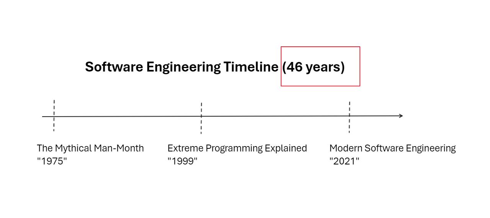

I start reading 3 books about software engineering / development. My initial intention was to identify which problems still arise in the software industry and learn from the authors: WHY those problems exists, advises on how to solve and (with this writing) share what I found to improve and help our industry.

## The books and the the Timeline

We will start with my books selected:

1. The Mythical Man-Month: Essays on Software Engineering by Frederick Phillips Brooks (1975)
2. Extreme Programming Explained: Embrace Change by Kent Beck (1999)
3. Modern Software Engineering: Doing What Works to Build Better Software Faster (2021)

## The problems

1. **Poor communication**: This is a problem that has been around for a long time and still persists today. Poor communication between team members, stakeholders, and customers can lead to misunderstandings, delays, and errors. 
    
2. **Inadequate testing**: Testing is an essential part of software development, but it is often neglected or done poorly. This can lead to bugs, security vulnerabilities, and other issues.
    
3. **Lack of collaboration**: Collaboration is crucial for software development, but it can be challenging to achieve. 
    
4. **Poor project management**: Poor project management can lead to missed deadlines, budget overruns, and other problems. 
    
5. **Inadequate documentation**: Documentation is essential for software development, but it is often neglected or done poorly. This can lead to confusion, errors, and other issues.