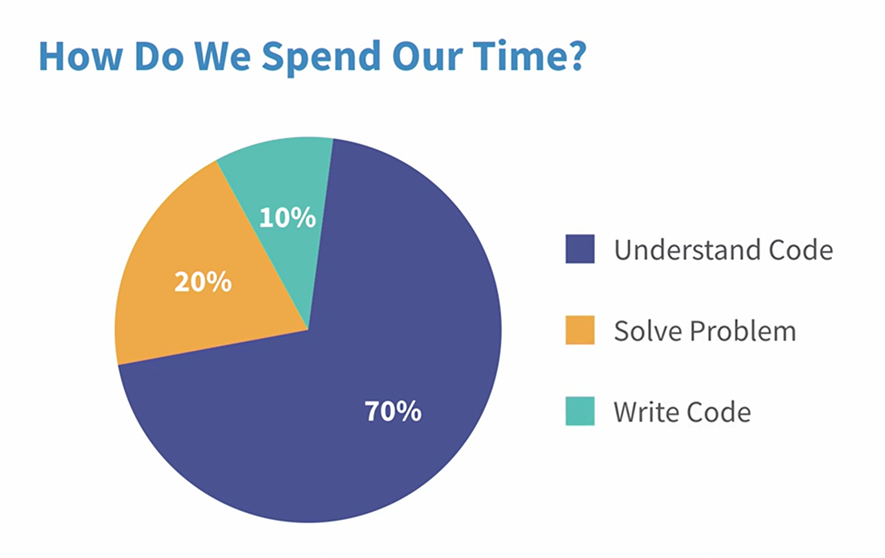
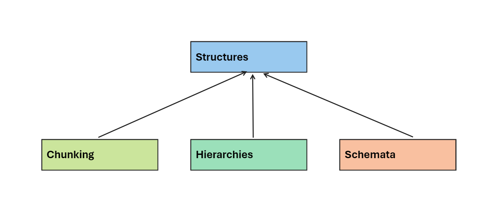
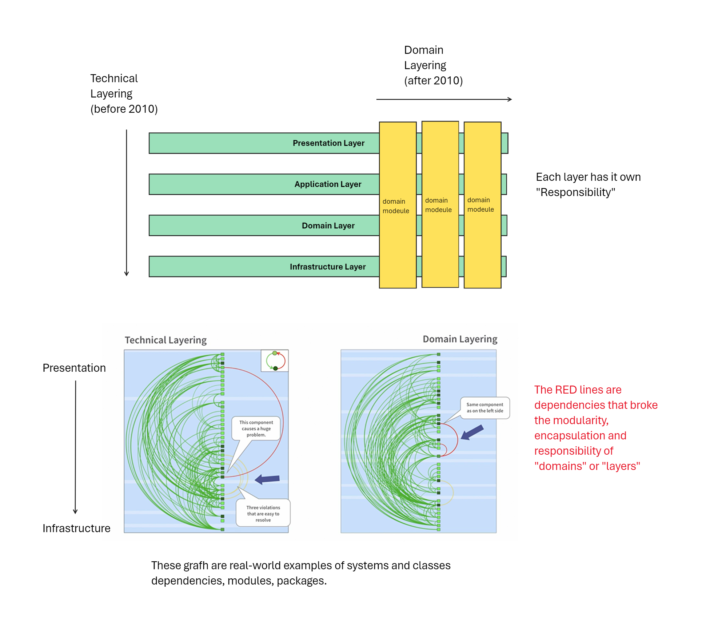

<button class="back-button" onclick="window.location.href='https://matiaspakua.github.io/tech.notes.io'">All notes</button>

# Sustainable Software Architecture
## Software architecture and sustainability

- **Software architecture**: the structure of a software product, consisting of elements, their externally visible properties, and their relationships.

-> Important to notice that EVERY software has a architecture underline.

- **Software archeology**: the process of recovering the original architecture of a software product from the source code, when it is not documented or known.

- **Sustainability**: the ability of a software product to live a long time without requiring much change, resulting in lower maintenance and expansion costs.
- **Technical debt**: the additional effort required at a later point in time due to suboptimal technical decisions made during software development, whether consciously or unconsciously.
- **Technical debt**: arises when false or suboptimal technical decisions are made, whether consciously or unconsciously. This leads to additional effort at a later point in time, which delays maintenance and expansion.
- **Adobe Flash Player**: an example of a technology that was once popular but is now outdated. The decision not to replace it when signs of its impending obsolescence became clear is an example of a conscious suboptimal technical decision.
- **Ignorance**: a team charged with development may not know how to build a good software architecture, leading to technical debt.
- **Creeping process**: as a system gets more complex and larger over time, it would need new rework structures, i.e., an architecture that is appropriate for its size and complexity. If this is not noticed or acted upon, it leads to technical debt.
- **Unplannable process**: software development is an unplannable process over a long period of time. The new software usually changes business processes and has effects when integrating into the target organization that are rarely fully predictable.
- **Sustainable software architecture**: to achieve this, one should take care to have as little technical debt as possible. It should be maintainable and extensible.
- **Comic "technicaldebts.xls"**: a humorous illustration of how technical debt is often handled in practice, with issues simply being logged in a spreadsheet rather than being addressed.

## Origin of tech debt

- Old technology (libraries, frameworks, SDK and on)
- Lack of knowledge on software architecture
- Complex or big systems.
- Lack of knowledge of business and clients (final users).

And important concept to notice is that "software development" is unplannable (cannot be planned in advance).

## Side Effects of tech debt

 1) Types of technical debt
 2) Architecture erosion
 3) high-cost of mantainance (bugfix, add new feature, overall mantainance)
 4) Continuos refactorings, improvements and related tasks

The graphic below show how the evolution of technical debt affect the evolution of a software product:

-> In the "Ideal World" we are situated at the bottom, where we had a team capacity and with each change or new feature, we can improve or fix a little of the architecture.

### Types of Tech Debt

1. **Test Debt**: Low test coverage leads to design and architectural debt. Without test we can't improve the design or make refactors.
2. **Design and Architectural Debt**: Poorly designed code structures become complex and "big ball of mud" situations.
3. **Implementation Debt**: Code smells like long methods, large classes, and code duplication.

### Managing Technical Debt

1. **Refactoring**: Step-by-step improvement of code quality to reduce debt.
2. **Balance** new features with architectural improvements.

## SW architecture and cognitive psychology

First we will start understanding where the developers spend their time, the graphic below is an approximation:

The human brain has a limited capacity. The brain can only remember about 30,000 lines of code and that developers spend most of their time reading and understanding existing code.

That 70% explain why is so important to had a well defined architecture and behind that is a human reason: the human brain is trained to understand "structures"

Software architecture benefits from these principles: Techniques like modularity, layering, and design patterns mirror these cognitive processes, making code easier to understand and maintain.

### Chunking

**Chunking** is a method of facilitating **short-term memory** by **grouping individual pieces of information into larger, more familiar groups**. When you chunk information, you break up long strings of data into smaller, more manageable units or “chunks.” These chunks are easier to commit to memory than a longer uninterrupted string of information.

Here’s how it works:

 * **Limited Short-Term Memory**: Our short-term memory has a capacity for about four chunks of information. While some research suggests people can store between five and nine units of information, chunking allows us to “hack” these limits by organizing data into meaningful groups.
 * **Patterns and Connections**: Our brains naturally seek patterns and make connections. Chunking leverages this tendency. By separating disparate elements into larger blocks, we make them easier to recall. This process isn’t just crucial for memory; it’s also a source of creativity. As Steve Jobs once said, “Creativity is just connecting things”

### Hierarchies

The second structure building process is that our brain tries to form hierarchies to remember as much as possible. Cognitive scientists have done a lot of research and found out that our brain loves hierarchies. <mark style="background: #FFF3A3A6;">We can remember hierarchical structures</mark> much better than net-like structures without an order.  In software, we have a suitable architectural principle, the **layering** or layered architectures. When we build our software in layers, we definitely support our brain.

### Schemata

And finally, our brain has developed another structure building process, which is our ability to form schemata. And that's really the best of all. <mark style="background: #FFF3A3A6;">Schema is an abstract idea</mark> of some part of the world. And it helps us to understand the world quickly. It's a mental framework that allows us to fill in the gaps and make associations based on our existing knowledge.

Here's a breakdown of the concept:

 * **Formation**: Schemas are formed through experiences and learning. As we encounter similar situations or concepts repeatedly, our brain develops a schema to represent them.
 * **Function**: Schemas help us organize and interpret information by providing a context for new experiences. They allow us to make predictions, fill in missing information, and draw conclusions based on what we already know.

In software development, we have something that perfectly captures this principle of schemata. We have **design and architecture patterns**, but they only work if we use them consistently. So our well structured architecture with which we save time in maintenance and extension needs pattern consistency

## Layered Architecture

---

## Cycles create technical debt

### First: what is a Big Ball of mud

A "big ball of mud" refers to a **complex and poorly-organized codebase**. It lacks a clear structure, making it difficult to understand, maintain, and modify. 

The key characteristics of a "big ball of mud":

* **Disorganized structure:** The code lacks proper modularity and separation of concerns, leading to tangled dependencies and interwoven functionality.
* **Code smells:** The codebase exhibits various "code smells" like long methods, large classes, and code duplication, indicating potential problems and difficulty in understanding the logic.
* **Lack of documentation:** There might be minimal or outdated documentation, making it challenging to understand the purpose and functionality of different parts of the code.
* **Inconsistent design principles:** The code may have been written adhering to different design principles at different times, leading to inconsistencies and making it difficult to reason about the overall architecture.

The "big ball of mud" metaphor aptly depicts the situation as a tangled mess, similar to a ball of mud, where individual parts are difficult to distinguish and manipulate. This situation can arise due to various factors, such as:

* Lack of initial planning or poor architectural design.
* Short-term fixes and code hacks accumulating over time.
* Limited knowledge sharing and inconsistent coding practices within the development team.

The presence of a "big ball of mud" can significantly impact software development efforts by:

* **Increasing maintenance costs:** It becomes challenging and time-consuming to make changes or fix bugs due to the lack of clarity and organization.
* **Reducing development speed:**  Understanding the existing codebase takes significant effort, hindering the implementation of new features.
* **Decreasing code quality:** The lack of maintainability and clarity can lead to further problems, creating a vicious cycle.

Software engineers aim to avoid "big ball of mud" situations by implementing good coding practices, utilizing appropriate design patterns, and focusing on code maintainability throughout the development process. Additionally, techniques like refactoring can help improve the structure and clarity of existing codebases that might be exhibiting signs of this anti-pattern.

# Reference:

 - https://www.linkedin.com/learning/sustainable-software-architecture
 - 
