# TPF Especialización: DevSecOps desde la perspectiva de QA Automation

<button class="back-button" onclick="window.location.href='https://matiaspakua.github.io/tech.notes.io'">All notes</button>

# Indice

- [1. Introducción](#1.introduction)
- [2. Marco Teórico](#2.marco_teorico)
	- [2.1. Conceptos y Prácticas Fundamentales](#2.1_conceptos_practicas_fundamentales)
	- [2.2. Pilares de la Ingeniería de Software](#2.2_pilares_ingenieria_software)
	- [2.3. Cultura y las personas](#2.3_cultura_personas)
	- [2.4 Enfoque de Calidad](#2.4_enfoque_calidad)
	- [2.5 Metodologías y Prácticas](#2.5.metodologia_practicas)
		- [2.5.1. Práctica: Organización de la Información](#2.5.1.practica_organizacion_informacion)
		- [2.5.2. Práctica: Artefactos](#2.5.2.practica_artefactos)
		- [2.5.3. Práctica: Trazabilidad](#2.5.3.practica_trazabilidad)
		- [2.5.4. Práctica: Identificación](#2.5.4.practica_identificacion)
		- [2.5.5. Práctica: Base de Conocimiento](#2.5.5.practica_base_conocimiento)
		- [2.5.6. Práctica: Arquitectura de alto nivel de Procesos](#2.5.6.practica_arquitectura_alto_nivel_procesos)
		- [2.5.7. Práctica: Integración Continua (CI)](#2.5.7.practica_integracion_continua)

# 1. Introducción

La metodología DevSecOps plantea una serie de prácticas, procesos y herramientas que en conjunto y correctamente orquestadas proporcionan un marco de trabajo completo, integral y sólido para resolver cuestiones asociadas a la entrega continua y de calidad de productos de software.

Sin embargo, es común en las organizaciones de desarrollo de software que no exista una visión de alto nivel que sea capaz de integrar de forma armónica todas las partes que componen la metodología DevSecOps, y es aún más inusual encontrar que cada aspecto de la metodología se aborde desde el punto de vista de Quality Assurance (QA) y Automation. Esto resulta un problema para la entrega continua de software de alta calidad y seguro, donde una de las principales actividades que ocupa gran parte del tiempo de “entrega” es el Aseguramiento de la Calidad del producto.

En este trabajo, el objetivo es plantear la metodología DevSecOps con sus conceptos, prácticas y herramientas, para cada una de sus etapas, haciendo foco en los aspectos de QA, aplicando la automatización de tareas donde sea posible, y planteando para ello una estrategia iterativa-incremental. En esta estrategia,  cada etapa será abordada desde la perspectiva de QA, aplicando automatización y dando como resultado un roadmap de adopción por etapas. Adicionalmente, se utilizará un caso de estudio para ilustrar aspectos prácticos de implementación con el fin de dar claridad a los aspectos conceptuales.

A grandes rasgos, las tareas a realizar para lograr este objetivo involucran:

- Definir el marco teórico, conceptos fundamentales y prácticas.
- Definir la metodología DevSecOps.
- Definir QA Automation y su perspectiva sobre DevSecOps.
- Analizar estrategias de diseño para la metodología y procesos.
- Presentar herramientas de soporte para las etapas de la metodología.
- Describir algunos casos de implementación.
- Brindar, como cierre, las conclusiones del trabajo.

**Fig. 1. Esquema conceptual DevSecOps**

Como introducción, la Fig. 1 ilustra un posible camino a recorrer para un producto de software. Las 3 capas horizontales representan las 3 disciplinas del ciclo de vida que se deben integrar y sincronizar con la disciplina de QA Automation: Dev (<mark style="background: #FFF3A3A6;">desarrollo</mark>), Sec (<mark style="background: #BBFABBA6;">Security</mark>) y Ops (<mark style="background: #ADCCFFA6;">Operaciones</mark>). La disciplina de QA Automation aparece de forma transversal durante el ciclo de desarrollo y se involucra de diversas maneras y con diferentes artefactos, dependiendo del estado de evolución del producto en ese momento. QA Automation debe contemplarse desde etapas tempranas para ayudar a refinar desde la idea del producto a desarrollar hasta la entrega al cliente final, asegurando en cada etapa poder cumplir con determinados aspectos de la calidad.

Cada disciplina (Dev, Sec y Ops) tienen sus propios flujos de trabajo, procesos y herramientas, pero todas comparten la misma necesidad desde QA: definir lineamientos de calidad, escribir pruebas, automatizar las tareas repetitivas y documentar el proceso, los artefactos intermedios y los resultados obtenidos para dejar evidencia del proceso y del producto.

# 2. Marco Teórico

## 2.1. Conceptos y Prácticas Fundamentales 

En la primera parte del presente trabajo se abordarán los conceptos teóricos que servirán de base para dar forma a la propuesta de implementación de la metodología DevSecOps, vista desde la perspectiva de QA Automation.

## 2.2. 🧱💻 Pilares de la Ingeniería de Software

El primer concepto sienta las bases del presente trabajo. Los pilares de la ingeniería de software, según lo definido por ([Pressman, 2006, 24] son: “La base que soporta la ingeniería del software es un enfoque de calidad”. Adicionalmente al enfoque clásico de Pressman, se decidió incluir un pilar que representa a<mark style="background: #FFF3A3A6;"> la cultura de la organización</mark> y a <mark style="background: #BBFABBA6;">las personas</mark> que dan vida a una organización, según se esquematiza en la Fig. 2.

**Referencia**:  Pressman, R. S. (2006). Ingeniería del software: un enfoque práctico (V. Campos Olguín, E. Pineda Rojas, & J. E. Murrieta Murrieta, Trans.). McGraw-Hill.

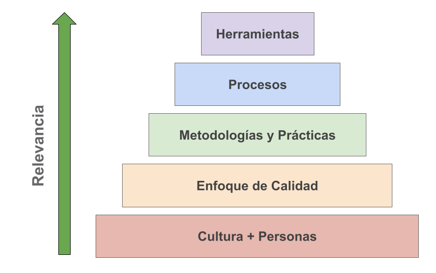

**Figura 2: Pilares de la Ingeniería del Software (basado en “Pressman,2006,24”)**

## 2.3. Cultura y las personas

Para el éxito en la implementación de cualquier estrategía de desarrollo de productos de software es importante que exista una buena cultura en la organización [Organizational Culture. 2018], que se enfoque en los <mark style="background: #FFF3A3A6;">procesos</mark>, las <mark style="background: #BBFABBA6;">personas</mark> y la <mark style="background: #ADCCFFA6;">cultura</mark> como se muestra en la Fig. 3. Una “buena” cultura debe promover el bienestar común e individual, generar entusiasmo en las personas, establecer los objetivos y estrategías de la empresa en sinergía con las personas, y sobre todo, deber ser una “cultura compartida”. Esta cultura debe ser comunicada y entendida sin ambigüedades.

La importancia de que las personas estén “motivadas” y “positivas” para llevar adelante el desarrollo y la mejora continua es un pilar fundamental del éxito de una organización.

⭐❗ Los aspectos técnicos (conocimientos técnicos, conocimientos especializados sobre tecnologías y herramientas, etc), se pueden adquirir de diversas formas, pero los aspectos más humanos como el bienestar laboral, el ámbito laboral y todos aquellos aspectos que hacen a tener una cultura sana son matices que se deben trabajar desde el inicio, de forma ardua y nunca descuidar.

**Referencia:** Development Cooperation Handbook/The development aid organization/Organizational Culture. (2018, February 22). Wikibooks, The Free Textbook Project. Retrieved 19:04, February 20, 2022 from https://en.wikibooks.org/w/index.php?title=Development_Cooperation_Handbook/The_development_aid_organization/Organizational_Culture&oldid=3377380.

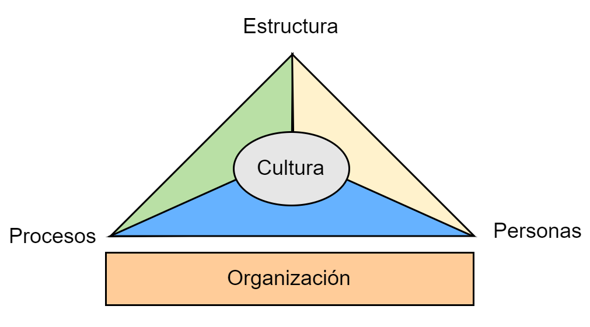

**Figura 3: Cultura, Procesos, Personas y Organización.**

Analizaremos que DevSecOps no solo implica la adición de herramientas de seguridad, sino también <mark style="background: #BBFABBA6;">la cultura de colaboración</mark> entre los equipos de desarrollo, operaciones y seguridad. La cultura y las prácticas deben estar bien integradas para ser efectivas.

Con esta base, se propone llevar adelante la implementación de la metodología DevSecOps desde la perspectiva de QA Automation.

## 2.4 Enfoque de Calidad

El aseguramiento de la calidad o QA [Quality assurance, 2022] es una forma de prevenir errores y defectos en los productos y evitar problemas al entregar productos o servicios a los clientes. La norma ISO 9000 define QA como "parte de la gestión de la calidad centrada en proporcionar <mark style="background: #FFF3A3A6;">confianza</mark> en que se cumplirán los requisitos de calidad".

**Referencia:** Wikipedia contributors. (2022, January 2). Quality assurance. In Wikipedia, The Free Encyclopedia. Retrieved 18:47, February 20, 2022, from https://en.wikipedia.org/w/index.php?title=Quality_assurance&oldid=1063244260

El enfoque de gestión de calidad del presente trabajo incluye los aspectos asociados al testing manual y automatizado, además de la mención a <mark style="background: #BBFABBA6;">Robotic Process Automation</mark> [RPA, 2022], y se abordarán aspectos de la organización y gestión de todos los elementos que agreguen valor al producto de software final.

**Referencia:** Wikipedia contributors. (2022, January 27). Robotic process automation. In Wikipedia, The Free Encyclopedia. Retrieved 19:16, February 20, 2022, from https://en.wikipedia.org/w/index.php?title=Robotic_process_automation&oldid=1068323418

Como se muestra en la Fig. 4, DevOps no solo incluye las fases de desarrollo (Dev ) y de operación o puesta en producción (Ops), sino que el tercer pilar de de la metodología es QA, con lo cual la importancia de QA es fundamental.

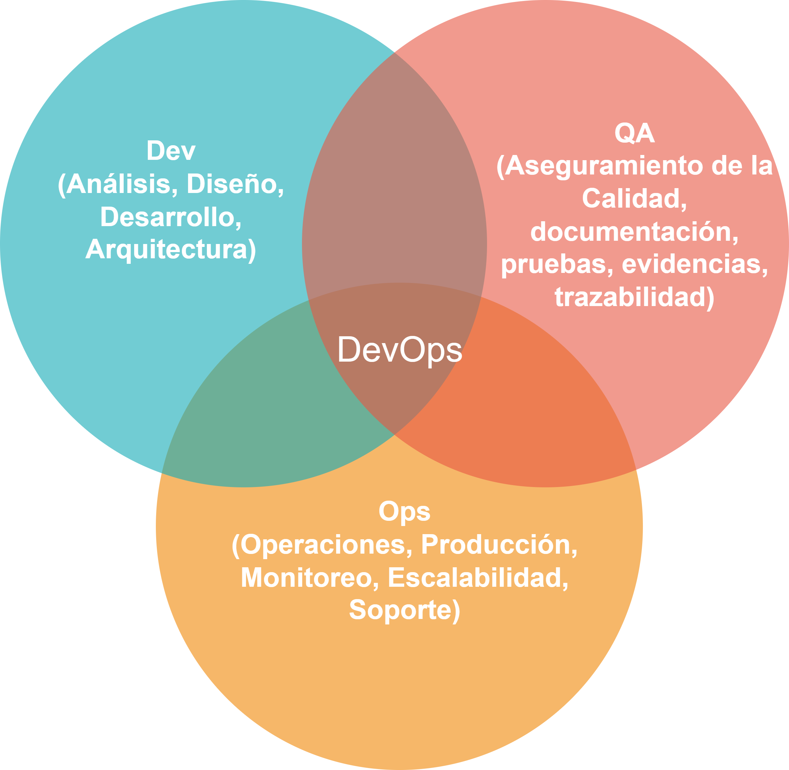

**Fig. 4. QA Automation como pilar de DevOps**

## 2.5. Metodologías y Prácticas

A continuación se listan y explican brevemente algunas de las prácticas esenciales que se deben considerar para aplicar la metodología DevSecOps y QA Automation.

### 2.5.1. Práctica: Organización de la Información

Esta práctica se entiende como: el código, las herramientas de desarrollo, soporte, documentación, las herramientas de comunicación, y cualquier otro medio de soporte que se use en el desarrollo de un producto de software, deben estar organizadas. Es común que este aspecto no esté correctamente resuelto, lo cual provoca que no haya un <mark style="background: #FFF3A3A6;">repositorio centralizado</mark> (o base de conocimiento) para almacenar y consultar toda la información asociada a un proyecto o producto.

En la Fig. 5 se resalta el hecho de tener como guía, por sobre los procesos y prácticas, a la organización de la información, donde las principales características que se deben asegurar son:

- 📚 **Base de conocimientos Centralizada**
- 📂 **Organización de la información**
- 🔄 **Sincronización de la información**
- 🤝 **Colaboración**

Luego de resolver como la información se va a organizar, queda resolver los Procesos y Prácticas que se asocian comúnmente al desarrollo de productos de software.

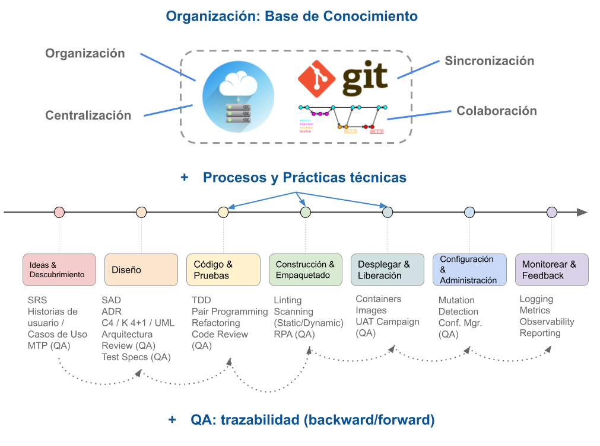

**Fig. 5. Organización de procesos, información, prácticas.**

### 2.5.2. Práctica: Artefactos

El ciclo de los procesos comienza y termina generalmente con el cliente o usuario final, ya sea desde la definición del producto o la notificación de mejoras o defectos.

Un <mark style="background: #FFF3A3A6;">artefacto</mark> [Storz, 2022] define un elemento de utilidad, que se utiliza en una o varias etapas de los procesos para aportar valor al producto final. Cada proceso se comunica con el resto utilizando artefactos (actúan como interfaces). Un artefacto es cualquier tipo de elemento definido, identificado y almacenado en la base de conocimientos de la organización.

**Referencia:** Storz, C. (2022, January 31). What Is An Artifact Repository? What Is An Artifact Repository? https://harness.io/blog/what-is-artifact-repository/ 

Un proceso se comunica con otro utilizando, en la mayoría de los casos, uno o varios artefactos. En la Fig. 6 se muestran ejemplos de distintos tipos de artefactos, típicamente generados durante el desarrollo de un producto.

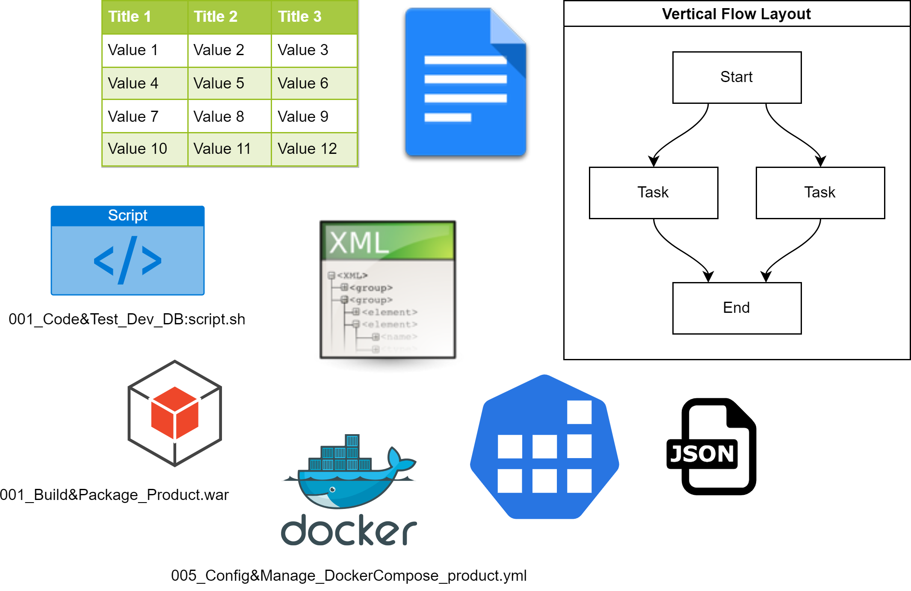

**Fig. 6 Ejemplos de Artefactos generados en un producto de Software**

Es importante que exista uno o varios repositorios de artefactos, según el tipo o categoría de los artefactos. Cuando se trata de artefactos de software (por ejemplo: ejecutables, binarios, archivos de configuración de servicios, etc.) es recomendable usar herramientas específicas que se puedan integrar en la infraestructura de desarrollo. Cuando se trata de artefactos como pueden ser: diagramas, documentos, o notas, se debería usar otro tipo de repositorio acorde al tipo de artefactos, por ejemplo un disco en la nube.

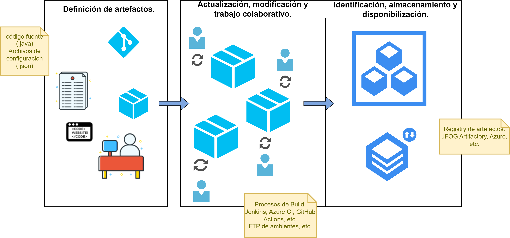

**Fig. 7 Flujo de vida y uso de los Artefactos**

Algunas de las principales características de los artefactos y de un repositorio de artefactos son:

- 🔒 **Control de Acceso**
- 🗄️ **Almacenamiento**
- 🚚 **Distribución**
- 📂 **Organización**
- 💾 **Respaldo**

La Fig. 7 representa el un flujo de vida típico de artefactos, divido en 3 etapas:

1. Definición de artefactos.
2. Actualización, modificación y trabajo colaborativo sobre los artefactos.
3. Identificación, almacenamiento y disponibilización de los artefactos.

### 2.5.3. Práctica: Trazabilidad

Una práctica indispensable de QA es asegurar la <mark style="background: #FFF3A3A6;">trazabilidad</mark> en el desarrollo de un producto de software. La trazabilidad es una característica esencial de un producto de software porque permite tener un hilo conductor, un **“camino de migas” (“breadcrumb trail”)** o inicio y un fin para una determinada funcionalidad. La Fig. 8 representa la idea conceptual de la trazabilidad, es decir, tener en claro el hilo conductor del desarrollo de un producto, desde un inicio, por ejemplo la definición de una nueva funcionalidad, hasta la UI/UX de usuario al utilizar dicha funcionalidad.

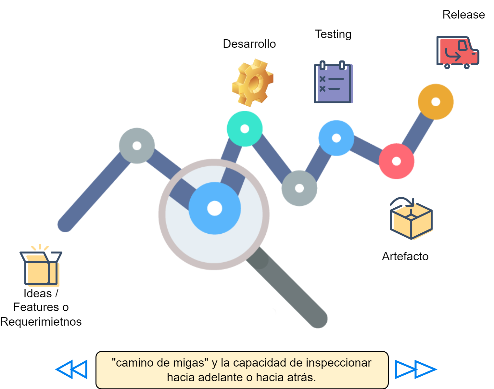

**Fig 8. Concepto de Trazabilidad.**

Un concepto importante de la trazabilidad es el de traza: “Huella, vestigio.” [DRAE, 2022]. La traza es lo que permite rastrear el origen (backward) o la etapa siguiente (forward) de una funcionalidad en un producto de software.

**Referencia:** (REAL ACADEMIA ESPAÑOLA: Diccionario de la lengua española, 23.ª ed., [versión 23.5 en línea]. <https://dle.rae.es> 01/03/2022.)

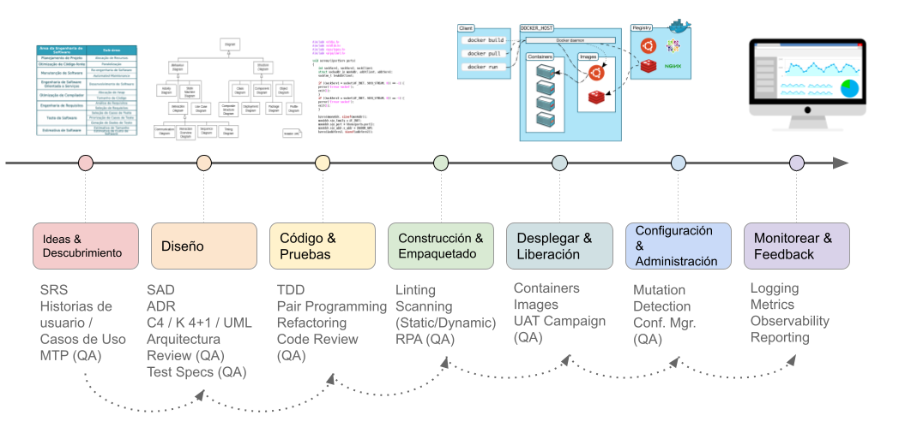

**Fig. 9. Trazabilidad entre artefactos**

Para lograr trazabilidad, hay varios aspectos a considerar:

1. Tener la información <mark style="background: #FFF3A3A6;">disponible</mark> en una base de conocimiento centralizada. Ver. 2.5.1.
2. Tener la información fácilmente <mark style="background: #BBFABBA6;">identificada</mark>, caracterizada, categorizada y ordenada;
3. Tener toda la información representada de alguna manera que se pueda <mark style="background: #ADCCFFA6;">recuperar y visualizar </mark>(formatos y herramientas disponibles);
4. Tener la información bajo <mark style="background: #FFF3A3A6;">control de acceso</mark> (roles, privilegios, permisos);  
5. Asegurar la trazabilidad hacia atrás y hacia adelante Fig. 10 en cada elemento de información [Pitchford et al., 2021]:

**Referencia:** Pitchford, M., Hurley, F., Dahad, N., & Roy, A. (2021, July 19). DevSecOps brings defense in depth to embedded security. Embedded.com. Retrieved February 23, 2022, from https://www.embedded.com/devsecops-brings-defense-in-depth-to-embedded-security/ 

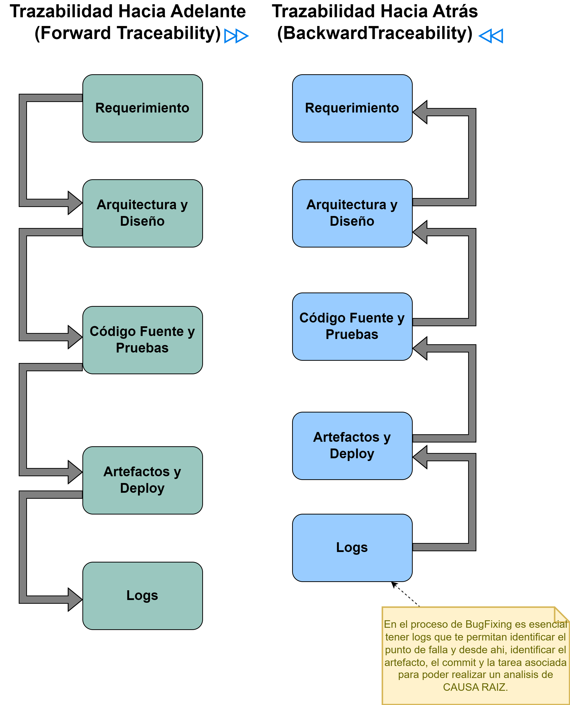

**Fig. 10 Trazabilidad hacia adelante (Forward) y hacia atrás (Backward)**

### Análisis de Causa Raíz (XP by K. Beck)

Link: [XP book notes: Root Analysis](https://matiaspakua.github.io/tech.notes.io/pages/books/book_extreme_programming_explained.html#1.9.5.root_cause_analysis)

### 2.5.4. Práctica: Identificación

La <mark style="background: #FFF3A3A6;">identificación</mark> de los elementos de información o artefactos es importante tanto desde el punto de vista de QA como en la operación. Para identificar los artefactos, un posible ejemplo es definir la siguiente nomenclatura general:

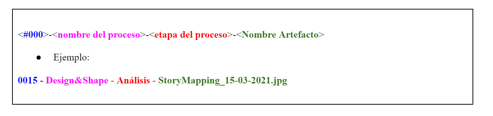

Todos los artefactos deben ser identificados y almacenados en la base de conocimiento y se debe usar el ID de los artefactos para asociar y/o referenciar otros artefactos o documentos de cualquier tipo, de modo tal de asegurar trazabilidad en el proceso.

📌La identificación adecuada de artefactos es crucial en la ingeniería de software para asegurar la trazabilidad, la organización y la gestión eficiente de los componentes y documentos a lo largo del ciclo de vida del proyecto. Aquí te proporciono algunos ejemplos adicionales de identificación de artefactos en diferentes áreas de la ingeniería de software:

#### 📋 Requisitos del Software

   - **ID de Requisitos:** <mark style="background: #FFF3A3A6;">REQ-001</mark>, REQ-002, REQ-003
   - **Descripción:** Cada requisito funcional y no funcional se asigna un ID único que se usa en toda la documentación del proyecto para referenciar de manera clara y consistente.
   - **Utilidad:** Facilita el seguimiento de la implementación de los requisitos, la gestión de cambios y la verificación de que todos los requisitos han sido cumplidos.

#### 📑Casos de Uso

   - **ID de Casos de Uso:** <mark style="background: #FFF3A3A6;">UC-LOGIN-001</mark>, UC-REGISTER-002
   - **Descripción:** Cada caso de uso tiene un ID único que describe la funcionalidad específica que aborda.
   - **Utilidad:** Mejora la claridad en la documentación y permite a los desarrolladores y testers referirse a casos de uso específicos sin ambigüedad.

#### 🧪 Pruebas de Software

   - **ID de Casos de Prueba:** <mark style="background: #FFF3A3A6;">TC-LOGIN-001</mark>, TC-REGISTER-002
   - **ID de Scripts de Prueba:** TS-LOGIN-AUTOMATION-001, TS-REGISTER-AUTOMATION-002
   - **Descripción:** Cada caso de prueba y script de prueba automatizado recibe un ID único.
   - **Utilidad:** Facilita la trazabilidad entre los requisitos, los casos de uso y las pruebas, asegurando que todos los aspectos han sido verificados y validados adecuadamente.

#### 📂 Documentos del Proyecto

   - **ID de Documentos:**<mark style="background: #FFF3A3A6;"> DOC-SRS-001</mark>, DOC-TESTPLAN-002
   - **Descripción:** Los documentos clave del proyecto, como las especificaciones de requisitos del software (SRS) y los planes de prueba, se identifican con IDs únicos.
   - **Utilidad:** Facilita la organización, el acceso y la referencia cruzada de los documentos, asegurando que todos los miembros del equipo puedan localizar y utilizar la información necesaria de manera eficiente.

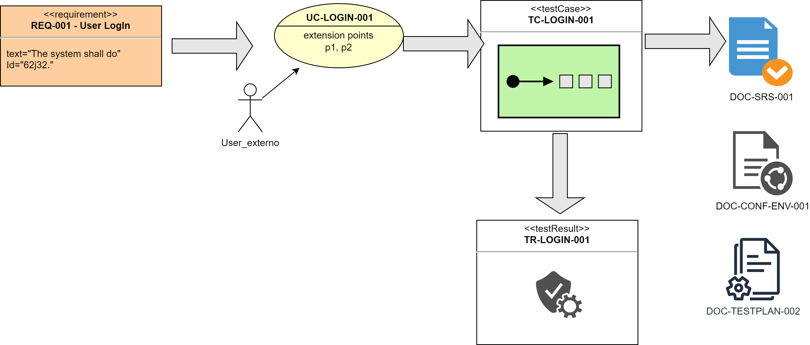

**Fig. 10.1. Ejemplo de trazabilidad de artefactos**

### 2.5.5. Práctica: Base de Conocimiento

Todos los artefactos se recomienda almacenarlos en un <mark style="background: #FFF3A3A6;">repositorio único</mark> (por ejemplo, un disco en la nube) que permita identificar al proyecto o producto y del cual se pueda recuperar la información almacenada.

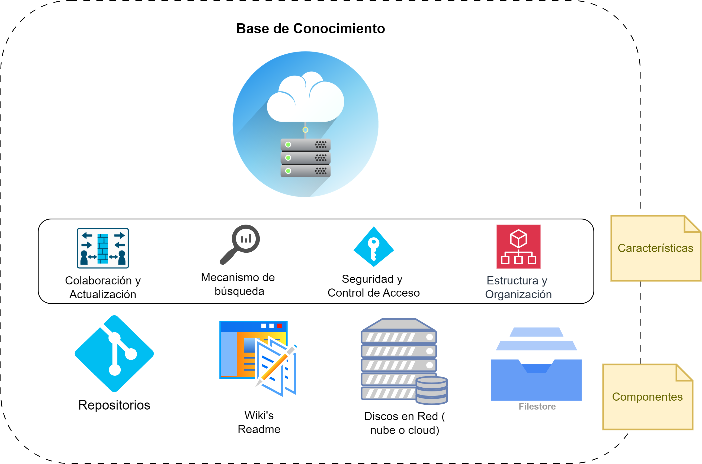

**Fig. 11. Concepto de Base de Conocimiento Centralizada y en la Nube**

Se propone armar una estructura de directorios para almacenar y categorizar los artefactos asociados a cada producto. La organización de directorios debe ser compatible y fácil de identificar con los procesos que se aplican en el producto de software. Este aspecto es importante para la recuperación, identificación y almacenamiento de los artefactos que allí se almacenarán.

Un ejemplo de estructura podría ser el siguiente:

/project-root/ 

	├── README.md 
	├── docs/ 

		├── DOC-SRS-001-Specification.md 
		├── DOC-TESTPLAN-002-TestPlan.md 
		├── DOC-ARCHITECTURE-003-ArchitectureDiagram.md 
		└── DOC-RELEASE-004-ReleaseNotes.md
	├── tests/
		├── TC-LOGIN-001-UserLoginTestCase.md 
		├── TC-REGISTER-002-UserRegisterTestCase.md 
		├── TS-LOGIN-AUTOMATION-001-LoginTestScript.py 
		└── TS-REGISTER-AUTOMATION-002-RegisterTestScript.py
	├── configs/ 
		├── CFG-DB-CONN-001-DatabaseConnectionConfig.yaml 
		├── CFG-API-ENDPOINT-002-APIEndpointsConfig.yaml 
		└── CFG-LOGGING-003-LoggingConfig.yaml
	├── scripts/ 
		├── backup.sh 
		└── cleanup.sh
	└── logs/
		├── TEST-2024-06-25.log 
		└── TEST-2024-06-26.log

### 2.5.6. Práctica: Arquitectura de alto nivel de Procesos

Al comienzo o inclusive en etapas tardías, se recomienda armar una arquitectura de alto nivel de los distintos procesos. Definir los procesos como “cajas negras” con sus interfaces, para luego desarrollar la especificación de cada proceso, es un paso importante para articular los componentes y personas que van a desarrollar un producto.

Para tener éxito con DevSecOps y QA Automation es imperativo definir la arquitectura de alto nivel y los procesos asociados. Tiene que estar claro y bien definido cuál es el <mark style="background: #FFF3A3A6;"> camino del producto y del desarrollo</mark> (“continuous develop, testing, integration, delivery, security, etc..”).

Si bien los procesos definen un conjunto de normas, prácticas y herramientas para cada conjunto de tareas o etapa del desarrollo de un producto, no es estrictamente necesario que cada proceso sea llevado a cabo por personas distintas o por equipos diferentes (mucho depende de la complejidad, la estructura y la cultura de la organización). La metodología DevSecOps promueve que los equipos sean multi-disciplinarios y auto-organizados con el objetivo, a largo plazo, de que éstos procesos puedan ser llevados adelante por el mismo equipo. Parte de “acelerar” el desarrollo de un producto de software se basa en ésta idea.

La premisa es que un mismo equipo lleve adelante todos los procesos, que sea una “construcción colectiva”, que se debe realizar de forma iterativa e incremental por el mismo equipo, acompañado de la cultura de la organización.

En la Fig. 12 se presenta un ejemplo de un diagrama de arquitectura de alto nivel para los procesos asociados a la implementación de la metodología DevSecOps y QA.

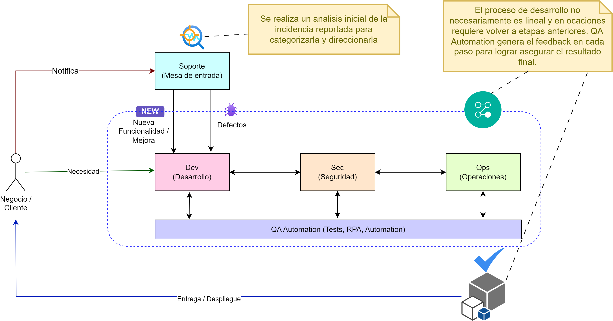

**Figura 12: Arquitectura de Procesos de Alto Nivel.**

Otro aspecto importante a tener en cuenta respecto a ésta práctica es que se debe analizar a los equipos, contextos y complejidad de los procesos y las herramientas y tecnologías asociadas a cada uno. Tener en cuenta la <mark style="background: #FFF3A3A6;">carga cognitiva</mark> 🧠 que se asigna, debido a que en equipos poco maduros y sin suficiente capacidad para afrontar la masiva cantidad de conceptos a manejar, puede generar efectos adversos en lugar de positivo. 

Como todo lo que se desarrollara en el presente trabajo: para cada punto, además de los conceptos técnicos y específicos, aplicar en primera medida:

1. Un juicio adecuado según el contexto y la complejidad;
2. Sentido común para buscar resultados positivo;
3. (KIS) Sencillez y simpleza sobre complejidad.

### 2.5.7. Práctica: Integración Continua (CI)

Históricamente uno de los mayores problemas en la producción o desarrollo de software es la llamada integración. Se trata de la etapa en donde se juntan todas las partes y comienza a tomar forma el producto final que deberá ser enviado a producción.

Las principales características de la Integración Continua [Fowler, 2006] (CI) son:

1. Integración en cada cambio.
2. Repositorio centralizado, organizado con un "mainline"
3. Testing y tareas automatizadas. En todos los niveles.
4. Resultado: producto estable.

**Referencia: ** Fowler, M. (2006, May 1). Continuous Integration. Martin Fowler. Retrieved February 20, 2022, from https://martinfowler.com/articles/continuousIntegration.html

La integración continua incluye alguna o todas las siguiente fases, que son justamente las etapas que se deben integrar durante el desarrollo de un producto de software. Al considerar las fases de la Fig. 13, integrarlas y ordenarlas de forma “continua”, se pueden ver como si fuera una tubería o **pipeline**:

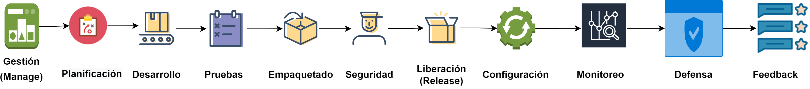

**Fig. 13: Fases comunes de un pipeline de Integración Continua**

Para entender la importancia de CI, se usará la analogía de un rompecabezas 🧩Fig. 14. Cada módulo de software es único, tiene una funcionalidad, se debe articular en una parte determinada, y para hacer que esa articulación funcione se deben respetar sus interfaces. Pero además, se debe validar que la posición donde se colocó corresponda a la función del módulo, y que además el módulo cumpla con su funcionalidad tanto individual como para todo el sistema:

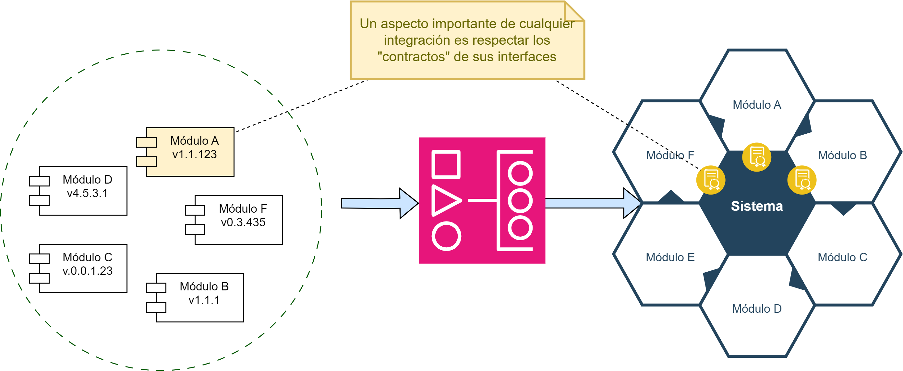

**Fig. 14 Concepto de Integración. Rompecabezas.**

Siguiendo con las características o propiedades que son importantes para lograr CI, surge la práctica de hacer un “**build self-testing**” que consiste en una compilación y prueba de que un producto se pueda generar correctamente. La práctica de build self-testing es muy útil cuando se hacen commits al mainline a diario.

La Fig. 15 muestra un posible checklist para determinar qué tanto se adhiere al concepto de CI.

Cada commit es conveniente que genere la ejecución de un “build” en un servidor de integración preparado con una copia de un ambiente, ya sea de desarrollo, testing o producción. Luego de disparar la ejecución de un build, se debe asegurar que se ejecute por completo sin problemas y si no fuera el caso, repararlo debe ser una prioridad. Con la maduración de la práctica, se deben pensar y mejorar los <mark style="background: #FFF3A3A6;">“tiempos de ejecución”</mark> de los builds, tratando de acelerarlos cuando sea posible. Para acelerar o mejorar los builds, es conveniente armar pipelines de integración con etapas (o stages) y los servidores que ejecuten los build deberían poder ser configurables para reproducir los ambientes y todas las dependencias necesarias para generar una versión del producto.

**Fig. 15 Checklist verificación de adherencia a Continuous Integration. Imagen Fuente (Fowler, 2017)**

**Referencia:** Fowler, M. (2017, January 18). ContinuousIntegrationCertification. Martin Fowler. Retrieved February 20, 2022, from https://martinfowler.com/bliki/ContinuousIntegrationCertification.html

--- 

### "Siempre" puede salir algo mal 🔙⚠️

**UPDATE: 19/07/2024**. El mundo despertó con uno de los mayores fallos informáticos de la historia, el cual afecto a infraestructura critica: aeropuertos, hospitales, sistemas financieros y bancos entre muchos otros. La causa fue una actualización de un driver de seguridad (Crowdstrike) en los sistemas Windows. El resultado: la pantalla azul de la muerte (un sistema inaccesible).

**Lección aprendida:** se puede desarrollar procesos, métodos, herramientas y pipelines con altísima calidad, pero igualmente pueden ocurrir errores, por lo tanto, nuestros procesos y pipelines de CI deben tener preparados mecanismos de recuperación ante fallas criticas: GREEN/BLUE deployment, CANARY deploy, etc.

--- 

Todas estas consideraciones ayudan a la calidad del producto, la fluidez del desarrollo, y como adicional, permiten que sea fácil que cualquier persona pueda obtener el último ejecutable con los últimos cambios. 

En resumen, la aplicación de CI provee la siguiente lista de beneficios:

 - Visibilidad del proceso de desarrollo 
 - Reducción de riesgos 
 - Eliminación de puntos ciegos al reducir las etapas de integración intermedias. 
 - Reducción de la cantidad de errores en producción 
 - Aceleración en la generación y publicación de nuevas features 
 - Obtención rápida de feedback 
 - Mejora en la comunicación y colaboración

Algunas prácticas recomendadas para iniciar con CI son:

 - 📚 Repositorio centralizado (Fowler, 2020)
 - 🤖Automatizar el build
 - 🧪 Comenzar con testing automatizado (poco es mejor que nada)
 - ⏱️ ⏩Acelerar el build: 10 minutes rules de la metodología XP (Beck & Andres, 2004, 49)
 - 🧠 Buscar ayuda en la experiencia

**Referencia:** Fowler, M. (2020, 05 28). Patterns for Managing Source Code Branches. Martin Fowler. Retrieved March 29, 2022, from https://martinfowler.com/articles/branching-patterns.html

**Referencia:** Beck, K., & Andres, C. (2004). Extreme Programming Explained: Embrace Change. Pearson Education

### 2.5.8. Práctica: Fallar desde el Inicio y Rápido

Para lograr una integración fluida y dinámica, se debe contar con servidores de integración continua que, como primer paso, hagan la construcción (build self-testing) del producto, pero mucho más importante es contar con buenas bases de QA Automation (Fitzpatrick, 2018), (Hristov, n.d.), (Rehkopf, n.d.). La base de testing debe incluir: 

● Test Unitarios 🧪 
● Test de Componentes 🧩  
● Test de Integración 🔄  
● Test E2E 🏁  
● Test de Performance ⚡  
● Test de Carga (load) 📈  
● Test de Seguridad 🔒

**Referencia:** Fitzpatrick, S. (2018, July 19). The Growing Importance of Test Automation Skills in DevOps. Sauce Labs. Retrieved February 21, 2022, from https://saucelabs.com/blog/the-growing-importance-of-test-automation-skills-in-devops

**Referencia:** Hristov, A. (n.d.). Test Automation. Atlassian. Retrieved February 21, 2022, from https://www.atlassian.com/devops/devops-tools/test-automation

**Referencia:** Rehkopf, M. (n.d.). Automated software testing for continuous delivery. Atlassian. Retrieved February 21, 2022, from https://www.atlassian.com/continuous-delivery/software-testing/automated-testing

Los objetivos fundamentales son: 

1. Validar la funcionalidad esperada para el producto. 
2. Encontrar problemas lo más rápido posible

El testing es fundamental y deben ser automatizados en su mayoría. No importa la forma de trabajo que se quiera implementar, se debe armar una buena base de test automáticos y manuales donde se requiera.