# TPF Especialización: DevSecOps desde la perspectiva de QA Automation

<style>
  .back-button {
    background-color: #4CAF50; /* Green */
    border: none;
    color: white;
    padding: 15px 32px;
    text-align: center;
    text-decoration: none;
    display: inline-block;
    font-size: 16px;
    margin: 4px 2px;
    cursor: pointer;
  }
</style>

<button class="back-button" onclick="window.location.href='https://matiaspakua.github.io/tech.notes.io'">All notes</button>

---

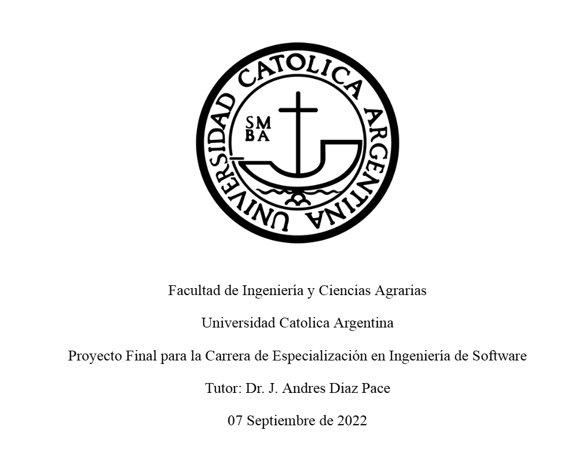

---

# Índice

- [1. Introducción](#1.introduction)
- [2. Marco Teórico](#2.marco_teorico)
	- [2.1. Conceptos y Prácticas Fundamentales](#2.1_conceptos_practicas_fundamentales)
	- [2.2. Pilares de la Ingeniería de Software](#2.2_pilares_ingenieria_software)
	- [2.3. Cultura y las personas](#2.3_cultura_personas)
	- [2.4 Enfoque de Calidad](#2.4_enfoque_calidad)
	- [2.5 Metodologías y Prácticas](#2.5.metodologia_practicas)
		- [2.5.1. Práctica: Organización de la Información](#2.5.1.practica_organizacion_informacion)
		- [2.5.2. Práctica: Artefactos](#2.5.2.practica_artefactos)
		- [2.5.3. Práctica: Trazabilidad](#2.5.3.practica_trazabilidad)
		- [2.5.4. Práctica: Identificación](#2.5.4.practica_identificacion)
		- [2.5.5. Práctica: Base de Conocimiento](#2.5.5.practica_base_conocimiento)
		- [2.5.6. Práctica: Arquitectura de alto nivel de Procesos](#2.5.6.practica_arquitectura_alto_nivel_procesos)
		- [2.5.7. Práctica: Integración Continua (CI)](#2.5.7.practica_integracion_continua)
		- [2.5.8. Práctica: Fallar desde el Inicio y Rápido (Testing)](#2.5.8.practica_falla_inicio_rapido)
			- [2.5.8.1. Pirámide de Testing](#2.5.8.1_piramide_testing)
		- [2.5.9. Práctica: Entrega Continua (CD)](#2.5.9_practica_entrega_continua_cd)
		- [2.5.10. Práctica: APIs](#2.5.10_practica_APIs)
		- [2.5.11. Práctica: Estado Actual de Madurez](#2.5.11_practica_estado_actual_madurez)
		- [2.5.12. Metodología: DevOps](#2.5.12_metodologia_DevOps)
		- [2.5.13. Metodología: Seguridad](#2.5.13_metodologia_seguridad)
		- [2.5.14. Metodología: QA Automation](#2.5.14_metodologia_qa_automation)
		- [2.5.15. Metodología: estrategia de QA](#2.5.15_metodologia_estrategia_qa)
		- [2.5.16. Metodología: Metodología: DevSecOps](#2.5.16_metodologia_metolodogia_devsecops)
- [3. Diseño](#3.diseño)
	- [3.1 Estrategías de Diseño](#3.1.estrategias_de_disenio)
		- [3.1.1 Gran Diseño Inicial (BDUF)](#3.1.1.gran_disenio_inicial_bduf)
		- [3.1.2 Diseño Preliminar Inicial (RDUF) y Diseño Emergente](#3.1.2.disenio_preliminar_inicial_RDUF_disenio_emergente)
		- [3.1.3 Framework Cynefin](#3.1.3.framework_cynefin)
		- [3.1.4 Estrategía de Diseño óptimo y compensación de costo/beneficio](#3.1.4_estrategia_diseño_optimo_compensacion_costo_beneficio)
	- [3.2. QA ByDesign](#3.2.qa_by_design)
		- [3.2.1 Modelado de Procesos y Artefactos](#3.2.1.modelado_procesos_artefactos)
		- [3.2.2 Patrones de Testing](#3.2.2_patrones_testing)
			- [3.2.2.1 Deep-Dive en el esquema de Testing](#3.2.2.1_Deep-Dive_esquema_testing)
			- [3.2.2.2 Características y Beneficios](#3.2.2.2_aracterísticas_beneficios)
	- [3.3 Dev byDesign](#3.3_Dev_byDesign")
		- [3.3.1 Modelado de Arquitectura usando C4model](#3.3.1_modelado_arquitectura_usando_C4model)
		- [3.3.2 Flujo de desarrollo usando GitFlow](#3.3.2_flujo_desarrollo_usando_GitFlow)
	- [3.4 Sec byDesign](#3.4_Sec_byDesign)
		- [3.4.1 Threat Assessment / Threat Modeling](#3.4.1_threat_assessment_threat_modeling)
		- [3.4.2 Requerimientos de Seguridad](#3.4.2_requerimientos_seguridad)

<a name="1.introduction"></a>
# 1. Introducción

La metodología DevSecOps plantea una serie de prácticas, procesos y herramientas que en conjunto y correctamente orquestadas proporcionan un marco de trabajo completo, integral y sólido para resolver cuestiones asociadas a la entrega continua y de calidad de productos de software.

Sin embargo, es común en las organizaciones de desarrollo de software que no exista una visión de alto nivel que sea capaz de integrar de forma armónica todas las partes que componen la metodología DevSecOps, y es aún más inusual encontrar que cada aspecto de la metodología se aborde desde el punto de vista de Quality Assurance (QA) y Automation. Esto resulta un problema para la entrega continua de software de alta calidad y seguro, donde una de las principales actividades que ocupa gran parte del tiempo de “entrega” es el Aseguramiento de la Calidad del producto.

En este trabajo, el objetivo es plantear la metodología DevSecOps con sus conceptos, prácticas y herramientas, para cada una de sus etapas, haciendo foco en los aspectos de QA, aplicando la automatización de tareas donde sea posible, y planteando para ello una estrategia iterativa-incremental. En esta estrategia,  cada etapa será abordada desde la perspectiva de QA, aplicando automatización y dando como resultado un roadmap de adopción por etapas. Adicionalmente, se utilizará un caso de estudio para ilustrar aspectos prácticos de implementación con el fin de dar claridad a los aspectos conceptuales.

A grandes rasgos, las tareas a realizar para lograr este objetivo involucran:

- Definir el marco teórico, conceptos fundamentales y prácticas.
- Definir la metodología DevSecOps.
- Definir QA Automation y su perspectiva sobre DevSecOps.
- Analizar estrategias de diseño para la metodología y procesos.
- Presentar herramientas de soporte para las etapas de la metodología.
- Describir algunos casos de implementación.
- Brindar, como cierre, las conclusiones del trabajo.


**Fig. 1. Esquema conceptual DevSecOps**

Como introducción, la Fig. 1 ilustra un posible camino a recorrer para un producto de software. Las 3 capas horizontales representan las 3 disciplinas del ciclo de vida que se deben integrar y sincronizar con la disciplina de QA Automation: Dev (<mark style="background: #FFF3A3A6;">desarrollo</mark>), Sec (<mark style="background: #BBFABBA6;">Security</mark>) y Ops (<mark style="background: #ADCCFFA6;">Operaciones</mark>). La disciplina de QA Automation aparece de forma transversal durante el ciclo de desarrollo y se involucra de diversas maneras y con diferentes artefactos, dependiendo del estado de evolución del producto en ese momento. QA Automation debe contemplarse desde etapas tempranas para ayudar a refinar desde la idea del producto a desarrollar hasta la entrega al cliente final, asegurando en cada etapa poder cumplir con determinados aspectos de la calidad.

Cada disciplina (Dev, Sec y Ops) tienen sus propios flujos de trabajo, procesos y herramientas, pero todas comparten la misma necesidad desde QA: definir lineamientos de calidad, escribir pruebas, automatizar las tareas repetitivas y documentar el proceso, los artefactos intermedios y los resultados obtenidos para dejar evidencia del proceso y del producto.

<a name="2.marco_teorico"></a>
# 2. Marco Teórico

<a name="2.1_conceptos_practicas_fundamentales"></a>
## 2.1. Conceptos y Prácticas Fundamentales 

En la primera parte del presente trabajo se abordarán los conceptos teóricos que servirán de base para dar forma a la propuesta de implementación de la metodología DevSecOps, vista desde la perspectiva de QA Automation.

<a name="2.2_pilares_ingenieria_software"></a>
## 2.2. 🧱💻 Pilares de la Ingeniería de Software

El primer concepto sienta las bases del presente trabajo. Los pilares de la ingeniería de software, según lo definido por ([Pressman, 2006, 24] son: “La base que soporta la ingeniería del software es un enfoque de calidad”. Adicionalmente al enfoque clásico de Pressman, se decidió incluir un pilar que representa a<mark style="background: #FFF3A3A6;"> la cultura de la organización</mark> y a <mark style="background: #BBFABBA6;">las personas</mark> que dan vida a una organización, según se esquematiza en la Fig. 2.

**Referencia**:  Pressman, R. S. (2006). Ingeniería del software: un enfoque práctico (V. Campos Olguín, E. Pineda Rojas, & J. E. Murrieta Murrieta, Trans.). McGraw-Hill.


**Figura 2: Pilares de la Ingeniería del Software (basado en “Pressman,2006,24”)**


<a name="2.3_cultura_personas"></a>
## 2.3. Cultura y las personas

Para el éxito en la implementación de cualquier estrategia de desarrollo de productos de software es importante que exista una buena cultura en la organización [Organizational Culture. 2018], que se enfoque en los <mark style="background: #FFF3A3A6;">procesos</mark>, las <mark style="background: #BBFABBA6;">personas</mark> y la <mark style="background: #ADCCFFA6;">cultura</mark> como se muestra en la Fig. 3. Una “buena” cultura debe promover el bienestar común e individual, generar entusiasmo en las personas, establecer los objetivos y estrategias de la empresa en sinergía con las personas, y sobre todo, deber ser una “cultura compartida”. Esta cultura debe ser comunicada y entendida sin ambigüedades.

La importancia de que las personas estén “motivadas” y “positivas” para llevar adelante el desarrollo y la mejora continua es un pilar fundamental del éxito de una organización.

⭐❗ Los aspectos técnicos (conocimientos técnicos, conocimientos especializados sobre tecnologías y herramientas, etc), se pueden adquirir de diversas formas, pero los aspectos más humanos como el bienestar laboral, el ámbito laboral y todos aquellos aspectos que hacen a tener una cultura sana son matices que se deben trabajar desde el inicio, de forma ardua y nunca descuidar.

**Referencia:** Development Cooperation Handbook/The development aid organization/Organizational Culture. (2018, February 22). Wikibooks, The Free Textbook Project. Retrieved 19:04, February 20, 2022 from https://en.wikibooks.org/w/index.php?title=Development_Cooperation_Handbook/The_development_aid_organization/Organizational_Culture&oldid=3377380.


**Figura 3: Cultura, Procesos, Personas y Organización.**

Analizaremos que DevSecOps no solo implica la adición de herramientas de seguridad, sino también <mark style="background: #BBFABBA6;">la cultura de colaboración</mark> entre los equipos de desarrollo, operaciones y seguridad. La cultura y las prácticas deben estar bien integradas para ser efectivas.

Con esta base, se propone llevar adelante la implementación de la metodología DevSecOps desde la perspectiva de QA Automation.

<a name="2.4_enfoque_calidad"></a>
## 2.4 Enfoque de Calidad

El aseguramiento de la calidad o QA [Quality assurance, 2022] es una forma de prevenir errores y defectos en los productos y evitar problemas al entregar productos o servicios a los clientes. La norma ISO 9000 define QA como "parte de la gestión de la calidad centrada en proporcionar <mark style="background: #FFF3A3A6;">confianza</mark> en que se cumplirán los requisitos de calidad".

**Referencia:** Wikipedia contributors. (2022, January 2). Quality assurance. In Wikipedia, The Free Encyclopedia. Retrieved 18:47, February 20, 2022, from https://en.wikipedia.org/w/index.php?title=Quality_assurance&oldid=1063244260

El enfoque de gestión de calidad del presente trabajo incluye los aspectos asociados al testing manual y automatizado, además de la mención a <mark style="background: #BBFABBA6;">Robotic Process Automation</mark> [RPA, 2022], y se abordarán aspectos de la organización y gestión de todos los elementos que agreguen valor al producto de software final.

**Referencia:** Wikipedia contributors. (2022, January 27). Robotic process automation. In Wikipedia, The Free Encyclopedia. Retrieved 19:16, February 20, 2022, from https://en.wikipedia.org/w/index.php?title=Robotic_process_automation&oldid=1068323418

Como se muestra en la Fig. 4, DevOps no solo incluye las fases de desarrollo (Dev ) y de operación o puesta en producción (Ops), sino que el tercer pilar de de la metodología es QA, con lo cual la importancia de QA es fundamental.


**Fig. 4. QA Automation como pilar de DevOps**


<a name="2.5.metodologia_practicas"></a>
## 2.5. Metodologías y Prácticas

A continuación se listan y explican brevemente algunas de las prácticas esenciales que se deben considerar para aplicar la metodología DevSecOps y QA Automation.

<a name="2.5.1.practica_organizacion_informacion"></a>
### 2.5.1. Práctica: Organización de la Información

Esta práctica se entiende como: el código, las herramientas de desarrollo, soporte, documentación, las herramientas de comunicación, y cualquier otro medio de soporte que se use en el desarrollo de un producto de software, deben estar organizadas. Es común que este aspecto no esté correctamente resuelto, lo cual provoca que no haya un <mark style="background: #FFF3A3A6;">repositorio centralizado</mark> (o base de conocimiento) para almacenar y consultar toda la información asociada a un proyecto o producto.

En la Fig. 5 se resalta el hecho de tener como guía, por sobre los procesos y prácticas, a la organización de la información, donde las principales características que se deben asegurar son:

- 📚 **Base de conocimientos Centralizada**
- 📂 **Organización de la información**
- 🔄 **Sincronización de la información**
- 🤝 **Colaboración**

Luego de resolver como la información se va a organizar, queda resolver los Procesos y Prácticas que se asocian comúnmente al desarrollo de productos de software.


**Fig. 5. Organización de procesos, información, prácticas.**

<a name="2.5.2.practica_artefactos"></a>
### 2.5.2. Práctica: Artefactos

El ciclo de los procesos comienza y termina generalmente con el cliente o usuario final, ya sea desde la definición del producto o la notificación de mejoras o defectos.

Un <mark style="background: #FFF3A3A6;">artefacto</mark> [Storz, 2022] define un elemento de utilidad, que se utiliza en una o varias etapas de los procesos para aportar valor al producto final. Cada proceso se comunica con el resto utilizando artefactos (actúan como interfaces). Un artefacto es cualquier tipo de elemento definido, identificado y almacenado en la base de conocimientos de la organización.

**Referencia:** Storz, C. (2022, January 31). What Is An Artifact Repository? What Is An Artifact Repository? https://harness.io/blog/what-is-artifact-repository/ 

Un proceso se comunica con otro utilizando, en la mayoría de los casos, uno o varios artefactos. En la Fig. 6 se muestran ejemplos de distintos tipos de artefactos, típicamente generados durante el desarrollo de un producto.


**Fig. 6 Ejemplos de Artefactos generados en un producto de Software**

Es importante que exista uno o varios repositorios de artefactos, según el tipo o categoría de los artefactos. Cuando se trata de artefactos de software (por ejemplo: ejecutables, binarios, archivos de configuración de servicios, etc.) es recomendable usar herramientas específicas que se puedan integrar en la infraestructura de desarrollo. Cuando se trata de artefactos como pueden ser: diagramas, documentos, o notas, se debería usar otro tipo de repositorio acorde al tipo de artefactos, por ejemplo un disco en la nube.


**Fig. 7 Flujo de vida y uso de los Artefactos**

Algunas de las principales características de los artefactos y de un repositorio de artefactos son:

- 🔒 **Control de Acceso**
- 🗄️ **Almacenamiento**
- 🚚 **Distribución**
- 📂 **Organización**
- 💾 **Respaldo**

La Fig. 7 representa el un flujo de vida típico de artefactos, divido en 3 etapas:

1. Definición de artefactos.
2. Actualización, modificación y trabajo colaborativo sobre los artefactos.
3. Identificación, almacenamiento y disponibilización de los artefactos.

<a name="2.5.3.practica_trazabilidad"></a>
### 2.5.3. Práctica: Trazabilidad

Una práctica indispensable de QA es asegurar la <mark style="background: #FFF3A3A6;">trazabilidad</mark> en el desarrollo de un producto de software. La trazabilidad es una característica esencial de un producto de software porque permite tener un hilo conductor, un **“camino de migas” (“breadcrumb trail”)** o inicio y un fin para una determinada funcionalidad. La Fig. 8 representa la idea conceptual de la trazabilidad, es decir, tener en claro el hilo conductor del desarrollo de un producto, desde un inicio, por ejemplo la definición de una nueva funcionalidad, hasta la UI/UX de usuario al utilizar dicha funcionalidad.


**Fig 8. Concepto de Trazabilidad.**

Un concepto importante de la trazabilidad es el de traza: “Huella, vestigio.” [DRAE, 2022]. La traza es lo que permite rastrear el origen (backward) o la etapa siguiente (forward) de una funcionalidad en un producto de software.

**Referencia:** (REAL ACADEMIA ESPAÑOLA: Diccionario de la lengua española, 23.ª ed., [versión 23.5 en línea]. <https://dle.rae.es> 01/03/2022.)


**Fig. 9. Trazabilidad entre artefactos**

Para lograr trazabilidad, hay varios aspectos a considerar:

1. Tener la información <mark style="background: #FFF3A3A6;">disponible</mark> en una base de conocimiento centralizada. Ver. 2.5.1.
2. Tener la información fácilmente <mark style="background: #BBFABBA6;">identificada</mark>, caracterizada, categorizada y ordenada;
3. Tener toda la información representada de alguna manera que se pueda <mark style="background: #ADCCFFA6;">recuperar y visualizar </mark>(formatos y herramientas disponibles);
4. Tener la información bajo <mark style="background: #FFF3A3A6;">control de acceso</mark> (roles, privilegios, permisos);  
5. Asegurar la trazabilidad hacia atrás y hacia adelante Fig. 10 en cada elemento de información [Pitchford et al., 2021]:

**Referencia:** Pitchford, M., Hurley, F., Dahad, N., & Roy, A. (2021, July 19). DevSecOps brings defense in depth to embedded security. Embedded.com. Retrieved February 23, 2022, from https://www.embedded.com/devsecops-brings-defense-in-depth-to-embedded-security/ 


**Fig. 10 Trazabilidad hacia adelante (Forward) y hacia atrás (Backward)**

### Análisis de Causa Raíz (XP by K. Beck)

Link: [XP book notes: Root Analysis](https://matiaspakua.github.io/tech.notes.io/pages/books/book_extreme_programming_explained.html#1.9.5.root_cause_analysis)


<a name="2.5.4.practica_identificacion"></a>
### 2.5.4. Práctica: Identificación

La <mark style="background: #FFF3A3A6;">identificación</mark> de los elementos de información o artefactos es importante tanto desde el punto de vista de QA como en la operación. Para identificar los artefactos, un posible ejemplo es definir la siguiente nomenclatura general:


Todos los artefactos deben ser identificados y almacenados en la base de conocimiento y se debe usar el ID de los artefactos para asociar y/o referenciar otros artefactos o documentos de cualquier tipo, de modo tal de asegurar trazabilidad en el proceso.

📌La identificación adecuada de artefactos es crucial en la ingeniería de software para asegurar la trazabilidad, la organización y la gestión eficiente de los componentes y documentos a lo largo del ciclo de vida del proyecto. Aquí te proporciono algunos ejemplos adicionales de identificación de artefactos en diferentes áreas de la ingeniería de software:

#### 📋 Requisitos del Software

   - **ID de Requisitos:** <mark style="background: #FFF3A3A6;">REQ-001</mark>, REQ-002, REQ-003
   - **Descripción:** Cada requisito funcional y no funcional se asigna un ID único que se usa en toda la documentación del proyecto para referenciar de manera clara y consistente.
   - **Utilidad:** Facilita el seguimiento de la implementación de los requisitos, la gestión de cambios y la verificación de que todos los requisitos han sido cumplidos.

#### 📑Casos de Uso

   - **ID de Casos de Uso:** <mark style="background: #FFF3A3A6;">UC-LOGIN-001</mark>, UC-REGISTER-002
   - **Descripción:** Cada caso de uso tiene un ID único que describe la funcionalidad específica que aborda.
   - **Utilidad:** Mejora la claridad en la documentación y permite a los desarrolladores y testers referirse a casos de uso específicos sin ambigüedad.

#### 🧪 Pruebas de Software

   - **ID de Casos de Prueba:** <mark style="background: #FFF3A3A6;">TC-LOGIN-001</mark>, TC-REGISTER-002
   - **ID de Scripts de Prueba:** TS-LOGIN-AUTOMATION-001, TS-REGISTER-AUTOMATION-002
   - **Descripción:** Cada caso de prueba y script de prueba automatizado recibe un ID único.
   - **Utilidad:** Facilita la trazabilidad entre los requisitos, los casos de uso y las pruebas, asegurando que todos los aspectos han sido verificados y validados adecuadamente.

#### 📂 Documentos del Proyecto

   - **ID de Documentos:**<mark style="background: #FFF3A3A6;"> DOC-SRS-001</mark>, DOC-TESTPLAN-002
   - **Descripción:** Los documentos clave del proyecto, como las especificaciones de requisitos del software (SRS) y los planes de prueba, se identifican con IDs únicos.
   - **Utilidad:** Facilita la organización, el acceso y la referencia cruzada de los documentos, asegurando que todos los miembros del equipo puedan localizar y utilizar la información necesaria de manera eficiente.


**Fig. 10.1. Ejemplo de trazabilidad de artefactos**

<a name="2.5.5.practica_base_conocimiento"></a>
### 2.5.5. Práctica: Base de Conocimiento

Todos los artefactos se recomienda almacenarlos en un <mark style="background: #FFF3A3A6;">repositorio único</mark> (por ejemplo, un disco en la nube) que permita identificar al proyecto o producto y del cual se pueda recuperar la información almacenada.


**Fig. 11. Concepto de Base de Conocimiento Centralizada y en la Nube**

Se propone armar una estructura de directorios para almacenar y categorizar los artefactos asociados a cada producto. La organización de directorios debe ser compatible y fácil de identificar con los procesos que se aplican en el producto de software. Este aspecto es importante para la recuperación, identificación y almacenamiento de los artefactos que allí se almacenarán.

Un ejemplo de estructura podría ser el siguiente:


/project-root/ 

	├── README.md 
	├── docs/ 

		├── DOC-SRS-001-Specification.md 
		├── DOC-TESTPLAN-002-TestPlan.md 
		├── DOC-ARCHITECTURE-003-ArchitectureDiagram.md 
		└── DOC-RELEASE-004-ReleaseNotes.md
	├── tests/
		├── TC-LOGIN-001-UserLoginTestCase.md 
		├── TC-REGISTER-002-UserRegisterTestCase.md 
		├── TS-LOGIN-AUTOMATION-001-LoginTestScript.py 
		└── TS-REGISTER-AUTOMATION-002-RegisterTestScript.py
	├── configs/ 
		├── CFG-DB-CONN-001-DatabaseConnectionConfig.yaml 
		├── CFG-API-ENDPOINT-002-APIEndpointsConfig.yaml 
		└── CFG-LOGGING-003-LoggingConfig.yaml
	├── scripts/ 
		├── backup.sh 
		└── cleanup.sh
	└── logs/
		├── TEST-2024-06-25.log 
		└── TEST-2024-06-26.log


<a name="2.5.6.practica_arquitectura_alto_nivel_procesos"></a>
### 2.5.6. Práctica: Arquitectura de alto nivel de Procesos

Al comienzo o inclusive en etapas tardías, se recomienda armar una arquitectura de alto nivel de los distintos procesos. Definir los procesos como “cajas negras” con sus interfaces, para luego desarrollar la especificación de cada proceso, es un paso importante para articular los componentes y personas que van a desarrollar un producto.

Para tener éxito con DevSecOps y QA Automation es imperativo definir la arquitectura de alto nivel y los procesos asociados. Tiene que estar claro y bien definido cuál es el <mark style="background: #FFF3A3A6;"> camino del producto y del desarrollo</mark> (“continuous develop, testing, integration, delivery, security, etc..”).

Si bien los procesos definen un conjunto de normas, prácticas y herramientas para cada conjunto de tareas o etapa del desarrollo de un producto, no es estrictamente necesario que cada proceso sea llevado a cabo por personas distintas o por equipos diferentes (mucho depende de la complejidad, la estructura y la cultura de la organización). La metodología DevSecOps promueve que los equipos sean multi-disciplinarios y auto-organizados con el objetivo, a largo plazo, de que éstos procesos puedan ser llevados adelante por el mismo equipo. Parte de “acelerar” el desarrollo de un producto de software se basa en ésta idea.

La premisa es que un mismo equipo lleve adelante todos los procesos, que sea una “construcción colectiva”, que se debe realizar de forma iterativa e incremental por el mismo equipo, acompañado de la cultura de la organización.

En la Fig. 12 se presenta un ejemplo de un diagrama de arquitectura de alto nivel para los procesos asociados a la implementación de la metodología DevSecOps y QA.


**Figura 12: Arquitectura de Procesos de Alto Nivel.**

Otro aspecto importante a tener en cuenta respecto a ésta práctica es que se debe analizar a los equipos, contextos y complejidad de los procesos y las herramientas y tecnologías asociadas a cada uno. Tener en cuenta la <mark style="background: #FFF3A3A6;">carga cognitiva</mark> 🧠 que se asigna, debido a que en equipos poco maduros y sin suficiente capacidad para afrontar la masiva cantidad de conceptos a manejar, puede generar efectos adversos en lugar de positivo. 

Como todo lo que se desarrollara en el presente trabajo: para cada punto, además de los conceptos técnicos y específicos, aplicar en primera medida:

1. Un juicio adecuado según el contexto y la complejidad;
2. Sentido común para buscar resultados positivo;
3. (KIS) Sencillez y simpleza sobre complejidad.

<a name="2.5.7.practica_integracion_continua"></a>
### 2.5.7. Práctica: Integración Continua (CI)

Históricamente uno de los mayores problemas en la producción o desarrollo de software es la llamada integración. Se trata de la etapa en donde se juntan todas las partes y comienza a tomar forma el producto final que deberá ser enviado a producción.

Las principales características de la Integración Continua [Fowler, 2006] (CI) son:

1. Integración en cada cambio.
2. Repositorio centralizado, organizado con un "mainline"
3. Testing y tareas automatizadas. En todos los niveles.
4. Resultado: producto estable.

**Referencia: ** Fowler, M. (2006, May 1). Continuous Integration. Martin Fowler. Retrieved February 20, 2022, from https://martinfowler.com/articles/continuousIntegration.html

La integración continua incluye alguna o todas las siguiente fases, que son justamente las etapas que se deben integrar durante el desarrollo de un producto de software. Al considerar las fases de la Fig. 13, integrarlas y ordenarlas de forma “continua”, se pueden ver como si fuera una tubería o **pipeline**:


**Fig. 13: Fases comunes de un pipeline de Integración Continua**

Para entender la importancia de CI, se usará la analogía de un rompecabezas 🧩Fig. 14. Cada módulo de software es único, tiene una funcionalidad, se debe articular en una parte determinada, y para hacer que esa articulación funcione se deben respetar sus interfaces. Pero además, se debe validar que la posición donde se colocó corresponda a la función del módulo, y que además el módulo cumpla con su funcionalidad tanto individual como para todo el sistema:


**Fig. 14 Concepto de Integración. Rompecabezas.**

Siguiendo con las características o propiedades que son importantes para lograr CI, surge la práctica de hacer un “**build self-testing**” que consiste en una compilación y prueba de que un producto se pueda generar correctamente. La práctica de build self-testing es muy útil cuando se hacen commits al mainline a diario.

La Fig. 15 muestra un posible checklist para determinar qué tanto se adhiere al concepto de CI.

Cada commit es conveniente que genere la ejecución de un “build” en un servidor de integración preparado con una copia de un ambiente, ya sea de desarrollo, testing o producción. Luego de disparar la ejecución de un build, se debe asegurar que se ejecute por completo sin problemas y si no fuera el caso, repararlo debe ser una prioridad. Con la maduración de la práctica, se deben pensar y mejorar los <mark style="background: #FFF3A3A6;">“tiempos de ejecución”</mark> de los builds, tratando de acelerarlos cuando sea posible. Para acelerar o mejorar los builds, es conveniente armar pipelines de integración con etapas (o stages) y los servidores que ejecuten los build deberían poder ser configurables para reproducir los ambientes y todas las dependencias necesarias para generar una versión del producto.


**Fig. 15 Checklist verificación de adherencia a Continuous Integration. Imagen Fuente (Fowler, 2017)**

**Referencia:** Fowler, M. (2017, January 18). ContinuousIntegrationCertification. Martin Fowler. Retrieved February 20, 2022, from https://martinfowler.com/bliki/ContinuousIntegrationCertification.html

--- 

### "Siempre" puede salir algo mal 🔙⚠️

**UPDATE: 19/07/2024**. El mundo despertó con uno de los mayores fallos informáticos de la historia, el cual afecto a infraestructura critica: aeropuertos, hospitales, sistemas financieros y bancos entre muchos otros. La causa fue una actualización de un driver de seguridad (<mark style="background: #FFF3A3A6;">Crowdstrike</mark>) en los sistemas Windows. El resultado: la pantalla azul de la muerte (un sistema inaccesible).

**Lección aprendida:** se puede desarrollar procesos, métodos, herramientas y pipelines con altísima calidad, pero igualmente pueden ocurrir errores, por lo tanto, nuestros procesos y pipelines de CI deben <mark style="background: #BBFABBA6;">tener preparados mecanismos de recuperación ante falla</mark>s criticas: GREEN/BLUE deployment, CANARY deploy, etc.

--- 

Todas estas consideraciones ayudan a la calidad del producto, la fluidez del desarrollo, y como adicional, permiten que sea fácil que cualquier persona pueda obtener el último ejecutable con los últimos cambios. 

En resumen, la aplicación de CI provee la siguiente lista de beneficios:

 - Visibilidad del proceso de desarrollo 
 - Reducción de riesgos 
 - Eliminación de puntos ciegos al reducir las etapas de integración intermedias. 
 - Reducción de la cantidad de errores en producción 
 - Aceleración en la generación y publicación de nuevas features 
 - Obtención rápida de feedback 
 - Mejora en la comunicación y colaboración

Algunas prácticas recomendadas para iniciar con CI son:

 - 📚 Repositorio centralizado (Fowler, 2020)
 - 🤖Automatizar el build
 - 🧪 Comenzar con testing automatizado (poco es mejor que nada)
 - ⏱️ ⏩Acelerar el build: 10 minutes rules de la metodología XP (Beck & Andres, 2004, 49)
 - 🧠 Buscar ayuda en la experiencia

**Referencia:** Fowler, M. (2020, 05 28). Patterns for Managing Source Code Branches. Martin Fowler. Retrieved March 29, 2022, from https://martinfowler.com/articles/branching-patterns.html

**Referencia:** Beck, K., & Andres, C. (2004). Extreme Programming Explained: Embrace Change. Pearson Education


<a name="2.5.8.practica_falla_inicio_rapido"></a>
### 2.5.8. Práctica: Fallar desde el Inicio y Rápido (Testing)

Para lograr una integración fluida y dinámica, se debe contar con servidores de integración continua que, como primer paso, hagan la construcción (build self-testing) del producto, pero mucho más importante es contar con buenas bases de QA Automation (Fitzpatrick, 2018), (Hristov, n.d.), (Rehkopf, n.d.). La base de testing debe incluir: 

● Test Unitarios 🧪 
● Test de Componentes 🧩  
● Test de Integración 🔄  
● Test E2E 🏁  
● Test de Performance ⚡  
● Test de Carga (load) 📈  
● Test de Seguridad 🔒

**Referencia:** Fitzpatrick, S. (2018, July 19). The Growing Importance of Test Automation Skills in DevOps. Sauce Labs. Retrieved February 21, 2022, from https://saucelabs.com/blog/the-growing-importance-of-test-automation-skills-in-devops

**Referencia:** Hristov, A. (n.d.). Test Automation. Atlassian. Retrieved February 21, 2022, from https://www.atlassian.com/devops/devops-tools/test-automation

**Referencia:** Rehkopf, M. (n.d.). Automated software testing for continuous delivery. Atlassian. Retrieved February 21, 2022, from https://www.atlassian.com/continuous-delivery/software-testing/automated-testing

Los objetivos fundamentales son: 

1. Validar la funcionalidad esperada para el producto. 
2. Encontrar problemas lo más rápido posible

El testing es fundamental y deben ser automatizados en su mayoría. No importa la forma de trabajo que se quiera implementar, se debe armar una buena base de test automáticos y manuales donde se requiera.

<a name="2.5.8.1_piramide_testing"></a>
#### 2.5.8.1. Pirámide de Testing

La analogía de una pirámide, ver Fig. 15.1, se usa para representar visualmente la <mark style="background: #FFF3A3A6;">cantidad y la prioridad </mark>de diferentes tipos de pruebas. Esta representación es útil por varias razones:

- **Distribución de Cantidad**: La base más ancha de la pirámide representa la mayor cantidad de pruebas unitarias que deben realizarse. A medida que subimos, la cantidad de pruebas disminuye, con menos pruebas de integración, aún menos pruebas de componentes, y menos aún de pruebas end-to-end (E2E), de rendimiento y seguridad. Esto refleja la práctica recomendada de tener una gran cantidad de pruebas unitarias debido a su <mark style="background: #BBFABBA6;">rapidez y costo efectivo</mark>, con una menor cantidad de pruebas más lentas y costosas en los niveles superiores.

- **Complejidad y Costo**: La base más ancha también sugiere que las pruebas en este nivel (unitarias) son <mark style="background: #ADCCFFA6;">más simples y menos costosas de ejecutar</mark>. A medida que subimos en la pirámide, las pruebas se vuelven más complejas y costosas, tanto en términos de tiempo como de recursos necesarios.

- **Estabilidad y Rapidez de Feedback**: En la base de la pirámide, las pruebas unitarias proporcionan un <mark style="background: #BBFABBA6;">feedback rápido</mark> y son menos propensas a errores de configuración. A medida que avanzamos hacia pruebas de integración y pruebas E2E, el tiempo de feedback aumenta debido a la mayor complejidad y la necesidad de más infraestructura.
    
- **Frecuencia de Ejecución**: Las pruebas en la base de la pirámide (unitarias) se ejecutan con <mark style="background: #FFF3A3A6;">mayor frecuencia</mark> en el ciclo de desarrollo, por ejemplo, con cada commit o integración continua. Las pruebas en los niveles superiores, debido a su costo y tiempo, se ejecutan con menos frecuencia, por ejemplo, en integraciones diarias o semanales, o antes de las liberaciones.

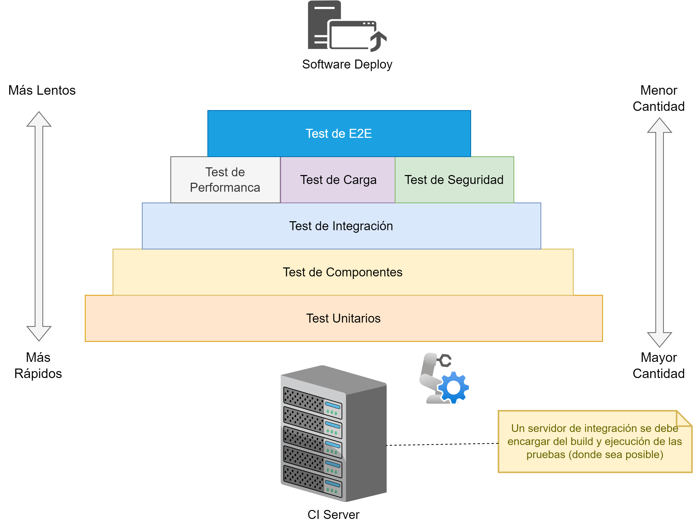

**Figura 15.1. Pirámide de Testing**

<a name="2.5.9_practica_entrega_continua_cd"></a>
### 2.5.9. Práctica: Entrega Continua (CD)

La entrega continua (Fowler et al., 2013) es la capacidad de <mark style="background: #FFF3A3A6;">introducir cambios</mark> de todo tipo (incluidas nuevas funciones, cambios de configuración, correcciones de errores y experimentos) en producción o en manos de los usuarios, de forma segura, rápida y sostenible (Humble, 2017). El objetivo es hacer que las implementaciones, ya sea de un sistema distribuido a gran escala, un entorno de producción complejo, un sistema embebido o una aplicación, <mark style="background: #ADCCFFA6;">sean asuntos rutinarios y predecibles</mark> que se puedan realizar bajo demanda.

*Referencia:*  Fowler, M., Humble, J., & Farley, D. (2013, May 30). ContinuousDelivery. Martin Fowler. Retrieved February 20, 2022, from https://martinfowler.com/bliki/ContinuousDelivery.html

*Referencia:* Humble, J. (2017). What is Continuous Delivery? What is Continuous Delivery? -Continuous Delivery. Retrieved February 21, 2022, from https://continuousdelivery.com/


La disciplina de CD implica que el **software puede (o no) ser enviado a producción** en cualquier momento. CD difiere del <mark style="background: #FFF3A3A6;">Despliegue Continuo (CD) donde “siempre” el software pasa a producción.</mark>

---

**CD (continuos delivery) != CD (continuous deploy)**

---

Los pre-requisitos para la práctica de CD incluyen: 

 * Tener funcionando un **pipeline** completo de Integración Continua (CI). 
 * Tener el **proceso de QA automation** en funcionamiento. 
 * Mantener un **control de configuración**, tanto del producto como de los ambientes (Artefactos y Repositorio de Artefactos). 
 
La complejidad en esta disciplina proviene de que se requiere un alto nivel de comunicación, coordinación y colaboración entre todos los equipos (Desarrollo, Operation, Delivery) y un alto grado de Testing (QA) y Automatización

La Fig. 16 hace visible que CI y CD son parte de procesos que se comunican entre sí usando “artefactos”. Así como como se definió en apartados iniciales, los artefactos sirven como elementos de intercambio, y por lo tanto, definen de alguna manera las interfaces de comunicación entre procesos.

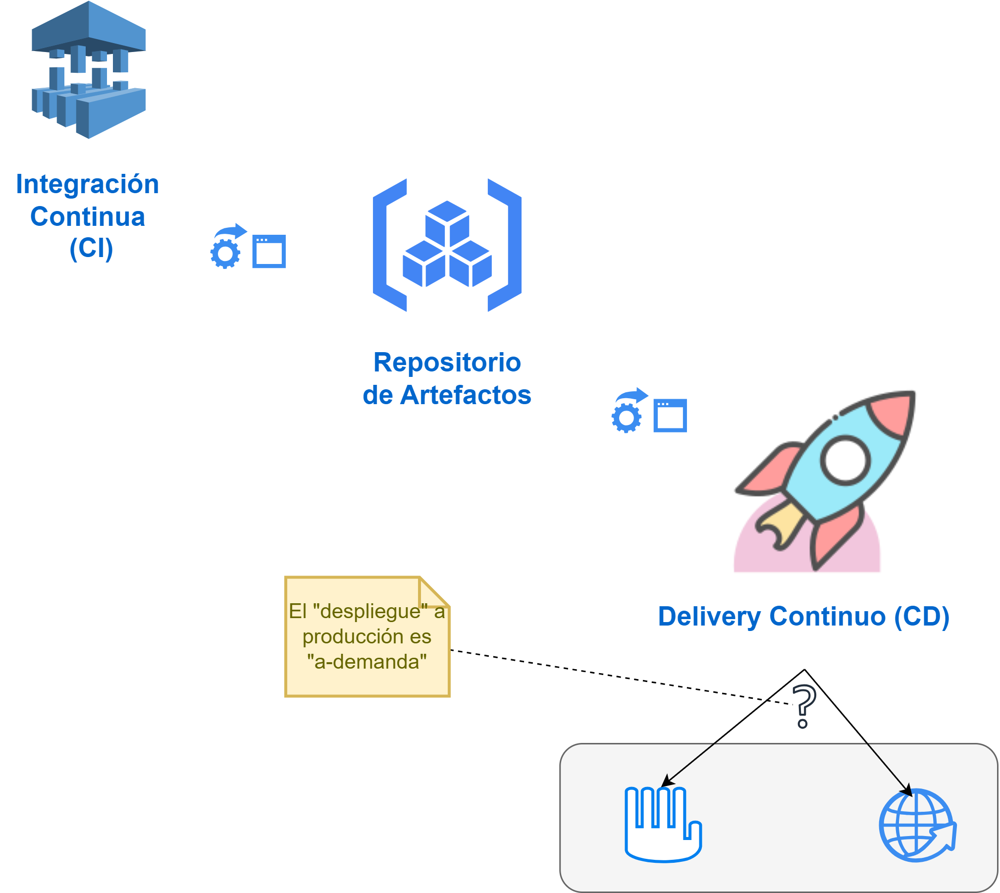

**Figura 16 Esquema de CI, Artefactos y CD.**

<a name="2.5.10_practica_APIs"></a>
### 2.5.10. Práctica: APIs

Una API (API, 2022) permite que un programa acceda a los datos y servicios de otro. Es un tipo de interfaz de software que ofrece un servicio. Un documento o formato estándar que describe cómo construir o usar una conexión o interfaz de este tipo se denomina especificación API. Se dice que un sistema de software que cumple con este estándar implementa o expone una API.

**Referencia:** Wikipedia contributors. (2022, February 4). API. In Wikipedia, The Free Encyclopedia. Retrieved 22:14, February 21, 2022, from https://en.wikipedia.org/w/index.php?title=API&oldid=1069932978

Una API se considera como el<mark style="background: #FFF3A3A6;"> “contrato”</mark> por el cual los sistemas pueden interactuar e intercambiar información.

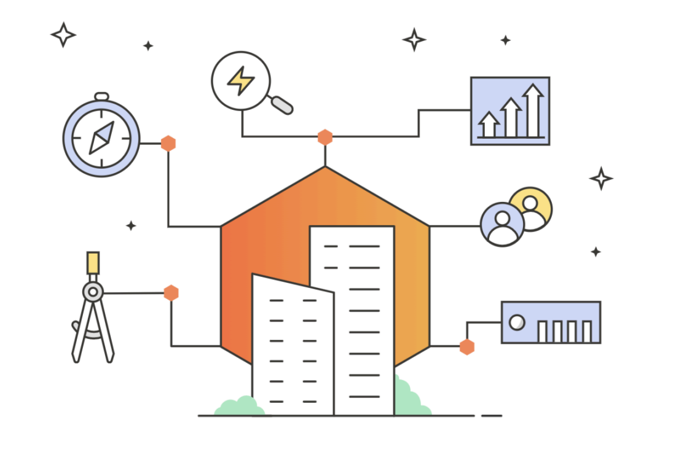

**Figura 17 Concepto de API. Imagen fuente (Postman, Inc., 2022**

En el desarrollo de productos de software, API-first (Postman, Inc., 2022) es un modelo en el que las aplicaciones se conceptualizan y construyen como una interconexión de servicios internos y externos a través de APIs. Al igual que modelar primero la arquitectura del producto de software trae varios beneficios,<mark style="background: #FFF3A3A6;"> modelar primero las interfaces</mark> de los distintos componentes del producto de software también provee sus beneficios (Lane, 2021). Para implementar la estrategia de desarrollo de productos utilizando el concepto de API-first, se recomiendan las siguientes acciones:

 * Hacer un **inventario** de las bases de datos, aplicaciones y servicios: comprender exactamente cuántas API hay disponibles y dónde faltan APIs. 
 * Comprenda el **enfoque de la organización** para producir API: identificar dónde existen procesos estándar y dónde no. 
 * Definir los **límites del dominio** empresarial y asignar su estructura organizativa a esos límites.
 * Adoptar una **plataforma de API y estandarizarla**. 
 * **Capacitar** a los equipos de Ingeniería, Security, DevOps, QA y Administración de Productos en las prácticas de uso, diseño, pruebas y priorización de API. 

**Referencia:** Postman, Inc. (2022). What is an API-first company? Postman. Retrieved February 21, 2022, from https://www.postman.com/lp/api-first-company/

**Referencia:** Lane, K. (2021, December 1). What Is an API-First Company? Postman Blog. Retrieved February 21, 2022, from https://blog.postman.com/what-is-an-api-first-company/


A continuación se listan las etapas (Lane, 2022) de implementación de una estrategia API-first:

1. 🛠️ **Definiciones iniciales**: equipo de trabajo, espacio para escribir, comunicar, modelar; y repositorio centralizado.
2.✏️ **Diseño**: Basarse en la especificación OpenAPI (The Linux Foundation, 2021) para un vocabulario común, mock servers y modelado de endpoints.
3. 📑 **Documentación**: Documentar (SmartBear Software, 2021) endpoints y proveer ejemplos.
4. 🚀 **Deploy**: Tener un servidor de CI/CD, y un gateway para centralizar los pedidos (requests).
5. 🧪 **Testing**: Generar pruebas por “contrato” y pruebas de performance.
6. 🔒 **Seguridad**: Implementar mecanismos de autenticación y autorización, implementar testing de seguridad.
7. 📊 **Monitoreo**: Monitorear el testing por contrato, de performance, seguridad, la actividad general de uso y desarrollo de las API, el changelog y las notificaciones que se generan.
8. 🔍 **Descubrimiento**: Asegurar los mecanismos de publicación en redes públicas o privadas y los mecanismos de búsqueda de documentación y ejemplos.

**Referencia:** Lane, K. (2022, January 14). The 8-Point API Lifecycle Blueprint. Postman Blog. Retrieved February 21, 2022, from https://blog.postman.com/api-lifecycle-blueprint/

**Referencia:** The Linux Foundation. (2021, February 15). OpenAPI Specification v3.1.0  Introduction, Definitions, & More. OpenAPI Initiative Registry. Retrieved February 21, 2022, from https://spec.openapis.org/oas/latest.html

**Referencia:** SmartBear Software. (2021). OpenAPI Specification - Version 3.0.3. Swagger. Retrieved February 21, 2022, from https://swagger.io/specification/


Como se verá más adelante, la etapa diseño es muy importante para el éxito de un producto de software. Generar roadmaps de alto nivel Fig. 18 es una práctica recomendada para tener una visión clara durante el desarrollo.

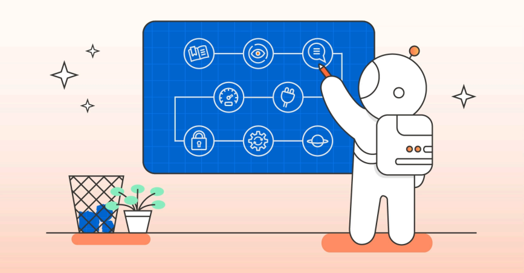

**Figura 18 Roadmap hacia un desarrollo Api-First. Imagen fuente (Postman, Inc., 2022)**


<a name="2.5.11_practica_estado_actual_madurez"></a>
### 2.5.11. Práctica: Estado Actual de Madurez

La implementación de una nueva metodología, procesos o herramientas requiere, para ser efectiva, que se identifique primero el estado actual en el cual está la organización y/o equipo, medirlo y luego planificar mediciones con el objetivo de analizar y evaluar el retorno de inversión (ROI).

Implementar una metodología como **DevSecOps** requiere tener en claro el estado actual de la organización para poder hacer el seguimiento y aplicar las acciones correctivas necesarias con el objetivo de tener éxito en la implementación de la metodología. 

Por ejemplo, según las recomendaciones de Google (Google LLC, n.d.), una organización puede identificar dónde se encuentra actualmente en el proceso de entrega de software Fig.19 a través de una simple encuesta que pretende hacer una evaluación de alto nivel sobre lo indicado por una organización/equipo.

**Referencia:** Google LLC. (n.d.). What is DevOps? Research and Solutions. Google Cloud. Retrieved February 21, 2022, from https://cloud.google.com/devops/

Link: [Simulador DORA Quick Check](https://dora.dev/quickcheck/)

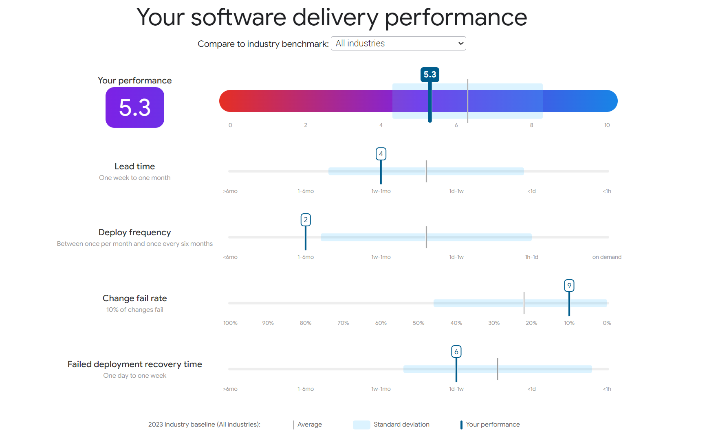

**Figura 19 Ejemplo Estado de Delivery de Software de una Organización. Imágen Fuente (Google LLC, n.d.)**

---

<a name="2.5.12_metodologia_DevOps"></a>
### 2.5.12. Metodología: DevOps

Terminamos de repasar las principales "prácticas", ahora vamos a realizar un repaso de las "metodologías".

Desde una perspectiva académica, (Bass et al., 2015) definen DevOps como: "un conjunto de prácticas Fig. 20 destinadas a reducir el tiempo entre la realización de un cambio en un sistema y el momento en que el cambio se coloca en producción, garantizando al mismo tiempo una alta calidad".


**Figura 20 Esquema Conceptual DevOps. Imagen Fuente (DevOps, 2020)**

**Referencia:** Bass, L., Zhu, L., & Weber, I. M. (2015). DevOps: A Software Architect's Perspective. Addison-Wesley

Para que una cultura de DevOps pueda ser implementada, se requiere que tanto el equipo como la organización tengan en claro los pilares técnicos y culturales sobre los cuales ésta metodología se sustenta para que sea exitosa. Desde el punto de vista técnico, estos pilares son: 

- **Deployability**: 🚀 la capacidad de un producto o servicio de ser puesto en producción o desplegado en distintos ambientes, por ejemplo: Dev, QA, pre-producción, producción, etc.
- **Modifiability**: 🔧 la capacidad de un producto o servicio de ser modificado. Este es un atributo fundamental de cualquier “buen” software.
- **Testability**: 🧪 la capacidad de un producto o servicio de ser puesto bajo pruebas según sea el caso. Un aspecto importante es tener claros los casos de negocio que el sistema debe cumplir y tener pruebas que validen esos "casos de negocio", tanto para validar los mismos como para ejecutar regresiones frecuentes.
- **Monitorability**: 📈 la capacidad de un producto o servicio de ser monitoreado.
- **Automation**: 🤖 la automatización (QA Automation) es un principio fundamental para lograr el éxito de DevOps, y CI/CD es un componente crítico.
- **Toolchain**: 🛠️ Conjunto de herramientas y plataformas bien definidas y compatibles con los procesos. Es importante destacar que las herramientas “proveen el soporte a DevOps” y no deben orientar la aplicación de la metodología.


Desde el punto de vista cultural, otros aspectos importantes incluyen: 

- **No trabajar en “silos”, aislados**: 🚫🏢❌
- **DevOps** no es un “rol” o una “persona”, es un equipo y una mentalidad, aún cuando pueden existir roles facilitadores (Fisher, 2021): 🤝👥💡
- **Generar ambiente “sin miedo”**, ambiente de respeto e igualdad dentro del equipo y la organización: 😌👫🤝
- **Responsabilidad** compartida y confianza: 🛡️🤝💪
- **Flujos** de información claros, bien definidos y acordados: 📊🔄📋
- **Colaboración**: 🤝💼🧑‍🤝‍🧑
- **Aprender de los errores, comunicar y aplicar “PostMortem Communication” (Mueller & Wickett, 2020)**: 📝💡📢
- **Aplicar nuevas ideas, y experimentar**: 💡🛠️🎯

**Referencia:** Fisher, B. (2021, December). Becoming a DevOps Engineer: Role and Responsibilities. Udemy Blog. Retrieved February 22, 2022, from https://blog.udemy.com/devops-engineer/

**Referencia:** Mueller, E., & Wickett, J. (Writers). (2020, 10 28). Use your words (Season 1, Episode 2.2) [TV series episode]. In DevOps Foundations. LinkedIn Corporation.  https://www.linkedin.com/learning/devops-foundations-23454205/the-foundations-of-devops

En “The DevOps Handbook” (Humble et al., 2021, 72), se toman como referencia los principios que se muestran en la Fig. 21 y que rigen una buena implementación de DevOps llamada “The Three Ways” (ó las 3 formas).

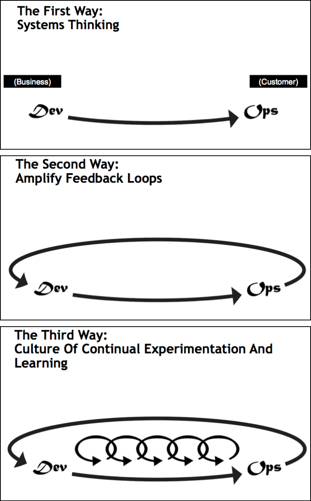

**Figura 21 Principios de DevOps. The Three Ways. Imagen Fuente: (Humble et al., 2021, 72)**

**Referencia:** Humble, J., Kim, G., Debois, P., & Forsgren, N. (2021). The DevOps Handbook, Second Edition: How to Create World-Class Speed, Reliability, and Security in Technology Organizations. IT Revolution Press. https://itrevolution.com/articles/the-three-ways-principles-underpinning-devops/

1. <mark style="background: #FFF3A3A6;">The First Way</mark>: Habilitar el flujo de trabajo de izquierda a derecha, desde Desarrollo
hasta la Operación, hacia el cliente.
2. <mark style="background: #BBFABBA6;">The Second Way</mark>: Habilitar el flujo constante y rápido de feedback, de izquierda a
derecha para todas las etapas de la cadena/flujo de valor (value stream).
3. <mark style="background: #ADCCFFA6;">The Third Way</mark>: Habilitar la creación de una cultura de confianza que soporte la
dinámica de trabajo de DevOps, ayudando a la disciplina, experimentación, y toma de
riesgos.


<a name="2.5.13_metodologia_seguridad"></a>
### 2.5.13. Metodología: Seguridad

La seguridad de la información (**InfoSEC**) y en general “seguridad digital” (Information security, 2022) tiene una gran importancia y cada vez más se incrementa la necesidad de implementar mejores mecanismos de seguridad digital, no solamente para los productos de software desarrollados, sino también para la infraestructura, herramientas, procesos y cultura en general. La idea de seguridad se basa en saber cuales son los riesgos (Skoglund, 2019) y en base a eso tomar dos acciones Fig. 22: 

 * Toma de <mark style="background: #FFF3A3A6;">conciencia</mark> del nivel de protección/exposición actual. 
 * Definición <mark style="background: #BBFABBA6;">medidas de protección</mark>.

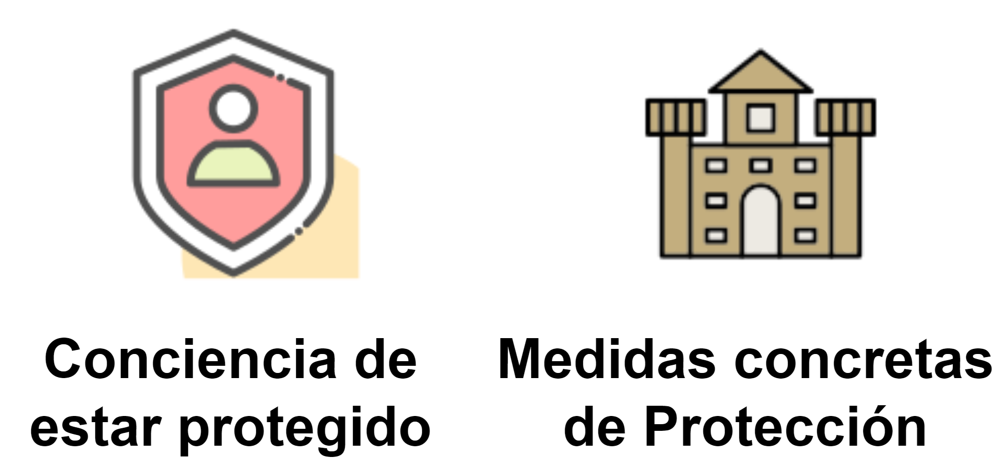

**Figura 22 Concepto de Seguridad.**

**Referencia:** Wikipedia contributors. (2022, February 21). Information security. In Wikipedia, The Free Encyclopedia. Retrieved 23:43, February 22, 2022, from https://en.wikipedia.org/w/index.php?title=Information_security&oldid=1073245153

**Referencia:** Skoglund, K. (Executive Producer). (2019). Programming Foundations: Web Security [TV series]. LinkedIn LinkedIn Corporation. https://www.linkedin.com/learning-login/share?forceAccount=false&redirect=https%3A%2F%2Fw ww.linkedin.com%2Flearning%2Fprogramming-foundations-web-security-2%3Ftrk%3Dshare_ent _url%26shareId%3D%252B1kjrO87ROmIeOzc9w5YVQ%253D%253D (Original work published 2019)

>[!todo]
>Para cada una de las deficiones, mejorar los ejemplos y diagramas, para que sea más técnico y claro el concepto.


Las siguientes definiciones proveen el marco en el cual se debe considerar la seguridad desde el punto de vista del desarrollo de productos de software. Se presenta una muy breve descripción de aspectos teóricos, prácticos y algunas prácticas de implementación que se recomienda tener en cuenta al plantear una estrategia de ciberseguridad:

 * **Threat Model**: 🛡️🎯👥 concepto militar que busca crear un escenario “único” para cada activo valioso e identificar las medidas de defensa disponibles. Se modela del perfil del atacante, los vectores de ataque probables, las vulnerabilidades existentes y casos realistas y no realistas de ataque. El modelado permite generar “conciencia” del estado de protección. 
 * **Vulnerabilidad Zero-Day**: 🚨0️⃣📅 Falla (o exploit) que expone al software/producto de alguna manera aún no solucionada o sin parche de seguridad disponible antes posibles ataques. 
 * **Principios Generales de Seguridad**: 
	 * 🚫🔐 Aceptar que: “La seguridad total es imposible”. 
	 * 🔑⬇️ Implementar medidas como least privilege (controlar, limitar, no dar accesos). 
	 * ⚙️✔️ **Simple** es más seguro. 
	 * 🙅‍♂️👤🔍 No confiar en los usuarios, ser paranoico. 
	 * 🔮📉 Esperar lo inesperado, analizar casos límites. 
	 * 🏰🔗 Defensa por “capas”, y niveles de defensa. 
	 * 🌑🔒Defensa a través de oscuridad (obscure). 
	 * 📋✅🚫Lista de permitidos / Lista de bloqueados (allow/deny) 
	 * 🗺️🔌 Mapa de puntos de Exposición y transferencia de datos (canales). 
 * **Seguridad de los Datos (CIA)**: 
	 * 🔒📝 Confidentiality (confidencialidad). 
	 * ✔️🔐 Integrity (integridad). 
	 * ⏳🔄 Availability (disponibilidad).
 * **Buenas Prácticas Generales**: 
	 * 🚪🛑 Filtrar entradas 
	 * 🚪✅Filtrar salidas 
	 * 🧹🔬✔️ Sanitizar, analizar, validar, etiquetar variables, código privado. 
	 * 🛡️👥🔑 Credenciales, permisos y roles 
	 * ✍️🧹 Clean-code, refactoring, 
	 * 📜📊 Estrategias de logging. 
	 * 🛠️🔍Testing de seguridad / Pentesting 


#### Ataques Comunes: 
* 🔐🔑💥 Ataque con credenciales: robo, elevación de privilegios, fuerza bruta, suffing. Protección con: Contraseñas robustas, Password Hashing, Login Throttling. 

[](https://mermaid.live/edit#pako:eNpVkU1OwzAQha8y8rq9QBZIzR9FYhHR7pwuhniSWErsYo-LoOqhEEfoxTAJFalXfvM-zRvNnEVjFYlEdA6PPezz2kB8G7lhfAsEjTWQOVJkGo0D-QOs1w-Qyhf7ag9_7FTKZDHQCRt9_TagCCqnT3qgTlt_x-WyDOQ-EVIXGO-sQs5JHJNgx6FttekiMTOlrJxlaqaEeYxHmVnDDj1dv9BDnCl4xlteOTFbWaH379Yp2KLv547_9pN8tp02sO9jcx6WgekElLPIliJfiuImxEqM5EbUKq7z_GvWgnsaqRZJ_CpqMQxci9pcIoqB7e7DNCJhF2glnA1dL5IWBx9VOCpkyjXGs4wzcvkBl42HVQ)

* 🌐🔓 IDOR (Insecure Direct Object Reference) o manipulación de URLs 

[](https://mermaid.live/edit#pako:eNpVkVFOAjEQhq8y6TNcYB9MgC5KIsGgPnV5GNtZKO62m2k3UQmH8QwegYvZLQral3Ym3_9n5u9BaG9IFGLL2O3gSVYO0pmohVytYeEC6Z4JpGXSEVYv--FaU01MTtMGxuMbmKolOtv1DWp7-nJgCJ7X92FztppmZqYmWlPw4DxgHz3bDzT-HyLV0htbW321MRj9r88sQ6Uq3zof7AWxhlzMKuOZAlgXid1FJbNqrubYRBx47V1k3yQyFZhnSugZLjN8q8o9tV3jC1jIAOT-bjPPyN0VeUA-fbaUPDNae25TEGzzBGIkWuIWrUkJHwaHSsQdtVSJIj0N8mslKndM3BDK47vToojc00iw77c7UdTYhFT1XYqCpMX0Te1P9_gNfuaUQA)

En éste ejemplo, si no protegemos una API correctamente, cualquier petición que exponga el ID del usuario (como la URL debajo) puede permitir conocer los detalles de cualquier otro usuario manipulando y cambiando el ID:

```
GET https://example.com/user/{userId}
```

```bash
// un usuario cualquiera
GET https://example.com/user/12345


// admin user
GET https://example.com/user/10000
```


* 💻💉📊 SQLi (Inyección de SQL). Manipular DB, robo datos. Protección con: control de inputs, sanitizar datos, uso de librerías del lenguaje/framework. 

[](https://mermaid.live/edit#pako:eNpdkk1uwjAQha9ieQ3qPotKkPCTFqS2aVcOC2MPwSXxRLajliKO1BVH4GI1cUhps0le3jee8bMPVKAEGtHC8HpLXpNcE_-MWPa8UCTVexBCnU-aSCD-14oMh_dkzJZcq7opee-NuYXLO-EO7apbpIVj9oJr_O-NWy9hqbZg-lXi80mqAsmSl0ootNjRcUtP2EgIsEg0klHj0KgvLq9I0iJTtkSpNkr8TnbbddJCMzb5rNGqHkn1Bk3VlWSgrVqX4EtC0Zw9GXRdDiGAlMWoncEyVNeNu3aYt_4Dy3xAzs9n_vQP7iN7s20gC7U2YM7f3HpVkgXoouHvcDc1vIIPNLt-hrC7eRDTWzG7CjqgFfhdKOlP83Axc-q2UEFOI_8pudnlNNdHz3EfXrbXgkbONDCgBptiS6MNL61XTS25g0RxfyWqgBx_AGMwtHM)

El ejemplos más clásico de SQLi sería: si tenemos una consulta SQL como esta:

```sql
SELECT * FROM usuarios WHERE usuario = 'admin' AND contraseña = 'password';
```

Si un atacante inserta código malicioso, la consulta podría convertirse en:

```sql

SELECT * FROM usuarios WHERE usuario = 'admin' OR '1'='1' AND contraseña = 'password';
```
Esto podría permitir el acceso no autorizado a la base de datos.


* 💻🎯📝 XSS (Cross Site Scripting). Ataques manipulando sitios webs de terceros. Tipos de ataques: reflected, stored, DOM-based. Protección con CSP o Content Security Policy. Protección con: Validación de request de las API (GET/POST), usar tokens CSRF. 

[](https://mermaid.live/edit#pako:eNpdUUtuwjAQvcrIa1D3WVSCBFIqISKcfiSHhXEGsEjs1J8FQpyqR-jF6jjQlnrl9xu90ZyJ0DWShOwN7w5QZpWC8CbsnVJIjbYWqHQIVBjZOan2GxiPH2HKllzJzjdcyK9PBTX2NqktvOG2RyUagSG-GeZNYyplpeyCJ-gTxz883uQ0yhlb465B4bC-42eMOm3-kXOWrZbjLbeRH5ScFUY7FLHTUPSJpbSAVCuHygFF4Y10Jyh0I8XpOjCPzgV75Y2sfxdaY9_QxboNtzApFpDPyodiRcu75DN7sTourY-oLKR0Pf_plEVLPoDZXzC_ATIiLZqWyzrc4dyLFXEHbLEiSfjW3BwrUqlL8HHvND0pQRJnPI6I0X5_IMmONzYg39XcYSZ5OGZ7ZS_fVpGXBQ)


* 🍪👀🕵 Robo y Visibilización de Cookies. Limitar y encriptar datos sensibles. Proteger con: Uso de Sesiones, SSL, HTTPS, Sign-Cookie. 

[](https://mermaid.live/edit#pako:eNp9kU1OwzAQha9ied2IfRZIaZKmBYQqHNg4LFxnSKwmnsh2JErVU3EELobJD1WLhFeeed88j2eOVGIJNKSVEV1N8qTQxJ-IP-EOyYG8KKt2qlEfQqqvT01KIDHiXoF9JUFwS5Y8fe_Qql81EQ4tYaB9XeOp0W85wDGPG9RnJwZWob6CEh5JCRbJI5Kod2j82yVOSDwgKX_2-rmV2cvbTlwycCu-0Q6MhO5P84UewYxvDTqQAzB-aT27X7WXDeqGM_Zws87zLbvI33GmKh2M_hfKPU-1NKpz4p8hjQXpUJCNwWoO6IK2YFqhSr-n449YUFdDCwUN_bUUZl_QQp88J_zA2EFLGjrTw4Ia7Kuahm-isT7qu1I4SJTwy26n7Okbhdynpw)


* 💻🔗🔒 Session Hijacking: Robo se sesiones activas. Proteger con HTTPS, SessionID. 
* 👤🔗💥 Session Fixation. Person-In-The-Middle attack. Proteger con: Validar Inputs, sanitización, CSP, Cookie Setting, HTTPS. 
* 💻💥🖥️ RCE o Remote Code Execution. Ejecución de comandos en el servidor. Proteger con: Controles en el servidor, Firewall, Análisis de tráfico. 
* 📂⚠️💾 File Upload Abuse. FUA, sobre-uso de almacenamiento, inyección de malware. 
* 🌊🚫💻 Denial Of Service (DoS). Flooding (inundar) o Crashing (overflow, RunTime Error). Proteger con: Throttling a través de limitaciones; Filtering con reglas; Sinkholing con redirección para post-análisis; Blackholing redirigiendo los datos a la nada (/dev/null).


<a name="2.5.14_metodologia_qa_automation"></a>
### 2.5.14. Metodología: QA Automation

QA es una metodología que abarca todo el ciclo de vida de desarrollo de software (SDLC). QA describe los esfuerzos sistemáticos que se realizan para garantizar que los productos entregados a los clientes cumplan con las expectativas contractuales (también conocidas como expectativas del negocio) y otras como por ejemplo: rendimiento, diseño, confiabilidad, usabilidad, mantenibilidad y operación. 

En el presente trabajo se considera a QA como el marco de trabajo que se implementa a través de la aplicación de:

 * Las metodologías y prácticas (sección 2.5) 
 * Las estrategias de diseño (sección 3)
 * Las herramientas (sección 4)
 * La implementación y operación (sección 5)

Todos los artefactos y procesos que se proponen en el presente trabajo son parte de la aplicación de la visión de QA para el aseguramiento del cumplimiento de las expectativas del cliente con el producto o servicio a desarrollar.

La automatización de QA se considera como la implementación de técnicas y herramientas automatizadas en la ejecución de pruebas en el producto o servicio de software que se está desarrollando e informar sobre los resultados (Laukkanen, 2006, 1-3), de manera tal que la intervención humana se reduzca al mínimo y se pueda enfocar el esfuerzo en otras tareas.

**Referencia:** Laukkanen, P. (2006, February 24). Data-Driven and Keyword-Driven Test Automation Frameworks. HELSINKI UNIVERSITY OF TECHNOLOGY, 1(2006), 98+0. 

La mayoría de los beneficios asociados se pueden resumir con palabras como eficiencia y reutilización. Se espera que la automatización de pruebas ayude a<mark style="background: #FFF3A3A6;"> ejecutar muchos casos de prueba de manera consistente de forma reiterada (regresión) en diferentes versiones del sistema bajo prueba</mark>. La automatización también puede facilitar disminuir la carga de trabajo de los ingenieros de software y liberarlos de tareas repetitivas. Todo esto tiene el potencial para aumentar la calidad del software y acortar los tiempos de prueba.

Todas estas promesas hacen que la automatización de pruebas parezca atractiva, pero lograrlas en la vida real requiere mucho trabajo. Si la automatización no se hace bien será abandonada y las promesas nunca se cumplirán. 


<a name="2.5.15_metodologia_estrategia_qa"></a>
### 2.5.15. Metodología: estrategia de QA

El problema general con la automatización de pruebas parece ser olvidar que cualquier proyecto de automatización de pruebas es un proyecto de software por derecho propio. Los proyectos de software fallan si no siguen procesos y no se gestionan adecuadamente, y los proyectos de automatización de pruebas no son diferentes. Por éste motivo <mark style="background: #ADCCFFA6;">es fundamental desarrollar una estrategia de QA</mark>.

A continuación se listan los principales tipos de pruebas que se recomienda automatizar, en lo posible, y que se deben considerar al momento de desarrollar una estrategia de QA:

1. **Gestión de Ambiente** 🌐
2. **Checklists** 📝
3. **Herramientas y Procesos** 🛠️
4. **Testing Unitario** ✅
5. **Testing de Componente** 🧩
6. **Testing de Integración** 🔗
7. **Test de Sistema** 🖥️
8. **Testing de Seguridad** 🔐
9. **Test de Aceptación** ✔️
10. **A/B Testing (Kohavi, 2013)** 🔄
11. **Herramientas (Linters, análisis de código estático)** 🧰
12. **Reportes y herramientas de análisis y visualización** 📊
13. **Repositorio de evidencias** 📂
14. **Trazabilidad con requerimientos, bugs, funcionalidades, diseño, versiones** 🧵

**Referencia:** Kohavi, R. (2013, December 12). Online Controlled Experiments: Introduction, Insights, Scaling, and Humbling Statistics. InfoQ. Retrieved February 23, 2022, from https://www.infoq.com/presentations/controlled-experiments/ 


<a name="2.5.16_metodologia_metolodogia_devsecops"></a>
### 2.5.16. Metodología: Metodología: DevSecOps


La metodología DevSecOps (Crawford, 2019) implica pensar desde el principio en la seguridad de las aplicaciones y de la infraestructura, ver  Fig. 23. También implica automatizar los aspectos de seguridad para impedir que se ralentice el flujo de trabajo de DevOps. Para cumplir con estos objetivos es necesario seleccionar aplicar ciertas prácticas y herramientas adecuadas para integrar la seguridad de manera permanente, como acordar el uso de un entorno de desarrollo integrado (IDE) con funciones de seguridad hasta el testing y automatización de ambientes e infraestructura de hardware.

**Referencia:** Crawford, A. (2019, September 12). What is DevSecOps? YouTube. Retrieved February 20, 2022, from https://www.youtube.com/watch?v=J73MELGF6u0 

Las prácticas de DevSecOps se expresan brevemente en la página oficial de la organización https://www.devsecops.org/ :

#### Manifiesto DevSecOps

| Aprender siempre                             | sobre decir "NO"                                   |
| -------------------------------------------- | ------------------------------------------------------ |
| Ciencia de datos y seguridad                 | sobre miedo, incerteza o duda                          |
| Contribución y colaboración abierta          | sobre solo requerimientos de seguridad                 |
| Consumir servicios seguros sobre API's       | sobre controles de seguridad mandatorios y "papeleo"   |
| Scores orientados por el negocio             | Sobre "sellos" de seguridad                            |
| Testing de exploit usando equipos Red y Blue | sobre basarse en escaneos de vulnerabilidades teóricos |
| Monitoreo proactivo 24x7                     | sobre reacción al ser informados de un incidente       |
| Información compartida sobre amenazas        | sobre mantener la información oculta para nosotros     |
| Cumplimientos en la Operación                | sobre checklists y pizarras                                                       |


Si se observa desde un punto de vista histórico, existen 3 grandes movimientos que dieron el impulso final a DevSecOps y a QA Automation (Lietz, 2020):

- Waterfall fue evolucionando hacia Agile, que luego trascendió a DevOps.
- Los productos tipo monolitos se han convertido en microservicios.
- Sistemas basados en datos centralizados ahora está dando paso a ambientes cloud.

**Referencia:** Lietz, S. (2020). History of DevSecOps. SKILup Day. https://www.devopsinstitute.com/skilup-days-devsecops/ 

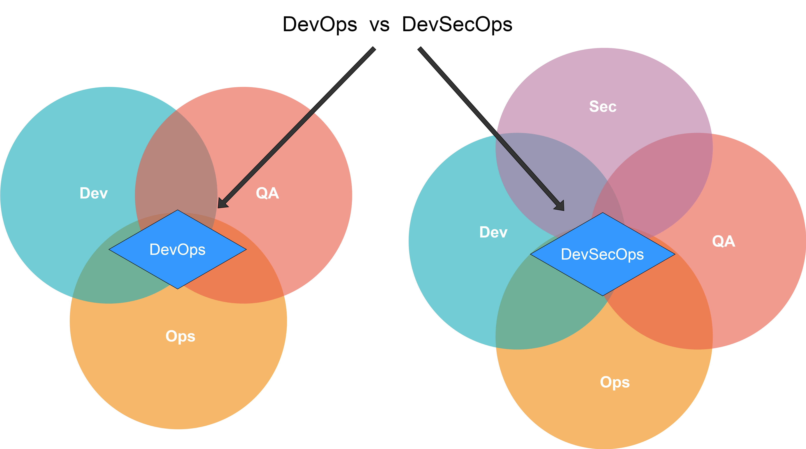

**Figura 23: DevOps vs DevSecOps. Concepto. Imagen Fuente (DevSecOps, 2021)**

**Referencia:** File:DevOps vs DevSecOps Mginise.jpg. (2021, November 29). Wikimedia Commons, the free media repository. Retrieved 21:45, February 23, 2022 from https://commons.wikimedia.org/w/index.php?title=File:DevOps_vs_DevSecOps_Mginise.jpg&oldid=610868212. 

Habiendo planteado los conceptos necesarios del marco teórico, se puede consolidar y analizar ahora el conjunto de actividades, fases y flujo de la metodología en su conjunto. En la Fig. 24 se puede observar las fases, etapas y el flujo continuo de integración y entrega:

- <mark style="background: #FFF3A3A6;">Dev</mark>: Plan, Develop, Build, Test, Releases.
- <mark style="background: #ADCCFFA6;">Ops</mark>: Deliver, Deploy, Operate, Monitor, Feedback.
- <mark style="background: #BBFABBA6;">Sec</mark>: Requirements Analysis, Secure Coding, SAST, WhiteBox DAST, BlackBox DAST, Digital Sign, Secure Transfer, Secure Config, Security Scan, Security Patch, Security Audit, Security Monitor, Security Analysis.

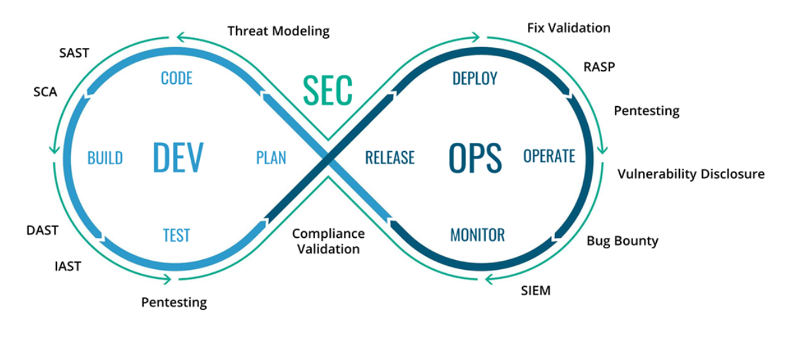

**Figura 24: DevSecOps: Etapas, Fases, Flujo. Imagen Fuente**

**Referencia:**  https://github.com/6mile/DevSecOps-Playbook  

Es evidente que tantas etapas de aseguramiento de calidad del producto serían extremadamente costosas y difíciles de implementar si no se emplea una estrategia de automatización que tenga en cuenta no solo la arquitectura del software, la infraestructura y el delivery, sino además las etapas de análisis, diseño y hasta la definición de requerimientos.

Finalmente, desde la estrategia de alto nivel hasta el modelado de los test unitarios de seguridad de un producto de software, puede verse el diseño como un concepto transversal.

---

<a name="3.diseño"></a>
# 3. Diseño

El concepto de diseño es muy amplio. En el presente trabajo se va a considerar el diseño no solo desde la perspectiva del desarrollo de código sino de todo el espectro de actividades asociadas al desarrollo de un producto, a saber:

- Diseño de la Arquitectura
- Diseño del flujo de trabajo de los equipos de QA, Dev, Sec y Ops.
- Diseño de la UX/UI de los usuarios
- Diseño de las Pruebas Funcionales
- Diseño de la Seguridad
- Diseño de la Documentación
- Diseño de la Infraestructura
- Diseño de los procesos de Soporte y Mantenimiento.

El diseño, según (Martin, 2011, 15) se puede definir como:


> Mucho se ha escrito sobre los principios y patrones de diseño de software que soportan estructuras que son flexibles y mantenibles.
> 
> Los desarrolladores de software memorizan estas cosas y se esfuerzan por adaptar su software a ellas. Pero hay un truco para esto que muy pocos desarrolladores de software siguen: si desean que su software sea flexible, ¡tiene que flexibilizarlo! La única forma de demostrar que su software es fácil de cambiar es que sea sencillo hacer cambios en él. Y cuando descubren que los cambios no son tan fáciles como se pensaba, entonces se debe refinar el diseño para que el próximo cambio sea más fácil.
> 
> Bob Martin


**Referencia:** Martin, R. C. (2011). The Clean Coder: A Code of Conduct for Professional Programmers. Prentice Hall. 

Como idea general que dará pie al resto del capítulo se plantea lo siguiente: un buen producto de software es aquel diseñado para cambiar, evolucionar, adaptarse a lo nuevo. De aquí la importancia de aplicar desde un inicio el diseño.

<a name="3.1.estrategias_de_disenio"></a>
## 3.1 Estrategías de Diseño

<a name="3.1.1.gran_disenio_inicial_bduf"></a>
### 3.1.1 Gran Diseño Inicial (BDUF)

El diseño completo de un sistema (tanto el diseño de alto nivel como el de bajo nivel) (BDUF, 2020) se completa/aprueba antes de que comience la implementación. Esto es común en el modelo de cascada (<mark style="background: #FFF3A3A6;">waterfall</mark>), y así funciona en campos como la construcción (donde los diseños de arquitectura e ingeniería están completos casi en su totalidad antes de iniciar la etapa de construcción. Primero pasan por varias rondas de aprobación y luego los constructores ejecutan según el plan, y donde cualquier desviación es un error costoso. Con el diseño aprobado, los cambios tardíos se consideran "errores" en el análisis.

**Referencia:** Wikipedia contributors. (2020, December 29). Big Design Up Front. In Wikipedia, The Free Encyclopedia. Retrieved 13:00, February 28, 2022, from https://en.wikipedia.org/w/index.php?title=Big_Design_Up_Front&oldid=997072916


<a name="3.1.2.disenio_preliminar_inicial_RDUF_disenio_emergente"></a>
### 3.1.2 Diseño Preliminar Inicial (RDUF) y Diseño Emergente

Se realiza un diseño por adelantado (RDUF, 2020), <mark style="background: #ADCCFFA6;">muy liviano, lo suficiente</mark> como para ver el panorama general del sistema. Esto podría significar identificar casos de uso, dibujar el modelo de dominio, realizar un análisis de alto nivel con respecto a algunos conceptos importantes, pero no se profundiza en los detalles, sino que se trabaja de forma incremental (o emergente) a medida que se ofrecen funcionalidades específicas(Beck & Andres, 2004, 105). Por lo tanto, parte del diseño se realiza por adelantado, pero una mayor parte del diseño se posterga. Este enfoque se popularizó con las metodologías ágiles.

**Referencia:** Wikipedia contributors. (2020, December 29). Big Design Up Front. In Wikipedia, The Free Encyclopedia. Retrieved 13:00, February 28, 2022, from https://en.wikipedia.org/w/index.php?title=Big_Design_Up_Front&oldid=997072916

**Referencia:** Beck, K., & Andres, C. (2004). Extreme Programming Explained: Embrace Change. Pearson Education. 

<a name="3.1.3.framework_cynefin"></a>
### 3.1.3 Framework Cynefin 

El framework Cynefin (Cynefin, 2022) Fig. 25 establece que a medida que se pasa de "Simple" → "Complicado" → "Complejo" → "Caótico", la predictibilidad de un sistema disminuye. En el caso de los sistemas "simples", los requisitos y la implementación se conocen completamente de antemano y hay bajo riesgo, mientras que en los sistemas caóticos, los requisitos y la implementación no están bien definidos y están en constante estado de cambio.

**Referencia:** Wikipedia contributors. (2022, February 28). Cynefin framework. In Wikipedia, The Free Encyclopedia. Retrieved 13:04, February 28, 2022, from https://en.wikipedia.org/w/index.php?title=Cynefin_framework&oldid=1074421336

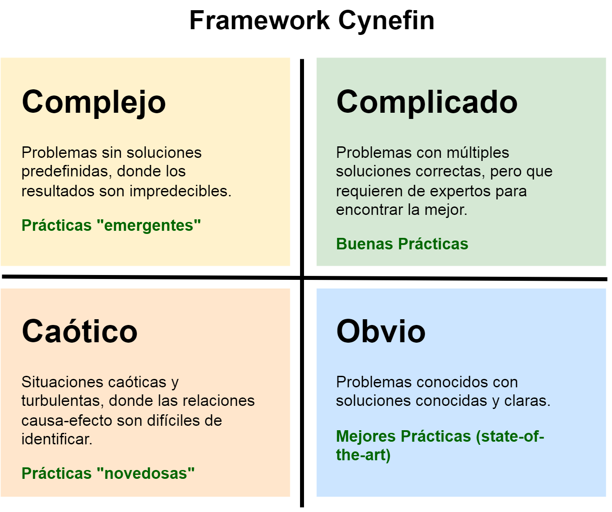

**Figura 25 Etapas del Framework Cynefin. Imagen Fuente (Cynefin, 2014)**

<a name="3.1.4_estrategia_diseño_optimo_compensacion_costo_beneficio"></a>
### 3.1.4 Estrategía de Diseño óptimo y compensación de costo/beneficio

BDUF es adecuado para sistemas "Simples", pero a medida que se avanza hacia sistemas "Complejos", se tiene una mayor necesidad de enfoques de diseño más adaptables, como es el caso de RDUF y Diseño Emergente.

Para un conjunto dado de requisitos (el comportamiento deseado del sistema), existen múltiples estrategías de diseños posibles (la estructura del sistema) para satisfacer esos requisitos.
Los sistemas predecibles/estables permiten decisiones de diseño más detalladas por adelantado. En este caso, podemos decir que BDUF es más económico que RDUF. Los sistemas impredecibles/cambiantes dan como resultado un diseño inicial más pequeño y un diseño incremental/emergente más importante. En este caso, RDUF es más económico que BDUF.
En base a los conceptos planteados se propone aplicar una estrategía de “etapa ByDesign”, donde se especifica una lista de pasos a seguir como estrategía de diseño de cada una de las etapas:


1. Identificar las principales etapas o procesos en el desarrollo de un producto de software 🔍🛠️
2. Modelar cada etapa o proceso 🧩✏️ abstrayendo la esencia que la define y expresando esa abstracción con alguna representación de alto nivel: diagramas, flujos, pizarras, texto 📊📝, o sea, un diseño “liviano” (RDUF) 🎯.
3. Armar el flujo de etapas o procesos 🔄, como lo expresado en la Fig. 12: Arquitectura de Procesos de Alto Nivel 🏗️.
4. Identificar las Entradas y Salidas de cada etapa o proceso 📥📤, o sea, identificar sus interfaces, que eventualmente son los canales de comunicación 📡 y los artefactos son el mensaje que se comunica ✉️.
5. Refinar a un nivel de detalle razonable (costo/beneficio) cada etapa o proceso identificado ⚖️, por ejemplo: QA 🛡️, Dev 💻, Sec 🔐 y Ops ⚙️.


<a name="3.2.qa_by_design"></a>
## 3.2. QA ByDesign

QA ByDesign o QA basado en modelos (Model-Based QA, 2021) es la aplicación de diseño basado en modelos para diseñar y, opcionalmente, también ejecutar, artefactos para realizar pruebas de software o pruebas de sistemas. Los modelos se pueden usar para representar el comportamiento deseado de un sistema bajo prueba (DUT/SUT) o para representar estrategias de prueba y los entornos de prueba. En la Fig. 26 se muestra un flujo completo desde el modelo a probar y los requerimientos, hasta los resultados.

**Referencia:** Wikipedia contributors. (2021, November 21). Model-based testing. In Wikipedia, The Free Encyclopedia. Retrieved 22:05, March 2, 2022, from https://en.wikipedia.org/w/index.php?title=Model-based_testing&oldid=1056315691 

<a name="3.2.1.modelado_procesos_artefactos"></a>
### 3.2.1 Modelado de Procesos y Artefactos

Se puede pensar en el modelado de QA como en el modelado de los componentes de un sistema de software, pero en lugar de modelar “componentes funcionales”, se modelan los “componentes para probar la funcionalidad” de un sistema de software. El modelo representa no solo los elementos necesarios para entender el esquema de QA sino las interfaces, conexiones y resultados de la instancia de un flujo de ejecución de pruebas.

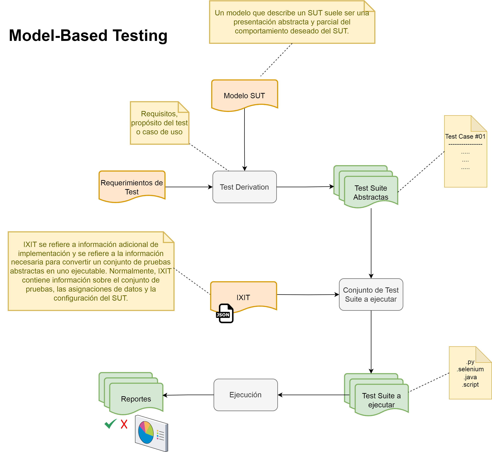

**Figura 26: Flujo de trabajo de QA basado en modelos. Imagen Fuente((Model-Based QA, 2021)**

<a name="3.2.2_patrones_testing"></a>
### 3.2.2 Patrones de Testing

El modelado de los aspectos de QA desde un inicio tiene varios beneficios pero a su vez es una tarea difícil y poco común en la industria en general. Es por eso que es conveniente basarse en framework y patrones de pruebas para acelerar la implementación. Un ejemplo que puede ayudar son los XUnit Test Patterns. (Meszaros, 2007, 7,19,21, 40), donde el autor expresa una forma estándar de diseñar las pruebas (Fig. 27), basadas en 4 fases:

**Referencia:** Meszaros, G. (2007). XUnit Test Patterns: Refactoring Test Code (1st ed.). Addison-Wesley. 

1. Fixture setup
2. Exercise SUT
3. Result verification
4. Fixture teardown


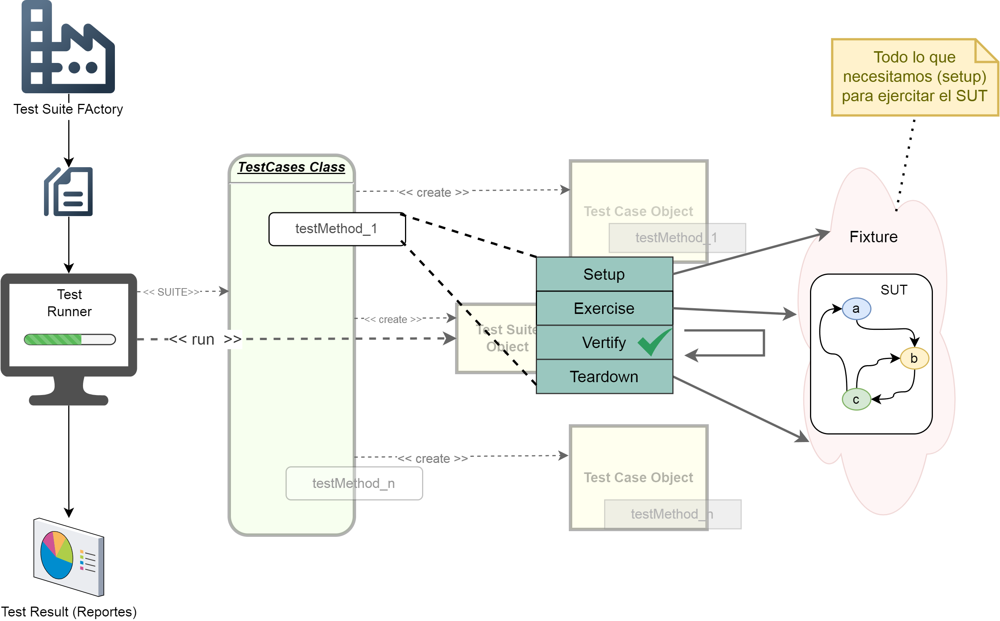
**Figura 27: xUnit Four-Phase Test Pattern.**

**Referencia:** [Four Phase Test at XUnitPatterns.com](http://xunitpatterns.com/Four%20Phase%20Test.html)

<a name="3.2.2.1_Deep-Dive_esquema_testing"></a>
#### 3.2.2.1 Deep-Dive en el esquema de Testing

Ahora vamos a repasar brevemente cada parte de éste esquema de testing propuesto:

1. **Test Suite Factory** 🏭 : Representa el punto de partida para la generación de pruebas. Este componente es responsable de crear las clases de pruebas (**TestCases Class**) que contienen los métodos de prueba necesarios.
2. **TestCases Class** 📂  :Esta clase contiene los métodos de prueba, como `testMethod_1`, `testMethod_n`, que serán ejecutados dentro de la suite de pruebas. Cada método se enfoca en verificar una funcionalidad específica del sistema bajo prueba (**SUT**).   
3. **Test Case Object** 🧪 : Los métodos de prueba se instancian como objetos individuales, representando casos de prueba independientes. Cada objeto sigue un ciclo estándar de ejecución conocido como **Setup-Exercise-Verify-Teardown**:
    - **Setup**: Configuración necesaria para preparar el entorno y los datos requeridos por el caso de prueba.
    - **Exercise**: Ejecución del comportamiento o funcionalidad del SUT que se quiere verificar.
    - **Verify**: Comprobación de que el resultado es el esperado (criterio de éxito) usando "aserciones".
    - **Teardown**: Limpieza del entorno después de la prueba para garantizar que no afecte a otras pruebas.
4. **Test Suite Object** 🛠️  : Agrupa múltiples casos de prueba y permite ejecutarlos de manera estructurada. Esto facilita la ejecución de un conjunto completo de pruebas, asegurando cobertura en diferentes aspectos del SUT.
5. **Fixture** 🎯  : Representa el conjunto de elementos necesarios para ejecutar el **SUT** (System Under Test). Esto incluye:
    - Datos específicos.
    - Dependencias como bases de datos, servicios externos o archivos.
    - Configuraciones particulares.
6. **SUT (System Under Test)** 🔄 : El sistema o componente que se está verificando. La interacción entre los casos de prueba y el SUT se realiza mediante el patrón Fixture. 
7. **Resultados** 📊  : Una vez ejecutadas las pruebas, los resultados se recopilan y analizan. Esto incluye reportes y métricas que ayudan a determinar la calidad del software y la efectividad de los tests.

<a name="3.2.2.2_aracterísticas_beneficios"></a>
#### 3.2.2.2 Características y Beneficios

1. **Estandarización y Consistencia**: La estructura xUnit proporciona un marco estandarizado para escribir y ejecutar pruebas, reduciendo la probabilidad de errores humanos y garantizando consistencia.
2. **Modularidad y Reutilización**: Componentes como **TestCases Class** y **Fixtures** permiten definir pruebas independientes y reutilizables, lo cual es fundamental para mantener un conjunto de pruebas eficiente y manejable.
3. **Aislamiento del SUT** : El uso de Fixtures asegura que las pruebas no dependan de condiciones externas, aislando correctamente el SUT para obtener resultados confiables.
4. **Ciclo de Vida del Caso de Prueba** : La estructura Setup-Exercise-Verify-Teardown garantiza que cada prueba sea autónoma, reduciendo las dependencias entre casos de prueba.    
5. **Escalabilidad** : La inclusión del **Test Suite Object** permite escalar la estrategia de pruebas al integrar grandes conjuntos de pruebas, gestionándolos de manera organizada.
6. **Automatización**  Este patrón se alinea perfectamente con los frameworks de automatización modernos, haciendo posible ejecutar pruebas de regresión y liberar a los equipos de tareas repetitivas.

<a name="3.3_Dev_byDesign"></a>
## 3.3 Dev byDesign

Quizás la etapa más conocida, documentada y discutida en el área de la Ingeniería de Software. Dado que el diseño de software es un área amplia, solo se listarán recomendaciones y herramientas o técnicas que se deben evaluar como parte de la implementación de la metodología DevSecOps y que son fundamentales desde la visión de QA:

- <mark style="background: #FFF3A3A6;">Modelado de la arquitectura del sistema</mark> o SAD (Carnegie Mellon University, 2016)
- Registro de decisiones de arquitectura o ADRs (GitHub, Inc., 2021)
- Modelado gráfico con herramientas: UML, C4 (Brown & Betts, 2018), 4+1 (Kruchten,2021)
- Consideración de <mark style="background: #ADCCFFA6;">atributos de calidad</mark> (Wiggins, 2017)
- Aplicación de Domain-Driven Design ó DDD (Evans & Evans, 2004)
- Modelado gráfico usando Diagrams-As-Code

**Referencias:**:
**Carnegie Mellon University. (2016, December 23). Confluence Mobile - Confluence. Confluence Mobile - Confluence. Retrieved March 2, 2022, from [https://wiki.sei.cmu.edu/confluence/display/SAD/Main+Page](https://wiki.sei.cmu.edu/confluence/display/SAD/Main+Page)**

**GitHub, Inc. (2021, July 12). Architectural Decision Records. Architectural Decision Records adr.github.io. Retrieved March 2, 2022, from [https://adr.github.io/](https://adr.github.io/)**

**Brown, S., & Betts, T. (2018, June 25). The C4 Model for Software Architecture. InfoQ. Retrieved February 23, 2022, from [https://www.infoq.com/articles/C4-architecture-model/](https://www.infoq.com/articles/C4-architecture-model/)**

**Wiggins, A. (2017). The twelve-factor App Methodology. The Twelve-Factor App. Retrieved March 2, 2022, from [https://12factor.net/](https://12factor.net/)**

**Evans, E. J., & Evans, E. (2004). Domain-driven design. Addison-Wesley.**

<a name="3.3.1_modelado_arquitectura_usando_C4model"></a>
### 3.3.1 Modelado de Arquitectura usando C4model

La Fig. 28 muestra un ejemplo del modelado gráfico de un sistema de software de alto nivel utilizando la técnica C4, donde se puede observar cómo se van explotando los distintos niveles de abstracción, desde el nivel 1 (más abstracto y de alto nivel) hasta el nivel 4 (nivel de código). Este último nivel no es recomendado por el autor, dada la complejidad y el costo/beneficio de llegar a dicho nivel.

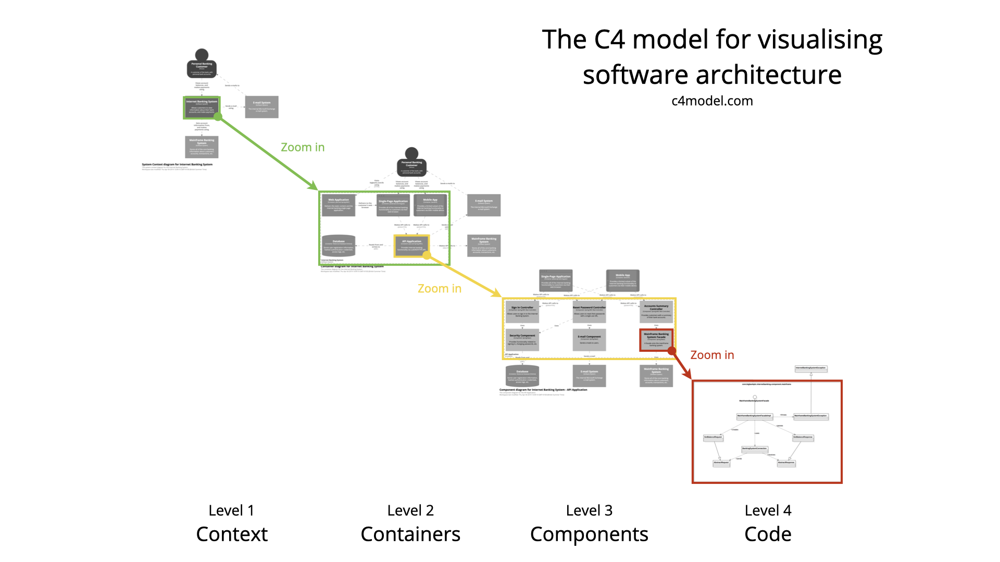
**Figura 28: Modelado de Arquitectura con C4. Imagen Fuente (C4 Model, 2022) (Brown & Betts, 2018)**

**Referencias:**
**Wikipedia contributors. (2022, February 20). C4 model. In Wikipedia, The Free Encyclopedia. Retrieved 22:36, February 23, 2022, from [https://en.wikipedia.org/w/index.php?title=C4_model&oldid=1073034709](https://en.wikipedia.org/w/index.php?title=C4_model&oldid=1073034709)**

**Brown, S., & Betts, T. (2018, June 25). The C4 Model for Software Architecture. InfoQ. Retrieved February 23, 2022, from [https://www.infoq.com/articles/C4-architecture-model/](https://www.infoq.com/articles/C4-architecture-model/)**


<a name="3.3.2_flujo_desarrollo_usando_GitFlow"></a>
### 3.3.2 Flujo de desarrollo usando GitFlow

Un aspecto muy importante del diseño en el desarrollo y que no está explícitamente ligado al diseño funcional, es el planteo del flujo de desarrollo. Si bien, en primera instancia pareciera no haber una relación aparente, es crucial que se diseñe el flujo de desarrollo considerando la perspectiva del código fuente. Una estrategia posible es utilizar Git Flow ([Driessen, 2010](https://docs.google.com/document/d/1AxZIkA2CJaisXTidKar3Qqg25c_oKFpEne6D-QvPxGE/edit#bookmark=id.lw3buhob00yg)), como se muestra en la Fig. 29:

**Referencia:** Driessen, V. (2010, January 5). A successful Git branching model » nvie.com. nvie.com. Retrieved March 23, 2022, from [https://nvie.com/posts/a-successful-git-branching-model/](https://nvie.com/posts/a-successful-git-branching-model/)


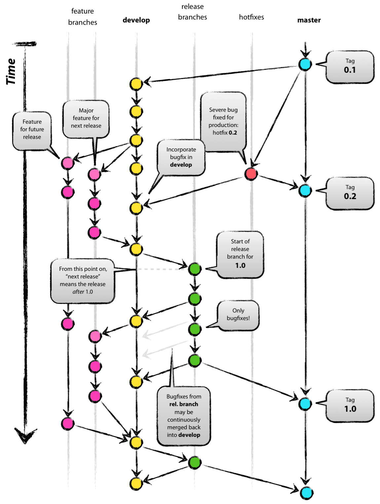
**Figura 29: Git Flow. Imagen Fuente (Driessen, 2010)**

DevSecOps y sobre todo QA requieren que las bases del producto de software, por ejemplo los repositorios de código, estén ordenados, prolijos y sobre todo utilicen un modelado de uso (Fowler, 2020), o flujo de trabajo, claro y estándar.

**Referencias:**  **Fowler, M. (2020, 05 28). Patterns for Managing Source Code Branches. Martin Fowler. Retrieved March 29, 2022, from [https://martinfowler.com/articles/branching-patterns.html](https://martinfowler.com/articles/branching-patterns.html)**

<a name="3.4_Sec_byDesign"></a>
## 3.4 Sec byDesign


Generalmente, los aspectos de seguridad no son considerados en fases iniciales de los productos de software o no son implementados durante el desarrollo. Tampoco es normal en la mayoría de los casos que se considere el “diseño” o el modelado de la “arquitectura de seguridad” desde un inicio.

La fundación OWASP promueve para el diseño seguro (Sec ByDesign) un modelo de madurez: SAMM, el cual proporciona las bases para implementar un diseño seguro desde el comienzo de desarrollo de un sistema de software, o en todo caso, aplicar el modelo a un producto ya existente. En la Fig. 30 se listan para cada etapa del desarrollo (o SDLC) las prácticas de seguridad que se pueden aplicar.


| **Gobernanza**           | **Diseño**                    | **Implementación**  | **Verificación**              | **Operaciones**       |
| ------------------------ | ----------------------------- | ------------------- | ----------------------------- | --------------------- |
| Estrategia y Métricas    | ==Evaluación de Amenazas==    | Construcción Segura | Evaluación de Arquitectura    | Gestión de Incidentes |
| Políticas y Cumplimiento | ==Requisitos de Seguridad==   | Despliegue Seguro   | Pruebas basadas en Requisitos | Gestión del Entorno   |
| Educación y Orientación  | ==Arquitectura de Seguridad== | Gestión de Defectos | Pruebas de Seguridad          | Gestión Operacional   |

**Figura 30: Modelo de Madurez SAMM. Imagen Fuente (SAMM OWASP® Foundation, 2021)**

**Referencia** SAMM OWASP® Foundation. (2021). The Model logo. OWASP SAMM. Retrieved March 3, 2022, from https://owaspsamm.org/model/ 

Desde el punto de vista del diseño se especifican 3 prácticas esenciales (que son las que vamos a tomar como foco por el momento):

1. Threat Assessment (implementando Threat Modeling)
2. Requerimientos de Seguridad
3. Arquitectura de Seguridad (modeling)

En los casos donde fuera posible pensar y modelar la seguridad desde etapas tempranas, se proponen las siguientes técnicas y herramientas para ser aplicadas.

<a name="3.4.1_threat_assessment_threat_modeling"></a>
### 3.4.1 Threat Assessment / Threat Modeling

El modelado de amenazas o Threat Modeling (Threat Model, Inc, 2021) (Shevchenko et al., 2018) es un enfoque estructurado para identificar y priorizar amenazas potenciales a un sistema y determinar el valor que tendrían las mitigaciones para reducir o neutralizar esas amenazas. Este concepto proviene de conceptos que se han aplicado en aspectos militares. Un modelo de amenaza se desarrolla y es único para cada sistema.

La Fig. 31 es un ejemplo de modelado de amenazas utilizado la notación gráfica C4 (Spilsbury, 2020) y anotando gráficamente las amenazas usando el esquema STRIDE (STRIDE, 2021) en combinación con uno menos conocido denominado LINDDUN (DistriNet Research Group, 2020). STRIDE representa los siguientes aspectos:

| Amenaza (Threat)                                                                           | Propiedad o Acción a aplicar                                                                    |
| ------------------------------------------------------------------------------------------ | ----------------------------------------------------------------------------------------------- |
| Spoofing: Robo de identidad, falsear.                                                      | Autenticidad, validar identidad u origen.                                                       |
| Tampering: Modificación de datos sin autorización                                          | Validar integridad, confiabilidad.                                                              |
| Repudiation: No poder asegurar autoría de algo.                                            | Non-Repudiability o desafiar todo los medios de autenticación hasta llegar a una conclusión.    |
| Information Disclosure: Difundir información sin autorización.                             | Asegurar confidencialidad, controles de accesos, permisos, fugas de información no autorizadas. |
| Denial of Service: sobrecarga de un sistema hasta colapsar.                                | Asegurar disponibilidad, controlar situaciones anormales, validar operaciones.                  |
| Elevation of Privilege: obtener credenciales de acceso a datos y operaciones restringidas. | Implementar mecanismos de Autorización, validación de identidad, privilegios y Roles.           |

**Referencias:**

**OWASP Foundation, Inc. (2021). Threat Modeling Cheat Sheet. OWASP Cheat Sheet Series. Retrieved March 3, 2022, from [https://cheatsheetseries.owasp.org/cheatsheets/Threat_Modeling_Cheat_Sheet.html](https://cheatsheetseries.owasp.org/cheatsheets/Threat_Modeling_Cheat_Sheet.html)**

 **Shevchenko, N., Chick, T. A., O’Riordan, P., Scanlon, T. P., & Woody, C. (2018, July). Threat Modeling: A Summary of Available Methods. SEI Digital Library. Retrieved March 3, 2022, from [https://resources.sei.cmu.edu/library/asset-view.cfm?assetID=524448](https://resources.sei.cmu.edu/library/asset-view.cfm?assetID=524448)**

**Spilsbury, D. (2020, April 29). C4 threat modeling this website. DanspilS. Retrieved March 3, 2022, from [Threat modelling this (old) website :: Daniel Spilsbury](https://daniel.spilsbury.uk/posts/threat_modelling_website/))**

**Wikipedia contributors. (2021, November 10). STRIDE (security). In Wikipedia, The Free Encyclopedia. Retrieved 22:18, March 3, 2022, from [STRIDE model - Wikipedia](https://en.wikipedia.org/wiki/STRIDE_model)

**DistriNet Research Group. (2020). Systematic elicitation and mitigation of privacy threats in software systems. LINDDUN: HOME. Retrieved March 3, 2022, from [https://www.linddun.org/](https://www.linddun.org/)**

El siguiente ejemplo es un diagrama de arquitectura de un sitio web, usando el modelado C4Model y agregando notaciones adicionales para identificar amenazas (STRIDE + LIDU) y luego registrar los riesgos asociados (Rn).


**Figura 31: Threat Model usando Diagrama C4. Imagen Fuente (Spilsbury, 2020)**

Luego, este diagrama se traduce a una tabla de Riesgos y mitigaciones que deberán aplicarse o tenerse en cuenta en la arquitectura:

|Riesgo (ID)|Descripción|Mitigación|
|---|---|---|
|R1|La página web se renderiza en el navegador del usuario, que es un entorno no confiable. Otro código malicioso podría ejecutarse en ese mismo entorno e interferir o robar datos de mi aplicación.|Implementar **Content Security Policy (CSP)** para restringir qué scripts se pueden cargar y ejecutar. Usar sanitización de entrada y técnicas de protección XSS.|
|R2|El DNS no es seguro, ya que los datos están en texto plano y podrían ser suplantados o modificados, redirigiendo al usuario a un punto final malicioso.|Usar **DNS sobre HTTPS (DoH)** o **DNSSEC** para asegurar la comunicación DNS. Configurar TLS para garantizar que las conexiones sean seguras.|
|R3|El endpoint HTTP podría estar sujeto a ataques volumétricos (DDoS), lo que lo dejaría inoperativo y, más importante, generaría costos adicionales.|Usar servicios de mitigación de **DDoS** como AWS Shield o Cloudflare. Implementar balanceo de carga y monitoreo para detectar picos inusuales de tráfico.|
|R4|Mi sitio web se sirve desde un CDN, que podría estar sujeto a ataques volumétricos (DDoS), dejando el servicio inoperativo o generando costos adicionales.|Configurar reglas de mitigación de DDoS a nivel de CDN. Activar sistemas de límite de tasa y priorizar el tráfico legítimo.|
|R5|El servicio de compilación descarga muchas dependencias de terceros al construir mi sitio. Cualquiera de estas podría contener código malicioso que termine sirviendo a los usuarios.|Usar un análisis de seguridad de dependencias como **OWASP Dependency-Check** o herramientas como **Snyk**. Implementar revisión manual de dependencias críticas.|
|R6|Si pierdo mi laptop, todas mis claves de acceso y contraseñas se perderán con ella, y todo mi sitio podría ser comprometido.|Usar un **gestor de contraseñas seguro** para almacenar las claves. Configurar autenticación multifactor (MFA) y deshabilitar claves comprometidas inmediatamente.|
|R7|Existen riesgos al cargar scripts de terceros durante la carga de la página, y también porque Google recopila una gran cantidad de datos analíticos de los usuarios.|Cargar scripts de terceros mediante un dominio confiable y asegurado con **CSP**. Usar alternativas de análisis menos invasivas como Matomo para evitar la exposición de datos.|

<a name="3.4.2_requerimientos_seguridad"></a>
### 3.4.2 Requerimientos de Seguridad

El objetivo de definir los requerimientos de seguridad es la comprensión, análisis, y especificación de los requisitos claves de seguridad para el desarrollo y puesta en operación de un sistema de software, de manera tal que se puedan alinear con otros tipos de requisitos del producto. 

Se proponen los siguientes pasos para la elicitación, especificación y modelado de los requerimientos de seguridad, según (Mead et al., 2006):

1. Acuerdo de definiciones de términos y conceptos
2. Identificación de los Objetivos de Seguridad
3. Desarrollo de Artefactos (Diagramas, Casos de Uso, Escenario, Árboles de Ataque Fig. 32 y Fig. 33, Templates)
4. Realizar un Assessment de Riesgos (ver técnica: Risk-Storming).
5. Selección de método/técnica de elicitación
6. Elicitación de requerimientos de seguridad [ver Fig. 34]
7. Categorización de requerimientos
8. Priorización de requerimientos
9. Inspección de los requerimientos


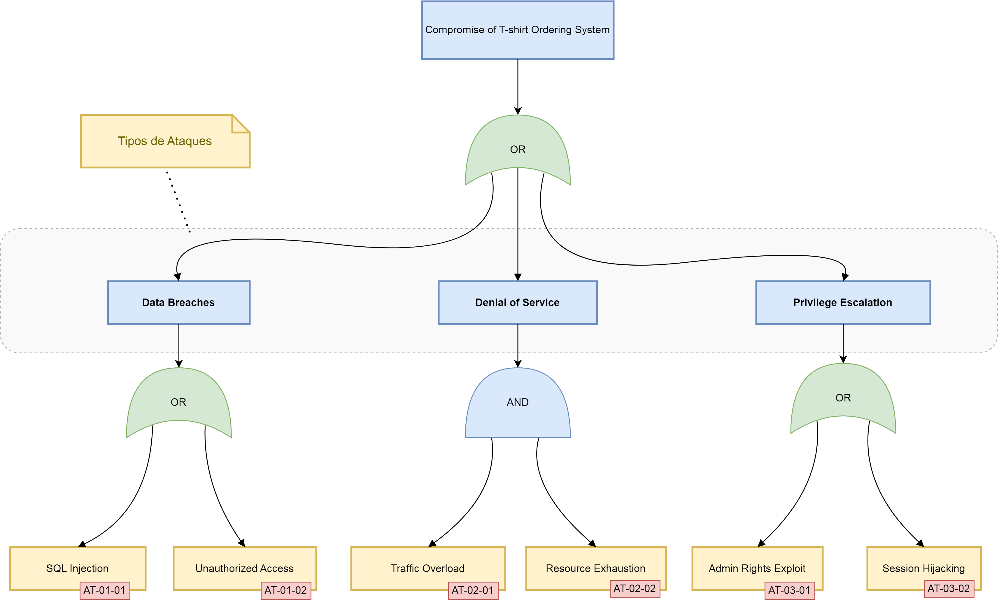
**Figura 32: Ejemplo de Árbol de Ataque. Imagen Fuente (Mead et al., 2006)**

**Referencia:** Mead, N. R., Hough, E. D., & Stehney II, T. R. (2006, January 30). SQUARE Process CISA. US-CERT. Retrieved March 3, 2022, from https://www.cisa.gov/uscert/bsi/articles/best-practices/requirements-engineering/square-process 

Del análisis del árbol de ataque, se deben describir y listar cada uno de los ejemplos de ataque que se puedan tener en cuenta y se deberá además agregar las posibles mitigaciones que se podrían aplicar a cada caso.

El análisis y diseño inicial sirven para luego definir los "requerimientos de seguridad".

| Identificador del Ataque | Ejemplo de Ataque                                                                                                 | Id Mitigación | Mitigación                                                                                  |
| ------------------------ | ----------------------------------------------------------------------------------------------------------------- | ------------- | ------------------------------------------------------------------------------------------- |
| AT-1-1                   | **Inyección SQL**: Modificación de consultas SQL para acceder o destruir datos.                                   | RM-01         | Implementar consultas parametrizadas y usar validación de entrada en el servidor.           |
| AT-1-2                   | **Acceso no autorizado**: Uso de credenciales robadas para entrar al sistema.                                     | RM-02         | Implementar autenticación multifactor (MFA) y sistemas de detección de accesos sospechosos. |
| AT-2-1                   | **Sobrecarga de tráfico**: Ataques DDoS para saturar el servidor.                                                 | RM-03         | Usar servicios de mitigación de DDoS como Cloudflare o AWS Shield y balanceo de carga.      |
| AT-2-2                   | **Exhaustión de recursos**: Creación de múltiples solicitudes para agotar memoria o CPU.                          | RM-04         | Establecer límites de recursos en el servidor y usar "Rate Limiting".                       |
| AT-3-1                   | **Explotación de privilegios de administrador**: Elevación de privilegios para modificar datos o configuraciones. | RM-05         | Implementar separación de privilegios y auditorías regulares de permisos.                   |
| AT-3-2                   | **Secuestro de sesión**: Interceptación de cookies de sesión para suplantar usuarios.                             | RM-06         | Usar cookies seguras (Secure y HttpOnly), TLS, y rotación frecuente de tokens de sesión.    |

De la tabla anterior surgen la siguiente liste de Requerimientos de seguridad. Es importante notar que cada requerimiento puede estar mapeado a 1 o más ataques analizados.

| Identificador de Requerimiento | Requerimiento de Seguridad                                                               | Trazabilidad (Ataques Mitigados) |
| ------------------------------ | ---------------------------------------------------------------------------------------- | -------------------------------- |
| SR-01                          | Validar todas las entradas del usuario para evitar inyecciones de código y manipulación. | AT-1-1                           |
| SR-02                          | Implementar consultas parametrizadas en todas las interacciones con bases de datos.      | AT-1-1                           |
| SR-03                          | Configurar autenticación multifactor (MFA) para todas las cuentas de usuario.            | AT-1-2                           |
| SR-04                          | Usar sistemas de detección de accesos sospechosos y alertas en tiempo real.              | AT-1-2                           |
| SR-05                          | Establecer límites de tasa (Rate Limiting) para prevenir ataques volumétricos.           | AT-2-1, AT-2-2                   |
| SR-06                          | Implementar balanceo de carga para manejar altos volúmenes de tráfico.                   | AT-2-1                           |
| SR-07                          | Configurar límites de recursos del servidor (memoria, CPU, conexiones).                  | AT-2-2                           |
| SR-08                          | Asegurar la separación de privilegios entre usuarios y roles administrativos.            | AT-3-1                           |
| SR-09                          | Realizar auditorías regulares de permisos para detectar configuraciones inseguras.       | AT-3-1                           |
| SR-10                          | Usar cookies seguras con atributos `Secure` y `HttpOnly` para proteger sesiones.         | AT-3-2                           |
| SR-11                          | Implementar comunicación segura mediante TLS (HTTPS) en todas las transacciones.         | AT-3-2                           |
| SR-12                          | Rotar tokens de sesión frecuentemente para reducir riesgos de secuestro de sesión.       | AT-3-2                           |
### 3.4.3 Arquitectura de Seguridad: Modelado y Patrones


Al igual que se desarrolla y modela la arquitectura funcional y no funcional del producto de software, se debe realizar un trabajo similar desde el punto de vista de la seguridad, realizando lo que se conoce como Architectural Analysis for Security o AAFS (Ryoo, 2020).

**Referencia:** Ryoo, J. (2020, 07 08). Developing Secure Software. Architectural analysis for security. https://www.linkedin.com/learning/developing-secure-software/architectural-analysis-for-security?autoplay=true&resume=false 

En la Fig. 35 cada nivel representa amenazas de seguridad, por lo tanto, para cada nivel se deben aplicar técnicas de arquitectura para mitigar esas posibles amenazas.

| Diseño de Arquitectura |
| ---------------------- |
| Diseño Detallado       |
| Código                 |
| Hardware               |
**Figura 35: Niveles de Diseño de Seguridad**

Los puntos de interés donde el modelado de la arquitectura de seguridad es relevante se pueden resumir en las siguientes 6 etapas, como se muestra en la Fig. 36:

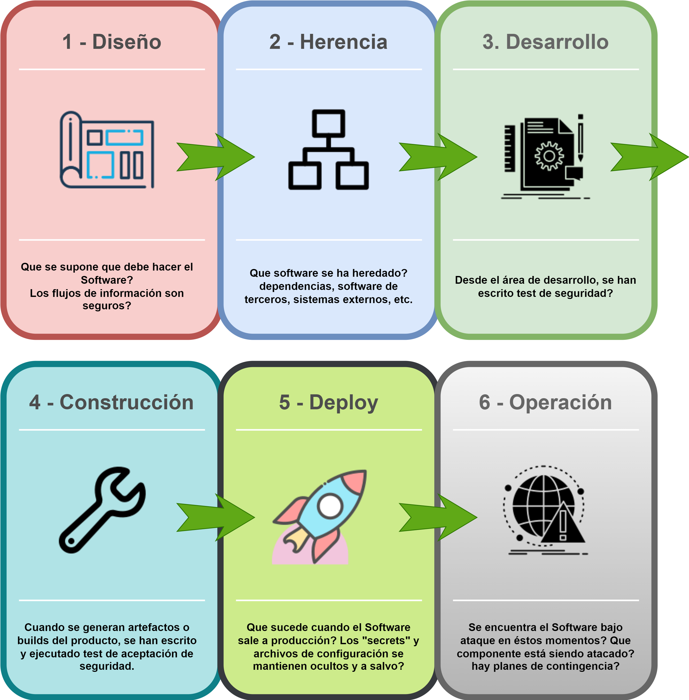
**Figura 36: Aspectos de Interés para el modelado de Arquitectura Segura de Software. Imagen Fuente (Ryoo, 2020)**

**Referencia:** Ryoo, J. (2020, 07 08). Developing Secure Software. Architectural analysis for security. https://www.linkedin.com/learning/developing-secure-software/architectural-analysis-for-security?autoplay=true&resume=false 


Teniendo en cuenta las etapas del ciclo de desarrollo, para el diseño de la arquitectura se pueden usar 3 técnicas que se pueden complementar:

- ToAA: Tactic-Oriented Architecture Analysis. Se realiza con interacción entre el arquitecto de software y los expertos del dominio del negocio. Se usan tácticas de identificación de vulnerabilidades a través de una interacción y feedback.
- PoAA: Pattern-Oriented Architecture Analysis. Al igual que sucede con los patrones de diseño y patrones de Arquitectura, al identificar escenario/problemas durante la etapa de ToAA, surgen lo que se conoce como patrones de seguridad (Security Pattern, 2020), por ejemplo el patrón de seguridad Interceptor-Validator que se muestra en la Fig. 37.
- VoAA: Vulnerability-Oriented Architecture Analysis. Es la etapa de más bajo nivel, se analizan las vulnerabilidades en el código y en el producto a nivel interno.

**Referencia:** Wikipedia contributors. (2020, April 20). Security pattern. In Wikipedia, The Free Encyclopedia. Retrieved 22:33, February 23, 2022, from https://en.wikipedia.org/w/index.php?title=Security_pattern&oldid=952064080 


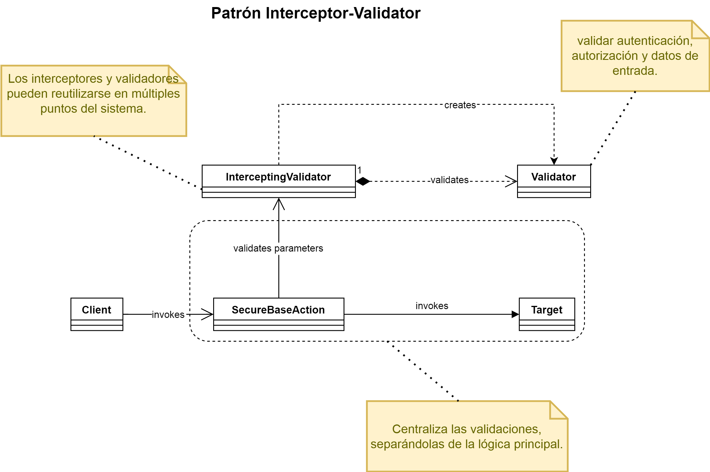
**Figura 37: Interceptor-Validator Patrón de seguridad. Imagen Fuente (Security Pattern, 2020)**

El patrón **Interceptor-Validator** se utiliza para agregar una capa de validación y procesamiento previo a las solicitudes en un sistema, interceptándolas antes de que lleguen a su destino (recurso protegido o funcionalidad). Su uso promueve:

- **Seguridad**: Permite validar autenticación, autorización y datos de entrada.
- **Modularidad**: Centraliza las validaciones, separándolas de la lógica principal.
- **Reusabilidad**: Los interceptores y validadores pueden reutilizarse en múltiples puntos del sistema.

Este tipo de patrón es útil para aplicar en los siguiente escenarios:

- En aplicaciones web para validar solicitudes HTTP antes de procesarlas.
- En sistemas que manejan recursos sensibles o críticas de negocio, como APIs o microservicios.
- En arquitecturas que requieren una validación uniforme y centralizada para mantener consistencia y reducir errores.

Básicamente, este patrón es ideal para asegurar que solo las solicitudes válidas y autorizadas lleguen a los componentes críticos del sistema.

### 3.4.4 Metodología de Testing de seguridad

En el mundo de la seguridad, se han desarrollado una variedad de tipos de pruebas de seguridad que se complementan con el SDLC y con el STLC. En la Fig. 38 se pueden apreciar las distintas etapas del ciclo de desarrollo y pruebas de software. En el centro, se mencionan los principales tipos de pruebas de seguridad (SSecLC) posibles para implementar una estrategía de seguridad complementaría al flujo de desarrollo estándar.

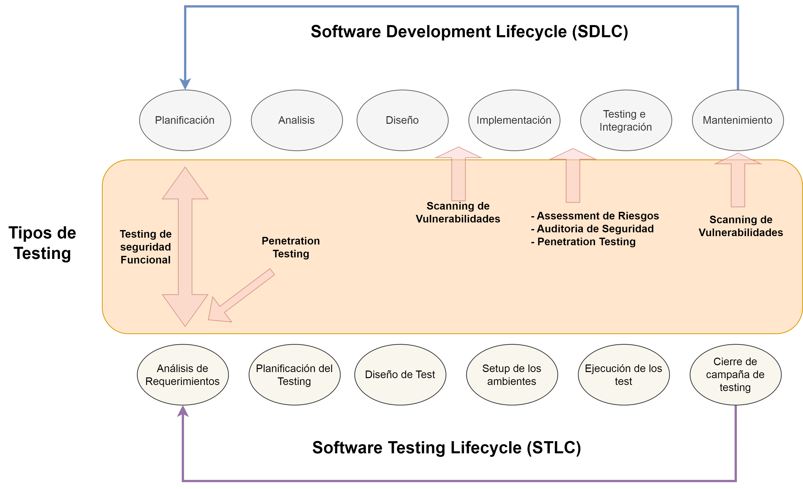