# TPF Especialización: DevSecOps desde la perspectiva de QA Automation

[← Inicio](https://matiaspakua.github.io/tech.notes.io)


---

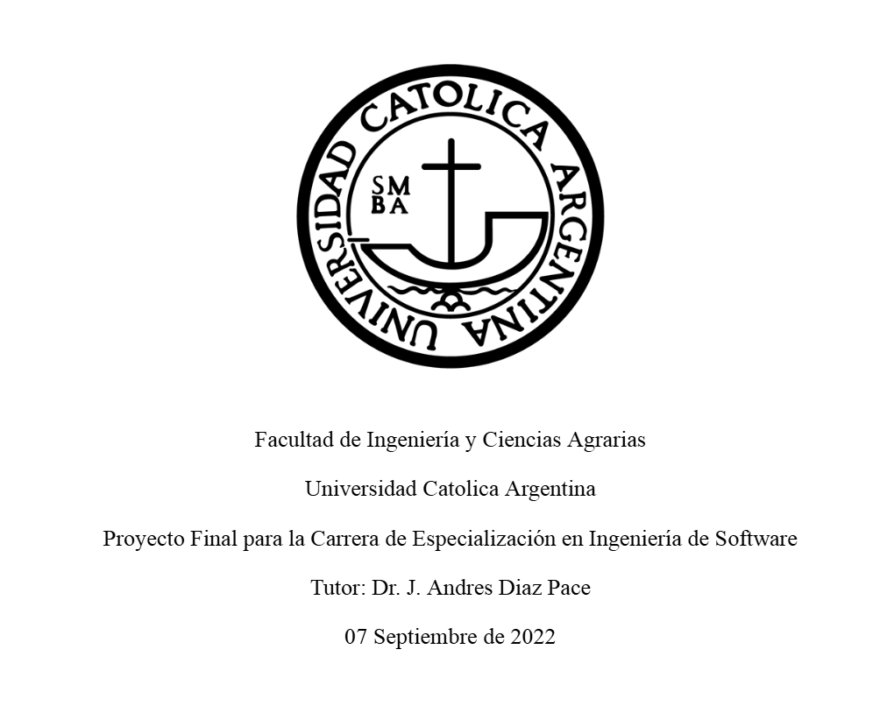

---

# Índice

- [1. Introducción](#1.introduction)
- [2. Marco Teórico](#2.marco_teorico)
	- [2.1. Conceptos y Prácticas Fundamentales](#2.1_conceptos_practicas_fundamentales)
	- [2.2. Pilares de la Ingeniería de Software](#2.2_pilares_ingenieria_software)
	- [2.3. Cultura y las personas](#2.3_cultura_personas)
	- [2.4 Enfoque de Calidad](#2.4_enfoque_calidad)
	- [2.5 Metodologías y Prácticas](#2.5.metodologia_practicas)
		- [2.5.1. Práctica: Organización de la Información](#2.5.1.practica_organizacion_informacion)
		- [2.5.2. Práctica: Artefactos](#2.5.2.practica_artefactos)
		- [2.5.3. Práctica: Trazabilidad](#2.5.3.practica_trazabilidad)
		- [2.5.4. Práctica: Identificación](#2.5.4.practica_identificacion)
		- [2.5.5. Práctica: Base de Conocimiento](#2.5.5.practica_base_conocimiento)
		- [2.5.6. Práctica: Arquitectura de alto nivel de Procesos](#2.5.6.practica_arquitectura_alto_nivel_procesos)
		- [2.5.7. Práctica: Integración Continua (CI)](#2.5.7.practica_integracion_continua)
		- [2.5.8. Práctica: Fallar desde el Inicio y Rápido (Testing)](#2.5.8.practica_falla_inicio_rapido)
			- [2.5.8.1. Pirámide de Testing](#2.5.8.1_piramide_testing)
		- [2.5.9. Práctica: Entrega Continua (CD)](#2.5.9_practica_entrega_continua_cd)
		- [2.5.10. Práctica: APIs](#2.5.10_practica_APIs)
		- [2.5.11. Práctica: Estado Actual de Madurez](#2.5.11_practica_estado_actual_madurez)
		- [2.5.12. Metodología: DevOps](#2.5.12_metodologia_DevOps)
		- [2.5.13. Metodología: Seguridad](#2.5.13_metodologia_seguridad)
		- [2.5.14. Metodología: QA Automation](#2.5.14_metodologia_qa_automation)
		- [2.5.15. Metodología: estrategia de QA](#2.5.15_metodologia_estrategia_qa)
		- [2.5.16. Metodología: Metodología: DevSecOps](#2.5.16_metodologia_metolodogia_devsecops)
- [3. Diseño](#3.disenio)
	- [3.1 estrategias de Diseño](#3.1.estrategias_de_disenio)
		- [3.1.1 Gran Diseño Inicial (BDUF)](#3.1.1.gran_disenio_inicial_bduf)
		- [3.1.2 Diseño Preliminar Inicial (RDUF) y Diseño Emergente](#3.1.2.disenio_preliminar_inicial_RDUF_disenio_emergente)
		- [3.1.3 Framework Cynefin](#3.1.3.framework_cynefin)
		- [3.1.4 estrategia de Diseño óptimo y compensación de costo/beneficio](#3.1.4_estrategia_diseño_optimo_compensacion_costo_beneficio)
	- [3.2. QA ByDesign](#3.2.qa_by_design)
		- [3.2.1 Modelado de Procesos y Artefactos](#3.2.1.modelado_procesos_artefactos)
		- [3.2.2 Patrones de Testing](#3.2.2_patrones_testing)
			- [3.2.2.1 Deep-Dive en el esquema de Testing](#3.2.2.1_Deep-Dive_esquema_testing)
			- [3.2.2.2 Características y Beneficios](#3.2.2.2_aracterísticas_beneficios)
	- [3.3 Dev byDesign](#3.3_Dev_byDesign")
		- [3.3.1 Modelado de Arquitectura usando C4model](#3.3.1_modelado_arquitectura_usando_C4model)
		- [3.3.2 Flujo de desarrollo usando GitFlow](#3.3.2_flujo_desarrollo_usando_GitFlow)
	- [3.4 Sec byDesign](#3.4_Sec_byDesign)
		- [3.4.1 Threat Assessment / Threat Modeling](#3.4.1_threat_assessment_threat_modeling)
		- [3.4.2 Requerimientos de Seguridad](#3.4.2_requerimientos_seguridad)
		- [3.4.3 Arquitectura de Seguridad: Modelado y Patrones](#3.4.3_Arquitectura_Seguridad_Modelado_Patrones)
		- [3.4.4 Metodología de Testing de seguridad](#3.4.4_Metodología_Testing_seguridad)
		- [3.4.5 Static application security testing o SAST](#3.4.5_Static_application_security_testing_o_SAST)
		- [3.4.6 Dynamic application security testing o DAST](#3.4.6_Dynamic_application_security_testing_o_DAST)
		- [3.4.7 Interactive application security testing o IAST](#3.4.7_Interactive_application_security_testing_o_IAST)
		- [3.4.8 Runtime application security protection o RASP](#3.4.8_Runtime_application_security_protection_o_RASP)
		- [3.4.9 Software composition analysis ó SCA](#3.4.9_Software_composition_analysis_ó_SCA)
		- [3.4.10 Penetration Testing](#3.4.10_Penetration_Testing)
		- [3.4.10.11 Ejemplo de un proceso de Penetration Testing](#3.4.10.11_Ejemplo_de_un_proceso_de_Penetration_Testing)
	- [3.5 Ops ByDesign](#3.5_Ops_ByDesign)
		- [3.5.1 Diseñar para Operar](#3.5.1_disenia_para_operar)
		- [3.5.2 Operar para Diseñar](#3.5.2_operar_para_diseniar)
		- [3.5.3 Métricas](#3.5.3_metricas)
	- [3.6 DevSecOps ByDesign](#3.6_DevSecOps_ByDesign)
		- [3.6.1. Nivel 0 del pipeline DevSecOps](#3.6.1_nivel_0_pipeline_DevSecOps)
		- [3.6.2. Nivel 1 del pipeline DevSecOps](#3.6.2_nivel_1_pipeline_DevSecOps)
		- [3.6.3. Nivel 2 del pipeline DevSecOps](#3.6.3_nivel_3_pipeline_DevSecOps)
	- [3.7. Situaciones Anormales ByDesign](#3.7_situaciones_anormales_ByDesign)
	- [3.8. Personas y Roles ByDesign](#3.8_personas_roles_ByDesign)
	- [3.9. Aspectos Legales y Privacidad ByDesign](#3.9_aspectos_legales_privacidad_ByDesign)
- [4. Herramientas](#4.herramientas)
	- [4.1. Análisis, Modelado y Codificación](#4.1_analisis_modelado_codificacion)
	- [4.2. Construcción](#4.2_construccion)
	- [4.3. Pruebas, Seguridad y QA Automation](#4.3_pruebas_seguridad_QA_automation)
	- [4.4. Empaquetado ](#4.4_empaquetado)
	- [4.5. Liberaciones (releases)](#4.5_releases)
	- [4.6. Configuración y Gestión de Infraestructura](#4.6_configuración_gestion_infraestructura)
	- [4.7. Supervisión y Monitoreo](#4.7_supervision_monitoreo)
	- [4.8. Conclusiones](#4.8_conclusiones)
	- [4.9. Update. Otras herramientas](#4.9_update_otras_herramientas)
- [5. Implementación](#5._Implementacion)  
	* [5.1. Introducción](#5.1._Introduccion)  
	* [5.2. Caso de Estudio: SecTx Analysis](#5.2._Caso_de_Estudio_SecTx_Analysis)  
	* [5.3. Casos de uso de SecTx Analysis](#5.3._Casos_de_uso_de_SecTx_Analysis)  
	* [5.4. Funcionalidades del Producto](#5.4._Funcionalidades_del_Producto)  
		* [5.4.1 Administración](#5.4.1_Administracion)  
		* [5.4.2 Rule Based Engine](#5.4.2_Rule_Based_Engine)  
		* [5.4.3 Fingerprint](#5.4.3_Fingerprint)  
		* [5.4.4. Reportes y Analítica](#5.4.4._Reportes_y_Analítica)  
		* [5.4.5 Notificaciones](#5.4.5_Notificaciones)  
		* [5.4.6 Machine Learning](#5.4.6_Machine_Learning)  
		* [5.4.7 Trazabilidad](#5.4.7_Trazabilidad) 
		* [5.4.8 Directrio Activo](#5.4.8_Directorio_Activo)  
		* [5.4.9 Auditoría](#5.4.9_Auditoría)
		* [5.4.10 API](#5.4.10_API)
	* [5.5. Estructura del proyecto](#5.5._Estructura_del_proyecto)  
		* [5.5.1 Equipo y Roles](#5.5.1_Equipo_y_Roles)  
		* [5.5.2 Mapa de versiones y EOL (end-of-life)](#5.5.2_Mapa_de_versiones_y_EOL)  
		* [5.5.3 Metodología](#5.5.3_Metodología)  
		* [5.5.4 Procesos y Framework: SCRUM y KANBAN](#5.5.4_Procesos_y_Framework_SCRUM_y_KANBAN)  
		* [5.5.5 Herramientas: Git y Base de Conocimiento](#5.5.5_Herramientas_Git_y_Base_de_Conocimiento)  
		* [5.5.6 Flujo de Trabajo Parte 1 y 2](#5.5.6_Flujo_de_Trabajo_Parte_1_y_2)  
		* [5.5.7 Diseño, SAD, ADR's y MTP](#5.5.7_Diseño,_SAD,_ADR's_y_MTP)  
		* [5.5.8. Flujo de Trabajo Parte 3](#5.5.8._Flujo_de_Trabajo_Parte_3)
* [6. Conclusiones](#6_conclusiones)


# 1. Introducción

La metodología DevSecOps plantea una serie de prácticas, procesos y herramientas que en conjunto y correctamente orquestadas proporcionan un marco de trabajo completo, integral y sólido para resolver cuestiones asociadas a la entrega continua y de calidad de productos de software.

Sin embargo, es común en las organizaciones de desarrollo de software que no exista una visión de alto nivel que sea capaz de integrar de forma armónica todas las partes que componen la metodología DevSecOps, y es aún más inusual encontrar que cada aspecto de la metodología se aborde desde el punto de vista de Quality Assurance (QA) y Automation. Esto resulta un problema para la entrega continua de software de alta calidad y seguro, donde una de las principales actividades que ocupa gran parte del tiempo de “entrega” es el Aseguramiento de la Calidad del producto.

En este trabajo, el objetivo es plantear la metodología DevSecOps con sus conceptos, prácticas y herramientas, para cada una de sus etapas, haciendo foco en los aspectos de QA, aplicando la automatización de tareas donde sea posible, y planteando para ello una estrategia iterativa-incremental. En esta estrategia,  cada etapa será abordada desde la perspectiva de QA, aplicando automatización y dando como resultado un roadmap de adopción por etapas. Adicionalmente, se utilizará un caso de estudio para ilustrar aspectos prácticos de implementación con el fin de dar claridad a los aspectos conceptuales.

A grandes rasgos, las tareas a realizar para lograr este objetivo involucran:

- Definir el marco teórico, conceptos fundamentales y prácticas.
- Definir la metodología DevSecOps.
- Definir QA Automation y su perspectiva sobre DevSecOps.
- Analizar estrategias de diseño para la metodología y procesos.
- Presentar herramientas de soporte para las etapas de la metodología.
- Describir algunos casos de implementación.
- Brindar, como cierre, las conclusiones del trabajo.


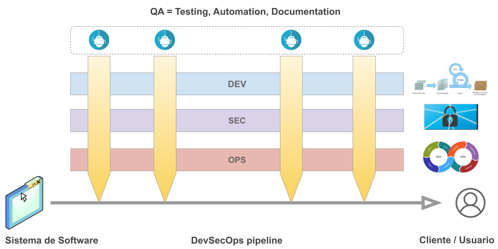

**Fig. 1. Esquema conceptual DevSecOps**

Como introducción, la Fig. 1 ilustra un posible camino a recorrer para un producto de software. Las 3 capas horizontales representan las 3 disciplinas del ciclo de vida que se deben integrar y sincronizar con la disciplina de QA Automation: Dev (<mark style="background: #FFF3A3A6;">desarrollo</mark>), Sec (<mark style="background: #BBFABBA6;">Security</mark>) y Ops (<mark style="background: #ADCCFFA6;">Operaciones</mark>). La disciplina de QA Automation aparece de forma transversal durante el ciclo de desarrollo y se involucra de diversas maneras y con diferentes artefactos, dependiendo del estado de evolución del producto en ese momento. QA Automation debe contemplarse desde etapas tempranas para ayudar a refinar desde la idea del producto a desarrollar hasta la entrega al cliente final, asegurando en cada etapa poder cumplir con determinados aspectos de la calidad.

Cada disciplina (Dev, Sec y Ops) tienen sus propios flujos de trabajo, procesos y herramientas, pero todas comparten la misma necesidad desde QA: definir lineamientos de calidad, escribir pruebas, automatizar las tareas repetitivas y documentar el proceso, los artefactos intermedios y los resultados obtenidos para dejar evidencia del proceso y del producto.


# 2. Marco Teórico


## 2.1. Conceptos y Prácticas Fundamentales 

En la primera parte del presente trabajo se abordarán los conceptos teóricos que servirán de base para dar forma a la propuesta de implementación de la metodología DevSecOps, vista desde la perspectiva de QA Automation.


## 2.2. 🧱💻 Pilares de la Ingeniería de Software

El primer concepto sienta las bases del presente trabajo. Los pilares de la ingeniería de software, según lo definido por ([Pressman, 2006, 24] son: “La base que soporta la ingeniería del software es un enfoque de calidad”. Adicionalmente al enfoque clásico de Pressman, se decidió incluir un pilar que representa a<mark style="background: #FFF3A3A6;"> la cultura de la organización</mark> y a <mark style="background: #BBFABBA6;">las personas</mark> que dan vida a una organización, según se esquematiza en la Fig. 2.

**Referencia**:  Pressman, R. S. (2006). Ingeniería del software: un enfoque práctico (V. Campos Olguín, E. Pineda Rojas, & J. E. Murrieta Murrieta, Trans.). McGraw-Hill.

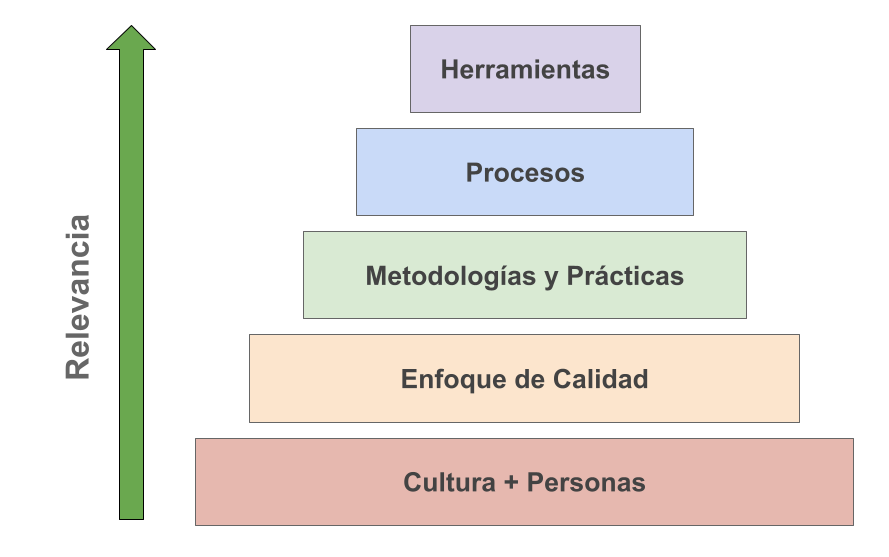

**Figura 2: Pilares de la Ingeniería del Software (basado en “Pressman,2006,24”)**


## 2.3. Cultura y las personas

Para el éxito en la implementación de cualquier estrategia de desarrollo de productos de software es importante que exista una buena cultura en la organización [Organizational Culture. 2018], que se enfoque en los <mark style="background: #FFF3A3A6;">procesos</mark>, las <mark style="background: #BBFABBA6;">personas</mark> y la <mark style="background: #ADCCFFA6;">cultura</mark> como se muestra en la Fig. 3. Una “buena” cultura debe promover el bienestar común e individual, generar entusiasmo en las personas, establecer los objetivos y estrategias de la empresa en sinergía con las personas, y sobre todo, deber ser una “cultura compartida”. Esta cultura debe ser comunicada y entendida sin ambigüedades.

La importancia de que las personas estén “motivadas” y “positivas” para llevar adelante el desarrollo y la mejora continua es un pilar fundamental del éxito de una organización.

⭐❗ Los aspectos técnicos (conocimientos técnicos, conocimientos especializados sobre tecnologías y herramientas, etc), se pueden adquirir de diversas formas, pero los aspectos más humanos como el bienestar laboral, el ámbito laboral y todos aquellos aspectos que hacen a tener una cultura sana son matices que se deben trabajar desde el inicio, de forma ardua y nunca descuidar.

**Referencia:** Development Cooperation Handbook/The development aid organization/Organizational Culture. (2018, February 22). Wikibooks, The Free Textbook Project. Retrieved 19:04, February 20, 2022 from https://en.wikibooks.org/w/index.php?title=Development_Cooperation_Handbook/The_development_aid_organization/Organizational_Culture&oldid=3377380.

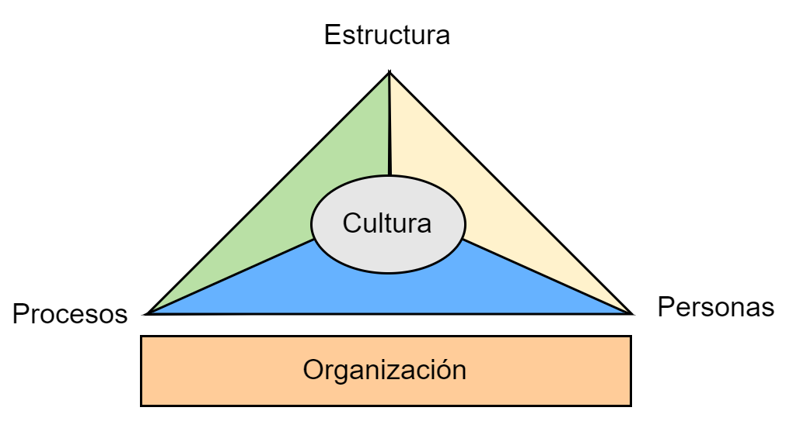

**Figura 3: Cultura, Procesos, Personas y Organización.**

Analizaremos que DevSecOps no solo implica la adición de herramientas de seguridad, sino también <mark style="background: #BBFABBA6;">la cultura de colaboración</mark> entre los equipos de desarrollo, operaciones y seguridad. La cultura y las prácticas deben estar bien integradas para ser efectivas.

Con esta base, se propone llevar adelante la implementación de la metodología DevSecOps desde la perspectiva de QA Automation.


## 2.4 Enfoque de Calidad

El aseguramiento de la calidad o QA [Quality assurance, 2022] es una forma de prevenir errores y defectos en los productos y evitar problemas al entregar productos o servicios a los clientes. La norma ISO 9000 define QA como "parte de la gestión de la calidad centrada en proporcionar <mark style="background: #FFF3A3A6;">confianza</mark> en que se cumplirán los requisitos de calidad".

**Referencia:** Wikipedia contributors. (2022, January 2). Quality assurance. In Wikipedia, The Free Encyclopedia. Retrieved 18:47, February 20, 2022, from https://en.wikipedia.org/w/index.php?title=Quality_assurance&oldid=1063244260

El enfoque de gestión de calidad del presente trabajo incluye los aspectos asociados al testing manual y automatizado, además de la mención a <mark style="background: #BBFABBA6;">Robotic Process Automation</mark> [RPA, 2022], y se abordarán aspectos de la organización y gestión de todos los elementos que agreguen valor al producto de software final.

**Referencia:** Wikipedia contributors. (2022, January 27). Robotic process automation. In Wikipedia, The Free Encyclopedia. Retrieved 19:16, February 20, 2022, from https://en.wikipedia.org/w/index.php?title=Robotic_process_automation&oldid=1068323418

Como se muestra en la Fig. 4, DevOps no solo incluye las fases de desarrollo (Dev ) y de operación o puesta en producción (Ops), sino que el tercer pilar de de la metodología es QA, con lo cual la importancia de QA es fundamental.

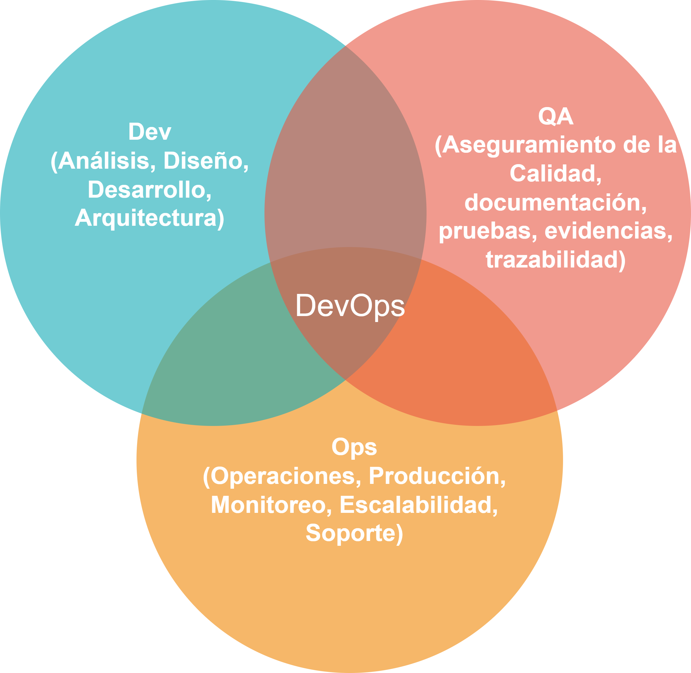

**Fig. 4. QA Automation como pilar de DevOps**


## 2.5. Metodologías y Prácticas

A continuación se listan y explican brevemente algunas de las prácticas esenciales que se deben considerar para aplicar la metodología DevSecOps y QA Automation.


### 2.5.1. Práctica: Organización de la Información

Esta práctica se entiende como: el código, las herramientas de desarrollo, soporte, documentación, las herramientas de comunicación, y cualquier otro medio de soporte que se use en el desarrollo de un producto de software, deben estar organizadas. Es común que este aspecto no esté correctamente resuelto, lo cual provoca que no haya un <mark style="background: #FFF3A3A6;">repositorio centralizado</mark> (o base de conocimiento) para almacenar y consultar toda la información asociada a un proyecto o producto.

En la Fig. 5 se resalta el hecho de tener como guía, por sobre los procesos y prácticas, a la organización de la información, donde las principales características que se deben asegurar son:

- 📚 **Base de conocimientos Centralizada**
- 📂 **Organización de la información**
- 🔄 **Sincronización de la información**
- 🤝 **Colaboración**

Luego de resolver como la información se va a organizar, queda resolver los Procesos y Prácticas que se asocian comúnmente al desarrollo de productos de software.

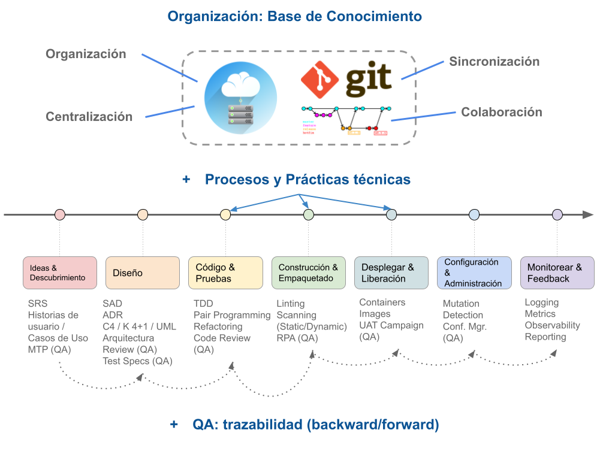

**Fig. 5. Organización de procesos, información, prácticas.**


### 2.5.2. Práctica: Artefactos

El ciclo de los procesos comienza y termina generalmente con el cliente o usuario final, ya sea desde la definición del producto o la notificación de mejoras o defectos.

Un <mark style="background: #FFF3A3A6;">artefacto</mark> [Storz, 2022] define un elemento de utilidad, que se utiliza en una o varias etapas de los procesos para aportar valor al producto final. Cada proceso se comunica con el resto utilizando artefactos (actúan como interfaces). Un artefacto es cualquier tipo de elemento definido, identificado y almacenado en la base de conocimientos de la organización.

**Referencia:** Storz, C. (2022, January 31). What Is An Artifact Repository? What Is An Artifact Repository? https://harness.io/blog/what-is-artifact-repository/ 

Un proceso se comunica con otro utilizando, en la mayoría de los casos, uno o varios artefactos. En la Fig. 6 se muestran ejemplos de distintos tipos de artefactos, típicamente generados durante el desarrollo de un producto.

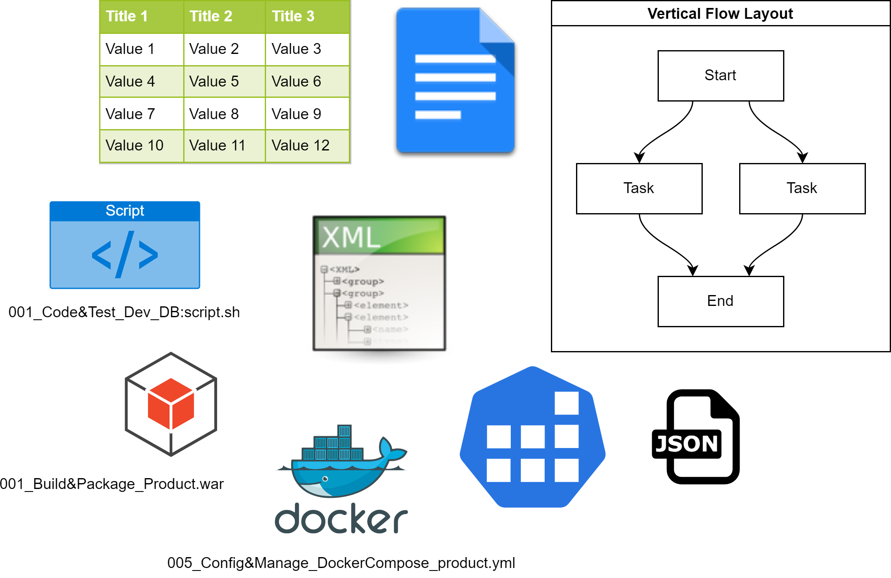

**Fig. 6 Ejemplos de Artefactos generados en un producto de Software**

Es importante que exista uno o varios repositorios de artefactos, según el tipo o categoría de los artefactos. Cuando se trata de artefactos de software (por ejemplo: ejecutables, binarios, archivos de configuración de servicios, etc.) es recomendable usar herramientas específicas que se puedan integrar en la infraestructura de desarrollo. Cuando se trata de artefactos como pueden ser: diagramas, documentos, o notas, se debería usar otro tipo de repositorio acorde al tipo de artefactos, por ejemplo un disco en la nube.

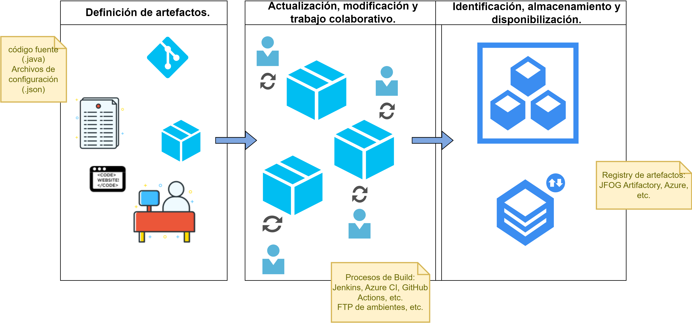

**Fig. 7 Flujo de vida y uso de los Artefactos**

Algunas de las principales características de los artefactos y de un repositorio de artefactos son:

- 🔒 **Control de Acceso**
- 🗄️ **Almacenamiento**
- 🚚 **Distribución**
- 📂 **Organización**
- 💾 **Respaldo**

La Fig. 7 representa el un flujo de vida típico de artefactos, divido en 3 etapas:

1. Definición de artefactos.
2. Actualización, modificación y trabajo colaborativo sobre los artefactos.
3. Identificación, almacenamiento y disponibilización de los artefactos.


### 2.5.3. Práctica: Trazabilidad

Una práctica indispensable de QA es asegurar la <mark style="background: #FFF3A3A6;">trazabilidad</mark> en el desarrollo de un producto de software. La trazabilidad es una característica esencial de un producto de software porque permite tener un hilo conductor, un **“camino de migas” (“breadcrumb trail”)** o inicio y un fin para una determinada funcionalidad. La Fig. 8 representa la idea conceptual de la trazabilidad, es decir, tener en claro el hilo conductor del desarrollo de un producto, desde un inicio, por ejemplo la definición de una nueva funcionalidad, hasta la UI/UX de usuario al utilizar dicha funcionalidad.

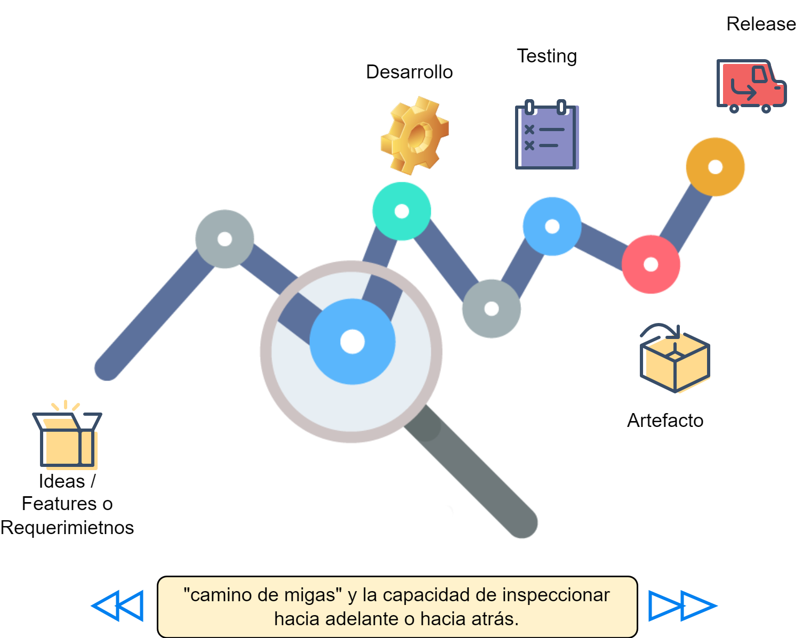

**Fig 8. Concepto de Trazabilidad.**

Un concepto importante de la trazabilidad es el de traza: “Huella, vestigio.” [DRAE, 2022]. La traza es lo que permite rastrear el origen (backward) o la etapa siguiente (forward) de una funcionalidad en un producto de software.

**Referencia:** (REAL ACADEMIA ESPAÑOLA: Diccionario de la lengua española, 23.ª ed., [versión 23.5 en línea]. <https://dle.rae.es> 01/03/2022.)

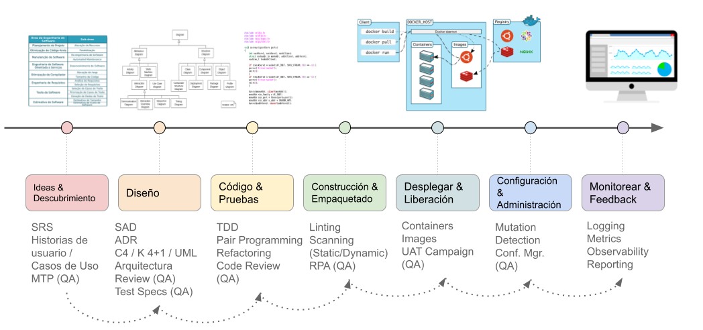

**Fig. 9. Trazabilidad entre artefactos**

Para lograr trazabilidad, hay varios aspectos a considerar:

1. Tener la información <mark style="background: #FFF3A3A6;">disponible</mark> en una base de conocimiento centralizada. Ver. 2.5.1.
2. Tener la información fácilmente <mark style="background: #BBFABBA6;">identificada</mark>, caracterizada, categorizada y ordenada;
3. Tener toda la información representada de alguna manera que se pueda <mark style="background: #ADCCFFA6;">recuperar y visualizar </mark>(formatos y herramientas disponibles);
4. Tener la información bajo <mark style="background: #FFF3A3A6;">control de acceso</mark> (roles, privilegios, permisos);  
5. Asegurar la trazabilidad hacia atrás y hacia adelante Fig. 10 en cada elemento de información [Pitchford et al., 2021]:

**Referencia:** Pitchford, M., Hurley, F., Dahad, N., & Roy, A. (2021, July 19). DevSecOps brings defense in depth to embedded security. Embedded.com. Retrieved February 23, 2022, from https://www.embedded.com/devsecops-brings-defense-in-depth-to-embedded-security/ 

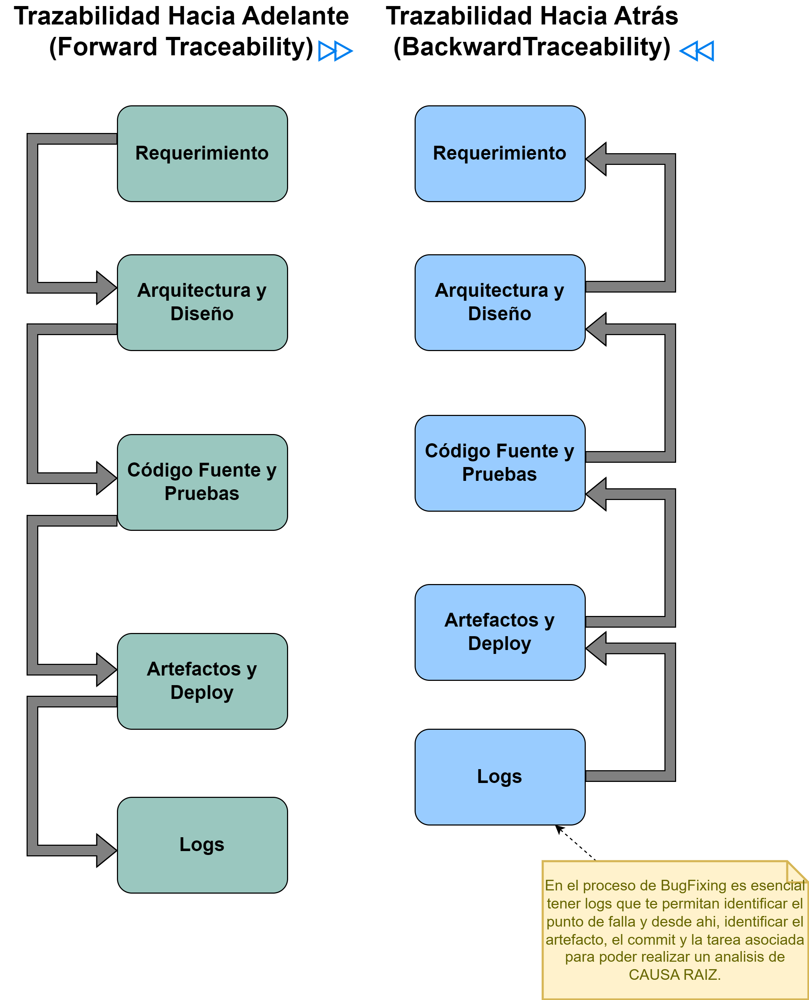

**Fig. 10 Trazabilidad hacia adelante (Forward) y hacia atrás (Backward)**

### Análisis de Causa Raíz (XP by K. Beck)

Link: [XP book notes: Root Analysis](https://matiaspakua.github.io/tech.notes.io/pages/books/book_extreme_programming_explained.html#1.9.5.root_cause_analysis)


### 2.5.4. Práctica: Identificación

La <mark style="background: #FFF3A3A6;">identificación</mark> de los elementos de información o artefactos es importante tanto desde el punto de vista de QA como en la operación. Para identificar los artefactos, un posible ejemplo es definir la siguiente nomenclatura general:

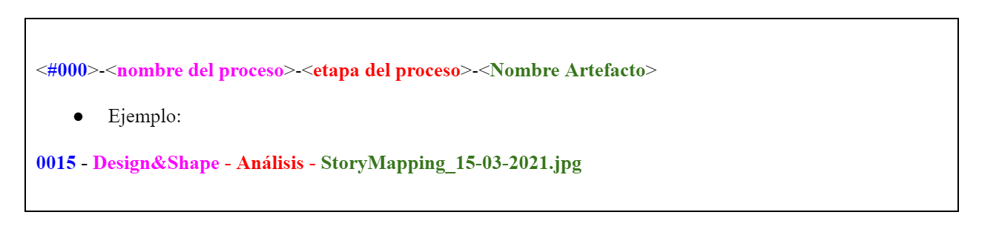

Todos los artefactos deben ser identificados y almacenados en la base de conocimiento y se debe usar el ID de los artefactos para asociar y/o referenciar otros artefactos o documentos de cualquier tipo, de modo tal de asegurar trazabilidad en el proceso.

📌 La identificación adecuada de artefactos es crucial en la ingeniería de software para asegurar la trazabilidad, la organización y la gestión eficiente de los componentes y documentos a lo largo del ciclo de vida del proyecto. Aquí te proporciono algunos ejemplos adicionales de identificación de artefactos en diferentes áreas de la ingeniería de software:

#### 📋 Requisitos del Software

   - **ID de Requisitos:** <mark style="background: #FFF3A3A6;">REQ-001</mark>, REQ-002, REQ-003
   - **Descripción:** Cada requisito funcional y no funcional se asigna un ID único que se usa en toda la documentación del proyecto para referenciar de manera clara y consistente.
   - **Utilidad:** Facilita el seguimiento de la implementación de los requisitos, la gestión de cambios y la verificación de que todos los requisitos han sido cumplidos.

#### 📑Casos de Uso

   - **ID de Casos de Uso:** <mark style="background: #FFF3A3A6;">UC-LOGIN-001</mark>, UC-REGISTER-002
   - **Descripción:** Cada caso de uso tiene un ID único que describe la funcionalidad específica que aborda.
   - **Utilidad:** Mejora la claridad en la documentación y permite a los desarrolladores y testers referirse a casos de uso específicos sin ambigüedad.

#### 🧪 Pruebas de Software

   - **ID de Casos de Prueba:** <mark style="background: #FFF3A3A6;">TC-LOGIN-001</mark>, TC-REGISTER-002
   - **ID de Scripts de Prueba:** TS-LOGIN-AUTOMATION-001, TS-REGISTER-AUTOMATION-002
   - **Descripción:** Cada caso de prueba y script de prueba automatizado recibe un ID único.
   - **Utilidad:** Facilita la trazabilidad entre los requisitos, los casos de uso y las pruebas, asegurando que todos los aspectos han sido verificados y validados adecuadamente.

#### 📂 Documentos del Proyecto

   - **ID de Documentos:**<mark style="background: #FFF3A3A6;"> DOC-SRS-001</mark>, DOC-TESTPLAN-002
   - **Descripción:** Los documentos clave del proyecto, como las especificaciones de requisitos del software (SRS) y los planes de prueba, se identifican con IDs únicos.
   - **Utilidad:** Facilita la organización, el acceso y la referencia cruzada de los documentos, asegurando que todos los miembros del equipo puedan localizar y utilizar la información necesaria de manera eficiente.

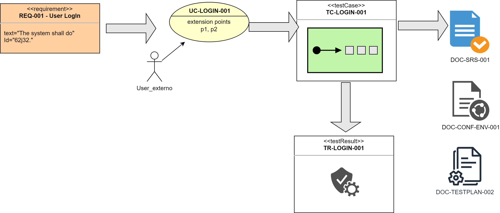

**Fig. 10.1. Ejemplo de trazabilidad de artefactos**


### 2.5.5. Práctica: Base de Conocimiento

Todos los artefactos se recomienda almacenarlos en un <mark style="background: #FFF3A3A6;">repositorio único</mark> (por ejemplo, un disco en la nube) que permita identificar al proyecto o producto y del cual se pueda recuperar la información almacenada.

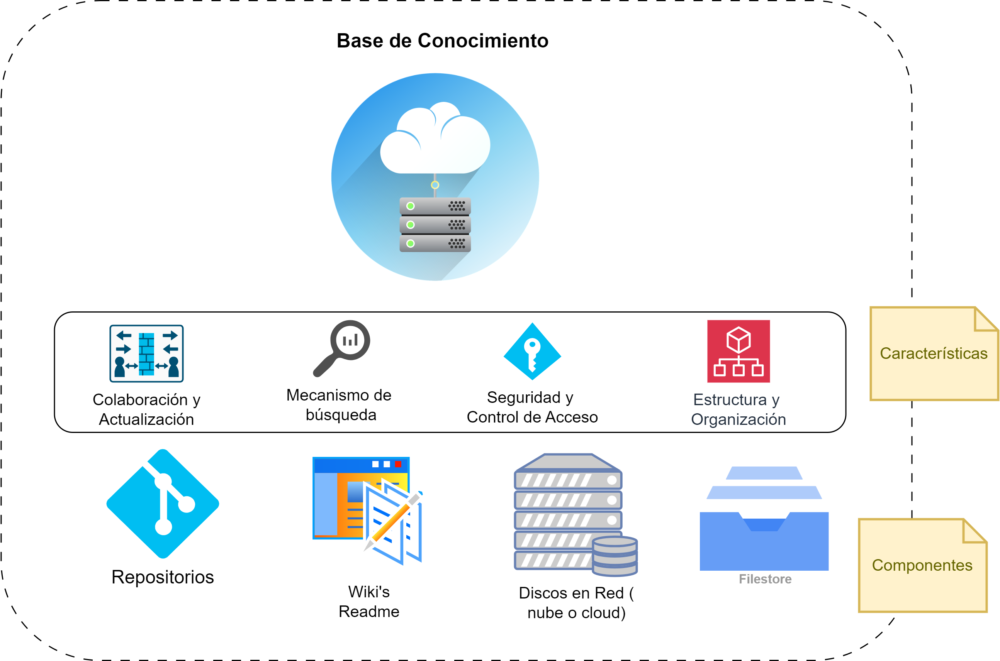

**Fig. 11. Concepto de Base de Conocimiento Centralizada y en la Nube**

Se propone armar una estructura de directorios para almacenar y categorizar los artefactos asociados a cada producto. La organización de directorios debe ser compatible y fácil de identificar con los procesos que se aplican en el producto de software. Este aspecto es importante para la recuperación, identificación y almacenamiento de los artefactos que allí se almacenarán.

Un ejemplo de estructura podría ser el siguiente:

```bash
/project-root/ 
	├── README.md 
	├── docs/ 
		├── DOC-SRS-001-Specification.md 
		├── DOC-TESTPLAN-002-TestPlan.md 
		├── DOC-ARCHITECTURE-003-ArchitectureDiagram.md 
		└── DOC-RELEASE-004-ReleaseNotes.md
	├── tests/
		├── TC-LOGIN-001-UserLoginTestCase.md 
		├── TC-REGISTER-002-UserRegisterTestCase.md 
		├── TS-LOGIN-AUTOMATION-001-LoginTestScript.py 
		└── TS-REGISTER-AUTOMATION-002-RegisterTestScript.py
	├── configs/ 
		├── CFG-DB-CONN-001-DatabaseConnectionConfig.yaml 
		├── CFG-API-ENDPOINT-002-APIEndpointsConfig.yaml 
		└── CFG-LOGGING-003-LoggingConfig.yaml
	├── scripts/ 
		├── backup.sh 
		└── cleanup.sh
	└── logs/
		├── TEST-2024-06-25.log 
		└── TEST-2024-06-26.log
```


Normalmente, dentro de la estructura de documentos y dependiendo del tamaño y necesidades del proyecto, se puede dar el caso que se requieran subdivisiones, por ejemplo:

 /planificación
 /requerimientos
 /interfaces
 /planning
 /reportes y logs de reuniones
 /etc...


> [!IMPORTANT] LO IMPORTANTE
> Si bien es importante la clasificación de la documentación, está claro que no hay que excederse en la organización, generando un maraña de carpetas y directorios, que terminen complicando encontrar lo que se necesita.

### 2.5.6. Práctica: Arquitectura de alto nivel de Procesos

Al comienzo o inclusive en etapas tardías, se recomienda armar una arquitectura de alto nivel de los distintos procesos. Definir los procesos como “cajas negras” con sus interfaces, para luego desarrollar la especificación de cada proceso, es un paso importante para articular los componentes y personas que van a desarrollar un producto.

Para tener éxito con DevSecOps y QA Automation es imperativo definir la arquitectura de alto nivel y los procesos asociados. Tiene que estar claro y bien definido cuál es el <mark style="background: #FFF3A3A6;"> camino del producto y del desarrollo</mark> (“continuous develop, testing, integration, delivery, security, etc..”).

Si bien los procesos definen un conjunto de normas, prácticas y herramientas para cada conjunto de tareas o etapa del desarrollo de un producto, no es estrictamente necesario que cada proceso sea llevado a cabo por personas distintas o por equipos diferentes (mucho depende de la complejidad, la estructura y la cultura de la organización). La metodología DevSecOps promueve que los equipos sean multi-disciplinarios y auto-organizados con el objetivo, a largo plazo, de que éstos procesos puedan ser llevados adelante por el mismo equipo. Parte de “acelerar” el desarrollo de un producto de software se basa en ésta idea.

La premisa es que un mismo equipo lleve adelante todos los procesos, que sea una “construcción colectiva”, que se debe realizar de forma iterativa e incremental por el mismo equipo, acompañado de la cultura de la organización.

En la Fig. 12 se presenta un ejemplo de un diagrama de arquitectura de alto nivel para los procesos asociados a la implementación de la metodología DevSecOps y QA.

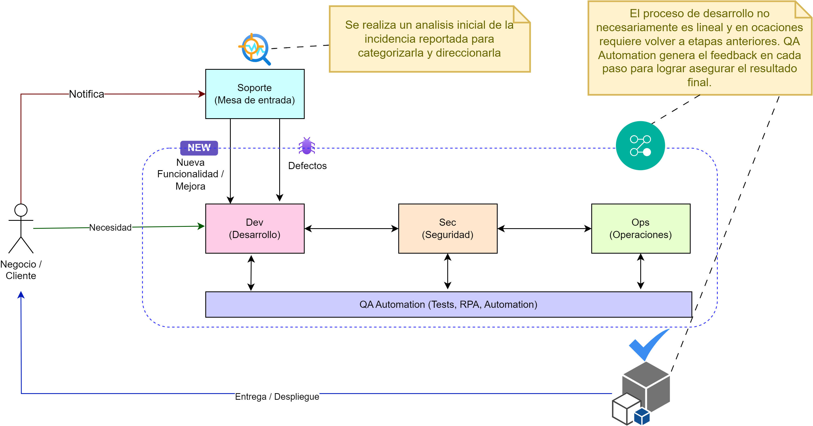

**Figura 12: Arquitectura de Procesos de Alto Nivel.**

Otro aspecto importante a tener en cuenta respecto a ésta práctica es que se debe analizar a los equipos, contextos y complejidad de los procesos y las herramientas y tecnologías asociadas a cada uno. Tener en cuenta la <mark style="background: #FFF3A3A6;">carga cognitiva</mark> 🧠 que se asigna, debido a que en equipos poco maduros y sin suficiente capacidad para afrontar la masiva cantidad de conceptos a manejar, puede generar efectos adversos en lugar de positivo. 

Como todo lo que se desarrollara en el presente trabajo: para cada punto, además de los conceptos técnicos y específicos, aplicar en primera medida:

1. Un juicio adecuado según el contexto y la complejidad;
2. Sentido común para buscar resultados positivo;
3. (KIS) Sencillez y simpleza sobre complejidad.


### 2.5.7. Práctica: Integración Continua (CI)

Históricamente uno de los mayores problemas en la producción o desarrollo de software es la llamada integración. Se trata de la etapa en donde se juntan todas las partes y comienza a tomar forma el producto final que deberá ser enviado a producción.

Las principales características de la Integración Continua [Fowler, 2006] (CI) son:

1. Integración en cada cambio.
2. Repositorio centralizado, organizado con un "mainline"
3. Testing y tareas automatizadas. En todos los niveles.
4. Resultado: producto estable.

**Referencia:** Fowler, M. (2006, May 1). Continuous Integration. Martin Fowler. Retrieved February 20, 2022, from https://martinfowler.com/articles/continuousIntegration.html

La integración continua incluye alguna o todas las siguiente fases, que son justamente las etapas que se deben integrar durante el desarrollo de un producto de software. Al considerar las fases de la Fig. 13, integrarlas y ordenarlas de forma “continua”, se pueden ver como si fuera una tubería o **pipeline**:

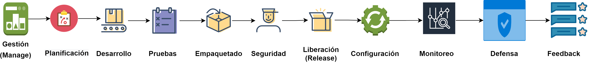

**Fig. 13: Fases comunes de un pipeline de Integración Continua**

Para entender la importancia de CI, se usará la analogía de un rompecabezas 🧩Fig. 14. Cada módulo de software es único, tiene una funcionalidad, se debe articular en una parte determinada, y para hacer que esa articulación funcione se deben respetar sus interfaces. Pero además, se debe validar que la posición donde se colocó corresponda a la función del módulo, y que además el módulo cumpla con su funcionalidad tanto individual como para todo el sistema:

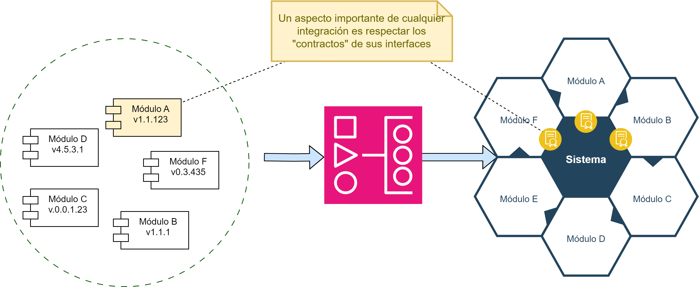

**Fig. 14 Concepto de Integración. Rompecabezas.**

Siguiendo con las características o propiedades que son importantes para lograr CI, surge la práctica de hacer un “**build self-testing**” que consiste en una compilación y prueba de que un producto se pueda generar correctamente. La práctica de build self-testing es muy útil cuando se hacen commits al mainline a diario.

La Fig. 15 muestra un posible checklist para determinar qué tanto se adhiere al concepto de CI.

Cada commit es conveniente que genere la ejecución de un “build” en un servidor de integración preparado con una copia de un ambiente, ya sea de desarrollo, testing o producción. Luego de disparar la ejecución de un build, se debe asegurar que se ejecute por completo sin problemas y si no fuera el caso, repararlo debe ser una prioridad. Con la maduración de la práctica, se deben pensar y mejorar los <mark style="background: #FFF3A3A6;">“tiempos de ejecución”</mark> de los builds, tratando de acelerarlos cuando sea posible. Para acelerar o mejorar los builds, es conveniente armar pipelines de integración con etapas (o stages) y los servidores que ejecuten los build deberían poder ser configurables para reproducir los ambientes y todas las dependencias necesarias para generar una versión del producto.


**Fig. 15 Checklist verificación de adherencia a Continuous Integration. Imagen Fuente (Fowler, 2017)**

**Referencia:** Fowler, M. (2017, January 18). ContinuousIntegrationCertification. Martin Fowler. Retrieved February 20, 2022, from https://martinfowler.com/bliki/ContinuousIntegrationCertification.html

--- 

### "Siempre" puede salir algo mal 🔙⚠️

**UPDATE: 19/07/2024**. El mundo despertó con uno de los mayores fallos informáticos de la historia, el cual afecto a infraestructura critica: aeropuertos, hospitales, sistemas financieros y bancos entre muchos otros. La causa fue una actualización de un driver de seguridad (<mark style="background: #FFF3A3A6;">Crowdstrike</mark>) en los sistemas Windows. El resultado: la pantalla azul de la muerte (un sistema inaccesible).

Fuente: https://www.gmv.com/en-es/communication/news/crowdstrike-bsod-happened-can-prepared


**Lección aprendida:** se puede desarrollar procesos, métodos, herramientas y pipelines con altísima calidad, pero igualmente pueden ocurrir errores, por lo tanto, nuestros procesos y pipelines de CI deben <mark style="background: #BBFABBA6;">tener preparados mecanismos de recuperación ante falla</mark>s criticas: GREEN/BLUE deployment, CANARY deploy, etc.

--- 

Todas estas consideraciones ayudan a la calidad del producto, la fluidez del desarrollo, y como adicional, permiten que sea fácil que cualquier persona pueda obtener el último ejecutable con los últimos cambios. 

En resumen, la aplicación de CI provee la siguiente lista de beneficios:

 - Visibilidad del proceso de desarrollo 
 - Reducción de riesgos 
 - Eliminación de puntos ciegos al reducir las etapas de integración intermedias. 
 - Reducción de la cantidad de errores en producción 
 - Aceleración en la generación y publicación de nuevas features 
 - Obtención rápida de feedback 
 - Mejora en la comunicación y colaboración

Algunas prácticas recomendadas para iniciar con CI son:

 - 📚 Repositorio centralizado (Fowler, 2020)
 - 🤖Automatizar el build
 - 🧪 Comenzar con testing automatizado (poco es mejor que nada)
 - ⏱️ Acelerar el build: 10 minutes rules de la metodología XP (Beck & Andres, 2004, 49)
 - 🧠 Buscar ayuda en la experiencia

**Referencia:** Fowler, M. (2020, 05 28). Patterns for Managing Source Code Branches. Martin Fowler. Retrieved March 29, 2022, from https://martinfowler.com/articles/branching-patterns.html

**Referencia:** Beck, K., & Andres, C. (2004). Extreme Programming Explained: Embrace Change. Pearson Education


### 2.5.8. Práctica: Fallar desde el Inicio y Rápido (Testing)

Para lograr una integración fluida y dinámica, se debe contar con servidores de integración continua que, como primer paso, hagan la construcción (build self-testing) del producto, pero mucho más importante es contar con buenas bases de QA Automation (Fitzpatrick, 2018), (Hristov, n.d.), (Rehkopf, n.d.). La base de testing debe incluir: 

● Test Unitarios 🧪 
● Test de Componentes 🧩  
● Test de Integración 🔄  
● Test E2E 🏁  
● Test de Performance ⚡  
● Test de Carga (load) 📈  
● Test de Seguridad 🔒

**Referencia:** Fitzpatrick, S. (2018, July 19). The Growing Importance of Test Automation Skills in DevOps. Sauce Labs. Retrieved February 21, 2022, from https://saucelabs.com/blog/the-growing-importance-of-test-automation-skills-in-devops

**Referencia:** Hristov, A. (n.d.). Test Automation. Atlassian. Retrieved February 21, 2022, from https://www.atlassian.com/devops/devops-tools/test-automation

**Referencia:** Rehkopf, M. (n.d.). Automated software testing for continuous delivery. Atlassian. Retrieved February 21, 2022, from https://www.atlassian.com/continuous-delivery/software-testing/automated-testing

Los objetivos fundamentales son: 

1. Validar la funcionalidad esperada para el producto. 
2. Encontrar problemas lo más rápido posible

El testing es fundamental y deben ser automatizados en su mayoría. No importa la forma de trabajo que se quiera implementar, se debe armar una buena base de test automáticos y manuales donde se requiera.


#### 2.5.8.1. Pirámide de Testing

La analogía de una pirámide, ver Fig. 15.1, se usa para representar visualmente la <mark style="background: #FFF3A3A6;">cantidad y la prioridad </mark>de diferentes tipos de pruebas. Esta representación es útil por varias razones:

- **Distribución de Cantidad**: La base más ancha de la pirámide representa la mayor cantidad de pruebas unitarias que deben realizarse. A medida que subimos, la cantidad de pruebas disminuye, con menos pruebas de integración, aún menos pruebas de componentes, y menos aún de pruebas end-to-end (E2E), de rendimiento y seguridad. Esto refleja la práctica recomendada de tener una gran cantidad de pruebas unitarias debido a su <mark style="background: #BBFABBA6;">rapidez y costo efectivo</mark>, con una menor cantidad de pruebas más lentas y costosas en los niveles superiores.

- **Complejidad y Costo**: La base más ancha también sugiere que las pruebas en este nivel (unitarias) son <mark style="background: #ADCCFFA6;">más simples y menos costosas de ejecutar</mark>. A medida que subimos en la pirámide, las pruebas se vuelven más complejas y costosas, tanto en términos de tiempo como de recursos necesarios.

- **Estabilidad y Rapidez de Feedback**: En la base de la pirámide, las pruebas unitarias proporcionan un <mark style="background: #BBFABBA6;">feedback rápido</mark> y son menos propensas a errores de configuración. A medida que avanzamos hacia pruebas de integración y pruebas E2E, el tiempo de feedback aumenta debido a la mayor complejidad y la necesidad de más infraestructura.
    
- **Frecuencia de Ejecución**: Las pruebas en la base de la pirámide (unitarias) se ejecutan con <mark style="background: #FFF3A3A6;">mayor frecuencia</mark> en el ciclo de desarrollo, por ejemplo, con cada commit o integración continua. Las pruebas en los niveles superiores, debido a su costo y tiempo, se ejecutan con menos frecuencia, por ejemplo, en integraciones diarias o semanales, o antes de las liberaciones.

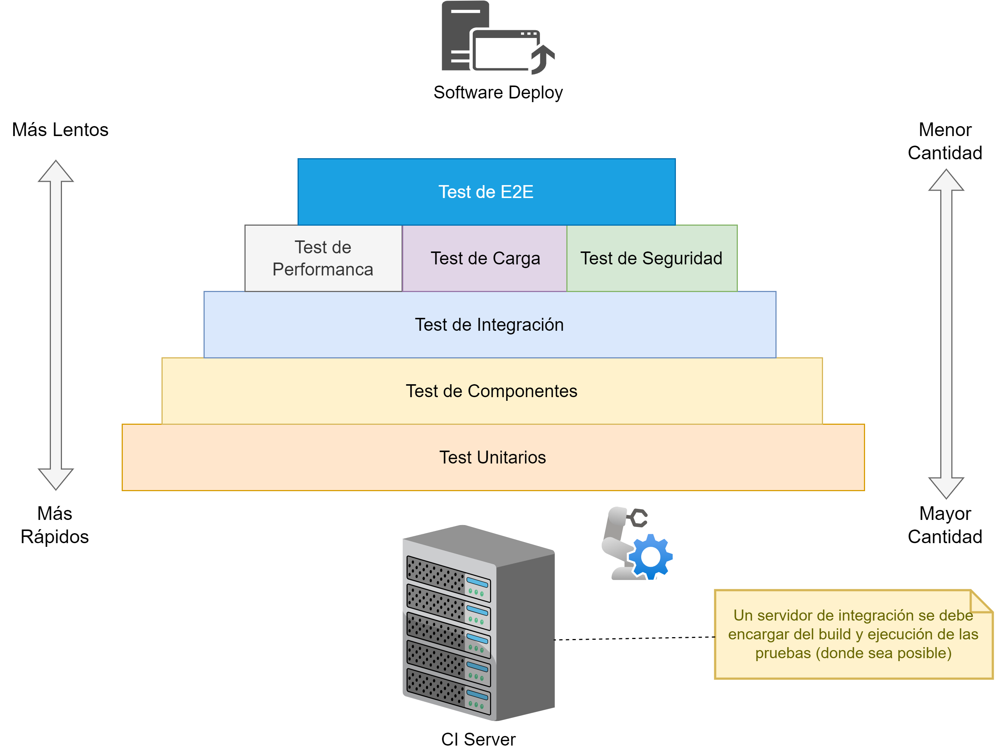

**Figura 15.1. Pirámide de Testing**


### 2.5.9. Práctica: Entrega Continua (CD)

La entrega continua (Fowler et al., 2013) es la capacidad de <mark style="background: #FFF3A3A6;">introducir cambios</mark> de todo tipo (incluidas nuevas funciones, cambios de configuración, correcciones de errores y experimentos) en producción o en manos de los usuarios, de forma segura, rápida y sostenible (Humble, 2017). El objetivo es hacer que las implementaciones, ya sea de un sistema distribuido a gran escala, un entorno de producción complejo, un sistema embebido o una aplicación, <mark style="background: #ADCCFFA6;">sean asuntos rutinarios y predecibles</mark> que se puedan realizar bajo demanda.

*Referencia:*  Fowler, M., Humble, J., & Farley, D. (2013, May 30). ContinuousDelivery. Martin Fowler. Retrieved February 20, 2022, from https://martinfowler.com/bliki/ContinuousDelivery.html

*Referencia:* Humble, J. (2017). What is Continuous Delivery? What is Continuous Delivery? -Continuous Delivery. Retrieved February 21, 2022, from https://continuousdelivery.com/


La disciplina de CD implica que el **software puede (o no) ser enviado a producción** en cualquier momento. CD difiere del <mark style="background: #FFF3A3A6;">Despliegue Continuo (CD) donde “siempre” el software pasa a producción.</mark>

> [!QUOTE] CD vs CI
> CD (continuos delivery) != CD (continuous deploy)


Los pre-requisitos para la práctica de CD incluyen: 

 * Tener funcionando un **pipeline** completo de Integración Continua (CI). 
 * Tener el **proceso de QA automation** en funcionamiento. 
 * Mantener un **control de configuración**, tanto del producto como de los ambientes (Artefactos y Repositorio de Artefactos). 
 
La complejidad en esta disciplina proviene de que se requiere un alto nivel de comunicación, coordinación y colaboración entre todos los equipos (Desarrollo, Operation, Delivery) y un alto grado de Testing (QA) y Automatización

La Fig. 16 hace visible que CI y CD son parte de procesos que se comunican entre sí usando “artefactos”. Así como como se definió en apartados iniciales, los artefactos sirven como elementos de intercambio, y por lo tanto, definen de alguna manera las interfaces de comunicación entre procesos.

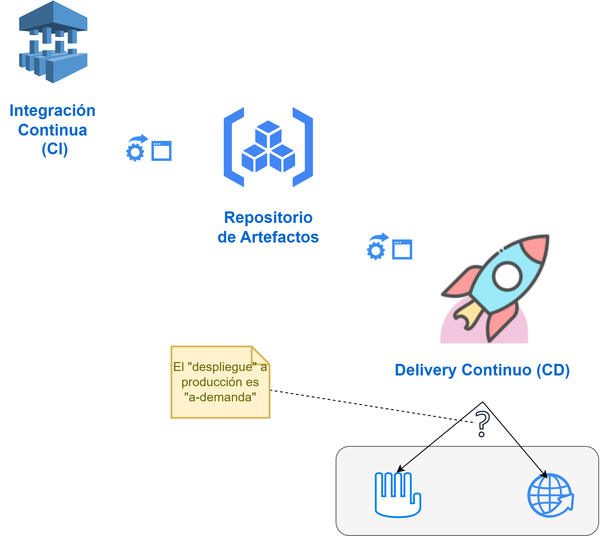

**Figura 16 Esquema de CI, Artefactos y CD.**


### 2.5.10. Práctica: APIs

Una API (API, 2022) permite que un programa acceda a los datos y servicios de otro. Es un tipo de interfaz de software que ofrece un servicio. Un documento o formato estándar que describe cómo construir o usar una conexión o interfaz de este tipo se denomina especificación API. Se dice que un sistema de software que cumple con este estándar implementa o expone una API.

**Referencia:** Wikipedia contributors. (2022, February 4). API. In Wikipedia, The Free Encyclopedia. Retrieved 22:14, February 21, 2022, from https://en.wikipedia.org/w/index.php?title=API&oldid=1069932978

Una API se considera como el<mark style="background: #FFF3A3A6;"> “contrato”</mark> por el cual los sistemas pueden interactuar e intercambiar información.

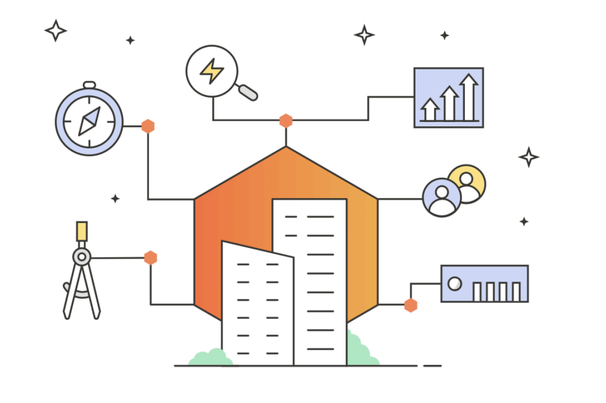

**Figura 17 Concepto de API. Imagen fuente (Postman, Inc., 2022**

En el desarrollo de productos de software, API-first (Postman, Inc., 2022) es un modelo en el que las aplicaciones se conceptualizan y construyen como una interconexión de servicios internos y externos a través de APIs. Al igual que modelar primero la arquitectura del producto de software trae varios beneficios,<mark style="background: #FFF3A3A6;"> modelar primero las interfaces</mark> de los distintos componentes del producto de software también provee sus beneficios (Lane, 2021). Para implementar la estrategia de desarrollo de productos utilizando el concepto de API-first, se recomiendan las siguientes acciones:

 * Hacer un **inventario** de las bases de datos, aplicaciones y servicios: comprender exactamente cuántas API hay disponibles y dónde faltan APIs. 
 * Comprenda el **enfoque de la organización** para producir API: identificar dónde existen procesos estándar y dónde no. 
 * Definir los **límites del dominio** empresarial y asignar su estructura organizativa a esos límites.
 * Adoptar una **plataforma de API y estandarizarla**. 
 * **Capacitar** a los equipos de Ingeniería, Security, DevOps, QA y Administración de Productos en las prácticas de uso, diseño, pruebas y priorización de API. 

**Referencia:** Postman, Inc. (2022). What is an API-first company? Postman. Retrieved February 21, 2022, from https://www.postman.com/lp/api-first-company/

**Referencia:** Lane, K. (2021, December 1). What Is an API-First Company? Postman Blog. Retrieved February 21, 2022, from https://blog.postman.com/what-is-an-api-first-company/


A continuación se listan las etapas (Lane, 2022) de implementación de una estrategia API-first:

1. 🛠️ **Definiciones iniciales**: equipo de trabajo, espacio para escribir, comunicar, modelar; y repositorio centralizado.
2.✏️ **Diseño**: Basarse en la especificación OpenAPI (The Linux Foundation, 2021) para un vocabulario común, mock servers y modelado de endpoints.
3. 📑 **Documentación**: Documentar (SmartBear Software, 2021) endpoints y proveer ejemplos.
4. 🚀 **Deploy**: Tener un servidor de CI/CD, y un gateway para centralizar los pedidos (requests).
5. 🧪 **Testing**: Generar pruebas por “contrato” y pruebas de performance.
6. 🔒 **Seguridad**: Implementar mecanismos de autenticación y autorización, implementar testing de seguridad.
7. 📊 **Monitoreo**: Monitorear el testing por contrato, de performance, seguridad, la actividad general de uso y desarrollo de las API, el changelog y las notificaciones que se generan.
8. 🔍 **Descubrimiento**: Asegurar los mecanismos de publicación en redes públicas o privadas y los mecanismos de búsqueda de documentación y ejemplos.

**Referencia:** Lane, K. (2022, January 14). The 8-Point API Lifecycle Blueprint. Postman Blog. Retrieved February 21, 2022, from https://blog.postman.com/api-lifecycle-blueprint/

**Referencia:** The Linux Foundation. (2021, February 15). OpenAPI Specification v3.1.0  Introduction, Definitions, & More. OpenAPI Initiative Registry. Retrieved February 21, 2022, from https://spec.openapis.org/oas/latest.html

**Referencia:** SmartBear Software. (2021). OpenAPI Specification - Version 3.0.3. Swagger. Retrieved February 21, 2022, from https://swagger.io/specification/


Como se verá más adelante, la etapa diseño es muy importante para el éxito de un producto de software. Generar roadmaps de alto nivel Fig. 18 es una práctica recomendada para tener una visión clara durante el desarrollo.

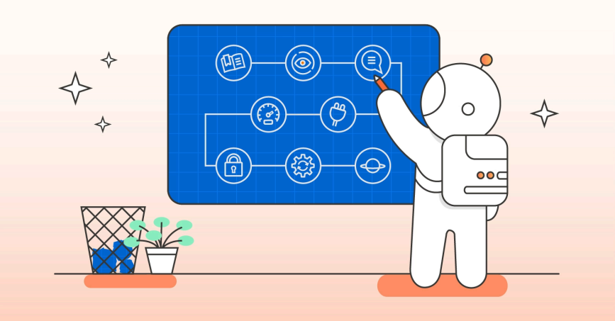

**Figura 18 Roadmap hacia un desarrollo Api-First. Imagen fuente (Postman, Inc., 2022)**


### 2.5.11. Práctica: Estado Actual de Madurez

La implementación de una nueva metodología, procesos o herramientas requiere, para ser efectiva, que se identifique primero el estado actual en el cual está la organización y/o equipo, medirlo y luego planificar mediciones con el objetivo de analizar y evaluar el retorno de inversión (ROI).

Implementar una metodología como **DevSecOps** requiere tener en claro el estado actual de la organización para poder hacer el seguimiento y aplicar las acciones correctivas necesarias con el objetivo de tener éxito en la implementación de la metodología. 

Por ejemplo, según las recomendaciones de Google (Google LLC, n.d.), una organización puede identificar dónde se encuentra actualmente en el proceso de entrega de software Fig.19 a través de una simple encuesta que pretende hacer una evaluación de alto nivel sobre lo indicado por una organización/equipo.

**Referencia:** Google LLC. (n.d.). What is DevOps? Research and Solutions. Google Cloud. Retrieved February 21, 2022, from https://cloud.google.com/devops/

Link: [Simulador DORA Quick Check](https://dora.dev/quickcheck/)

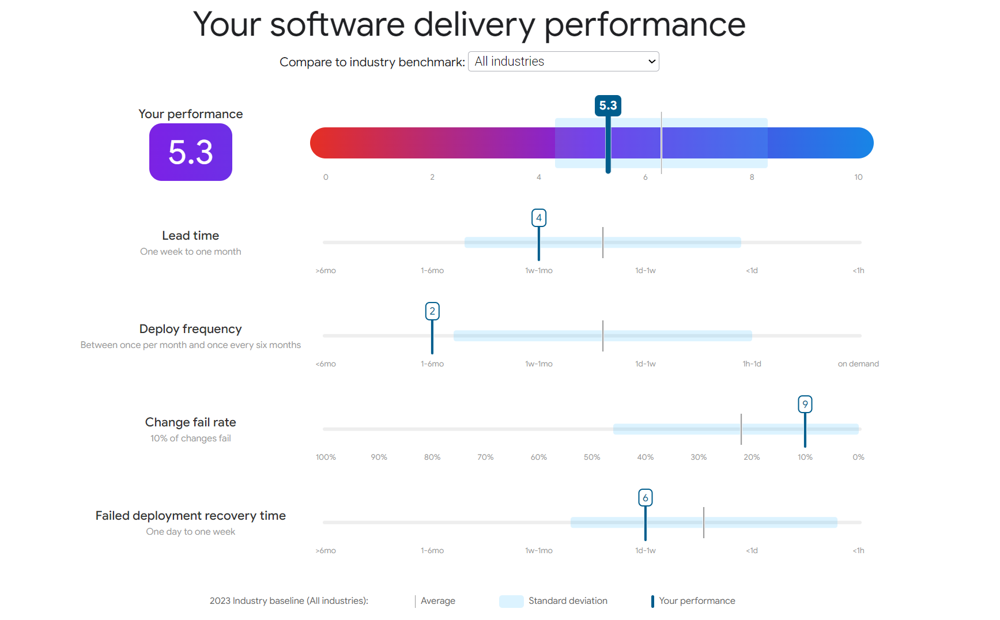

**Figura 19 Ejemplo Estado de Delivery de Software de una Organización. Imágen Fuente (Google LLC, n.d.)**

---


### 2.5.12. Metodología: DevOps

Terminamos de repasar las principales "prácticas", ahora vamos a realizar un repaso de las "metodologías".

Desde una perspectiva académica, (Bass et al., 2015) definen DevOps como: "un conjunto de prácticas Fig. 20 destinadas a reducir el tiempo entre la realización de un cambio en un sistema y el momento en que el cambio se coloca en producción, garantizando al mismo tiempo una alta calidad".

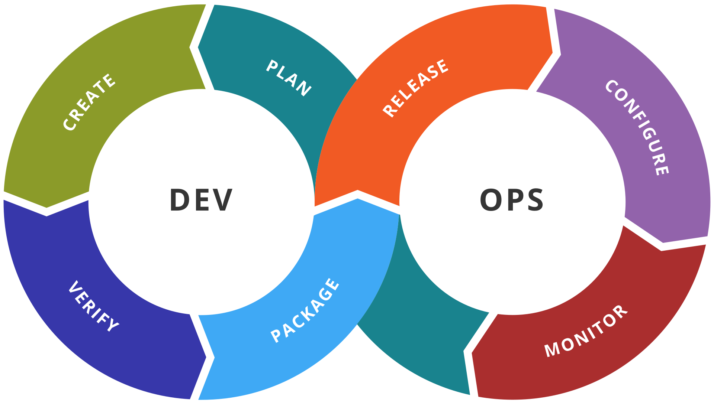

**Figura 20 Esquema Conceptual DevOps. Imagen Fuente (DevOps, 2020)**

**Referencia:** Bass, L., Zhu, L., & Weber, I. M. (2015). DevOps: A Software Architect's Perspective. Addison-Wesley

Para que una cultura de DevOps pueda ser implementada, se requiere que tanto el equipo como la organización tengan en claro los pilares técnicos y culturales sobre los cuales ésta metodología se sustenta para que sea exitosa. Desde el punto de vista técnico, estos pilares son: 

- **Deployability**: 🚀 la capacidad de un producto o servicio de ser puesto en producción o desplegado en distintos ambientes, por ejemplo: Dev, QA, pre-producción, producción, etc.
- **Modifiability**: 🔧 la capacidad de un producto o servicio de ser modificado. Este es un atributo fundamental de cualquier “buen” software.
- **Testability**: 🧪 la capacidad de un producto o servicio de ser puesto bajo pruebas según sea el caso. Un aspecto importante es tener claros los casos de negocio que el sistema debe cumplir y tener pruebas que validen esos "casos de negocio", tanto para validar los mismos como para ejecutar regresiones frecuentes.
- **Monitorability**: 📈 la capacidad de un producto o servicio de ser monitoreado.
- **Automation**: 🤖 la automatización (QA Automation) es un principio fundamental para lograr el éxito de DevOps, y CI/CD es un componente crítico.
- **Toolchain**: 🛠️ Conjunto de herramientas y plataformas bien definidas y compatibles con los procesos. Es importante destacar que las herramientas “proveen el soporte a DevOps” y no deben orientar la aplicación de la metodología.


Desde el punto de vista cultural, otros aspectos importantes incluyen: 

- No trabajar en “silos”, aislados
- **DevOps** no es un “rol” o una “persona”, es un equipo y una mentalidad, aún cuando pueden existir roles facilitadores (Fisher, 2021).
- **Generar ambiente “sin miedo”**, ambiente de respeto e igualdad dentro del equipo y la organización
- **Responsabilidad** compartida y confianza
- **Flujos** de información claros, bien definidos y acordados
- **Colaboración**
- Aprender de los errores, comunicar y aplicar “PostMortem Communication” (Mueller & Wickett, 2020)
- Aplicar nuevas ideas, y experimentar

**Referencia:** Fisher, B. (2021, December). Becoming a DevOps Engineer: Role and Responsibilities. Udemy Blog. Retrieved February 22, 2022, from https://blog.udemy.com/devops-engineer/

**Referencia:** Mueller, E., & Wickett, J. (Writers). (2020, 10 28). Use your words (Season 1, Episode 2.2) [TV series episode]. In DevOps Foundations. LinkedIn Corporation.  https://www.linkedin.com/learning/devops-foundations-23454205/the-foundations-of-devops

En <mark style="background: #FFF3A3A6;">“The DevOps Handbook”</mark> (Humble et al., 2021, 72), se toman como referencia los principios que se muestran en la Fig. 21 y que rigen una buena implementación de DevOps llamada “The Three Ways” (ó las 3 formas).

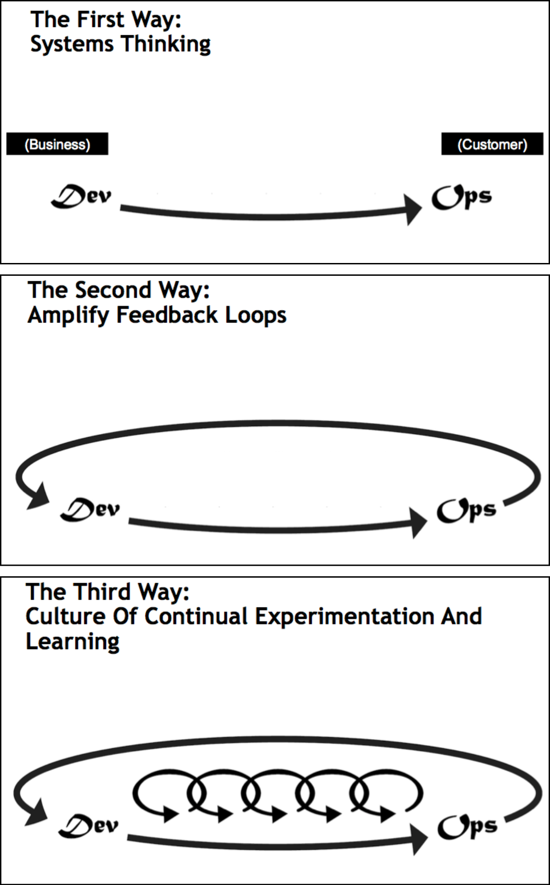

**Figura 21 Principios de DevOps. The Three Ways. Imagen Fuente: (Humble et al., 2021, 72)**

**Referencia:** Humble, J., Kim, G., Debois, P., & Forsgren, N. (2021). The DevOps Handbook, Second Edition: How to Create World-Class Speed, Reliability, and Security in Technology Organizations. IT Revolution Press. https://itrevolution.com/articles/the-three-ways-principles-underpinning-devops/

1. <mark style="background: #FFF3A3A6;">The First Way</mark>: Habilitar el flujo de trabajo de izquierda a derecha, desde Desarrollo
hasta la Operación, hacia el cliente.
2. <mark style="background: #BBFABBA6;">The Second Way</mark>: Habilitar el flujo constante y rápido de feedback, de izquierda a
derecha para todas las etapas de la cadena/flujo de valor (value stream).
3. <mark style="background: #ADCCFFA6;">The Third Way</mark>: Habilitar la creación de una cultura de confianza que soporte la
dinámica de trabajo de DevOps, ayudando a la disciplina, experimentación, y toma de
riesgos.


### 2.5.13. Metodología: Seguridad

La seguridad de la información (**InfoSEC**) y en general “seguridad digital” (Information security, 2022) tiene una gran importancia y cada vez más se incrementa la necesidad de implementar mejores mecanismos de seguridad digital, no solamente para los productos de software desarrollados, sino también para la infraestructura, herramientas, procesos y cultura en general. La idea de seguridad se basa en saber cuales son los riesgos (Skoglund, 2019) y en base a eso tomar dos acciones Fig. 22: 

 * Toma de <mark style="background: #FFF3A3A6;">conciencia</mark> del nivel de protección/exposición actual. 
 * Definición <mark style="background: #BBFABBA6;">medidas de protección</mark>.

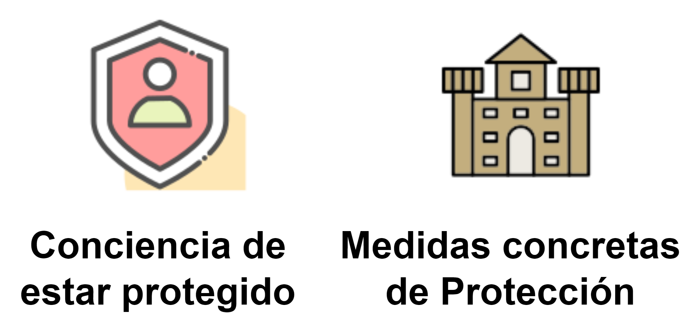

**Figura 22 Concepto de Seguridad.**

**Referencia:** Wikipedia contributors. (2022, February 21). Information security. In Wikipedia, The Free Encyclopedia. Retrieved 23:43, February 22, 2022, from https://en.wikipedia.org/w/index.php?title=Information_security&oldid=1073245153

**Referencia:** Skoglund, K. (Executive Producer). (2019). Programming Foundations: Web Security [TV series]. LinkedIn LinkedIn Corporation. https://www.linkedin.com/learning-login/share?forceAccount=false&redirect=https%3A%2F%2Fw ww.linkedin.com%2Flearning%2Fprogramming-foundations-web-security-2%3Ftrk%3Dshare_ent _url%26shareId%3D%252B1kjrO87ROmIeOzc9w5YVQ%253D%253D (Original work published 2019)

>[!todo]
>Para cada una de las deficiones, mejorar los ejemplos y diagramas, para que sea más técnico y claro el concepto.


Las siguientes definiciones proveen el marco en el cual se debe considerar la seguridad desde el punto de vista del desarrollo de productos de software. Se presenta una muy breve descripción de aspectos teóricos, prácticos y algunas prácticas de implementación que se recomienda tener en cuenta al plantear una estrategia de ciberseguridad:

 * **Threat Model**: concepto militar que busca crear un escenario “único” para cada activo valioso e identificar las medidas de defensa disponibles. Se modela del perfil del atacante, los vectores de ataque probables, las vulnerabilidades existentes y casos realistas y no realistas de ataque. El modelado permite generar “conciencia” del estado de protección. 
 * **Vulnerabilidad Zero-Day**:  Falla (o exploit) que expone al software/producto de alguna manera aún no solucionada o sin parche de seguridad disponible antes posibles ataques. 
 * **Principios Generales de Seguridad**: 
	 * 🚫 Aceptar que: “La seguridad total es imposible”. 
	 * 🔑 Implementar medidas como least privilege (controlar, limitar, no dar accesos). 
	 * ✔️ **Simple** es más seguro. 
	 * 🙅‍♂️ No confiar en los usuarios, ser paranoico. 
	 * 🔮 Esperar lo inesperado, analizar casos límites. 
	 * 🏰 Defensa por “capas”, y niveles de defensa. 
	 * 🌑Defensa a través de oscuridad (obscure). 
	 * 📋Lista de permitidos / Lista de bloqueados (allow/deny) 
	 * 🔌 Mapa de puntos de Exposición y transferencia de datos (canales). 
 * **Seguridad de los Datos (CIA)**: 
	 * 🔒 Confidentiality (confidencialidad). 
	 * ✔️ Integrity (integridad). 
	 * 🔄 Availability (disponibilidad).
 * **Buenas Prácticas Generales**: 
	 * 🛑 Filtrar entradas 
	 * 🚪Filtrar salidas 
	 * 🧹 Sanitizar, analizar, validar, etiquetar variables, código privado. 
	 * 👥 Credenciales, permisos y roles 
	 * 🧹 Clean-code, refactoring, 
	 * 📜 Estrategias de logging. 
	 * 🔍Testing de seguridad / Pentesting 


#### Ataques Comunes: 
* 🔐 Ataque con credenciales: robo, elevación de privilegios, fuerza bruta, suffing. Protección con: Contraseñas robustas, Password Hashing, Login Throttling. 

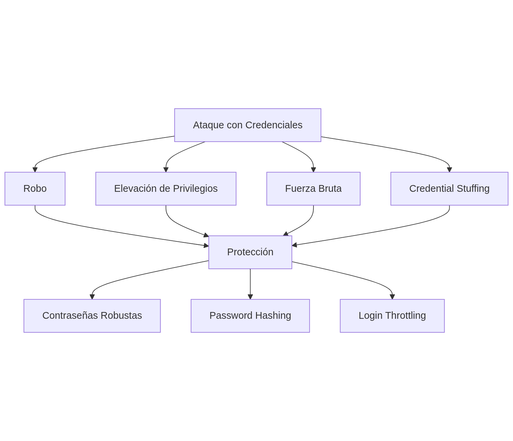


* 🌐 IDOR (Insecure Direct Object Reference) o manipulación de URLs 

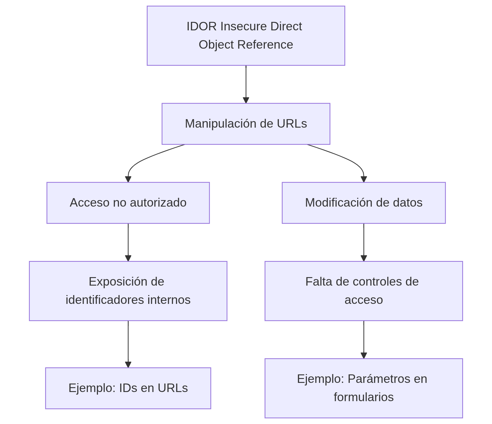


En éste ejemplo, si no protegemos una API correctamente, cualquier petición que exponga el ID del usuario (como la URL debajo) puede permitir conocer los detalles de cualquier otro usuario manipulando y cambiando el ID:

```
GET https://example.com/user/{userId}
```

```bash
// un usuario cualquiera
GET https://example.com/user/12345


// admin user
GET https://example.com/user/10000
```


* 💉 SQLi (Inyección de SQL). Manipular DB, robo datos. Protección con: control de inputs, sanitizar datos, uso de librerías del lenguaje/framework. 


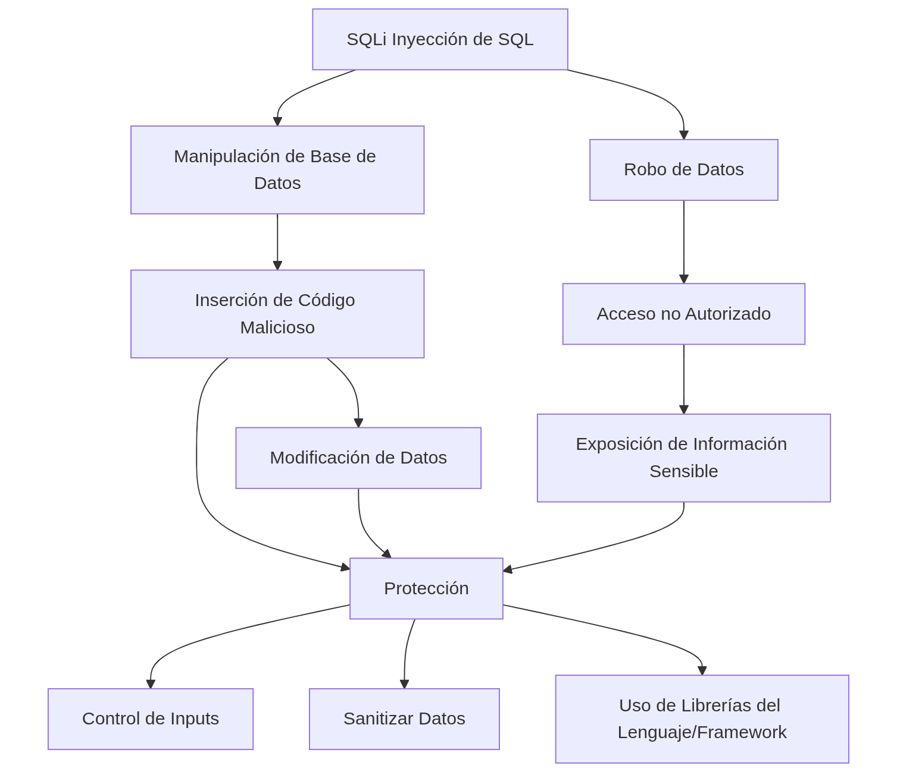


El ejemplos más clásico de SQLi sería: si tenemos una consulta SQL como esta:

```sql
SELECT * FROM usuarios WHERE usuario = 'admin' AND contraseña = 'password';
```

Si un atacante inserta código malicioso, la consulta podría convertirse en:

```sql

SELECT * FROM usuarios WHERE usuario = 'admin' OR '1'='1' AND contraseña = 'password';
```
Esto podría permitir el acceso no autorizado a la base de datos.


* 🎯 XSS (Cross Site Scripting). Ataques manipulando sitios webs de terceros. Tipos de ataques: reflected, stored, DOM-based. Protección con CSP o Content Security Policy. Protección con: Validación de request de las API (GET/POST), usar tokens CSRF. 

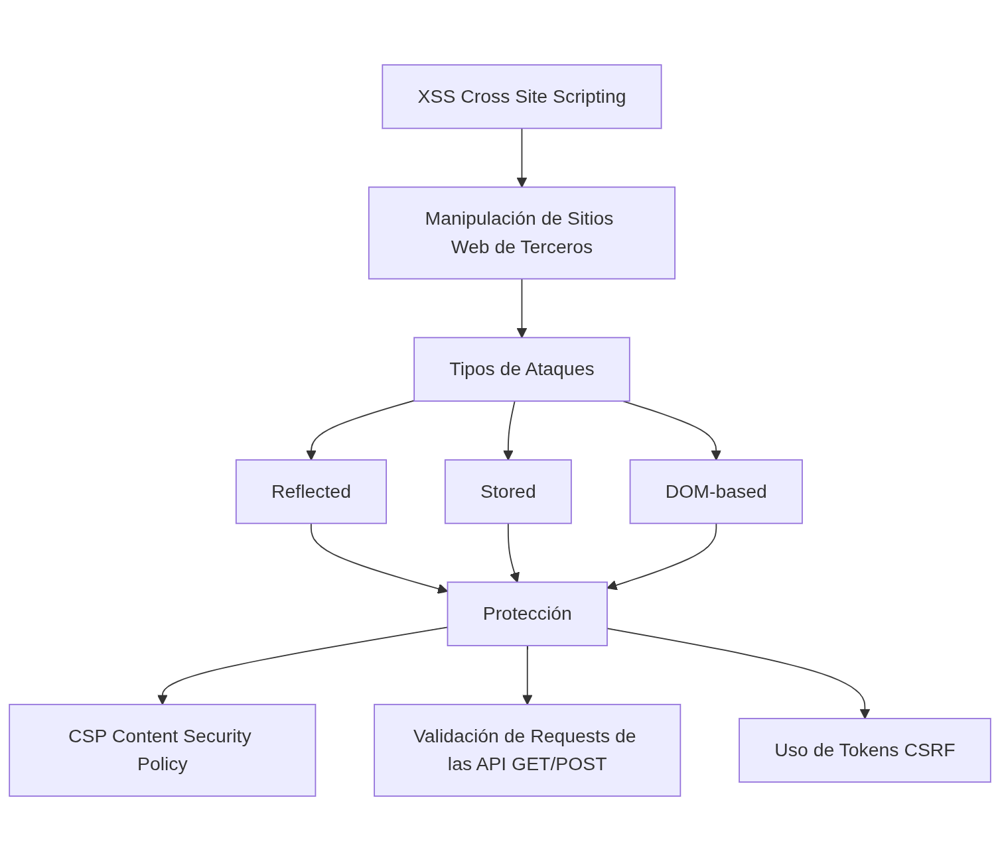

* 🕵 Robo y Visibilización de Cookies. Limitar y encriptar datos sensibles. Proteger con: Uso de Sesiones, SSL, HTTPS, Sign-Cookie. 

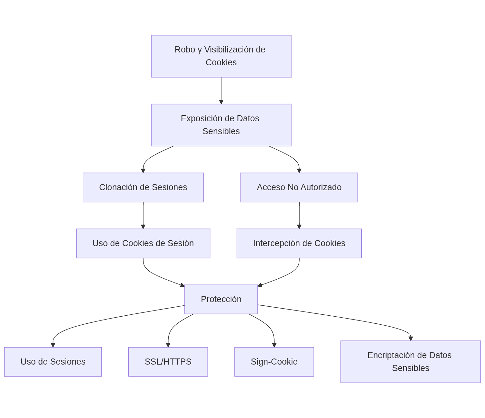


* 🔒 Session Hijacking: Robo se sesiones activas. Proteger con HTTPS, SessionID. 
* 💥 Session Fixation. Person-In-The-Middle attack. Proteger con: Validar Inputs, sanitización, CSP, Cookie Setting, HTTPS. 
* 💻 <--> 🖥️ RCE o Remote Code Execution. Ejecución de comandos en el servidor. Proteger con: Controles en el servidor, Firewall, Análisis de tráfico. 
* 💾 File Upload Abuse. FUA, sobre-uso de almacenamiento, inyección de malware. 
* 🚫  Denial Of Service (DoS). Flooding (inundar) o Crashing (overflow, RunTime Error). Proteger con: Throttling a través de limitaciones; Filtering con reglas; Sinkholing con redirección para post-análisis; Blackholing redirigiendo los datos a la nada (/dev/null).


### 2.5.14. Metodología: QA Automation

QA es una metodología que abarca todo el ciclo de vida de desarrollo de software (SDLC). QA describe los esfuerzos sistemáticos que se realizan para garantizar que los productos entregados a los clientes cumplan con las expectativas contractuales (también conocidas como expectativas del negocio) y otras como por ejemplo: rendimiento, diseño, confiabilidad, usabilidad, mantenibilidad y operación. 

En el presente trabajo se considera a QA como el marco de trabajo que se implementa a través de la aplicación de:

 * Las metodologías y prácticas (sección 2.5) 
 * Las estrategias de diseño (sección 3)
 * Las herramientas (sección 4)
 * La implementación y operación (sección 5)

Todos los artefactos y procesos que se proponen en el presente trabajo son parte de la aplicación de la visión de QA para el aseguramiento del cumplimiento de las expectativas del cliente con el producto o servicio a desarrollar.

La automatización de QA se considera como la implementación de técnicas y herramientas automatizadas en la ejecución de pruebas en el producto o servicio de software que se está desarrollando e informar sobre los resultados (Laukkanen, 2006, 1-3), de manera tal que la intervención humana se reduzca al mínimo y se pueda enfocar el esfuerzo en otras tareas.

**Referencia:** Laukkanen, P. (2006, February 24). Data-Driven and Keyword-Driven Test Automation Frameworks. HELSINKI UNIVERSITY OF TECHNOLOGY, 1(2006), 98+0. 

La mayoría de los beneficios asociados se pueden resumir con palabras como eficiencia y reutilización. Se espera que la automatización de pruebas ayude a<mark style="background: #FFF3A3A6;"> ejecutar muchos casos de prueba de manera consistente de forma reiterada (regresión) en diferentes versiones del sistema bajo prueba</mark>. La automatización también puede facilitar disminuir la carga de trabajo de los ingenieros de software y liberarlos de tareas repetitivas. Todo esto tiene el potencial para aumentar la calidad del software y acortar los tiempos de prueba.

Todas estas promesas hacen que la automatización de pruebas parezca atractiva, pero lograrlas en la vida real requiere mucho trabajo. Si la automatización no se hace bien será abandonada y las promesas nunca se cumplirán. 


### 2.5.15. Metodología: estrategia de QA

El problema general con la automatización de pruebas parece ser olvidar que cualquier proyecto de automatización de pruebas es un proyecto de software por derecho propio. Los proyectos de software fallan si no siguen procesos y no se gestionan adecuadamente, y los proyectos de automatización de pruebas no son diferentes. Por éste motivo <mark style="background: #ADCCFFA6;">es fundamental desarrollar una estrategia de QA</mark>.

A continuación se listan los principales tipos de pruebas que se recomienda automatizar, en lo posible, y que se deben considerar al momento de desarrollar una estrategia de QA:

1. **Gestión de Ambiente** 🌐
2. **Checklists** 📝
3. **Herramientas y Procesos** 🛠️
4. **Testing Unitario** ✅
5. **Testing de Componente** 🧩
6. **Testing de Integración** 🔗
7. **Test de Sistema** 🖥️
8. **Testing de Seguridad** 🔐
9. **Test de Aceptación** ✔️
10. **A/B Testing (Kohavi, 2013)** 🔄
11. **Herramientas (Linters, análisis de código estático)** 🧰
12. **Reportes y herramientas de análisis y visualización** 📊
13. **Repositorio de evidencias** 📂
14. **Trazabilidad con requerimientos, bugs, funcionalidades, diseño, versiones** 🧵

**Referencia:** Kohavi, R. (2013, December 12). Online Controlled Experiments: Introduction, Insights, Scaling, and Humbling Statistics. InfoQ. Retrieved February 23, 2022, from https://www.infoq.com/presentations/controlled-experiments/ 


### 2.5.16. Metodología: Metodología: DevSecOps


La metodología DevSecOps (Crawford, 2019) implica pensar desde el principio en la seguridad de las aplicaciones y de la infraestructura, ver  Fig. 23. También implica automatizar los aspectos de seguridad para impedir que se ralentice el flujo de trabajo de DevOps. Para cumplir con estos objetivos es necesario seleccionar aplicar ciertas prácticas y herramientas adecuadas para integrar la seguridad de manera permanente, como acordar el uso de un entorno de desarrollo integrado (IDE) con funciones de seguridad hasta el testing y automatización de ambientes e infraestructura de hardware.

**Referencia:** Crawford, A. (2019, September 12). What is DevSecOps? YouTube. Retrieved February 20, 2022, from https://www.youtube.com/watch?v=J73MELGF6u0 

Las prácticas de DevSecOps se expresan brevemente en la página oficial de la organización https://www.devsecops.org/ :

#### Manifiesto DevSecOps

| Aprender siempre                             | sobre decir "NO"                                   |
| -------------------------------------------- | ------------------------------------------------------ |
| Ciencia de datos y seguridad                 | sobre miedo, incerteza o duda                          |
| Contribución y colaboración abierta          | sobre solo requerimientos de seguridad                 |
| Consumir servicios seguros sobre API's       | sobre controles de seguridad mandatorios y "papeleo"   |
| Scores orientados por el negocio             | Sobre "sellos" de seguridad                            |
| Testing de exploit usando equipos Red y Blue | sobre basarse en escaneos de vulnerabilidades teóricos |
| Monitoreo proactivo 24x7                     | sobre reacción al ser informados de un incidente       |
| Información compartida sobre amenazas        | sobre mantener la información oculta para nosotros     |
| Cumplimientos en la Operación                | sobre checklists y pizarras                                                       |


Si se observa desde un punto de vista histórico, existen 3 grandes movimientos que dieron el impulso final a DevSecOps y a QA Automation (Lietz, 2020):

- Waterfall fue evolucionando hacia Agile, que luego trascendió a DevOps.
- Los productos tipo monolitos se han convertido en microservicios.
- Sistemas basados en datos centralizados ahora está dando paso a ambientes cloud.

**Referencia:** Lietz, S. (2020). History of DevSecOps. SKILup Day. https://www.devopsinstitute.com/skilup-days-devsecops/ 

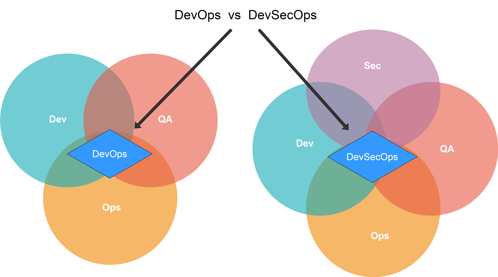

**Figura 23: DevOps vs DevSecOps. Concepto. Imagen Fuente (DevSecOps, 2021)**

**Referencia:** File:DevOps vs DevSecOps Mginise.jpg. (2021, November 29). Wikimedia Commons, the free media repository. Retrieved 21:45, February 23, 2022 from https://commons.wikimedia.org/w/index.php?title=File:DevOps_vs_DevSecOps_Mginise.jpg&oldid=610868212. 

Habiendo planteado los conceptos necesarios del marco teórico, se puede consolidar y analizar ahora el conjunto de actividades, fases y flujo de la metodología en su conjunto. En la Fig. 24 se puede observar las fases, etapas y el flujo continuo de integración y entrega:

- <mark style="background: #FFF3A3A6;">Dev</mark>: Plan, Develop, Build, Test, Releases.
- <mark style="background: #ADCCFFA6;">Ops</mark>: Deliver, Deploy, Operate, Monitor, Feedback.
- <mark style="background: #BBFABBA6;">Sec</mark>: Requirements Analysis, Secure Coding, SAST, WhiteBox DAST, BlackBox DAST, Digital Sign, Secure Transfer, Secure Config, Security Scan, Security Patch, Security Audit, Security Monitor, Security Analysis.

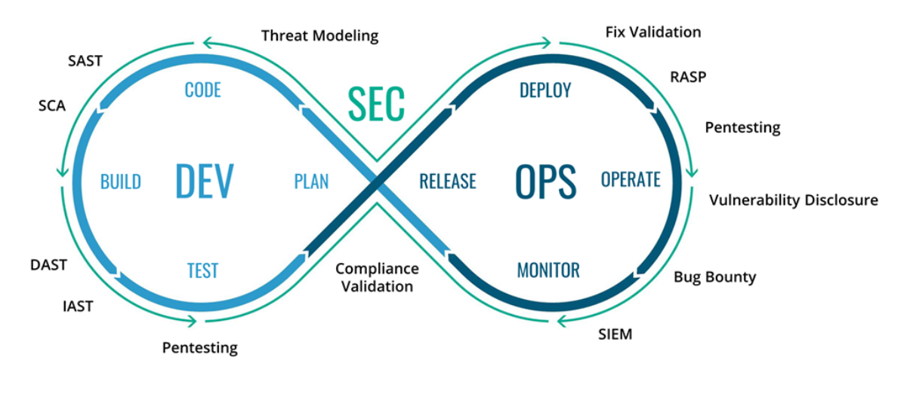

**Figura 24: DevSecOps: Etapas, Fases, Flujo. Imagen Fuente**

**Referencia:**  https://github.com/6mile/DevSecOps-Playbook  

Es evidente que tantas etapas de aseguramiento de calidad del producto serían extremadamente costosas y difíciles de implementar si no se emplea una estrategia de automatización que tenga en cuenta no solo la arquitectura del software, la infraestructura y el delivery, sino además las etapas de análisis, diseño y hasta la definición de requerimientos.

Finalmente, desde la estrategia de alto nivel hasta el modelado de los test unitarios de seguridad de un producto de software, puede verse el diseño como un concepto transversal.

---


# 3. Diseño

El concepto de diseño es muy amplio. En el presente trabajo se va a considerar el diseño no solo desde la perspectiva del desarrollo de código sino de todo el espectro de actividades asociadas al desarrollo de un producto, a saber:

- Diseño de la Arquitectura
- Diseño del flujo de trabajo de los equipos de QA, Dev, Sec y Ops.
- Diseño de la UX/UI de los usuarios
- Diseño de las Pruebas Funcionales
- Diseño de la Seguridad
- Diseño de la Documentación
- Diseño de la Infraestructura
- Diseño de los procesos de Soporte y Mantenimiento.

El diseño, según (Martin, 2011, 15) se puede definir como:


> Mucho se ha escrito sobre los principios y patrones de diseño de software que soportan estructuras que son flexibles y mantenibles.
> 
> Los desarrolladores de software memorizan estas cosas y se esfuerzan por adaptar su software a ellas. Pero hay un truco para esto que muy pocos desarrolladores de software siguen: si desean que su software sea flexible, ¡tiene que flexibilizarlo! La única forma de demostrar que su software es fácil de cambiar es que sea sencillo hacer cambios en él. Y cuando descubren que los cambios no son tan fáciles como se pensaba, entonces se debe refinar el diseño para que el próximo cambio sea más fácil.
> 
> Bob Martin


**Referencia:** Martin, R. C. (2011). The Clean Coder: A Code of Conduct for Professional Programmers. Prentice Hall. 

Como idea general que dará pie al resto del capítulo se plantea lo siguiente: <mark style="background: #FFF3A3A6;">un buen producto de software es aquel diseñado para cambiar, evolucionar, adaptarse a lo nuevo</mark>. De aquí la importancia de aplicar desde un inicio el diseño.


## 3.1 estrategias de Diseño


### 3.1.1 Gran Diseño Inicial (BDUF)

El diseño completo de un sistema (tanto el diseño de alto nivel como el de bajo nivel) (BDUF, 2020) se completa/aprueba antes de que comience la implementación. Esto es común en el modelo de cascada (<mark style="background: #FFF3A3A6;">waterfall</mark>), y así funciona en campos como la construcción (donde los diseños de arquitectura e ingeniería están completos casi en su totalidad antes de iniciar la etapa de construcción. Primero pasan por varias rondas de aprobación y luego los constructores ejecutan según el plan, y donde cualquier desviación es un error costoso. Con el diseño aprobado, los cambios tardíos se consideran "errores" en el análisis.

**Referencia:** Wikipedia contributors. (2020, December 29). Big Design Up Front. In Wikipedia, The Free Encyclopedia. Retrieved 13:00, February 28, 2022, from https://en.wikipedia.org/w/index.php?title=Big_Design_Up_Front&oldid=997072916


### 3.1.2 Diseño Preliminar Inicial (RDUF) y Diseño Emergente

Se realiza un diseño por adelantado (RDUF, 2020), <mark style="background: #ADCCFFA6;">muy liviano, lo suficiente</mark> como para ver el panorama general del sistema. Esto podría significar identificar casos de uso, dibujar el modelo de dominio, realizar un análisis de alto nivel con respecto a algunos conceptos importantes, pero no se profundiza en los detalles, sino que se trabaja de forma incremental (o emergente) a medida que se ofrecen funcionalidades específicas(Beck & Andres, 2004, 105). Por lo tanto, parte del diseño se realiza por adelantado, pero una mayor parte del diseño se posterga. Este enfoque se popularizó con las metodologías ágiles.

**Referencia:** Wikipedia contributors. (2020, December 29). Big Design Up Front. In Wikipedia, The Free Encyclopedia. Retrieved 13:00, February 28, 2022, from https://en.wikipedia.org/w/index.php?title=Big_Design_Up_Front&oldid=997072916

**Referencia:** Beck, K., & Andres, C. (2004). Extreme Programming Explained: Embrace Change. Pearson Education. 


### 3.1.3 Framework Cynefin 

El framework Cynefin (Cynefin, 2022) Fig. 25 establece que a medida que se pasa de "Simple" → "Complicado" → "Complejo" → "Caótico", la predictibilidad de un sistema disminuye. En el caso de los sistemas "simples", los requisitos y la implementación se conocen completamente de antemano y hay bajo riesgo, mientras que en los sistemas caóticos, los requisitos y la implementación no están bien definidos y están en constante estado de cambio.

**Referencia:** Wikipedia contributors. (2022, February 28). Cynefin framework. In Wikipedia, The Free Encyclopedia. Retrieved 13:04, February 28, 2022, from https://en.wikipedia.org/w/index.php?title=Cynefin_framework&oldid=1074421336

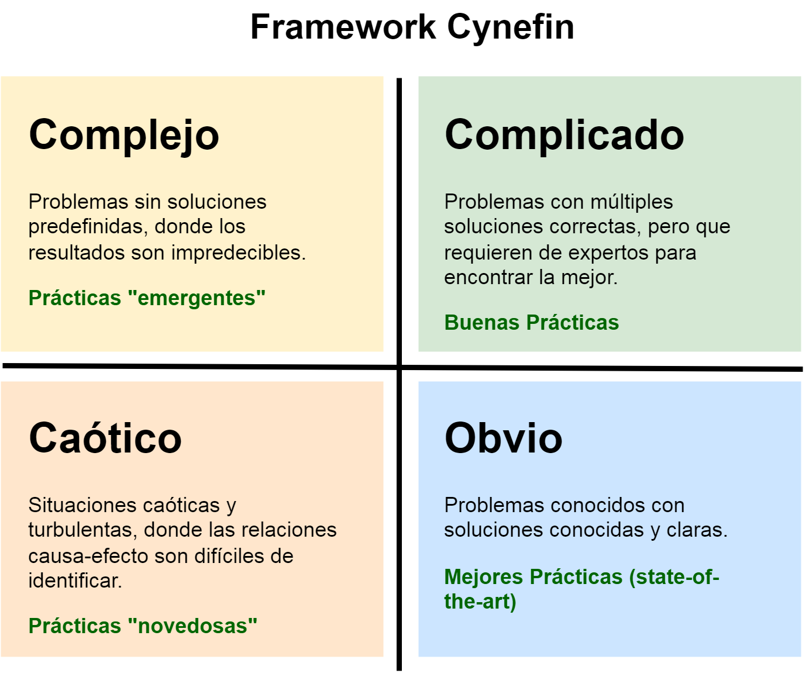

**Figura 25 Etapas del Framework Cynefin. Imagen Fuente (Cynefin, 2014)**


### 3.1.4 estrategia de Diseño óptimo y compensación de costo/beneficio

BDUF es adecuado para sistemas "Simples", pero a medida que se avanza hacia sistemas "Complejos", se tiene una mayor necesidad de enfoques de diseño más adaptables, como es el caso de RDUF y Diseño Emergente.

Para un conjunto dado de requisitos (el comportamiento deseado del sistema), existen múltiples estrategias de diseños posibles (la estructura del sistema) para satisfacer esos requisitos.
Los sistemas predecibles/estables permiten decisiones de diseño más detalladas por adelantado. En este caso, podemos decir que BDUF es más económico que RDUF. Los sistemas impredecibles/cambiantes dan como resultado un diseño inicial más pequeño y un diseño incremental/emergente más importante. En este caso, RDUF es más económico que BDUF.
En base a los conceptos planteados se propone aplicar una estrategia de “etapa ByDesign”, donde se especifica una lista de pasos a seguir como estrategia de diseño de cada una de las etapas:


1. Identificar las principales etapas o procesos en el desarrollo de un producto de software 🔍🛠️
2. Modelar cada etapa o proceso 🧩✏️ abstrayendo la esencia que la define y expresando esa abstracción con alguna representación de alto nivel: diagramas, flujos, pizarras, texto 📊📝, o sea, un diseño “liviano” (RDUF) 🎯.
3. Armar el flujo de etapas o procesos 🔄, como lo expresado en la Fig. 12: Arquitectura de Procesos de Alto Nivel 🏗️.
4. Identificar las Entradas y Salidas de cada etapa o proceso 📥📤, o sea, identificar sus interfaces, que eventualmente son los canales de comunicación 📡 y los artefactos son el mensaje que se comunica ✉️.
5. Refinar a un nivel de detalle razonable (costo/beneficio) cada etapa o proceso identificado ⚖️, por ejemplo: QA 🛡️, Dev 💻, Sec 🔐 y Ops ⚙️.


## 3.2. QA ByDesign

QA ByDesign o QA basado en modelos (Model-Based QA, 2021) es la aplicación de diseño basado en modelos para diseñar y, opcionalmente, también ejecutar, artefactos para realizar pruebas de software o pruebas de sistemas. Los modelos se pueden usar para representar el comportamiento deseado de un sistema bajo prueba (DUT/SUT) o para representar estrategias de prueba y los entornos de prueba. En la Fig. 26 se muestra un flujo completo desde el modelo a probar y los requerimientos, hasta los resultados.

**Referencia:** Wikipedia contributors. (2021, November 21). Model-based testing. In Wikipedia, The Free Encyclopedia. Retrieved 22:05, March 2, 2022, from https://en.wikipedia.org/w/index.php?title=Model-based_testing&oldid=1056315691 


### 3.2.1 Modelado de Procesos y Artefactos

Se puede pensar en el modelado de QA como en el modelado de los componentes de un sistema de software, pero en lugar de modelar “componentes funcionales”, se modelan los “componentes para probar la funcionalidad” de un sistema de software. El modelo representa no solo los elementos necesarios para entender el esquema de QA sino las interfaces, conexiones y resultados de la instancia de un flujo de ejecución de pruebas.

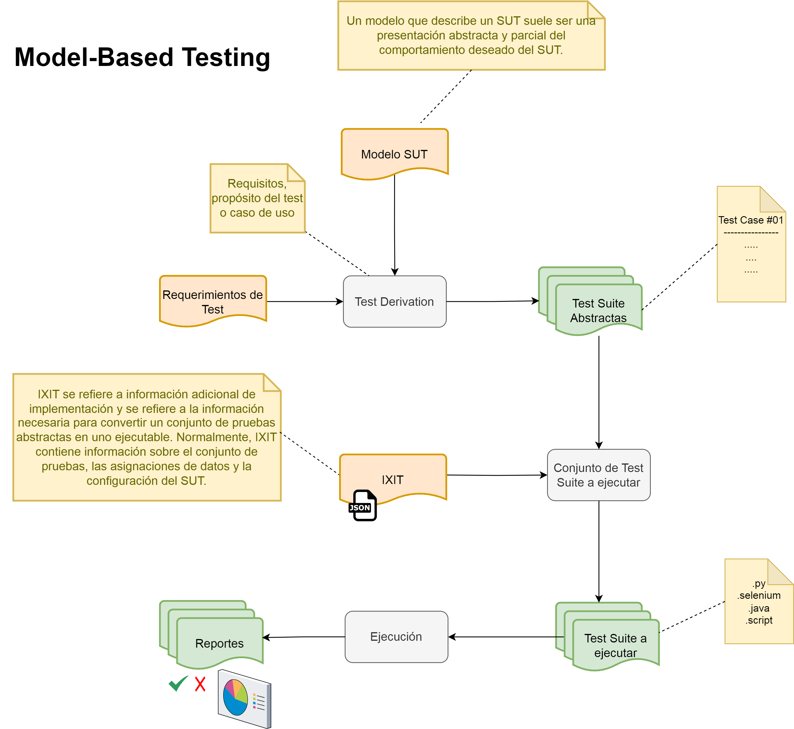

**Figura 26: Flujo de trabajo de QA basado en modelos. Imagen Fuente((Model-Based QA, 2021)**


### 3.2.2 Patrones de Testing

El modelado de los aspectos de QA desde un inicio tiene varios beneficios pero a su vez es una tarea difícil y poco común en la industria en general. Es por eso que es conveniente basarse en framework y patrones de pruebas para acelerar la implementación. Un ejemplo que puede ayudar son los XUnit Test Patterns. (Meszaros, 2007, 7,19,21, 40), donde el autor expresa una forma estándar de diseñar las pruebas (Fig. 27), basadas en 4 fases:

**Referencia:** Meszaros, G. (2007). XUnit Test Patterns: Refactoring Test Code (1st ed.). Addison-Wesley. 

1. Fixture setup
2. Exercise SUT
3. Result verification
4. Fixture teardown


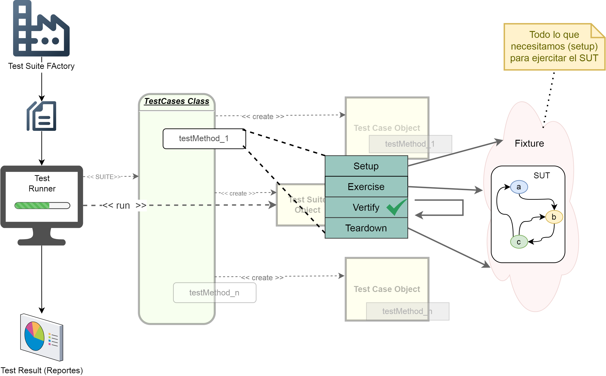
**Figura 27: xUnit Four-Phase Test Pattern.**

**Referencia:** [Four Phase Test at XUnitPatterns.com](http://xunitpatterns.com/Four%20Phase%20Test.html)


#### 3.2.2.1 Deep-Dive en el esquema de Testing

Ahora vamos a repasar brevemente cada parte de éste esquema de testing propuesto:

1. **Test Suite Factory** 🏭 : Representa el punto de partida para la generación de pruebas. Este componente es responsable de crear las clases de pruebas (**TestCases Class**) que contienen los métodos de prueba necesarios.
2. **TestCases Class** 📂  :Esta clase contiene los métodos de prueba, como `testMethod_1`, `testMethod_n`, que serán ejecutados dentro de la suite de pruebas. Cada método se enfoca en verificar una funcionalidad específica del sistema bajo prueba (**SUT**).   
3. **Test Case Object** 🧪 : Los métodos de prueba se instancian como objetos individuales, representando casos de prueba independientes. Cada objeto sigue un ciclo estándar de ejecución conocido como **Setup-Exercise-Verify-Teardown**:
    - **Setup**: Configuración necesaria para preparar el entorno y los datos requeridos por el caso de prueba.
    - **Exercise**: Ejecución del comportamiento o funcionalidad del SUT que se quiere verificar.
    - **Verify**: Comprobación de que el resultado es el esperado (criterio de éxito) usando "aserciones".
    - **Teardown**: Limpieza del entorno después de la prueba para garantizar que no afecte a otras pruebas.
4. **Test Suite Object** 🛠️  : Agrupa múltiples casos de prueba y permite ejecutarlos de manera estructurada. Esto facilita la ejecución de un conjunto completo de pruebas, asegurando cobertura en diferentes aspectos del SUT.
5. **Fixture** 🎯  : Representa el conjunto de elementos necesarios para ejecutar el **SUT** (System Under Test). Esto incluye:
    - Datos específicos.
    - Dependencias como bases de datos, servicios externos o archivos.
    - Configuraciones particulares.
6. **SUT (System Under Test)** 🔄 : El sistema o componente que se está verificando. La interacción entre los casos de prueba y el SUT se realiza mediante el patrón Fixture. 
7. **Resultados** 📊  : Una vez ejecutadas las pruebas, los resultados se recopilan y analizan. Esto incluye reportes y métricas que ayudan a determinar la calidad del software y la efectividad de los tests.


#### 3.2.2.2 Características y Beneficios

1. **Estandarización y Consistencia**: La estructura xUnit proporciona un marco estandarizado para escribir y ejecutar pruebas, reduciendo la probabilidad de errores humanos y garantizando consistencia.
2. **Modularidad y Reutilización**: Componentes como **TestCases Class** y **Fixtures** permiten definir pruebas independientes y reutilizables, lo cual es fundamental para mantener un conjunto de pruebas eficiente y manejable.
3. **Aislamiento del SUT** : El uso de Fixtures asegura que las pruebas no dependan de condiciones externas, aislando correctamente el SUT para obtener resultados confiables.
4. **Ciclo de vida del caso de prueba** : La estructura Setup-Exercise-Verify-Teardown garantiza que cada prueba sea autónoma, reduciendo las dependencias entre casos de prueba.    
5. **Escalabilidad** : La inclusión del **Test Suite Object** permite escalar la estrategia de pruebas al integrar grandes conjuntos de pruebas, gestionándolos de manera organizada.
6. **Automatización**  Este patrón hace posible ejecutar pruebas de regresión y liberar a los equipos de tareas repetitivas.


## 3.3 Dev byDesign

Quizás la etapa más conocida, documentada y discutida en el área de la Ingeniería de Software. Dado que el diseño de software es un área amplia, solo se listarán recomendaciones y herramientas o técnicas que se deben evaluar como parte de la implementación de la metodología DevSecOps y que son fundamentales desde la visión de QA:

- <mark style="background: #FFF3A3A6;">Modelado de la arquitectura del sistema</mark> o SAD (Carnegie Mellon University, 2016)
- Registro de decisiones de arquitectura o ADRs (GitHub, Inc., 2021)
- Modelado gráfico con herramientas: UML, C4 (Brown & Betts, 2018), 4+1 (Kruchten,2021)
- Consideración de <mark style="background: #ADCCFFA6;">atributos de calidad</mark> (Wiggins, 2017)
- Aplicación de Domain-Driven Design ó DDD (Evans & Evans, 2004)
- Modelado gráfico usando Diagrams-As-Code

**Referencias:**:
**Carnegie Mellon University. (2016, December 23). Confluence Mobile - Confluence. Confluence Mobile - Confluence. Retrieved March 2, 2022, from [https://wiki.sei.cmu.edu/confluence/display/SAD/Main+Page](https://wiki.sei.cmu.edu/confluence/display/SAD/Main+Page)**

**GitHub, Inc. (2021, July 12). Architectural Decision Records. Architectural Decision Records adr.github.io. Retrieved March 2, 2022, from [https://adr.github.io/](https://adr.github.io/)**

**Brown, S., & Betts, T. (2018, June 25). The C4 Model for Software Architecture. InfoQ. Retrieved February 23, 2022, from [https://www.infoq.com/articles/C4-architecture-model/](https://www.infoq.com/articles/C4-architecture-model/)**

**Wiggins, A. (2017). The twelve-factor App Methodology. The Twelve-Factor App. Retrieved March 2, 2022, from [https://12factor.net/](https://12factor.net/)**

**Evans, E. J., & Evans, E. (2004). Domain-driven design. Addison-Wesley.**


### 3.3.1 Modelado de Arquitectura usando C4model

La Fig. 28 muestra un ejemplo del modelado gráfico de un sistema de software de alto nivel utilizando la técnica C4, donde se puede observar cómo se van explotando los distintos niveles de abstracción, desde el nivel 1 (más abstracto y de alto nivel) hasta el nivel 4 (nivel de código). Este último nivel no es recomendado por el autor, dada la complejidad y el costo/beneficio de llegar a dicho nivel.

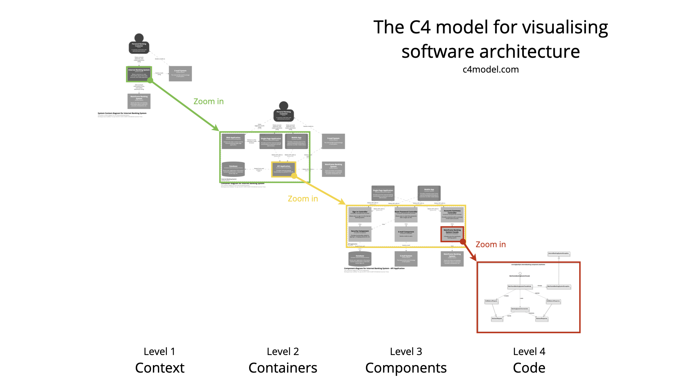
**Figura 28: Modelado de Arquitectura con C4. Imagen Fuente (C4 Model, 2022) (Brown & Betts, 2018)**

**Referencias:**
**Wikipedia contributors. (2022, February 20). C4 model. In Wikipedia, The Free Encyclopedia. Retrieved 22:36, February 23, 2022, from [https://en.wikipedia.org/w/index.php?title=C4_model&oldid=1073034709](https://en.wikipedia.org/w/index.php?title=C4_model&oldid=1073034709)**

**Brown, S., & Betts, T. (2018, June 25). The C4 Model for Software Architecture. InfoQ. Retrieved February 23, 2022, from [https://www.infoq.com/articles/C4-architecture-model/](https://www.infoq.com/articles/C4-architecture-model/)**


### 3.3.2 Flujo de desarrollo usando GitFlow

Un aspecto muy importante del diseño en el desarrollo y que no está explícitamente ligado al diseño funcional, es el planteo del flujo de desarrollo. Si bien, en primera instancia pareciera no haber una relación aparente, es crucial que se diseñe el flujo de desarrollo considerando la perspectiva del código fuente. Una estrategia posible es utilizar Git Flow ([Driessen, 2010](https://docs.google.com/document/d/1AxZIkA2CJaisXTidKar3Qqg25c_oKFpEne6D-QvPxGE/edit#bookmark=id.lw3buhob00yg)), como se muestra en la Fig. 29:

**Referencia:** Driessen, V. (2010, January 5). A successful Git branching model » nvie.com. nvie.com. Retrieved March 23, 2022, from [https://nvie.com/posts/a-successful-git-branching-model/](https://nvie.com/posts/a-successful-git-branching-model/)


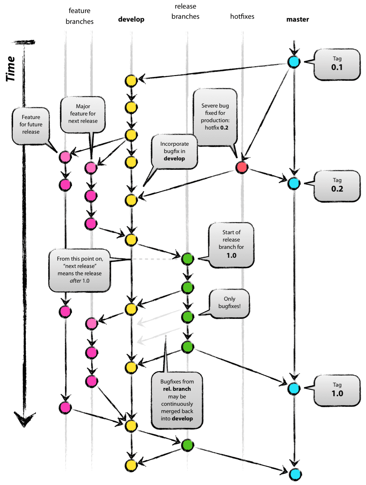
**Figura 29: Git Flow. Imagen Fuente (Driessen, 2010)**

DevSecOps y sobre todo QA requieren que las bases del producto de software, por ejemplo los repositorios de código, estén ordenados, prolijos y sobre todo utilicen un modelado de uso (Fowler, 2020), o flujo de trabajo, claro y estándar.

**Referencias:**  **Fowler, M. (2020, 05 28). Patterns for Managing Source Code Branches. Martin Fowler. Retrieved March 29, 2022, from [https://martinfowler.com/articles/branching-patterns.html](https://martinfowler.com/articles/branching-patterns.html)**


## 3.4 Sec byDesign


Generalmente, los aspectos de seguridad no son considerados en fases iniciales de los productos de software o no son implementados durante el desarrollo. Tampoco es normal en la mayoría de los casos que se considere el “diseño” o el modelado de la “arquitectura de seguridad” desde un inicio.

La fundación OWASP promueve para el diseño seguro (Sec ByDesign) un modelo de madurez: SAMM, el cual proporciona las bases para implementar un diseño seguro desde el comienzo de desarrollo de un sistema de software, o en todo caso, aplicar el modelo a un producto ya existente. En la Fig. 30 se listan para cada etapa del desarrollo (o SDLC) las prácticas de seguridad que se pueden aplicar.


| **Gobernanza**           | **Diseño**                | **Implementación**  | **Verificación**              | **Operaciones**       |
| ------------------------ | ------------------------- | ------------------- | ----------------------------- | --------------------- |
| Estrategia y Métricas    | Evaluación de Amenazas    | Construcción Segura | Evaluación de Arquitectura    | Gestión de Incidentes |
| Políticas y Cumplimiento | Requisitos de Seguridad   | Despliegue Seguro   | Pruebas basadas en Requisitos | Gestión del Entorno   |
| Educación y Orientación  | Arquitectura de Seguridad | Gestión de Defectos | Pruebas de Seguridad          | Gestión Operacional   |

**Figura 30: Modelo de Madurez SAMM. Imagen Fuente (SAMM OWASP® Foundation, 2021)**

**Referencia** SAMM OWASP® Foundation. (2021). The Model logo. OWASP SAMM. Retrieved March 3, 2022, from https://owaspsamm.org/model/ 

Desde el punto de vista del diseño se especifican 3 prácticas esenciales (que son las que vamos a tomar como foco por el momento):

1. Threat Assessment (implementando Threat Modeling)
2. Requerimientos de Seguridad
3. Arquitectura de Seguridad (modeling)

En los casos donde fuera posible pensar y modelar la seguridad desde etapas tempranas, se proponen las siguientes técnicas y herramientas para ser aplicadas.


### 3.4.1 Threat Assessment / Threat Modeling

El modelado de amenazas o Threat Modeling (Threat Model, Inc, 2021) (Shevchenko et al., 2018) es un enfoque estructurado para identificar y priorizar amenazas potenciales a un sistema y determinar el valor que tendrían las mitigaciones para reducir o neutralizar esas amenazas. Este concepto proviene de conceptos que se han aplicado en aspectos militares. Un modelo de amenaza se desarrolla y es único para cada sistema.

La Fig. 31 es un ejemplo de modelado de amenazas utilizado la notación gráfica C4 (Spilsbury, 2020) y anotando gráficamente las amenazas usando el esquema STRIDE (STRIDE, 2021) en combinación con uno menos conocido denominado LINDDUN (DistriNet Research Group, 2020). STRIDE representa los siguientes aspectos:

| Amenaza (Threat)                                                                           | Propiedad o Acción a aplicar                                                                    |
| ------------------------------------------------------------------------------------------ | ----------------------------------------------------------------------------------------------- |
| Spoofing: Robo de identidad, falsear.                                                      | Autenticidad, validar identidad u origen.                                                       |
| Tampering: Modificación de datos sin autorización                                          | Validar integridad, confiabilidad.                                                              |
| Repudiation: No poder asegurar autoría de algo.                                            | Non-Repudiability o desafiar todo los medios de autenticación hasta llegar a una conclusión.    |
| Information Disclosure: Difundir información sin autorización.                             | Asegurar confidencialidad, controles de accesos, permisos, fugas de información no autorizadas. |
| Denial of Service: sobrecarga de un sistema hasta colapsar.                                | Asegurar disponibilidad, controlar situaciones anormales, validar operaciones.                  |
| Elevation of Privilege: obtener credenciales de acceso a datos y operaciones restringidas. | Implementar mecanismos de Autorización, validación de identidad, privilegios y Roles.           |

**Referencias:**

**OWASP Foundation, Inc. (2021). Threat Modeling Cheat Sheet. OWASP Cheat Sheet Series. Retrieved March 3, 2022, from [https://cheatsheetseries.owasp.org/cheatsheets/Threat_Modeling_Cheat_Sheet.html](https://cheatsheetseries.owasp.org/cheatsheets/Threat_Modeling_Cheat_Sheet.html)**

 **Shevchenko, N., Chick, T. A., O’Riordan, P., Scanlon, T. P., & Woody, C. (2018, July). Threat Modeling: A Summary of Available Methods. SEI Digital Library. Retrieved March 3, 2022, from [https://resources.sei.cmu.edu/library/asset-view.cfm?assetID=524448](https://resources.sei.cmu.edu/library/asset-view.cfm?assetID=524448)**

**Spilsbury, D. (2020, April 29). C4 threat modeling this website. DanspilS. Retrieved March 3, 2022, from [Threat modelling this (old) website :: Daniel Spilsbury](https://daniel.spilsbury.uk/posts/threat_modelling_website/))**

**Wikipedia contributors. (2021, November 10). STRIDE (security). In Wikipedia, The Free Encyclopedia. Retrieved 22:18, March 3, 2022, from [STRIDE model - Wikipedia](https://en.wikipedia.org/wiki/STRIDE_model)

**DistriNet Research Group. (2020). Systematic elicitation and mitigation of privacy threats in software systems. LINDDUN: HOME. Retrieved March 3, 2022, from [https://www.linddun.org/](https://www.linddun.org/)**

El siguiente ejemplo es un diagrama de arquitectura de un sitio web, usando el modelado C4Model y agregando notaciones adicionales para identificar amenazas (STRIDE + LIDU) y luego registrar los riesgos asociados (Rn).

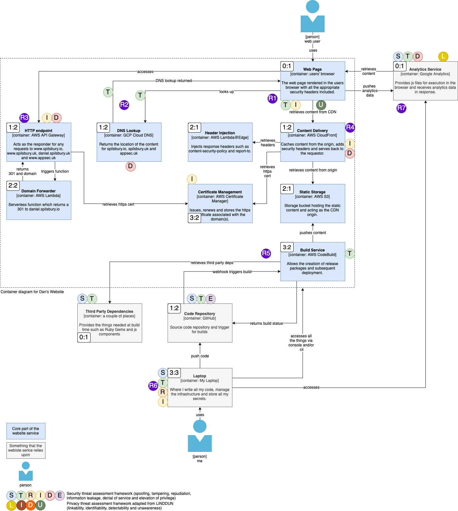
**Figura 31: Threat Model usando Diagrama C4. Imagen Fuente (Spilsbury, 2020)**

Luego, este diagrama se traduce a una tabla de Riesgos y mitigaciones que deberán aplicarse o tenerse en cuenta en la arquitectura:

|Riesgo (ID)|Descripción|Mitigación|
|---|---|---|
|R1|La página web se renderiza en el navegador del usuario, que es un entorno no confiable. Otro código malicioso podría ejecutarse en ese mismo entorno e interferir o robar datos de mi aplicación.|Implementar **Content Security Policy (CSP)** para restringir qué scripts se pueden cargar y ejecutar. Usar sanitización de entrada y técnicas de protección XSS.|
|R2|El DNS no es seguro, ya que los datos están en texto plano y podrían ser suplantados o modificados, redirigiendo al usuario a un punto final malicioso.|Usar **DNS sobre HTTPS (DoH)** o **DNSSEC** para asegurar la comunicación DNS. Configurar TLS para garantizar que las conexiones sean seguras.|
|R3|El endpoint HTTP podría estar sujeto a ataques volumétricos (DDoS), lo que lo dejaría inoperativo y, más importante, generaría costos adicionales.|Usar servicios de mitigación de **DDoS** como AWS Shield o Cloudflare. Implementar balanceo de carga y monitoreo para detectar picos inusuales de tráfico.|
|R4|Mi sitio web se sirve desde un CDN, que podría estar sujeto a ataques volumétricos (DDoS), dejando el servicio inoperativo o generando costos adicionales.|Configurar reglas de mitigación de DDoS a nivel de CDN. Activar sistemas de límite de tasa y priorizar el tráfico legítimo.|
|R5|El servicio de compilación descarga muchas dependencias de terceros al construir mi sitio. Cualquiera de estas podría contener código malicioso que termine sirviendo a los usuarios.|Usar un análisis de seguridad de dependencias como **OWASP Dependency-Check** o herramientas como **Snyk**. Implementar revisión manual de dependencias críticas.|
|R6|Si pierdo mi laptop, todas mis claves de acceso y contraseñas se perderán con ella, y todo mi sitio podría ser comprometido.|Usar un **gestor de contraseñas seguro** para almacenar las claves. Configurar autenticación multifactor (MFA) y deshabilitar claves comprometidas inmediatamente.|
|R7|Existen riesgos al cargar scripts de terceros durante la carga de la página, y también porque Google recopila una gran cantidad de datos analíticos de los usuarios.|Cargar scripts de terceros mediante un dominio confiable y asegurado con **CSP**. Usar alternativas de análisis menos invasivas como Matomo para evitar la exposición de datos.|


### 3.4.2 Requerimientos de Seguridad

El objetivo de definir los requerimientos de seguridad es la comprensión, análisis, y especificación de los requisitos claves de seguridad para el desarrollo y puesta en operación de un sistema de software, de manera tal que se puedan alinear con otros tipos de requisitos del producto. 

Se proponen los siguientes pasos para la elicitación, especificación y modelado de los requerimientos de seguridad, según (Mead et al., 2006):

1. Acuerdo de definiciones de términos y conceptos
2. Identificación de los Objetivos de Seguridad
3. Desarrollo de Artefactos (Diagramas, Casos de Uso, Escenario, Árboles de Ataque Fig. 32 y Fig. 33, Templates)
4. Realizar un Assessment de Riesgos (ver técnica: Risk-Storming).
5. Selección de método/técnica de elicitación
6. Elicitación de requerimientos de seguridad [ver Fig. 34]
7. Categorización de requerimientos
8. Priorización de requerimientos
9. Inspección de los requerimientos


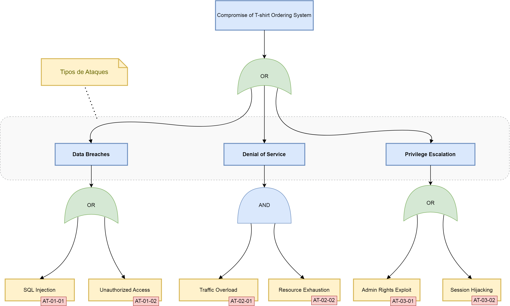
**Figura 32: Ejemplo de Árbol de Ataque. Imagen Fuente (Mead et al., 2006)**

**Referencia:** Mead, N. R., Hough, E. D., & Stehney II, T. R. (2006, January 30). SQUARE Process CISA. US-CERT. Retrieved March 3, 2022, from https://www.cisa.gov/uscert/bsi/articles/best-practices/requirements-engineering/square-process 

Del análisis del árbol de ataque, se deben describir y listar cada uno de los ejemplos de ataque que se puedan tener en cuenta y se deberá además agregar las posibles mitigaciones que se podrían aplicar a cada caso.

El análisis y diseño inicial sirven para luego definir los "requerimientos de seguridad".

| Identificador del Ataque | Ejemplo de Ataque                                                                                                 | Id Mitigación | Mitigación                                                                                  |
| ------------------------ | ----------------------------------------------------------------------------------------------------------------- | ------------- | ------------------------------------------------------------------------------------------- |
| AT-1-1                   | **Inyección SQL**: Modificación de consultas SQL para acceder o destruir datos.                                   | RM-01         | Implementar consultas parametrizadas y usar validación de entrada en el servidor.           |
| AT-1-2                   | **Acceso no autorizado**: Uso de credenciales robadas para entrar al sistema.                                     | RM-02         | Implementar autenticación multifactor (MFA) y sistemas de detección de accesos sospechosos. |
| AT-2-1                   | **Sobrecarga de tráfico**: Ataques DDoS para saturar el servidor.                                                 | RM-03         | Usar servicios de mitigación de DDoS como Cloudflare o AWS Shield y balanceo de carga.      |
| AT-2-2                   | **Exhaustión de recursos**: Creación de múltiples solicitudes para agotar memoria o CPU.                          | RM-04         | Establecer límites de recursos en el servidor y usar "Rate Limiting".                       |
| AT-3-1                   | **Explotación de privilegios de administrador**: Elevación de privilegios para modificar datos o configuraciones. | RM-05         | Implementar separación de privilegios y auditorías regulares de permisos.                   |
| AT-3-2                   | **Secuestro de sesión**: Interceptación de cookies de sesión para suplantar usuarios.                             | RM-06         | Usar cookies seguras (Secure y HttpOnly), TLS, y rotación frecuente de tokens de sesión.    |

De la tabla anterior surgen la siguiente liste de Requerimientos de seguridad. Es importante notar que cada requerimiento puede estar mapeado a 1 o más ataques analizados.

| Identificador de Requerimiento | Requerimiento de Seguridad                                                               | Trazabilidad (Ataques Mitigados) |
| ------------------------------ | ---------------------------------------------------------------------------------------- | -------------------------------- |
| SR-01                          | Validar todas las entradas del usuario para evitar inyecciones de código y manipulación. | AT-1-1                           |
| SR-02                          | Implementar consultas parametrizadas en todas las interacciones con bases de datos.      | AT-1-1                           |
| SR-03                          | Configurar autenticación multifactor (MFA) para todas las cuentas de usuario.            | AT-1-2                           |
| SR-04                          | Usar sistemas de detección de accesos sospechosos y alertas en tiempo real.              | AT-1-2                           |
| SR-05                          | Establecer límites de tasa (Rate Limiting) para prevenir ataques volumétricos.           | AT-2-1, AT-2-2                   |
| SR-06                          | Implementar balanceo de carga para manejar altos volúmenes de tráfico.                   | AT-2-1                           |
| SR-07                          | Configurar límites de recursos del servidor (memoria, CPU, conexiones).                  | AT-2-2                           |
| SR-08                          | Asegurar la separación de privilegios entre usuarios y roles administrativos.            | AT-3-1                           |
| SR-09                          | Realizar auditorías regulares de permisos para detectar configuraciones inseguras.       | AT-3-1                           |
| SR-10                          | Usar cookies seguras con atributos Secure y HttpOnly para proteger sesiones.             | AT-3-2                           |
| SR-11                          | Implementar comunicación segura mediante TLS (HTTPS) en todas las transacciones.         | AT-3-2                           |
| SR-12                          | Rotar tokens de sesión frecuentemente para reducir riesgos de secuestro de sesión.       | AT-3-2                           |


### 3.4.3 Arquitectura de Seguridad: Modelado y Patrones

Al igual que se desarrolla y modela la arquitectura funcional y no funcional del producto de software, se debe realizar un trabajo similar desde el punto de vista de la seguridad, realizando lo que se conoce como Architectural Analysis for Security o AAFS (Ryoo, 2020).

**Referencia:** Ryoo, J. (2020, 07 08). Developing Secure Software. Architectural analysis for security. https://www.linkedin.com/learning/developing-secure-software/architectural-analysis-for-security?autoplay=true&resume=false 

En la Fig. 35 cada nivel representa amenazas de seguridad, por lo tanto, para cada nivel se deben aplicar técnicas de arquitectura para mitigar esas posibles amenazas.

|Grado de la amenaza | Nivel de aquitectura|
|---|---|
| Alto Nivel (diseño) | Diseño de Arquitectura |
| Nivel Medio         | Diseño detallado       |
| Bajo nivel          | Código                 |
| Muy Bajo Nivel      | Hardware               |

**Figura 35: Niveles de Diseño de Seguridad**

Los puntos de interés donde el modelado de la arquitectura de seguridad es relevante se pueden resumir en las siguientes 6 etapas, como se muestra en la Fig. 36:

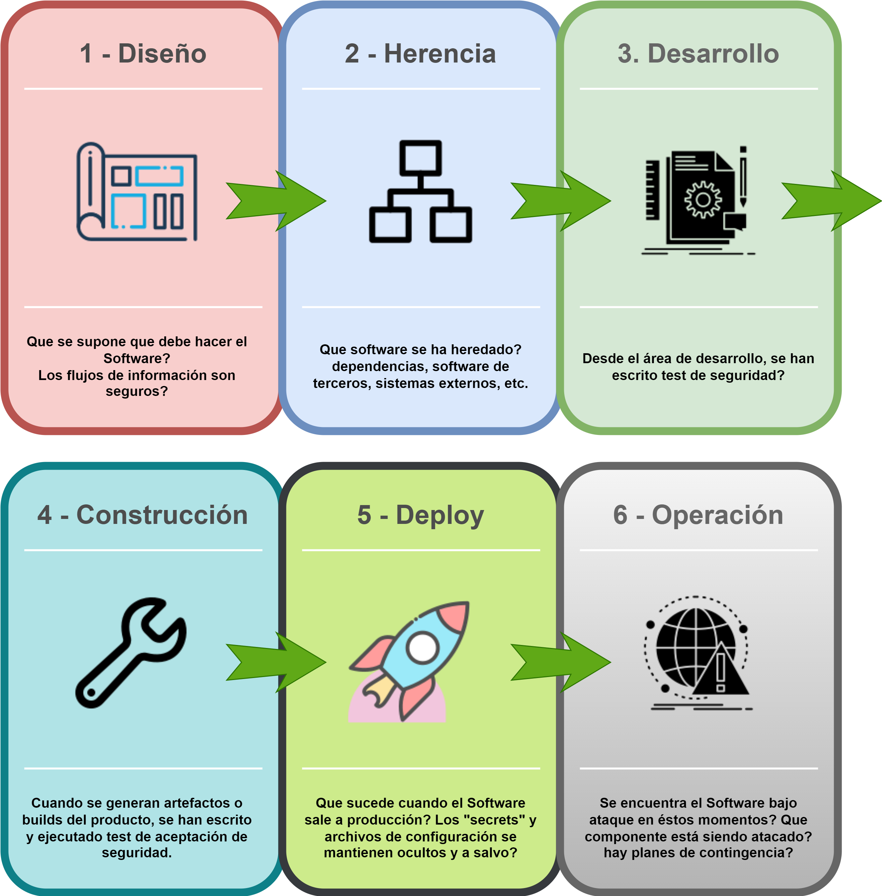
**Figura 36: Aspectos de Interés para el modelado de Arquitectura Segura de Software. Imagen Fuente (Ryoo, 2020)**

**Referencia:** Ryoo, J. (2020, 07 08). Developing Secure Software. Architectural analysis for security. https://www.linkedin.com/learning/developing-secure-software/architectural-analysis-for-security?autoplay=true&resume=false 


Teniendo en cuenta las etapas del ciclo de desarrollo, para el diseño de la arquitectura se pueden usar 3 técnicas que se pueden complementar:

- <mark style="background: #FFF3A3A6;">ToAA: Tactic-Oriented Architecture Analysis</mark>. Se realiza con interacción entre el arquitecto de software y los expertos del dominio del negocio. Se usan tácticas de identificación de vulnerabilidades a través de una interacción y feedback.
- <mark style="background: #FFF3A3A6;">PoAA: Pattern-Oriented Architecture Analysis</mark>. Al igual que sucede con los patrones de diseño y patrones de Arquitectura, al identificar escenario/problemas durante la etapa de ToAA, surgen lo que se conoce como patrones de seguridad (Security Pattern, 2020), por ejemplo el patrón de seguridad Interceptor-Validator que se muestra en la Fig. 37.
- <mark style="background: #FFF3A3A6;">VoAA: Vulnerability-Oriented Architecture Analysis</mark>. Es la etapa de más bajo nivel, se analizan las vulnerabilidades en el código y en el producto a nivel interno.

**Referencia:** Wikipedia contributors. (2020, April 20). Security pattern. In Wikipedia, The Free Encyclopedia. Retrieved 22:33, February 23, 2022, from https://en.wikipedia.org/w/index.php?title=Security_pattern&oldid=952064080 


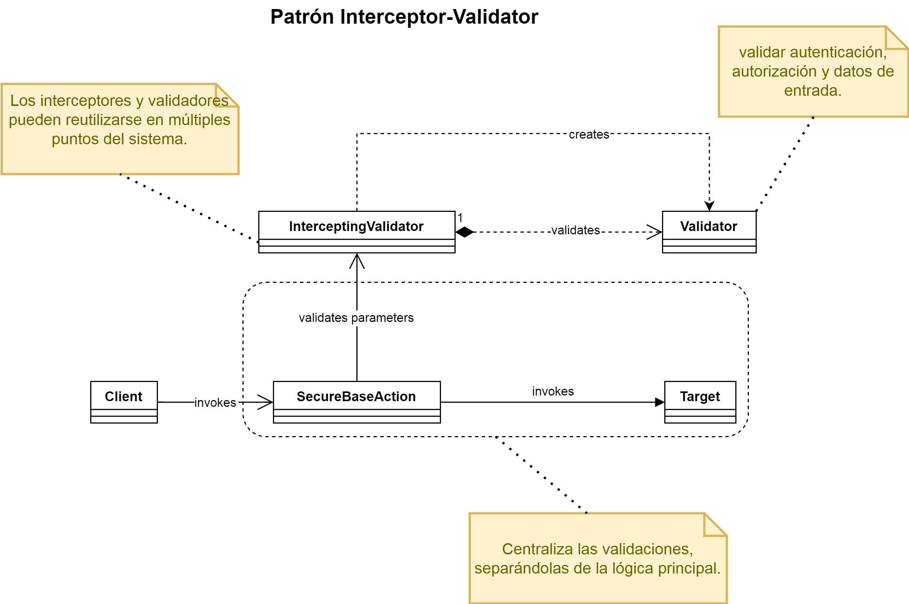
**Figura 37: Interceptor-Validator Patrón de seguridad. Imagen Fuente (Security Pattern, 2020)**

El patrón **Interceptor-Validator** se utiliza para agregar una capa de validación y procesamiento previo a las solicitudes en un sistema, interceptándolas antes de que lleguen a su destino (recurso protegido o funcionalidad). Su uso promueve:

- **Seguridad**: Permite validar autenticación, autorización y datos de entrada.
- **Modularidad**: Centraliza las validaciones, separándolas de la lógica principal.
- **Reusabilidad**: Los interceptores y validadores pueden reutilizarse en múltiples puntos del sistema.

Este tipo de patrón es útil para aplicar en los siguiente escenarios:

- En aplicaciones web para validar solicitudes HTTP antes de procesarlas.
- En sistemas que manejan recursos sensibles o críticas de negocio, como APIs o microservicios.
- En arquitecturas que requieren una validación uniforme y centralizada para mantener consistencia y reducir errores.

Básicamente, este patrón es ideal para asegurar que solo las solicitudes válidas y autorizadas lleguen a los componentes críticos del sistema.


### 3.4.4 Metodología de Testing de seguridad

En el mundo de la seguridad, se han desarrollado una variedad de tipos de pruebas de seguridad que se complementan con el SDLC y con el STLC. En la Fig. 38 se pueden apreciar las distintas etapas del ciclo de desarrollo y pruebas de software. En el centro, se mencionan los principales tipos de pruebas de seguridad (SSecLC) posibles para implementar una estrategia de seguridad complementaría al flujo de desarrollo estándar.

Referencia web: https://safestack.io/blog/app-sec/secure-development-bringing-security-testing-into-your-sdlc


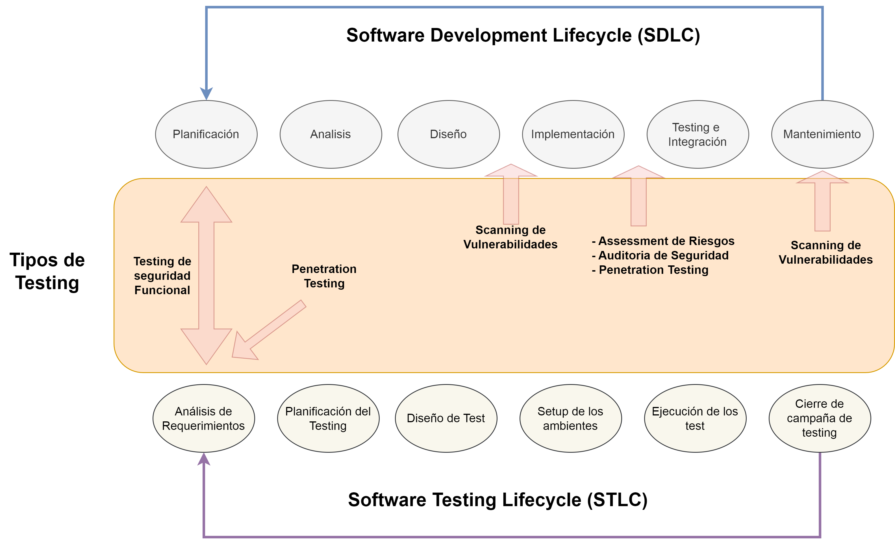
**Figura 38. SDLC, STLC y SSecLC.**


### 3.4.5 Static application security testing o SAST

A SAST se lo conoce como prueba de “caja blanca”, lo que significa que se prueba el sistema desde adentro en lugar de intentar probarlo desde una perspectiva externa o en ejecución. Generalmente en tiempo de desarrollo se pueden utilizar herramientas para análisis estático de código fuente.

El siguiente ejemplo de código es una muestra de como se puede ejecutar un análisis estático usado herramientas como **SonarQube**:

```java

import java.sql.Connection;
import java.sql.DriverManager;
import java.sql.ResultSet;
import java.sql.Statement;

public class UserDAO {
    private static final String DB_URL = "jdbc:mysql://localhost:3306/mydatabase";
    private static final String DB_USER = "root";
    private static final String DB_PASSWORD = "password";

    public boolean authenticateUser(String username, String password) {
        Connection connection = null;
        Statement statement = null;
        ResultSet resultSet = null;

        try {
            connection = DriverManager.getConnection(DB_URL, DB_USER, DB_PASSWORD);

            // Crear una consulta SQL dinámica (peligrosa)
            String query = "SELECT * FROM users WHERE username = '" + username + "' AND password = '" + password + "'";

            statement = connection.createStatement();
            resultSet = statement.executeQuery(query);
            return resultSet.next();

        } catch (Exception e) {
            e.printStackTrace();
            return false;
        } finally {
            try {
                if (resultSet != null) resultSet.close();
                if (statement != null) statement.close();
                if (connection != null) connection.close();
            } catch (Exception e) {
                e.printStackTrace();
            }
        }
    }
}


```

En este caso, luego de ejecutar SonarQube sobre el proyecto donde se encuentra ésta clase, se genera el siguiente reporte de alerta:

#### **Resumen General**

- Líneas de código analizadas: 10,000
- Vulnerabilidades encontradas: **5**
- Código duplicado: 3%
- Cobertura de pruebas: 80%

#### **Vulnerabilidades Detectadas**

| Tipo de Vulnerabilidad | Severidad | Ubicación                    | Descripción                                                                         | Solución Recomendada                      |
| ---------------------- | --------- | ---------------------------- | ----------------------------------------------------------------------------------- | ----------------------------------------- |
| Inyección SQL          | Crítica   | `UserDAO.java:45`            | Uso de `Statement` para construir consultas SQL con datos no validados del usuario. | Usar `PreparedStatement` con parámetros.  |
| Exposición de datos    | Alta      | `AuthService.java:110`       | Almacén de contraseñas no cifradas en el sistema de archivos.                       | Implementar hashing con `BCrypt`.         |
| Validación de entradas | Media     | `RegisterController.java:22` | Faltan validaciones de entrada en el formulario de registro.                        | Validar y sanitizar entradas del usuario. |

Pero cual es el problema? Resulta que al utilizar `Statement` para ejecutar la query se puede realizar una inyección SQL. Un atacante podría pasar los siguientes valores como entrada:

- `username: ' OR '1'='1`
- `password: anything`

Esto generaría una consulta SQL como esta:

```SQL

SELECT * FROM users WHERE username = '' OR '1'='1' AND password = 'anything';

/*
La condición `OR '1'='1'` siempre se evalúa como verdadera, permitiendo el acceso sin credenciales válidas.
*/
```

La solución es reemplazar el uso del método `Statement por `PreparedStatement:

```java 

import java.sql.Connection;
import java.sql.DriverManager;
import java.sql.PreparedStatement;
import java.sql.ResultSet;

public class UserDAO {
    private static final String DB_URL = "jdbc:mysql://localhost:3306/mydatabase";
    private static final String DB_USER = "root";
    private static final String DB_PASSWORD = "password";

    public boolean authenticateUser(String username, String password) {
        Connection connection = null;
        PreparedStatement preparedStatement = null;
        ResultSet resultSet = null;

        try {
            connection = DriverManager.getConnection(DB_URL, DB_USER, DB_PASSWORD);
            // Crear una consulta SQL segura con parámetros
            String query = "SELECT * FROM users WHERE username = ? AND password = ?";
            preparedStatement = connection.prepareStatement(query);
            preparedStatement.setString(1, username);
            preparedStatement.setString(2, password);

            resultSet = preparedStatement.executeQuery();

            return resultSet.next();

        } catch (Exception e) {
            e.printStackTrace();
            return false;

        } finally {
            try {
                if (resultSet != null) resultSet.close();
                if (preparedStatement != null) preparedStatement.close();
                if (connection != null) connection.close();
            } catch (Exception e) {
                e.printStackTrace();
            }
        }
    }
}
```


### 3.4.6 Dynamic application security testing o DAST

DAST es un tipo de prueba de “caja negra”, donde se prueba un sistema en ejecución desde el exterior. Esto significa que la iteración en la que está trabajando debe implementarse, integrarse y ejecutarse para realizar este tipo de pruebas.

Herramientas como ZAPPROXY son muy prácticas al momento de realizar análisis de seguridad dinámicos, por ejemplo sobre sitios web:

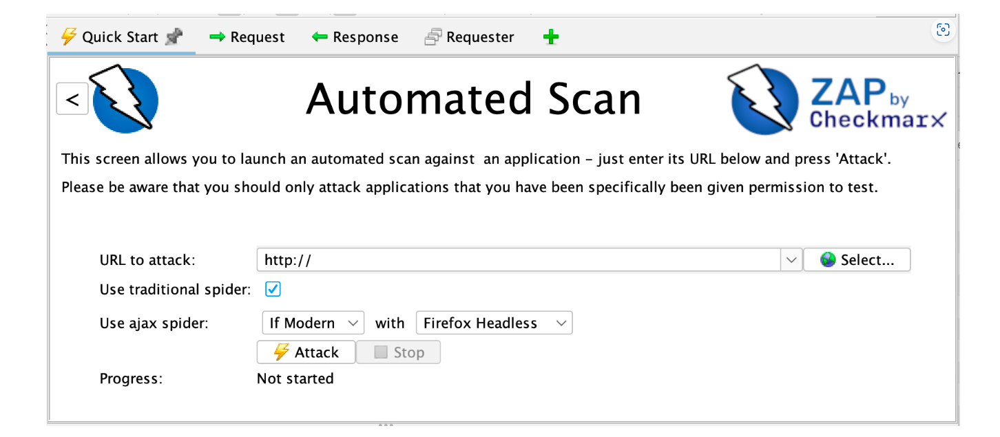
**Figura 38.1** ZAPPROXY interfaz gráfica.

**Referencia:**  [ZAP – Getting Started](https://www.zaproxy.org/getting-started/)


### 3.4.7 Interactive application security testing o IAST

Es una combinación de SAST y DAST. Se prueba desde el interior del sistema, y las pruebas que se ejecutan imitan las pruebas ejecutadas por la interacción humana y sus estímulos hacia  el sistema. Son tipos de pruebas más complejas y a menudo se basan en instalar agentes o sensores en los entornos de prueba que simulan la interacción de usuarios finales


### 3.4.8 Runtime application security protection o RASP

RASP es un método de prueba y una herramienta de prevención y detección de seguridad, ya que monitorea el sistema en tiempo real.

Este tipo de prueba la realiza una persona externa a la organización (un atacante) y la detecta una herramienta diferente (una herramienta con funciones RASP).


### 3.4.9 Software composition analysis ó SCA

Cuando se trata de escanear vulnerabilidades, se debe asegurar de verificar no solo el código propio, sino también el software que se usa como dependencias. Aquí entra en juego el análisis de composición de software (SCA). Las pruebas de SCA escanean en busca de vulnerabilidades en el software de código abierto en el que se basa un sistema de software.


### 3.4.10 Penetration Testing

Las pruebas de penetración o Pentesting (Bell et al., 2017, 322) son una forma especializada de test exploratorio, donde el tester asume el papel de un atacante. Los Pentesters utilizan proxies interceptores y escáneres y otras herramientas para identificar vulnerabilidades y luego tratar de explotarlas. Esto requiere habilidades técnicas y experiencia para hacerlo de manera efectiva. Los Pentesters utilizan generalmente una metodología basada en 6 etapas (CIPHER ©, 2020), como se muestra en la Fig. 39.

**Referencias:** Bell, L., Brunton-Spall, M., Bird, J., & Smith, R. (2017). Agile Application Security: Enabling Security in a Continuous Delivery Pipeline. O'Reilly Media. 

**CIPHER ©. (2020, August 24). A Complete Guide to the Phases of Penetration Testing. Cipher. Retrieved March 23, 2022, from [https://cipher.com/blog/a-complete-guide-to-the-phases-of-penetration-testing/](https://cipher.com/blog/a-complete-guide-to-the-phases-of-penetration-testing/)**

1. Pre-Engagement Interactions: análisis inicial, definición de ambientes, pruebas y alcance general.
2. Reconnaissance ó Open Source Intelligence (OSINT) Gathering: trabajo de inteligencia y recolección de información y posibles puntos vulnerables.
3. Threat Modeling & Vulnerability Identification: modelado y generación de un “mapa” de todos los componentes y elementos de interés.
4. Exploitation: ejecución de las pruebas de vulnerabilidades.
5. Post-Exploitation, Risk Analysis & Recommendations: generación de evidencias e información para procesar.
6. Reporting: Generación de un reporte final con los resultados de las vulnerabilidades identificadas.


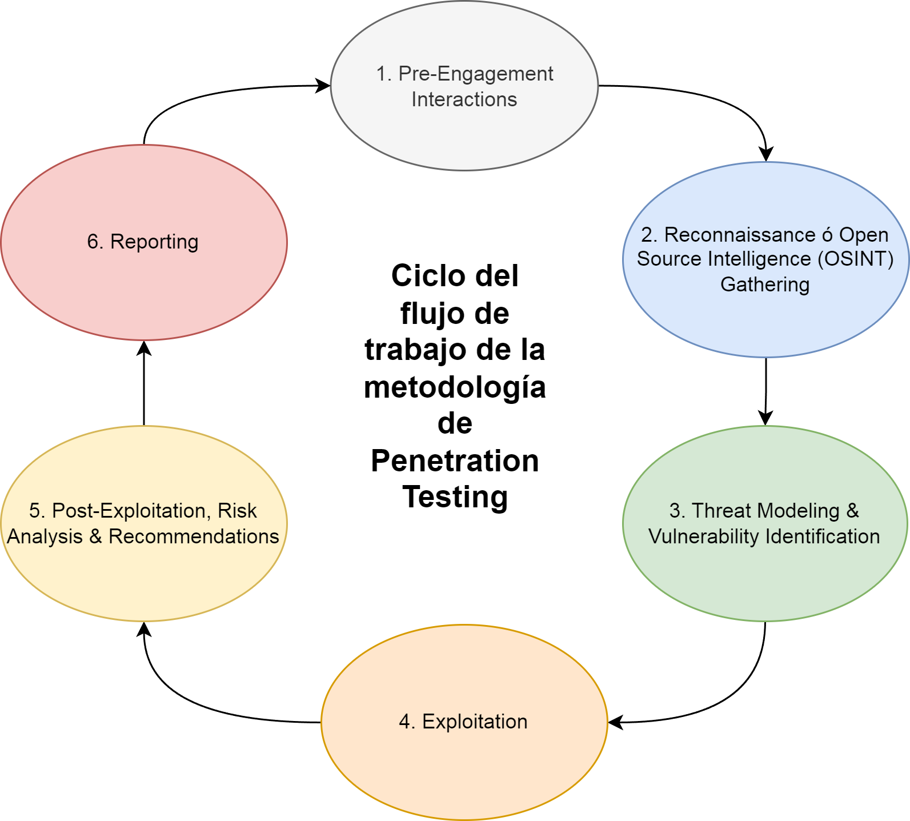
**Figura 39: Metodología de Pentesting. Imagen fuente (CIPHER ©, 2020)**


### 3.4.10.11 Ejemplo de un proceso de Penetration Testing

#### Paso 1. Pre-Engagement Interactions

**Objetivo**: Definir los términos, el alcance y los objetivos de la prueba.

|Detalle|Ejemplo|
|---|---|
|**Entorno de prueba**|Sitio web interno: `http://inventory-app.local`|
|**Pruebas permitidas**|Inyección SQL, XSS, fuerza bruta en autenticación.|
|**Restricciones**|No probar fuera del horario laboral ni afectar sistemas en producción.|
|**Objetivo**|Identificar vulnerabilidades críticas en la autenticación y el manejo de inventarios.|

### Paso 2. Reconnaissance (OSINT Gathering)

**Objetivo**: Recopilar información sobre el sistema y posibles puntos vulnerables.

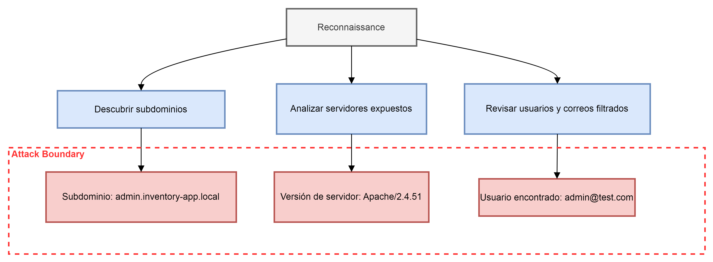

**Ejemplo**:

**Herramienta**: `sublist3r` para descubrir sub-dominios.

```bash
sublist3r -d inventory-app.
```


**Resultado**: Se identifica `admin.inventory-app.local` como un sub-dominio expuesto.
 Herramienta: `nmap` para analizar puertos y servicios.
    
```bash
nmap -sV admin.inventory-app.local
```


**Resultado**: Se descubre que el servidor usa Apache 2.4.51, con vulnerabilidades conocidas.

#### Paso 3. Threat Modeling & Vulnerability Identification

**Objetivo**: Crear un mapa de los componentes del sistema y sus posibles vulnerabilidades.


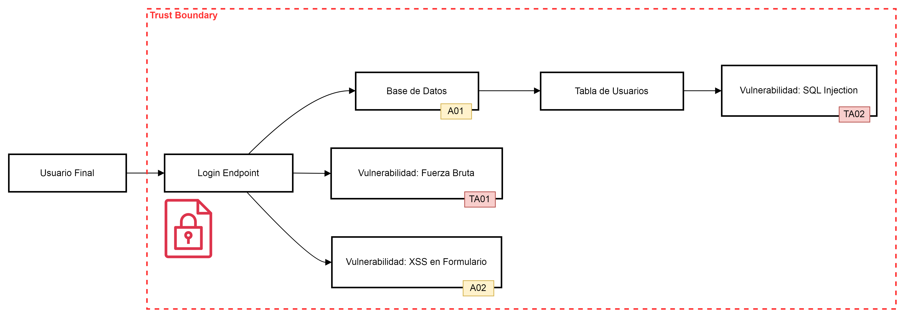

**Ejemplo**:  
Se crea un mapa de amenazas y se identifican:

- **SQL Injection** en la consulta de autenticación.
- **Fuerza Bruta** en el formulario de login.
- **XSS** en el campo "nombre del producto" en el inventario.

#### Paso 4. Exploitation

**Objetivo**: Explorar y confirmar vulnerabilidades identificadas.

#### Ejemplo: SQL Injection en el login

- Herramienta: `sqlmap`.

```bash
sqlmap -u "http://inventory-app.local/login" --data="username=admin&password=test"
```

**Resultado**: Se extrae información de la tabla `users`, confirmando la vulnerabilidad.

| Usuario | Contraseña (hash) |
| ------- | ----------------- |
| admin   | $2y$12$abcdef...  |

#### Ejemplo: Fuerza Bruta en el login

- Herramienta: `hydra`.


```bash 
hydra -l admin -P passwords.txt inventory-app.local http-post-form "/login:username=^USER^&password=^PASS^:F=incorrect"
```

**Resultado**: Contraseña descubierta: `admin123`.


#### Paso 5. Post-Exploitation, Risk Analysis & Recommendations

**Objetivo**: Evaluar el impacto de las vulnerabilidades y generar recomendaciones.

#### Resultados:

|Vulnerabilidad|Impacto|Recomendación|
|---|---|---|
|SQL Injection|Acceso completo a la base de datos.|Usar consultas parametrizadas (`PreparedStatement`).|
|Fuerza Bruta|Acceso no autorizado.|Implementar bloqueo tras varios intentos fallidos.|
|XSS|Robo de sesiones de usuarios.|Validar y sanitizar entradas de usuario.|

#### Paso 6. Reporting

**Objetivo**: Documentar los hallazgos y proporcionar un reporte detallado.

|Sección|Contenido|
|---|---|
|**Resumen Ejecutivo**|Se identificaron 3 vulnerabilidades críticas (SQL Injection, Fuerza Bruta, XSS).|
|**Hallazgos Detallados**|Descripción de cada vulnerabilidad con pasos para reproducir y mitigar.|
|**Impacto**|Riesgo para los datos sensibles y cuentas de usuario.|
|**Recomendaciones**|Aplicar controles de seguridad específicos.|

**Ejemplo de reporte en formato Markdown**:

```sql
# Penetration Testing Report
## Resumen Ejecutivo
Se identificaron tres vulnerabilidades críticas:
1. SQL Injection en el formulario de login.
2. Fuerza Bruta en el sistema de autenticación.
3. XSS en los formularios del inventario.

## Vulnerabilidad: SQL Injection
- **Impacto**: Acceso total a la base de datos.
- **Reproducción**: 

sqlmap -u "[http://inventory-app.local/login](http://inventory-app.local/login)" --data="username=admin&password=test"

- **Recomendación**: Usar consultas parametrizadas y validar entradas.


```


## 3.5 Ops ByDesign


### 3.5.1 Diseñar para Operar

Un pipeline de desarrollo tendrá éxito en la operación en base a todo el conjunto de decisiones que se hayan tomado desde un inicio. Por éste motivo, es importante pensar en el flujo de modelado, desarrollo, testing  y operación de forma temprana. Una buena guía de los principales punto a tener en cuenta durante el desarrollo y que se deben diseñar para la operación se encuentra en (Wiggins, 2017) y se denomina: “The Twelve-Factor App Methodology”:

*Referencia*: Wiggins, A. (2017). The twelve-factor App Methodology. The Twelve-Factor App. Retrieved March 2, 2022, from https://12factor.net/ 


* Factor 01: **Código Base (Codebase)**: Un código base gestionado con control de revisión (git), que permita muchos deploys (Fig. 40).

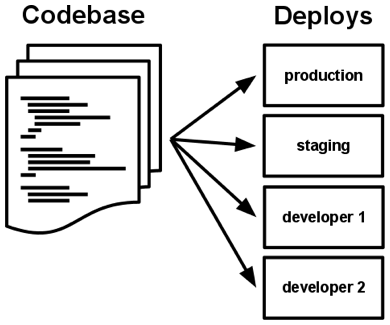

Fig. 40: Código Base gestionado y configurable para ambientes de deploy. Imagen Fuente (Wiggins, 2017)

* Factor 02. **Dependencias** (Dependencies): Declarar y aislar explícitamente las dependencias    
* Factor 03. **Configuración** (Config): Almacenar la configuración del entorno (ambiente, backups, credenciales, etc).
* Factor 04. **Servicios de respaldo/adicionales** (Backing services): Tratar los servicios de respaldo (bases de datos, brokers, buses, etc) como recursos adjuntos independientes, como se muestra en la Fig. 41. Los recursos se pueden adjuntar y separar de los deployments a voluntad.

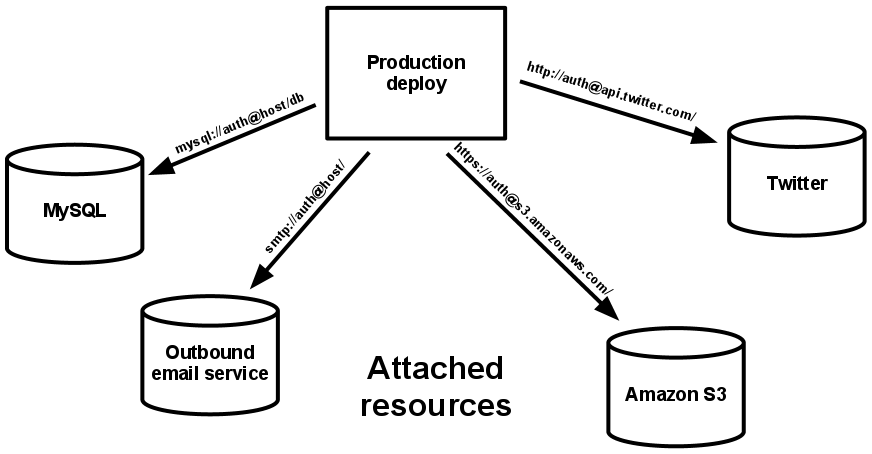


* Factor 05. ***Construir, lanzar, ejecutar** (build, release, run): Las etapas de construcción y ejecución deben estar estrictamente separadas (Fig. 42).

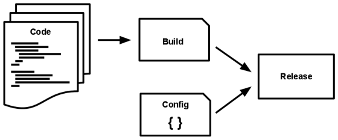

**Figura 42**: Tratar Etapas  de desarrollo de forma Separadas. Imagen Fuente (Wiggins, 2017)

* Factor 06. **Procesos** (Processes): Ejecutar la aplicación como uno o más procesos sin estado (stateless).
* Factor 07. *Enlace de puerto**  (Port binding): Exportar servicios a través de la vinculación de puertos
* Factor 08. **Concurrencia** (Concurrency): Escalar horizontalmente (Fig. 43) a través del modelo de proceso.

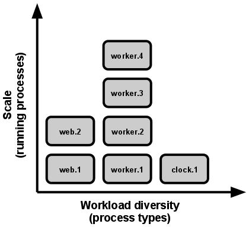


* Factor 09. **Desechabilidad** (Disposability): Maximizar la robustez con un inicio rápido y un apagado ordenado
* Factor 10. **Paridad desarrollo/producción** (Dev/prod parity): Mantener los ambientes de desarrollo, staging/testing y producción lo más similares posibles.
* Factor 11. **Logs/Registros**: Tratar los logs/registros como flujos de eventos.
* Factor 12. **Procesos de administración**: Ejecutar las tareas de administración/gestión como procesos únicos

**Referencias:**  en la página https://12factor.net/ están todos estos puntos mejor detallados.


### 3.5.2 Operar para Diseñar

Operar para Diseñar trata sobre cómo obtener el feedback y retroalimentar el diseño y desarrollo de productos con información importante obtenida de la operación. En Google se originó el término Site Reliability Engineering ó SRE [SRE, 2022] cuya definición es la siguiente:

> [!quote] 
> “SRE es lo que obtiene cuando trata las operaciones como si fuera un problema de software.”

SRE resuelve en parte el aspecto de tratar aspectos de la operación (obtener el feedback) y aplicar ese feedback como temas a resolver durante el desarrollo. Algunos de los aspectos incluyen:

- System availability
- System latency
- System performance
- System efficiency
- Change management
- Monitoring
- Emergency response
- Capacity planning


**Referencia** Wikipedia contributors. (2022, February 15). Site reliability engineering. In Wikipedia, The Free Encyclopedia. Retrieved 23:24, March 8, 2022, from https://en.wikipedia.org/w/index.php?title=Site_reliability_engineering&oldid=1071948725 


Para obtener y aplicar ese feedback, por ejemplo, SRE plantea aplicar los siguientes principios y prácticas generales:

- <mark style="background: #FFF3A3A6;">Automatización</mark> o eliminación de cualquier elemento repetitivo que también sea rentable de automatizar o eliminar.
- Evitar perseguir mucha más fiabilidad de la estrictamente necesaria. Definir lo que es <mark style="background: #FFF3A3A6;">necesario</mark> es una práctica en sí misma.
- Diseño de sistemas con un sesgo hacia la **reducción de riesgos** para la disponibilidad, la latencia y la eficiencia.
- <mark style="background: #FFF3A3A6;">Observabilidad</mark>, la capacidad de poder hacer preguntas arbitrarias sobre el sistema sin tener que saber de antemano lo que se quería preguntar. Generalmente se establecen niveles de observabilidad, y una referencia a ello se puede indagar en la Fig. 44.


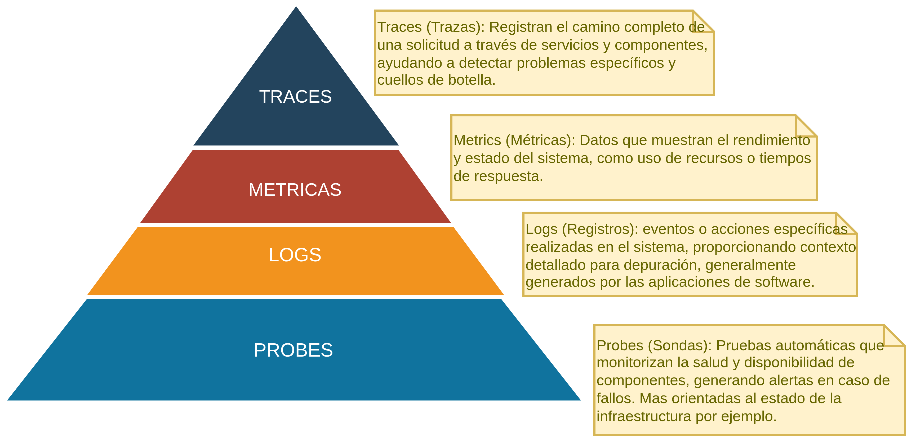
**Figura 44:** La pirámide de observabilidad de los microservicios: seguimientos, métricas, 
registros y sondeos. Imagen Fuente (Carvalho, 2021)


**Referencia:** Carvalho, A. (2021, August 10). Monitoring Microservices: Observability . Geek Culture. Medium. Retrieved March 29, 2022, from https://medium.com/geekculture/monObservabilidaditoring-microservices-part-1-observability-b2b44fa3e67e 


### 3.5.3 Métricas

Parte de conocer el estado actual de un proyecto, las mejoras a implementar, las correcciones a realizar y por lo tanto, tener la capacidad de mejorar los procesos y prácticas para que DevSecOps y QA aporten valor al producto y finalmente al cliente, son necesarias las métricas. Sin embargo, no cualquier métrica aporta el mismo valor. Desde DevOps se proponen algunas métricas orientadas al flujo de valor que se aporta al cliente/negocio, estas métricas son denominadas: Flow Metrics (Humble et al., 2021, 71). A continuación se listan las 5 más importantes:


**Referencia:** Humble, J., Kim, G., Debois, P., & Forsgren, N. (2021). The DevOps Handbook, Second Edition: How to Create World-Class Speed, Reliability, and Security in Technology Organizations. IT Revolution Press. 


* **Flow Velocity**: número de work-item o features completadas, por semana ó sprint.

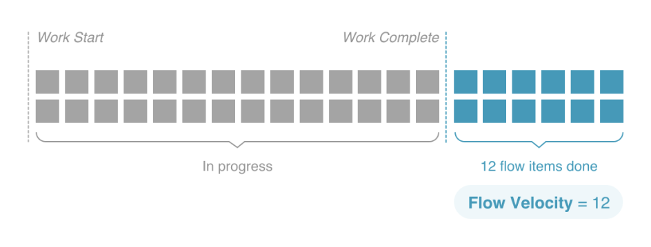
**Figura 45:** Flow Velocity. Imagen Fuente: https://flowframework.org/flow-metrics/


* **Flow Efficiency**: La eficiencia es la relación entre el tiempo activo (verde) y el tiempo de flujo total.

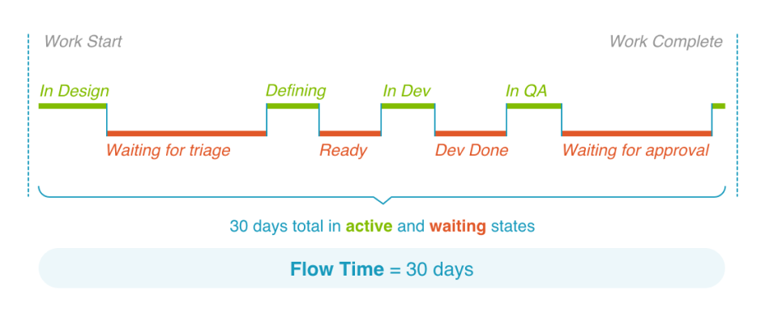
**Figura 46:** Flow Efficiency. Imagen Fuente: https://flowframework.org/flow-metrics/ 


* **Flow Time**: el tiempo transcurrido que tarda una solicitud (una épica, una historia) en pasar de "Sí, hagámoslo" a "Terminado".

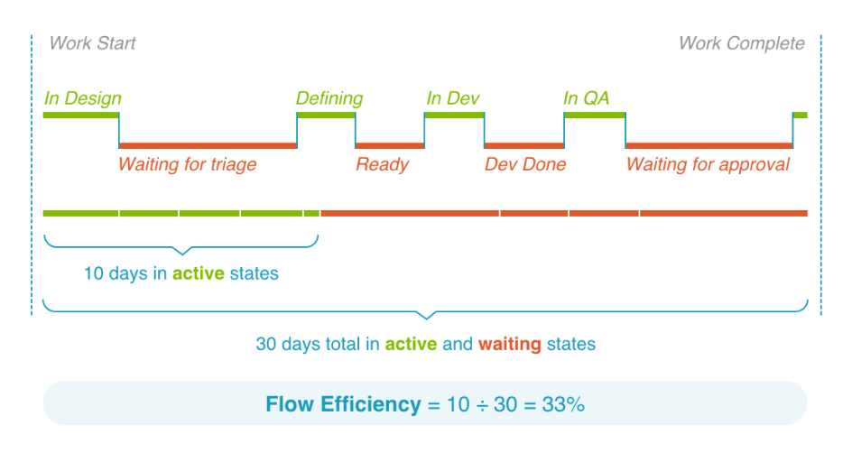
**Figura 47**: Flow Time. Imagen Fuente: https://flowframework.org/flow-metrics/ 

* **Flow Load**: mide la cantidad de elementos de flujo actualmente en curso (activos o en espera) dentro de un flujo de valor particular.

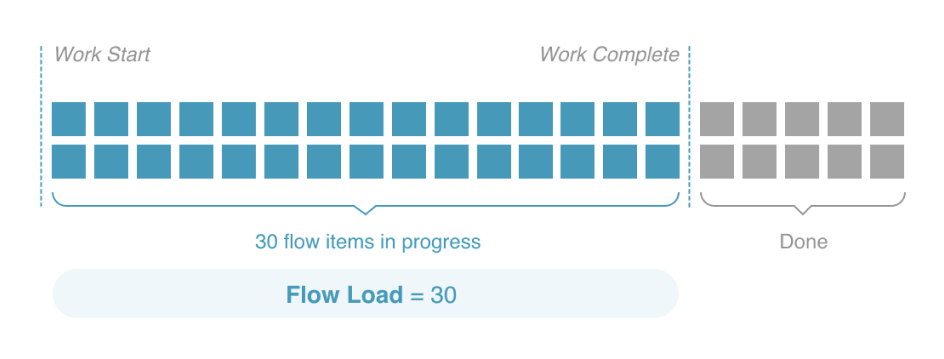
**Figura 48**: Flow Load. Imagen Fuente: https://flowframework.org/flow-metrics/ 


* **Flow Distribution**: mide la distribución de los cuatro elementos de Flujo (Características, Defectos, Riesgos y Deudas) en la entrega del flujo de valor.


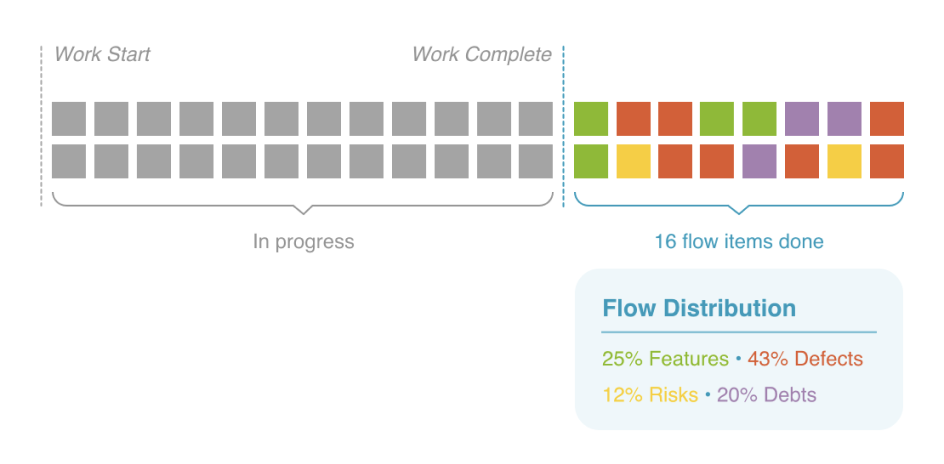
**Figura 49**  Flow Distribution. Imagen Fuente: https://flowframework.org/flow-metrics/ 


## 3.6 DevSecOps ByDesign

Ya planteada la importancia y aspectos importantes en el diseño, desde la calidad hasta la seguridad, el siguiente paso es modelar el sistema completo (System Design, 2021), donde debe quedar claro el pipeline de alto nivel (Fig. 50) o flujo de valor a considerar.

**Referencia:** Wikipedia contributors. (2021, December 15). Systems design. In Wikipedia, The Free Encyclopedia. Retrieved 00:21, March 4, 2022, from https://en.wikipedia.org/w/index.php?title=Systems_design&oldid=1060468175

Los 3 aspectos más importantes se ilustran como:
1. **Delivery pipelines**, que es camino que desde el análisis, diseño e implementación hasta el delivery de un producto o servicio de software hacia los clientes.
2. El pipeline de **"seguridad"**, que incluye desde la aplicación de buenas prácticas, análisis estáticos de código, threat modeling, análisis en runtime de los contenedores deployados en un ambiente en la nube o hasta equipos de pentesting.
3. En la capa inferior se muestra lo que se denomina un "feedback loop", un punto clave en cada paso de todo el proceso. En cada paso, se debe asegurar de alguna manera de obtener feedback para corregir / reajustar / mejorar. Aspecto clave, y no siempre modelado o tenido en cuenta como un proceso critico. 

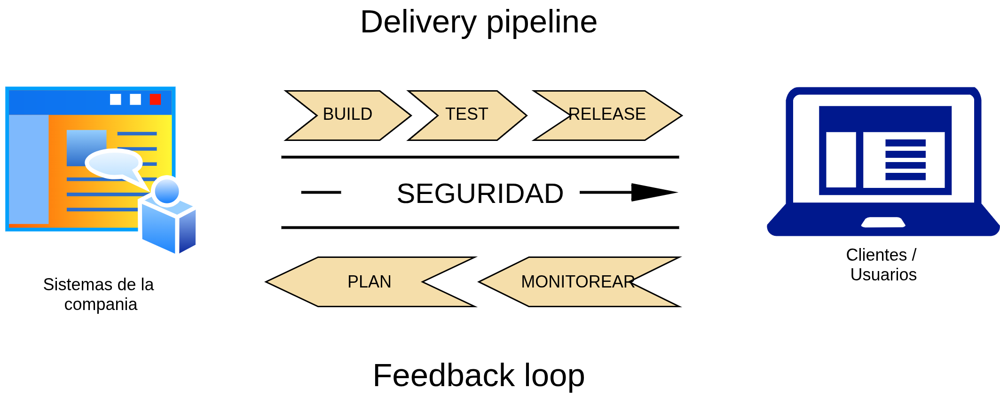

**Figura 50** DevSecOps Pipeline Alto Nivel (ZETTLER, 2022). Fuente:(  https://catalog.us-east-1.prod.workshops.aws/workshops/95ee7fde-4d85-47a5-99fc-7e0dee07fc94/en-US/introduction  )


### 3.6.1. Nivel 0 del pipeline DevSecOps

Primero y a modo de ejemplo, se presenta el esquema de la Fig. 51 que presenta todas las partes componentes de un modelo DevSecOps + QA, que se llamará nivel 0. Éste tipo de diseño/modelos sirve para plantear el sistema completo, sin entrar en demasiado detalle, pero que a grandes rasgos da información sobre el ecosistema a considerar para el producto.

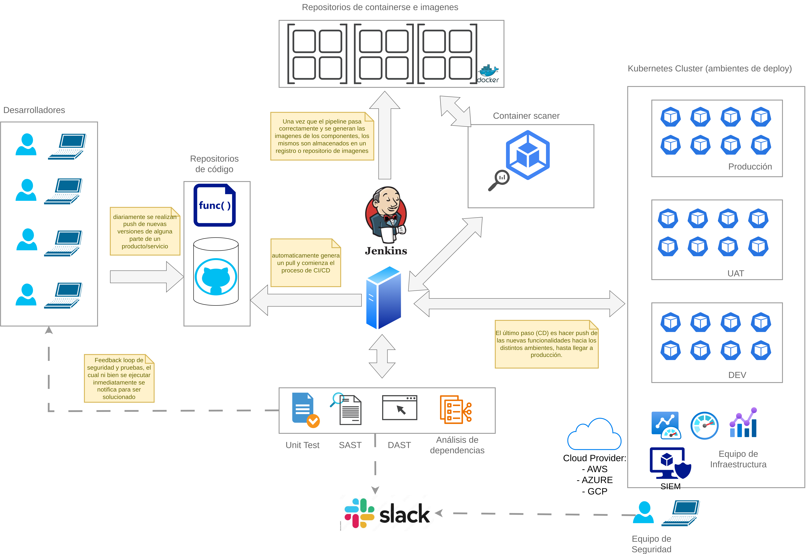

**Figura 51**: DevSecOps + QA Ejemplo de Vista Completa Nivel 0. Imagen fuente ( https://www.linkedin.com/feed/update/urn:li:activity:6863289227103367168/  )


### 3.6.2. Nivel 1 del pipeline DevSecOps

Las siguiente etapas involucran ir bajando el nivel de detalle, siempre y cuando ese nivel de detalle aporte valor. El siguiente nivel de detalle, que se llamará nivel 1, donde el principal objetivo es identificar para cada etapa del Desarrollo y Operación, las principales amenazas basándose en el Threat modeling.

Si vamos etapa por etapa en todo el pipeline, desde el escritorio del desarrollador, pasando por los repositorio de código y hasta llegar a los ambientes desplegados en clusters de kubernestes, los aspecto que se deben tener en cuenta, probar, registrar y solventar si fuera necesario son:

- **Critical Vulnerabilities**
	- Pueden ingresar al pipeline en cualquier etapa. Por esto es importante tener herramientas de análisis estático desde el escritorio del desarrollador hasta en los repositorios de código.
- **Security Breaks Pipeline**
	- **Configuración manual**: valerse de herramientas de despliegue IaC como terraform y ansible entre muchas otras, o sea, evitar configuraciones manuales. Todo debe estar correctamente bajo control de configuración, por ejemplo usando Git.
	- **Falta de integración**: Asegurarse de tener un servidor de integración que "funcione".  
- **Misconfiguration:**
	- Registros (registries)
	- Kubernetes 
	- Hosts de contenedores (Container Hosts)
	- Para estos puntos: gobierno de la infraestructura, utilizar buenas prácticas, estándares y cross-checks constantes.
- **New Attack Surfaces**
    - Vulnerabilidades en Kubernetes
    - Vulnerabilidades en Docker
    - Vulnerabilidades en herramientas (Tool Vulnerabilities)
    - Utilizar herramientas como Falco para análisis runtime de container, y muchas otras.
- **Inadequate Protection in Production**
    - Exploits de contenedores (Container Exploits)
    - Vulnerabilidades de día cero (Zero day)
    - Amenazas internas (Insiders)
    - Valerse de equipos de pentesting, herramientas de monitoreo y observabilidad.


### 3.6.3. Nivel 2 del pipeline DevSecOps

Finalmente, para el escenario planteado, se puede modelar un tercer nivel de detalle, que se llamará nivel 2 Fig. 53, donde se especifican con más detalle las prácticas y posibles herramientas para aplicar en cada etapa del pipeline DevSecOps + QA orientados en detectar fallas o vulnerabilidades de seguridad.

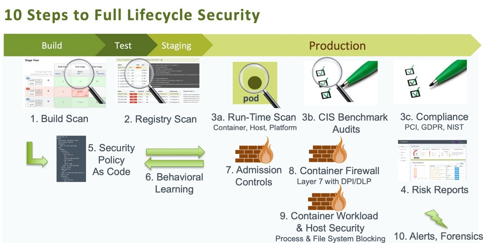

**Figura 53:** DevSecOps + QA nivel 2. Imagen fuente (  https://www.infoworld.com/article/3545337/10-steps-to-automating-security-in-kubernetes-pipelines.html  )

Para cada una de las fases del ciclo de vida, las siguientes prácticas son las recomendadas:

1. Build:
	1. Build scan => aplicar Security Policies as Code
2. Testing y staging:
	1. Registry scan:
		1. Aprendisaje basado en el comportamiento del sistema.
3. Producción:
	1. Scaning en run-time
	2. Benchmark CIS (ver https://learn.microsoft.com/en-us/compliance/regulatory/offering-cis-benchmark)
	3. Auditoria y control de Compliance: PCI, GRDP, NIST
	4. Control de accesos (roles, permisos y privilegios)
	5. Firewall y otras técnicas de control inbound and outbound
	6. Container, carga de trabajo y seguridad en los host.
	7. Reporte de Riegos
	8. Alertas y análisis forence.


## 3.7. Situaciones Anormales ByDesign

Hasta ahora se ha planteado trabajar en el modelado, diseño, implementación y pruebas desde la perspectiva cuando todo funciona de manera correcta. No obstante, no se puede tener un buen diseño y mucho menos una implementación de la metodología DevSecOps y de los aspectos de QA asociados sin hablar de las fallas, caídas, ataques, DoS, DDOS y todas las categorías de escenario desafortunados que usualmente suceden (Fig. 54).

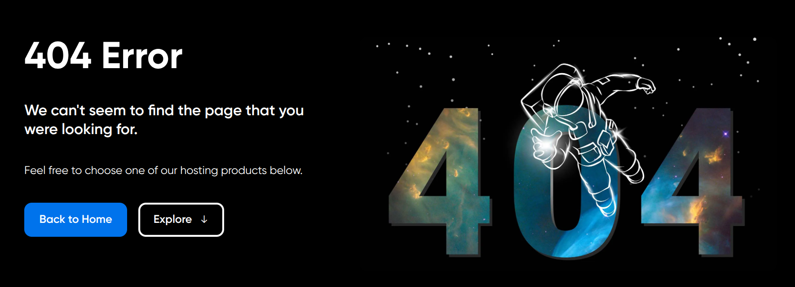
**Figura 54** HTTP estado de error - Sistema fuera de servicio.


Se deben considerar, especificar y modelar desde el inicio (idealmente) aquellos aspectos o escenarios desafortunados o no esperados durante el ciclo de vida de un producto de software, para poder generar así planes de contingencias, planes de acción, reacción o cualquier actividad de mitigación posible. Algunos de los aspectos a considerar son:

- Logs de la aplicación, centralizados, claros y disponibles ante fallas.
- Manejo de excepciones y logs adecuados.
- Logs de versiones de componentes de software y dependencias, así como SO host y otros.
- Monitoreo de infraestructura de software: servidores web, por ejemplo, logs de Tomcat.
- Monitoreo de infraestructura de hardware: RAM, CPU, I/O, Networking.
- Monitoreo de estado de salud (heartbeats, health status, etc).
- Mecanismo de rollback (al actualizar un componentes y/o dependencia)
- Mecanismos de dump de bases de datos, logs, binarios, etc.
- Mecanismos de comunicación ante fallos. Definir un template Fig.55] para usar como mecanismo de PostMorten Communication: (Rachitsky, 2010):

El siguiente es un ejemplo de un template para generar un análisis post-mortem:

| Prerrequisitos:                                                                                                                                             | Requisitos:                                                                                                                        |
| :---------------------------------------------------------------------------------------------------------------------------------------------------------- | :--------------------------------------------------------------------------------------------------------------------------------- |
| 1. Admitir el fallo: ocultar el tiempo de inactividad ya no es una opción.                                                                                  | 1. Hora de inicio y hora de finalización del incidente.                                                                            |
| 2. Hablar con naturalidad: no usar una plantilla estándar ni disculparse por las molestias.                                                                 | 2. ¿Quién o qué se vio afectado? ¿Debería preocuparme por este incidente? ¿Qué falló?                                              |
| 3.Disponer de un canal de comunicación: establecer un proceso para gestionar los incidentes antes de que ocurran (blog de estado, cuenta de Twitter, etc.). | 3. ¿Qué falló y cómo lo solucionaron (con información sobre el proceso de análisis de la causa raíz)?                              |
| 4. Sobre todo, ser auténtico: debe ser escuchado                                                                                                            | 4. Lecciones aprendidas: ¿Qué se está haciendo para mejorar la situación de cara al futuro en tecnología, procesos y comunicación? |

**Figura 55**: Template para generar un Informe PostMortem


**Referencia:** Rachitsky, L. (2010, March 2). A guideline for postmortem communication. Transparent Uptime. Retrieved February 22, 2022, from http://www.transparentuptime.com/2010/03/guideline-for-postmortem-communication.html 


## 3.8. Personas y Roles ByDesign


La estructura de la organización y por lo tanto la estructura de los equipos para soportar DevSecOps y QA deben ser analizadas desde el punto de vista de la colaboración, especialización y comunicación. Una posible lista de roles a tener en cuenta se detalla en (Weber et al., 2015, 13), donde se mencionan las siguientes categorías:

1. **Team Size**: el tamaño del equipo. Una buena práctica viene de Amazon: Two-Pizza Team.
2. **Team Lead**: Líder “soft” del equipo, por ejemplo, el scrum master en Scrum.
3. **Team Member**: el equipo de desarrollo (Dev, Sec, QA).
4. **Service Owner**: Similar al Product Owner en Scrum, se encarga de las interfaces externas.
5. **Realiability Engineer** o SRE según Google (SRE, 2022).
6. **DevOps Engineer**: si bien ya se especificó que DevOps o DevSecOps no son roles, en la industria se usa asignar a una persona con conocimientos amplios de la infraestructura y el desarrollo para dar soporte a los procesos y herramientas de la metodología. Es un rol similar al Scrum Master con Scrum, pero visto desde el punto de vista de aptitudes técnicas o “hard”.

**Referencia:** 
1. Two-Pizza Team:  https://docs.aws.amazon.com/whitepapers/latest/introduction-devops-aws/two-pizza-teams.html
2. Wikipedia contributors. (2022, February 15). Site reliability engineering. In Wikipedia, The Free Encyclopedia. Retrieved 23:24, March 8, 2022, from https://en.wikipedia.org/w/index.php?title=Site_reliability_engineering&oldid=1071948725 


## 3.9. Aspectos Legales y Privacidad ByDesign

Finalmente un último, pero no menos importante, aspecto a tener en cuenta en el diseño de un producto de software son los relacionados a aspectos legales y de licencias (Software Licences, 2022), tanto del código, herramientas y otros componentes de terceros que formen parte tanto del desarrollo de un producto, como del producto en sí mismo.
Cada organización debería asesorarse legalmente y definir para los productos que desarrolla y disponibiliza, las licencias y aspectos legales asociados.
Existen herramientas online disponibles para generar licencias de forma automática, pero en cualquier caso, el asesoramiento legal siempre es recomendado. En la sección de herramientas se expone un ejemplo de herramienta online para generación de licencias que puede ser de utilidad como punto de partida. 

**Referencia:** Wikipedia contributors. (2022, March 25). Software license. In Wikipedia, The Free Encyclopedia. Retrieved 22:27, April 7, 2022, from https://en.wikipedia.org/w/index.php?title=Software_license&oldid=1079095846

---


# 4. Herramientas

Dado que DevSecOps está destinado a ser una forma de trabajo multi-funcional, para implementar la metodología se necesitan utilizan diferentes conjuntos de herramientas para cada diferente etapa (Fig. 56), que se denominan: **toolchains.**

Una "toolchain" no es otra cosa que un conjunto de herramientas configuradas, según un stack tecnológico específico, basado en el tipo de proyecto, para desarrollar, testear o simplemente ejecutar/levantar un componente de software.

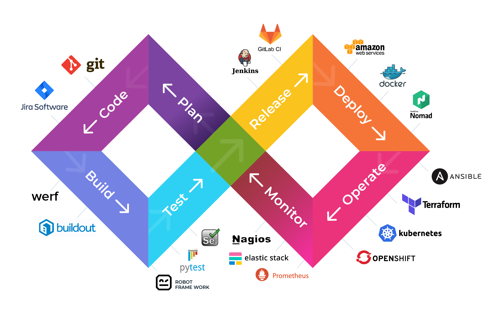
**Figura 56**: Herramientas o Toolchains de soporte en DevSecOps y QA.

**Referencia:** https://www.ryadel.com/en/devops-methodology-lifecycle-best-practices-explained/

Se espera que estas herramientas estén en una o más de las siguientes categorías, lo que refleja aspectos clave del proceso de desarrollo, delivery y sobre todo de QA:

1. **Análisis, Modelado y Codificación**: modelado, desarrollo y revisión de código, herramientas de gestión de código fuente, combinación de código.
2. **Construcción**: herramientas de integración continua, compilación, estado de la construcción, gestión de dependencias.
3. **Pruebas y QA Automation**: herramientas de pruebas continuas que brindan retroalimentación rápida y oportuna sobre los riesgos, defectos, anomalías, vulnerabilidades..
4. **Empaquetado**: empaquetado, generación de imágenes, repositorio de artefactos, preparación previa a la implementación de la aplicación.
5. **Liberaciones**: gestión de cambios, aprobaciones de versiones, automatización de versiones.
6. **Configuración**: configuración y gestión de la infraestructura, infraestructura como código, orquestación de servidores, nodos, deployments.
7. **Supervisión**: supervisión del rendimiento de las aplicaciones, experiencia del usuario final, registros de eventos, métricas generales.

A continuación se listan ejemplos de herramientas para cada una de las categorías mencionadas. El propósito de listar las herramientas está asociado a presentar ejemplos de herramientas para evaluar su implementación en toolchains con el objetivo de dar soporte a un proceso de implementación de la metodología DevSecOps. También es importante evaluar que éstas herramientas aporten valor a los aspecto de QA del producto final y a los usuarios final.

>[!note] 
> Las herramientas que se nombran están fuertemente orientadas a un toolchain basado en Java, pero el mismo conjunto de herramientas se puede encontrar con cualquier tecnología elegida.


## 4.1. Análisis, Modelado y Codificación

Las siguientes herramientas se pueden utilizar desde el análisis, hasta la implementación. Cada herramienta tiene sus pro y cons, por lo tanto, al momento de elegirlas, se deberán considerar varios aspectos, desde la utilidad especifica hasta aspecto como la seguridad de la compañía, donde muchas veces no se pueden utilizar herramientas que no estén autorizadas.

- PlantUML - Para el análisis y diseño. Integrado con Git y varios IDE's: [Link](https://plantuml.com/)
- Drawio - Para un análisis más "libre": [Link](https://www.drawio.com/)
- Git - Gestión de código fuente: [Link](https://git-scm.com/ )
- Gitlab - Repositorio de Código Fuente Integrado: [Link](https://about.gitlab.com/)
- Etiquetado o Tagging: [Link](https://semver.org/)[Link](
- Git Flow - Gestión de ramas o Branching (Driessen, 2010)
- Changelog de ramas y versiones: [Link](https://keepachangelog.com/en/1.0.0/)
- Readme y datos importantes: [Link](https://www.makeareadme.com/)
- IDE - Entorno de Desarrollo Integrado: [Link](https://www.jetbrains.com/idea/)
- Gestión de Proyectos y tareas: [Link](https://docs.gitlab.com/ee/topics/plan_and_track.html )
- Gitlab Wiki - Documentación de Arquitectura SAD y ADR: [Link](https://docs.gitlab.com/ee/user/project/wiki/)  (o Github pages, JIRA confluence, entre muchas otras)
- Gitlab Wiki (modelado gráfico de diagramas con Mermaid.js): [Link](https://docs.gitlab.com/ee/user/markdown.html#diagrams-and-flowcharts) y [Link](https://mermaid-js.github.io/mermaid/#/ )
- Convenciones de código: [Link](https://www.oracle.com/java/technologies/javase/codeconventions-contents.html)


## 4.2. Construcción


- GNU Make - Herramienta de generación automática de empaquetados (builds): (Make, 2022)
- Maven - Gestión de paquetes y dependencias: [Link](https://maven.apache.org/)
- Gradle - Gradle es un sistema de automatización de construcción: [Link](https://gradle.org/)
- Gitlab-CI - Servidor de Integración Continua o CI [Link](https://docs.gitlab.com/ee/ci/)  (o Jenkins o Azure devOps o Github actions, etc.)
- Generador de Licencias de código: [Link](https://commercial.polyformproject.org/)


## 4.3. Pruebas, Seguridad y QA Automation

- xUnit / JUnit - Framework para testing unitario basado en Java: [Link](https://junit.org/junit5/)
- Robot Framework - Framework de automatización genérico de código abierto. Se puede utilizar para la automatización de pruebas y la automatización de procesos robóticos (RPA): [Link](https://robotframework.org/)
- Postman & Newman - Postman es una plataforma de API para crear y usar APIs, y Newman es un Collection Runner de línea de comandos para Postman: [Link](https://www.postman.com/product/what-is-postman/ y https://learning.postman.com/docs/running-collections/using-newman-cli/command-line-integration-with-newman/)
- Bruno (alternativa a Postman) - [Link](https://www.usebruno.com/)
- JMeter - Performance & Load Testing - Es un software de código abierto, una aplicación Java 100% pura diseñada para testing de cargar, probar el comportamiento funcional y medir el rendimiento. [Link](https://jmeter.apache.org/)
- RPA Framework - Es una colección de bibliotecas y herramientas de código abierto para la automatización robótica de procesos (RPA), y está diseñado para usarse tanto con Robot Framework como con Python: [Link](https://rpaframework.org/)
- Security Tools (SAST) -  es un programa que utiliza análisis estático para buscar errores en el código Java: [Link](https://find-sec-bugs.github.io/)
- Security Tools (DAST) -  [Link](https://docs.fluidattacks.com/machine/scanner)
- Security Tools (OWASP ZAP) - es una herramienta gratuita de prueba de penetración de código abierto: [Link](https://owasp.org/www-project-zap/ y https://www.zaproxy.org/getting-started/)
- Security Tools (SQL MAP) -Es una herramienta de prueba de penetración de código abierto que automatiza el proceso de detección y explotación de fallas de inyección SQL y toma de control de servidores de bases de datos: [Link](https://sqlmap.org/)
- Security Tools (User Security Stories) - Ejemplos de definición de historias de usuarios basadas en Seguridad: [Link](https://github.com/OWASP/user-security-stories)
- Microsoft Threat Modeling Tool -  Herramienta para crear diagramas, identificar amenazas, definiendo mecanismos de mitigación y validando cada mitigación: [Link](https://docs.microsoft.com/en-us/azure/security/develop/threat-modeling-tool-getting-started) 


## 4.4. Empaquetado 

- Docker: [Link](https://www.docker.com/)
- JAR / WAR - Formato de empaquetado de productos de Software basados en Java: [Link](https://en.wikipedia.org/wiki/WAR_(file_format)  (o .whl para python, etc.)
- JFROG Artifactory - Repositorio Centralizado de Artefactos Fig. 57: [Link](https://www.jfrog.com/confluence/display/JFROG/JFrog+Artifactory)
- Versionado de Artefactos y Meta-información

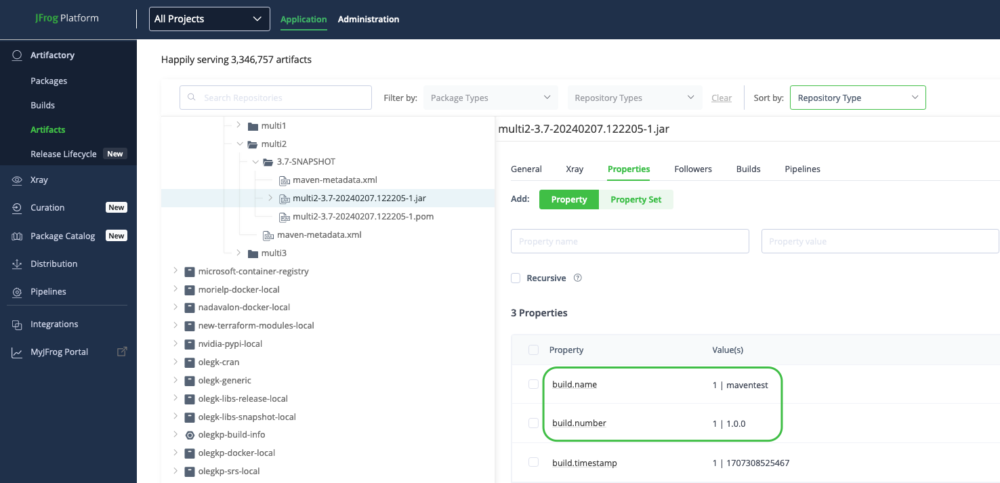
**Figura 57:** Artifactory - Manipulación de artefactos

**Referencia:** https://jfrog.com/help/r/how-does-build-promotion-work/artifactory-how-does-build-promotion-work


## 4.5. Liberaciones (releases)

* Artifactory + Gitlab - CI/CD con una estrategia de promoción de artefactos (Fig. 58):  [Link](https://jfrog.com/knowledge-base/how-does-build-promotion-work/)

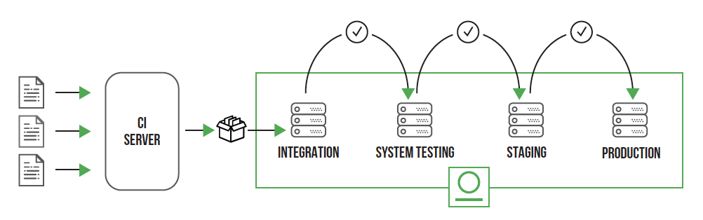
**Figura 58:** Artifactory - Mecanismo de Promoción de Artefactos


## 4.6. Configuración y Gestión de Infraestructura

- Kubernetes: [Link](https://kubernetes.io/)
- Docker: [Link](https://www.docker.com/)
- Helm Charts: [Link](https://helm.sh/)
- Ansible: [Link](https://www.ansible.com/overview/devops/ )
- Puppets: [Link](https://puppet.com/devops/ )
- Chef: [Link](https://www.chef.io/)


## 4.7. Supervisión y Monitoreo

- OpenTelemetry: [Link](https://opentelemetry.io/)
- ElasticStack: [Link](https://www.elastic.co/es/elastic-stack/ )
- New Relic: [Link](https://newrelic.com/platform)
- Nagios: [Link](https://www.nagios.org/)
- Grafana: [Link](https://grafana.com/)
- Prometheus: [Link](https://prometheus.io/)


## 4.8. Conclusiones

Finalmente, el toolchain puede resultar abrumador a primeras, pero termina siendo muy necesario si se quiere automatizar todo el ciclo de desarrollo de un producto. Automatizar, no solo es un beneficio técnico sino también a nivel negocio, debido a que permite reducir tiempos, por lo tanto, se reducen costos. Permite además, una vez aceitado todo el proceso, aumentar la velocidad de generar nuevas features del producto/servicio y por lo tanto, aumenta el valor a negocio.


## 4.9. Update. Otras herramientas

Como es normal, todo el tiempo están surgiendo herramientas nuevas, mejores o que reemplazan a otras que ya no existen, a continuación listo algunas de las ultima herramientas que he visto y me parecen muy interesantes para observar y probar:
1. Modelado de sistemas: [link](https://systemforge.app/) . La descubri por el siguiente post: [Link](https://www.linkedin.com/posts/cauenapier_systemsengineering-mbse-sysml-ugcPost-7400899974319927296-D2j5?utm_source=share&utm_medium=member_desktop&rcm=ACoAADXjTjwBuJRTMS15dwLutB1fDEtOwXbs314)
2. Falco seguridad en runtime para containers: [Link](https://falco.org/), en una charla de meetup BCN: [Link](https://www.linkedin.com/posts/matiasmiguez_devops-kubernetes-opensource-activity-7399157735281397760-TLt3?utm_source=share&utm_medium=member_desktop&rcm=ACoAADXjTjwBuJRTMS15dwLutB1fDEtOwXbs314)


---


# 5. Implementación


## 5.1. Introducción

Para dar sustento al presente trabajo, se utilizará como caso de estudio una versión modificada del producto ficticio <mark style="background: #FFF3A3A6;">SecTx Analysis</mark> de la empresa Tx Security.

Se expondrán detalles internos del producto, con algunos aspectos importantes que pudieran ser útiles para diseñar un plan de implementación, que se utilizarán a modo conceptual donde se expondrán aspectos de la arquitectura y desarrollo del producto para dar una idea de ejemplos de implementación de la metodología DevSecOps desde la perspectiva de QA automation y los posibles roadmaps de adopción de la misma.


## 5.2. Caso de Estudio: SecTx Analysis

SecTx Analysis es una solución que genera perfiles de usuarios en base a la información provista por el core del cliente (actúa como middleware, ver Fig. 60). Genera un modelo de análisis de comportamiento de usuarios a través de reglas definidas en la solución SecTx Analysis utilizando una Interfaz Web (Backoffice) donde los analistas de riesgos definen las reglas de aplicación.

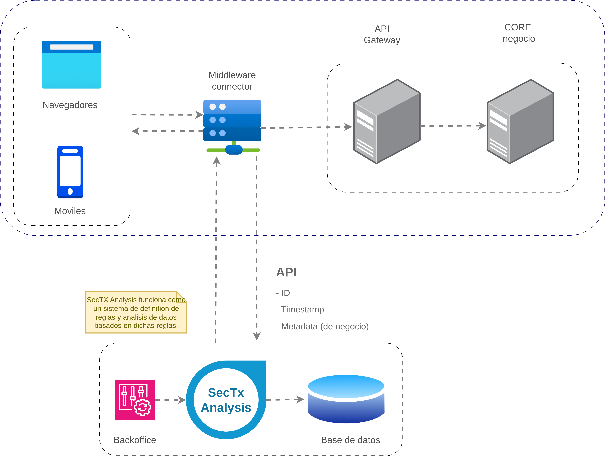
**Figura 60**: Esquema funcional de alto nivel del proyecto fictitio SecTX Analyis

En base al almacenamiento y procesamiento de información proveniente de múltiples canales (Web, dispositivos móviles) denominadas eventos/transacciones con importes, fecha de transacción, tipo de transacción, frecuencia de operación y datos de conexión del usuario, SecTx Analysis identifica posibles casos de fraude o de comportamiento sospechoso, pudiendo alertar de forma pasiva o bien de forma activa disparando procesos de autenticación robusta personalizados para ese perfil de usuarios.


## 5.3. Casos de uso de SecTx Analysis

El producto ficticio SectTx Analysis presenta los siguientes casos de uso:

1. Prevención del lavado de dinero en transacciones provenientes de fuentes ilegales o no reguladas.
2. Tokenización de datos de tarjetas y personales para proteger activos, información y transacciones.
3. Recolección, almacenamiento y gestión de datos provenientes de fuentes externas.
4. Prevención del acciones fraudulentas o sospechosas mediante análisis en tiempo real y autenticación robusta.
5. Detección de cuentas "sospechosas" mediante listas prohibidas que incluyen cuentas publicas indicadas (block-list) .
6. Validación en tiempo real para operadores móviles y bancos con tecnología de huella digital del dispositivo.
7. Prevención de contracargos validando la identidad del comprador o pagador.
8. Verificación del cumplimiento de normas gubernamentales y requisitos bancarios, con seguimiento continuo.
9. Aplicación de reglas configurables según las necesidades del cliente, el área de negocio y el comportamiento esperado de los usuarios.
10. Dashboards (backoffice) de configuración generar.


## 5.4. Funcionalidades del Producto

A continuación se listar las principales funcionales del sistema. Cada funcionalidad es un module especifico, con un responsabilidad bien asignada y especifica. Todos los módulos del sistemas se pueden habilitar y deshabilitar de forma independiente.

Cada modulo funcional está diseñado para ser stateless (todo los datos se persisten en una base de datos centralizada, dependiendo del dominio de negocio del modulo), con una API interna basada en gRPC para la comunicación entre módulos; un esquema de cola de mensajería para la comunicación asincrónica; un mecanismo de recolección y almacenamiento de logs del sistema (para auditoria); cada modulo está contenereizado utilizando docker, multi stage y con imágenes minimalista (alpine o similares) para reducir el tamaño y para disminuir la superficie de ataque (desde el punto de vista de ciberseguridad).


## 5.4.1 Administración

- Configuración de Datos: Administración de canales que proporciona una solución multi-canal, donde en cada canal se puede configurar múltiples operaciones, y cada operación puede tener un formato similar o distintas de transacción/eventos. Administración de tipos de operaciones y administración de parámetros.
- Administración de listas (deny-list, allow-list). Carga masiva de listas. Carga de listas con ubicación de ATMs. Parámetros por especialidad.
- Parámetros generales del sistema, Parámetros de año fiscal y Usuarios: Manejo de usuarios de sistemas basados en roles personalizables de acuerdo con la necesidad del negocio. Roles. Agregado y administración de usuarios.
- Gestión de API KEYs: Seguridad de acceso en las transacciones basados en las api keys.


## 5.4.2 Rule Based Engine


- Motor de Reglas Generales y Pre-filtrado, Acumuladores, Reglas por canales y tipos de operaciones. Reglas de Riesgo.
- Histórico para carga de transacciones masivas y carga de eventos masiva.
- Administración de casos para ver transacciones almacenadas y hacer análisis específicos. Visualización de casos procesados y exportación de información procesada.


## 5.4.3 Fingerprint

- Administración de reglas de Browser Fingerprint y Device Fingerprint. Consultas y visualización a través de Dashboard para análisis de Fingerprint multi-canal y Consultas con tablero de consulta de Fingerprints por ID de usuarios.


## 5.4.4. Reportes y Analítica
- Usuarios y perfiles: Manejo de reportes a nivel usuarios y transacciones con perfil y cantidad de usuarios. Reportes dinámicos. Reportes estáticos.


## 5.4.5 Notificaciones
- Tipos de Notificaciones: Configuración de grupo de interesados en las notificaciones para las asignaciones de los casos y envío de correos de alerta de asignación de transacciones mediante el protocolo SMTP. 
- Notificaciones a grupos y Administración de grupos de negocio. Configuración de visibilidad de reglas y asignación automática.


## 5.4.6 Machine Learning
* Análisis de transacciones, redes y experimentos.


## 5.4.7 Trazabilidad
* Trazar: Disponibilidad de armar grafos enfocados a la transacción y los montos, con el fin de armar una trazabilidad del usuario y movimientos de fondos entre cuentas.


## 5.4.8 Directorio Activo
* Conexión: Configuración para poder integrar con directorios activos (AD) para usuarios de sistemas protocolo LDAP y gestión de grupos.


## 5.4.9 Auditoría
* Registros de auditoría: Mecanismo de auditoría de eventos del sistema.


### 5.4.10 API
* API REST para interactuar e integrar la solución SecTx Analysis para permitir el ingreso y gestión de eventos y transacciones, y endpoints específicos para el ingreso y gestión de Fingerprints.

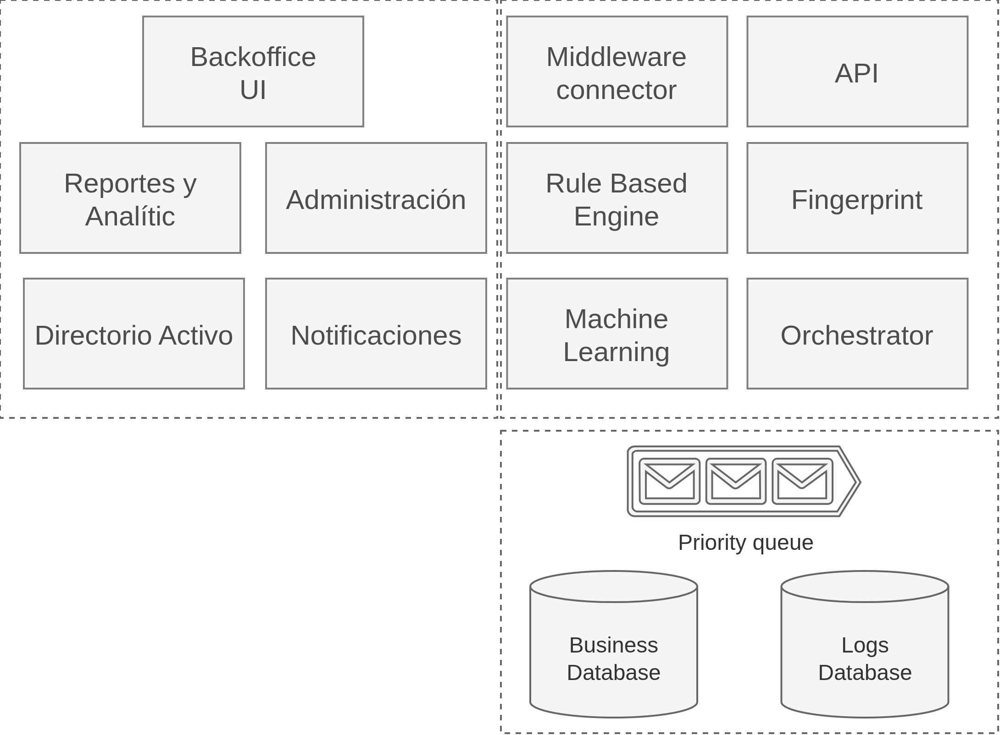
**Figura 60.1** Diagrama funcional del producto.


## 5.5. Estructura del proyecto


### 5.5.1 Equipo y Roles

El equipo de trabajo está conformado por personas de varias áreas de la organización:

* Product: 
	* 1 Product Owner,  
	* 1 Functional Analyst, y 
	* 1 UX/UI Designer.
* Development: 
	* Software Developers (back, front y full-stack)
	* Quality: 1 Agente de QA

Internamente el equipo trabaja dividido en 2 sub-grupos para resolver aspectos importantes del producto, a saber:

* **Scrum**: nuevas funcionalidades, cambios de arquitectura, nuevos negocios.
* **Kanban**: soporte, mantenimiento y bug-fixing de software en producción.

Debido a que el producto fue desarrollado hace más de 10 años (por poner un ejemplo), lo que normalmente sucede es que los primeros clientes (early adopters) tienen versiones viejas, o versiones levemente customizadas, que pocas veces se documenta. Lo mismo sucede durante el transcurso del tiempo y la evolución de las tecnologías y la compañia que desarrollo inicialmente el producto. Lo que termina pasando es que luego de más de 10 el producto pudo haber evolucionado en diferentes ramas, para diferentes clientes con funcionalidades diferentes.

La organización del equipo usando 2 esquemas de trabajo (scrum y kanban) puede ayudar a gestionar la complejidad de tener muchas versiones del mismo producto, desplegadas en distintos clientes, con diferentes ambientes.


### 5.5.2 Mapa de versiones y EOL (end-of-life)

Otra herramienta muy útil es tener un mapa de todas las versiones "habilitadas" al día de hoy, que versión del producto es, en que clientes está desplegada, y otras características que puedan ser de interés.

| version | Stable | cliente(s) | Tech stack             | Fin de soporte | LTS    | Fecha migración |
| ------- | ------ | ---------- | ---------------------- | -------------- | ------ | --------------- |
| 1.0.1   |        | Acme       | java 8, postgres       | 01/12/2022     | 1.3.1. | 01/01/2025      |
| 1.4.6   |        | Disney     | Java 11, MySQL         | 01/12/2024     | 1.5.0  | 01/06/2025      |
| 1.4.1   |        | Willow     | Java 17, Oracle        | 01/12/2024     | 1.5.0  | 01/07/2025      |
| 1.5.0   | x      | Roca       | Java 21, postgres      | 01/12/2026     |        |                 |
| 1.3.1   | x      | Minky      | Java 11, all databases |                |        |                 |
| 0.9.7   |        | Dorlly     | Java 6, postgress      | 01/12/2020     | 1.3.1  | 01/02/2025      |
|         |        |            |                        |                |        |                 |

En la tabla se muestra un ejemplo de como armar un mapa de todas las versiones del producto, así como un esquema de EOL (end-of-life) para las distintas versiones. Este tipo de esquemas no solo ayuda al equipo de desarrollo y de producto a tener mapeado las distintas versiones del producto, sino que da soporte a la evolución del mismo, ayudando a la migración del producto para los distintos clientes. Cada migración puede tener su complejidad, por lo tanto, la tabla establece fechas de EOL y fecha de migración propuestas para cada cliente. En un tablero kanban se pueden ir planificando estas tareas a ejecutar, en conjunto con el departamento de soporte (si es que lo hay), producto y desarrollo.

Asi como existen en muchos productos comerciales (como ubuntu) un mapa del ciclo de vida de todas las releases, aquí la idea es similar, identificar unas versiones "estables" o base que puedan servir de referencia tanto para las migraciones como para el equipo de desarrollo al momento de dar soporte a las nuevas funcionalidades.


### 5.5.3 Metodología
La organización alienta a seguir los lineamientos de la metodología ágil (Agile, 2001) para todo el desarrollo de sus productos de software. Se prioriza el software funcional, respeto entre pares, buena predisposición, conversaciones, charlas, comunicación y propuestas de mejoras desde cualquier persona, independientemente del rol y responsabilidades asociadas.

**Referencia:**  Agile. (2001). Manifesto for Agile Software Development. Manifesto for Agile Software Development. Retrieved April 14, 2022, from https://agilemanifesto.org/


### 5.5.4 Procesos y Framework: SCRUM y KANBAN

El equipo utiliza 2 enfoques para el desarrollo:
* **Evolutivos**: se utiliza el framework de trabajo Scrum Fig. 61 (Sutherland & Schwaber, 2020). La instancia de Scrum utilizada establece sprints de 3 semanas y una 4ta semana de transición, donde se realizan las ceremonias: Cierre de Sprint, Refinamiento y Planning, Sprint Review y Demo, Retrospectiva y tareas de gestión varias.


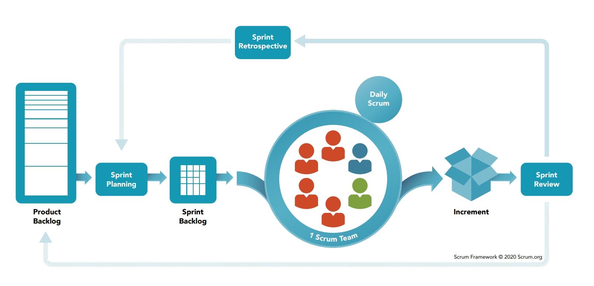
**Figura 61** Scrum Framework:  https://scrumorg-website-prod.s3.amazonaws.com/drupal/2021-01/Scrumorg-Scrum-Framework-tabloid.pdf 


* **Correctivos**: Utiliza el método de Kanban (Kanban, 2022) para la gestión de tareas. Se utiliza un tablero simplificado (Fig. 62) con tareas en: To-Do, In Progress y Done. El ciclo temporal o similar sprint se define de 4 semanas. Al finalizar cada ciclo se realizan ceremonias de retrospectiva, reorganización, re-priorización del backlog de tareas y otras tareas de gestión varias.

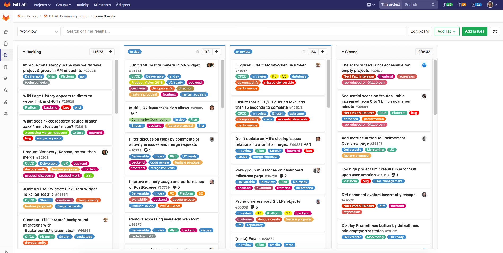
**Figura 62:** Kanban workflow:  https://about.gitlab.com/images/blogimages/workflow.png 

**Referencia:** Wikipedia contributors. (2022, March 30). Kanban (development). In Wikipedia, The Free Encyclopedia. Retrieved 17:25, April 14, 2022, from https://en.wikipedia.org/w/index.php?title=Kanban_(development)&oldid=1080155858


### 5.5.5 Herramientas: Git y Base de Conocimiento

El equipo de producto SectTx Analysis utiliza las siguientes herramientas (Fig. 63) como base de conocimiento y repositorios de información:

* **Gitlab**:
	* Repositorio de código fuente y test unitarios
	* Repositorio de pruebas de integración API, UI, scripts, etc.
	* Wiki de documentación técnica: funcionalidad, ADRs, arquitectura, MTP, configuración de ambientes de desarrollo y testing.
	* Tablero de issues para Scrum y Kanban, con el uso de flujo de tareas diferencias, etiquetas, milestones, registro de horas, estimaciones, referencia a commit y otros artefactos de desarrollo. Se registran: feature requests, épicas, user stories, y bugs.
	* CI/CD: pipelines de build, test, seguridad, generación de imágenes docker y deploy en ambientes Cloud.
* **Microsoft Teams**:
	* Comunicación general en grupos de trabajo de la organización.
	* Sala de desarrollo específica para el equipo de SectTx.
	* Eventos de comunicación, retrospectivas, demo, review, capacitaciones.
	* Mensajería peer-to-peer.
* **Microsoft Sharepoint**:
	* Repositorio de documentación general.
	* Información asociada al producto: hojas de datos, documentos, presentaciones, imágenes, videos, recursos, etc.


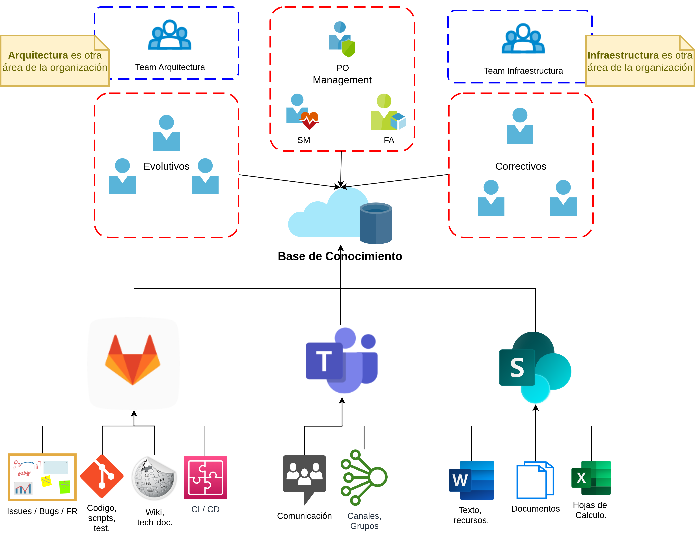
**Figura 63**: Organización de Equipo, Roles, Herramientas y Base de Conocimiento. Imagen Fuente (Propia)


### 5.5.6 Flujo de Trabajo Parte 1 y 2

Para describir el flujo de trabajo y Organización de la Información, se utilizará la Fig. 64. El flujo de trabajo de desarrollo comienza con el Proceso de Descubrimiento (A) que arranca con 2 entradas: 

* **Soporte**: el área de soporte recibe todas las consultas, solicitudes y errores (bugs) o mal-funcionamiento del producto que está en ambientes productivos de los clientes.
* **Negocio, Mercado o Cliente**: Pueden surgir nuevas funcionalidades u oportunidades de negocio ya sea desde los mismo clientes o internamente al analizar la competencia y el mercado.

Cualquiera de estas entradas son redirigidas a la Mesa de Entrada (1) que es básicamente un tablero de GitLab donde se cargan incidencias de tipo Feature Request (FR) o dependiendo del análisis inicial, si resulta que viene del área de Soporte y se identifica como un Bug entonces, se carga una incidencia de dicho tipo.

El siguiente paso es el Análisis Inicial de la FR / Bugs donde participan principalmente el Product Owner (PO) y el Analista Funcional (FA). Del análisis inicial se determina la criticidad, prioridad, planificación de la Issue registrada, así como también si se requiere más información o tareas adicionales de análisis. Todas las Issues de la mesa de entrada son trabajadas en un tablero denominado Tablero de Feature Requests (FR) / Bugs (2).

El proceso continúa en el Proceso de Refinamiento (B) que comienza con cada inicio de Sprint (en la semana 4 de la instancia de Scrum definida en el equipo). Todo el equipo se reúne y revisa las issues en el Tablero Product Backlog (3), que deben estar ordenadas y priorizadas por el PO para comenzar con refinamiento y planificación. En éste proceso, el equipo completo y posiblemente otras personas de otros equipos participan, con el objetivo de aclarar las FRs y así comenzar el proceso de Análisis, Refinamiento y descomposición de tareas (4) que resulta en la generación de Épicas  → User Stories → Tasks. La idea central es descomponer problemas en pequeños problemas a resolver en tiempos no mayores a 3 días laborables (18 hs aproximadamente).

Un aspecto importante del resultado de los procesos de Descubrimiento y Refinamiento es la Trazabilidad (5). Todas las Issues son gestionadas a través de la herramienta de tableros de Gitlab y así como son creadas, son relacionadas entre sí. La trazabilidad es un aspecto crítico para asegurar la calidad (QA).

Realizando el refinamiento, el equipo se sustenta en diagramas (Whiteboards), información disponible, información del mercado, casos de uso de los clientes y cualquier información adicional que pueda resultar útil para entender los desarrollos. Toda la información o artefactos generada es Identificada y almacenada en la Base de Conocimiento del Producto (6) (Sharepoint, Tech Wiki, etc).


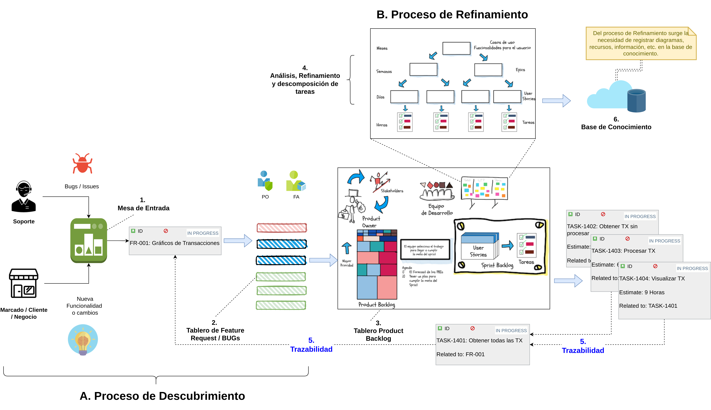
**Figura 64:** Flujo de Trabajo, parte 1. Descubrimiento y Refinamiento. Imagen Fuente (Propia)


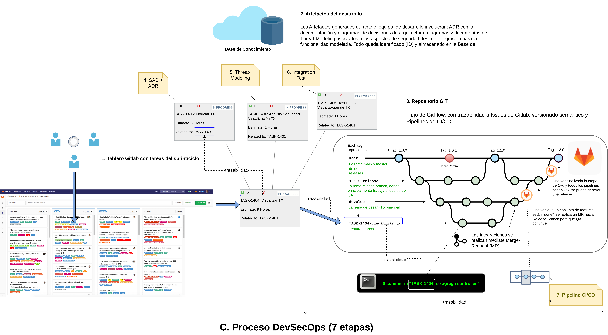
**Figura 65:** Flujo de Trabajo Parte 2. Tablero, Artefactos y Repositorio. Imagen Fuente (Propia)


Luego del descubrimiento y refinamiento, viene la etapa de Desarrollo, Seguridad y Puesta en Producción o DevSecOps. El Proceso DevSecOps - Fig. 65 (c) está armado en 7 (siete) etapas. 

Una vez iniciado el sprint de <mark style="background: #FFF3A3A6;">**Evolutivos** o el Ciclo de Correctivo</mark>, el equipo tiene pre-asignadas algunas de las tareas del tablero de Gitlab (1). La tarea principal (o tarea padre) generalmente se descompone en tareas más pequeñas para desarrollar cada uno de los artefactos necesarios para el desarrollo.

Uno de los primeros artefactos es documentar o actualizar el<mark style="background: #FFF3A3A6;"> SAD y/o los ADRs</mark> (4) correspondientes. El SAD y los ADRs representan la documentación técnica del producto, generalmente desarrollada por el equipo de desarrollo y el equipo de Arquitectura. El equipo en conjunto realiza el análisis, diseño, modelado y documentación de la funcionalidad a implementar. Los ADRs se escriben usando notación sencilla de Markdown como parte de la Wiki del producto. También se utiliza la capacidad de Gitlab para procesar Diagram-as-code (ejemplo, usando PlantUML o Mermaid.js) y se genera el modelado usando el mismo archivo Markdown.

El SAD y los ADRs se actualizan al comienzo de cada cada tarea para analizar, diseñar y dejar documentación asociada a las decisiones de arquitectura que se pueden llegar a tomar al implementar una nueva funcionalidad o corrección.

El Proceso de Análisis, Diseño y Modelado de Seguridad denominado <mark style="background: #FFF3A3A6;">Threat-Modeling</mark> (5) es el mismo proceso de Análisis, Diseño, Modelado y Documentación pero ahora desde la perspectiva de Seguridad, Desarrollo Seguro y Testing de Seguridad. Utilizando documentos en Markdown y los diagramas que se renderizan en Gitlab, se generan documentos de Threat-Modeling en la wiki del producto donde se generan artefactos como Diagramas de amenazas o Árboles de ataque, y se decide la aplicación de patrones de seguridad (de ser necesario).

Test de Integración (6). Durante el desarrollo de los procesos de registro de ADRs y de Seguridad, se comienza con la especificación de las pruebas de API, UI y E2E. Se utilizan varias herramientas en conjunto, por ejemplo, Robot Framework para modelar las especificaciones de pruebas de UI usando Gherkin como notación de test funcionales. Además se utiliza Postman para generar la especificación de pruebas de API junto con los test (assert de request) para validar la API una vez implementada.

Los Test de Integración de API, UI y E2E se arman pensando en la funcionalidad final y la validación de las historias de usuario (que se desprenden de los casos de uso y casos de negocio).

Todos los artefactos generados durante éstas etapas son almacenados ya sea en la wiki, o si se trata de otro tipo de artefactos (screenshots, documentos de texto, planillas de cálculo, presentaciones) se deben almacenar en la Base de Conocimiento (2) con el identificador correspondiente, a fin de tener trazabilidad y que sean posteriormente recuperables sin mayores inconvenientes.

La codificación generalmente se inicia una vez que el análisis, diseño y especificación inicial de pruebas está en progreso. El trabajo se realiza en el Repositorio de Código Fuente Git (3). Se emplea un esquema basado en Git Flow para organizar las branches y los elementos de código fuente, por ejemplo: branches, versiones, archivos de configuración, Pipelines de CI/CD (7). Además de contener en código fuente y archivos adicionales en un lugar centralizado y organizado con el esquema de Git Flow, se emplea un mecanismo donde las Features Branch son nombradas anteponiendo como prefijo el ID de las tareas de desarrollo de Gitlab (trazabilidad). Tanto las branch como los commit son identificados con éste prefijo para armar un “historia” detallada del desarrollo.

Con el uso de Git Flow se emplea el mecanismo de Merge-Request para integrar los cambios entre ramas. Un Merge Request se genera al finalizar una tarea, feature o task y debe contener al menos 2 revisores, donde uno de los revisores debe ser el líder técnico del equipo de desarrollo.

En todos los artefactos, se utilizan las referencias a las tareas del tablero de Gitlab para asegurar la trazabilidad del proceso en todo momento, como parte de la estrategía de QA.

Todas las pruebas (unitarias, integración, seguridad) tienen un stage o etapa dentro del flujo del Pipeline de CI/CD (7). El pipeline está categorizado en 8 fases y cada una tiene una o varias etapas asociadas. Cada fase tiene una responsabilidad bien definida y ejecuta secuencialmente una serie de tareas automatizadas para garantizar la construcción de artefactos (Dev), validación (QA y Sec) y puesta en producción (Ops) de una versión productiva del Producto de Software en caso de que el pipeline termine sin errores en alguna de sus etapas intermedias.

Dentro del flujo de trabajo con Git y el Pipeline de CI/CD se aplica el concepto de Integración Continua (CI). Las ramas “develop”, “release-branch” y “master” tienen cada una un pipeline asociado y cada pipeline tiene un ambiente de deployment en una nube (Cloud) basado en Docker disponibles:

- develop-branch: ambiente estable del equipo de desarrollo.
- qa-branch: ambiente estable del equipo de QA.
- security-branch: ambiente de pruebas de seguridad, SAST, DAST, Pentesting.
- product-branch: ambiente de pruebas y evaluación de Producto en UX/UI, mejoras, detalles.
- master-branch: Promoción a ambiente de producción.


### 5.5.7 Diseño, SAD, ADR's y MTP

La Fig. 66 muestra un ADR generado usando notación de Markdown desde la wiki de Arquitectura parte del repositorio Gitlab de SectTx Analysis. Se observa que todo ADR debe tener referencia a una task para indicar la trazabilidad u origen de dicha decisión de arquitectura.

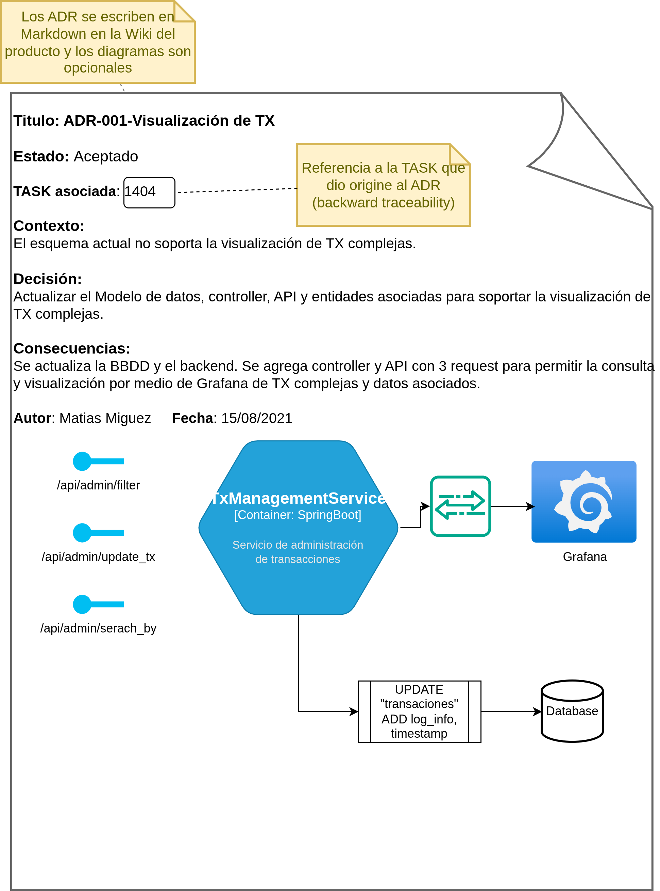

La Fig. 67 se corresponde a la página renderizada de Markdown de la wiki. La página está estructurada a modo de un SAD (Software Architecture Document). En el SAD se registran y modelan los aspectos de interés sobre la arquitectura del producto SectTx Analysis. Si bien es un documento de orientación técnica, también se usa como fuente de información para la wiki de usuarios finales del producto gracias a la interacción con el equipo de technical writers.


**Ejemplo de indice de SAD**
```
1. Introducción  
   1.1 Propósito del documento  
   1.2 Alcance del sistema  
   1.3 Definiciones y referencias  

2. Visión general del sistema  
   2.1 Descripción general  
   2.2 Objetivos y casos de uso principales  

3. Arquitectura del sistema  
   3.1. Driving requirements
   3.2. Background de la solución
   3.3  Vista lógica  
   3.4  Vista física / de despliegue  
   3.5  Componentes principales y sus interacciones  

5. Diseño de datos  
   4.1 Fuentes de datos  
   4.2 Modelos y flujos de información  

6. Seguridad y cumplimiento  
   5.1 Controles de acceso y autenticación  
   5.2 Cumplimiento normativo y privacidad  

7. Integraciones externas  
   6.1 APIs y servicios externos  
   6.2 Protocolos y formatos de intercambio  

8. Consideraciones operativas  
   7.1 Escalabilidad y rendimiento  
   7.2 Monitoreo y mantenimiento  

```
**Figura 67: ** Wiki de Arquitectura basada en template SAD con Markdown de Gitlab. Imagen Fuente (Propia)


Para documentar algunos aspectos de alto nivel de SectTxnalysis se utiliza el modelado usando C4-Models. Por ejemplo, la Fig. 68 muestra el diagrama de contexto de SectTx Analysis donde se puede observar la interacción con componentes externos, como son los usuario del producto (Analistas de Fraude), un core bancario de ejemplo y el motor de base de datos.

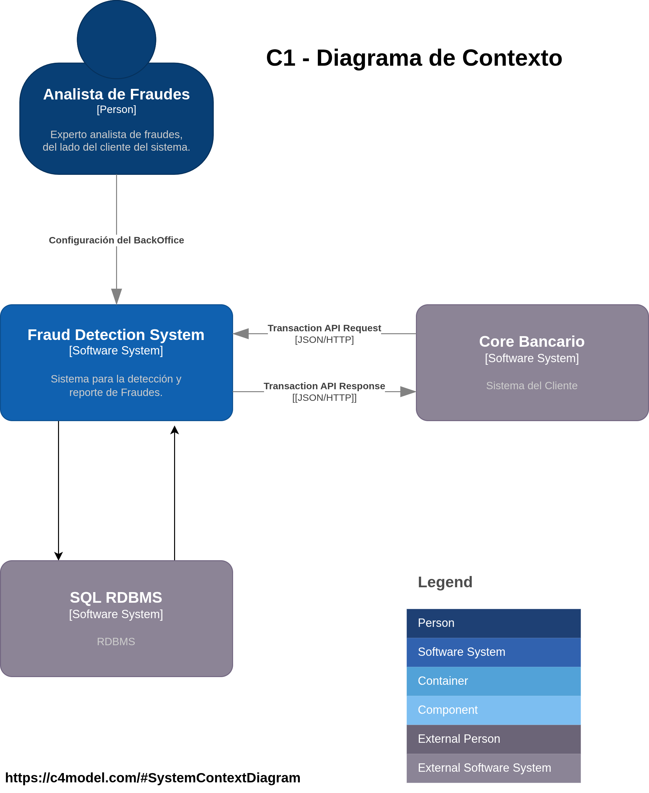
**Figura 68:** C1 - Modelo de Contexto para SecTx Analysis. Imagen Fuente (Propia)


La Fig. 69 es un artefacto de modelado de seguridad, parte de la metodología de Threat-Modeling. La notación gráfica no es estrictamente estándar, pero sirve para documentar, modelar y comunicar el diseño seguro de cada una de las funcionalidades del producto.

Todo artefacto tiene un identificador y una tarea asociada, componentes fundamentales para asegurar trazabilidad y por lo tanto, asegurar la calidad del producto.

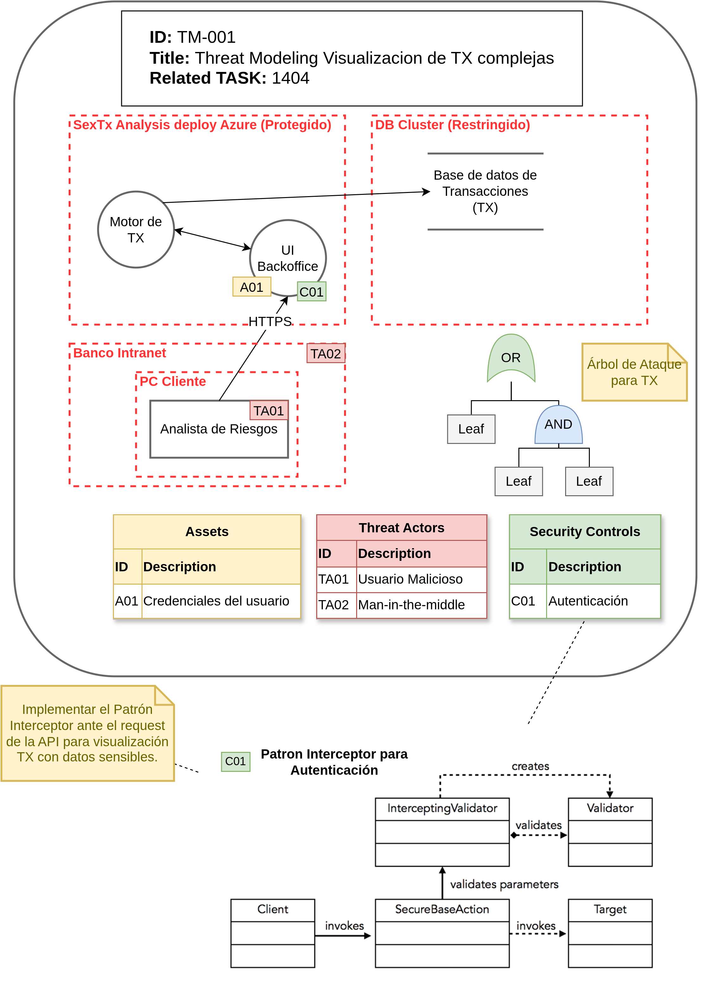
**Figura 69**: Threat-model para Funcionalidad de SecTx Analysis. Imagen Fuente (Propia)


Así como existe una página en la wiki del producto dedicada exclusivamente a los aspectos de arquitectura, también existe una página para documentar la estrategía de pruebas del producto o Master Test Plan (MTP). La Fig. 70 representa el MTP del producto SectTx Analysis.


```
1. Introducción  
    1.1 Descripción del producto  
    1.2 Propósito del Master Test Plan  
    1.3 Audiencia
    
2. Alcance  
    2.1 Sistema bajo prueba (SUT)  
    2.2 Funcionalidades a probar  
    2.3 Fuera de alcance
    
3. Estrategia de pruebas  
    3.1 Nivel de criticidad  
    3.2 Tipos / categorías de pruebas  
    3.3 Identificación única de pruebas (Test ID)
    
4. Repositorio de pruebas  
    4.1 Repositorio central de casos y resultados
```
**Figura 70:** Wiki del Master-Test-Plan (MTP) para SectTx  Analysis. Imagen Fuente (Propia)


En el MTP se define la estrategía de testing y aseguramiento de calidad del producto a alto nivel. Se definen los módulos a probar, los aspectos que quedan fuera de alcance, el mecanismo de identificación de los artefactos de testing, la caracterización, herramientas, a utilizar, repositorios de fuentes de scripting y cualquier otra información que pudiera ser relevante para las tareas de testing del producto. Uno de los aspecto clave de un MTP son los casos de pruebas y para cada caso de prueba, los criterios de aceptación, junto con los test vectors necesarios para validar los input y outputs esperados.

En la Fig. 71 se observan dos herramientas utilizadas para la generación de los artefactos o scripts de pruebas. Arriba se muestra el IDE Eclipse RED con Robot Framework y bibliotecas de Selenium entre otras para realizar el testing de UI o interfaces gráficas del producto. El framework permite la definición de scripting usando notación de funcionalidad estándar o Gherkin. Abajo se observa la herramienta Postman para la definición y pruebas de la API del producto. En ambos casos se observa que cada script tiene una estructura particular como nombre. Esa estructura o ID de test es la definida en el MTP de la wiki de Testing.


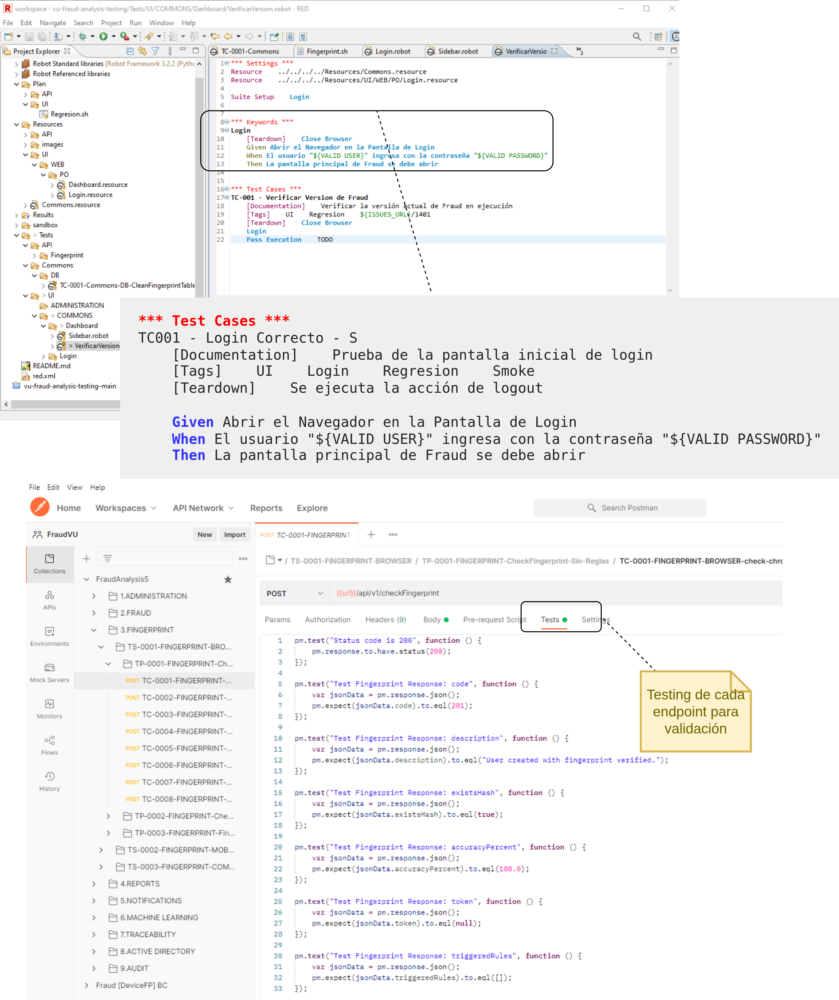
**Figura 71:** Artefactos de QA Automation basados en Postman y Robot Framework. Imagen Fuente (Propia)

Como parte del ciclo normal de desarrollo, se utiliza un pipeline de CI/CD que se ejecuta con cada merge-request en el repositorio Git para las ramas definidas del pipeline (no todas las ramas ejecutan el pipeline, el criterio es definido por el equipo de desarrollo). En la Fig. 72 se observa el pipeline completo de CI/CD, compuesto por 8 etapas, y en cada etapa pueden existir una o varias stages. Una stage es una división “lógica” utilizada para ejecutar una tarea automatizada específica, se puede pensar que cada stage tiene una responsabilidad asignada.


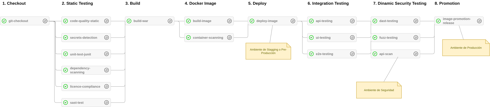
**Figura 72:** Pipeline de CI/CD en Gitlab para SecTx Analysis. Imagen Fuente (Propia)

Cada stage del pipeline de CI/CD se ejecuta y tiene un estado final de esa ejecución que puede ser:

- Pass (se ejecutó sin errores)
- Warning (existen problemas durante la ejecución pero no son críticos ni graves)
- Error (la ejecución finalizó con errores)

Ante la falla (Error) de cualquier stage en cualquier etapa del pipeline, la ejecución completa del pipeline finaliza con el estado de Error. Esa ejecución fallida dispara un correo electrónico y OpsChat (mensaje en un canal de Teams) para notificar del error y que el equipo de Desarrollo quede notificado inmediatamente. Ante un estado de error, es prioridad que el equipo de desarrollo lo resuelva lo más pronto posible.


### 5.5.8. Flujo de Trabajo Parte 3

La última parte del flujo de trabajo se representa en la Fig. 73, donde se definen 4 procesos. El Proceso de Deployment y Producción (a) comienza una vez que el pipeline de CI/CD paso por todas sus etapas sin problemas. Al finalizar el pipeline, el artefacto final que representa una nueva versión del producto SectTx Analysis es promovida a una ambiente Cloud de producción.

El ambiente de producción tiene un conjunto de herramientas específicas para asegurar la escalabilidad, estabilidad, performance, registro de logs y aspectos de observabilidad del producto en ejecución. Aquí un equipo de DevOps Engineer se encarga de mantener el Proceso de Monitoreo, Logging y Observabilidad (b) al día para asegurar una buena experiencia a los usuarios en producción.

Durante las etapas finales del desarrollo, se ejecuta el Proceso de Documentación (c), donde el equipo del área de Productos (llamados Technical Writers ó UX/UI Writers) es la encargada de actualizar y corregir la documentación de usuario del producto, basando en la comunicación el equipo de desarrollo y toda la información almacenada y disponible en la base de conocimiento (Changelog, SAD, ADR, MTP, Threat-Models). El resultado de éste proceso es la actualización de la wiki publica del producto utilizada por los usuarios o clientes de SectTx  Analysis.

Finalmente, queda el Proceso de Soporte y Feedback (d), donde el equipo de soporte y la mesa de entrada , son los encargados de dar soporte, guiar en la implementación, despejar dudas o inclusive hacer llegar a los responsables del producto mejoras o cualquier elemento de negocio que pudiera resultar en una oportunidad de negocio o mejora del producto. El proceso de soporte resulta en un input importante para el producto y es donde se generan Bugs o Task que inicia todo el proceso nuevamente.

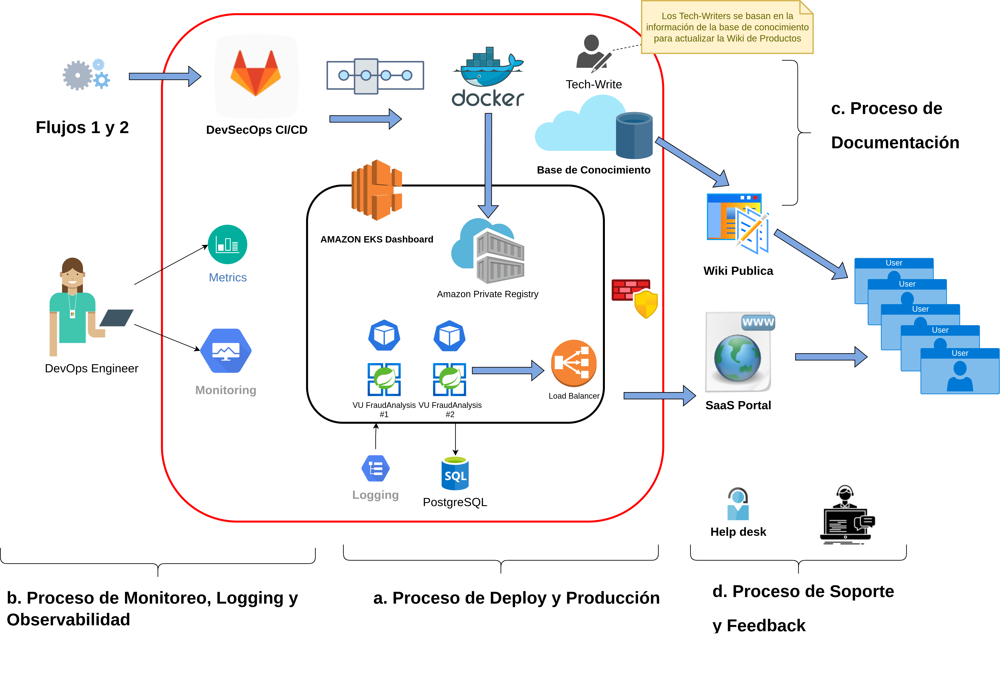
**Figura 73:** Flujo de Trabajo, parte 3. Procesos de Deploy, Monitoreo. Documentación de usuario, Soporte y Feedback. Imagen Fuente (Propia)

En este último esquema de soporte y feedback se puede definir SLA y el mecanismo de niveles de soporte L0, L1, etc para el servicio. Junto con todo lo relativo a la gestión de releases y soporte en producción. Para estas tareas igualmente se requiere del diseño de esos procesos, iniciando por un alto nivel y estableciendo los niveles de comunicación, responsables, escalado y priorización de las incidencias o ticket.


---


# 6. Conclusiones

Todas las metodologías, procesos y técnicas que se han desarrollado buscan generar productos o servicios de alta calidad, que cumplan con las expectativas del negocio, la empresa y las empresas que los desarrollan. Para lograr ese nivel de calidad es indispensable plantear estrategias a corto, mediano y largo plazo. La estrategia tiene que tener una visión de alto nivel, que observe y articule todas las partes, equipos, tareas, herramientas y cualquier otro componente necesario para lograr el objetivo de calidad en el producto y/o servicio.

La visión estratégica por sí sola no alcanza, al igual que intentar implementar la metodología de DevSecOps por sí sola. Se requieren que los siguientes elementos de una organización se desarrollen y se acepten para lograr una implementación exitosa:

- Cultura, personas y líderes. Como se planteó inicialmente, la base del éxito es la cultura, las personas, pero también tiene que haber “líderes” que tengan la visión estratégica.

- Excelencia técnica y aceptar los errores, aprender de ellos y buscar la mejora continua. Para ésto es necesario que la cultura de la organización acepte éstos ideales y que los líderes del equipo den soporte a éstas ideas.

- Orden, prolijidad, trazabilidad, centralización de información. La excelencia técnica debe buscarse continuamente y tienen que existir líderes técnicos que ayuden y soporten ésta búsqueda continua de hacer las cosas mejor que antes.

- Se tienen que armar Roadmaps a corto, mediano y largo plazo que permitan a todos los integrantes de la organización conocer el “norte” al cual se dirigen. Los pasos a seguir no son rígidos ni estáticos, pueden surgir problemas en el camino y es importante que se actualicen los roadmaps para no perder el rumbo.

- Desde el inicio, en cada etapa, en cada idea, implementación o tarea a realizar, pensar en las pruebas, la automatización de pruebas y tareas, tener documentación liviana, útil. Dejar las pruebas para etapas intermedias o tardías es un problema que luego se paga más caro. El precio de la No-Calidad siempre es más alto. Las pruebas y la automatización son elementos que están disponibles siempre, lo que hace falta es que los líderes de equipos incentiven agresivamente su uso e implementación. Las organización deben replantearse comenzar cualquier proyecto mirando la calidad como parte fundamental de todo producto o servicio.    


La tarea no es sencilla, pero justamente ésta complejidad es la que nos tiene que alimentar personal y profesionalmente. Si no fuera así, ¿para qué hacer lo que hacemos?

---

**Autor: Miguez Matias, contacto:  https://www.linkedin.com/in/matiasmiguez/**

**TFM: Posgrado de Especialización en Ingeniería de Software**

**UCA - Universidad Católica Argentina**

---

## Referencias principales

- [Accelerate: The Science of Lean Software and DevOps — Nicole Forsgren, Jez Humble & Gene Kim, IT Revolution Press, 2018](https://itrevolution.com/product/accelerate/)
- [The DevOps Handbook — Gene Kim, Patrick Debois, John Willis & Jez Humble, IT Revolution Press, 2016](https://itrevolution.com/product/the-devops-handbook/)
- [Modern Software Engineering — David Farley, Addison-Wesley, 2021](../books/modern_software_engineering.md)
- [Continuous Delivery — Jez Humble & David Farley, Addison-Wesley, 2010](https://continuousdelivery.com/)
- [ISO/IEC 25010:2023 — SQuaRE Quality Model](https://www.iso.org/standard/78175.html)
- [OWASP Top Ten — Open Web Application Security Project](https://owasp.org/www-project-top-ten/)
- [The Pragmatic Programmer — Andrew Hunt & David Thomas, Addison-Wesley, 2019](https://pragprog.com/titles/tpp20/the-pragmatic-programmer-20th-anniversary-edition/)

## Notas relacionadas

- [DevSecOps Foundations](../cybersecurity/dev_sec_ops_foundations.md)
- [TDD y BDD](../testing/on_unit_test_tdd_and_bdd.md)
- [BDD con Cucumber](../testing/bdd_with_cucumber_java_notes.md)
- [Architecture — Hexagonal](../sw_and_system_architecture/on_hexagonal_architecture_notes.md)
- [Agile y Scrum](../software_engineering/agile_and_scrum.md)
- [Calidad de Software](software_quality.md)
- [Testing de Software](software_testing.md)

**Año: Octubre 2022**