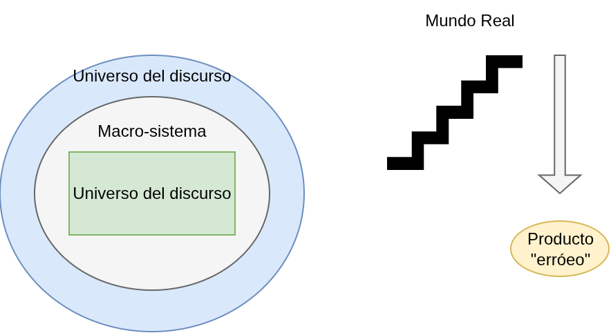
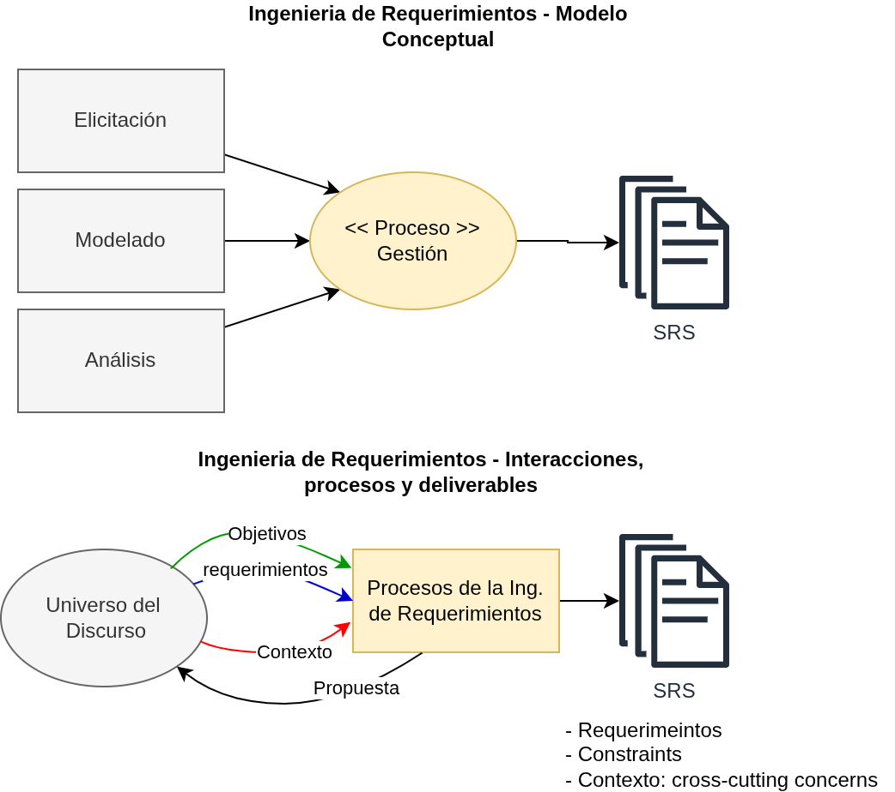

## Definiciones

 Que es un **Requerimiento**?; Necesidad del cliente que debe ser cumplida por el software. Condición que debe cumplir el software: Esto implica que el desarrollo del software debe satisfacer ciertos criterios y funcionalidades para ser considerado exitoso.

- **Requisito**: Se refiere a una condición específica que el software debe cumplir. 
- **Requerimiento**: Se refiere a la necesidad del cliente que motiva el desarrollo del software.

<mark style="background: #FFF3A3A6;">¿Por que falla el desarrollo del software?</mark>

**Crisis del Software**: La mayoría de los problemas en el desarrollo de software se deben a fallas en la especificación sobre "¿Qué construir?". La incorrecta comprensión de los requerimientos puede llevar a resultados no deseados.

## Catarata de Errores

Es como una montaña. En la cima está el mundo real, que no es perfecto. Todas las distintas capas debajo son las abstracciones y representaciones de lo que el mundo real es. Por lo tanto agregan complejidad y restan "esencia".

**Universo de Discurso**

- **Macrosistema**: Representa el contexto general donde el software será utilizado.
- **Sistema**: El sistema específico en el que se desarrollará el software.

## Evolución de los requerimientos

Es común que los requerimientos cambien o evolucionen durante el ciclo de vida del desarrollo del software. Se estima que el 50% de los requerimientos pueden cambiar. Entonces, se puede asumir que:

1. Los requerimientos van a cambiar;
2. Los requerimientos van a ser mal comprendidos;

## Ingeniería de Requerimientos

La ingeniería de requerimientos es un "concepto" + una representación. Define una metodología, junto con un proceso y herramientas asociadas. Se incluyen procesos como:

  - **Elicitación**: Obtención de requerimientos.
  - **Modelado**: Representación gráfica de los requerimientos.
  - **Análisis**: Evaluación de los requerimientos obtenidos.
  - **Gestión**: Control y seguimiento de los cambios en los requerimientos.

Una nota importante es respecto a los cross-cutting concerns. Se trata de todo aquellos elementos del contexto, que permiten ver o estimulan los requerimientos cuando hay presentes muchos componentes externos.

## Requerimientos No Funcionales

**Definición**: Son aquellos aspecto del sistema que se definen o juzgan la "operación" y no el "comportamiento" (funcionalidad). Son igualmente importantes que los requerimientos funcionales y deben ser cuantificables.

  - Ejemplos: 
    - Nivel de seguridad
    - Porcentaje de rendimiento
    - Otros criterios de evaluación.

Fuente: https://en.wikipedia.org/wiki/Non-functional_requirement

