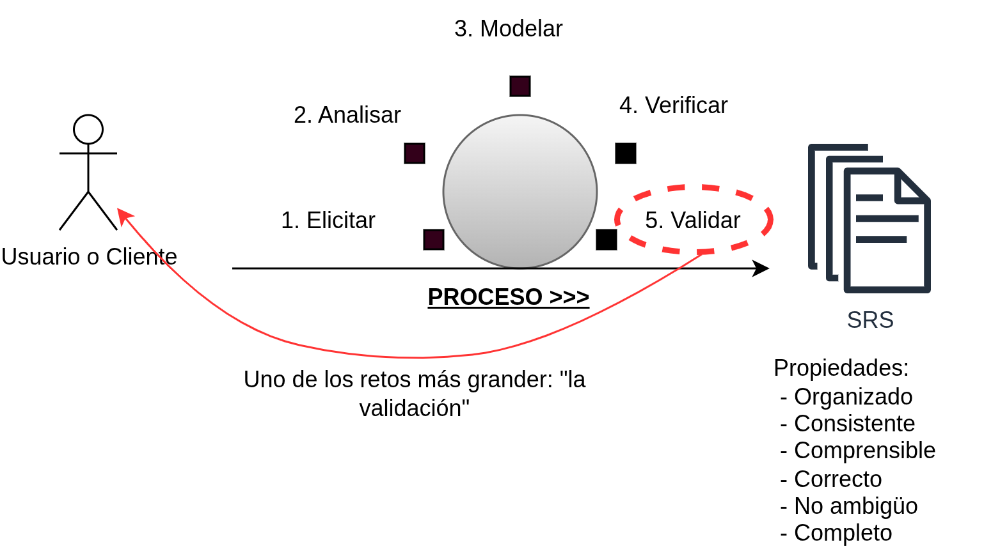
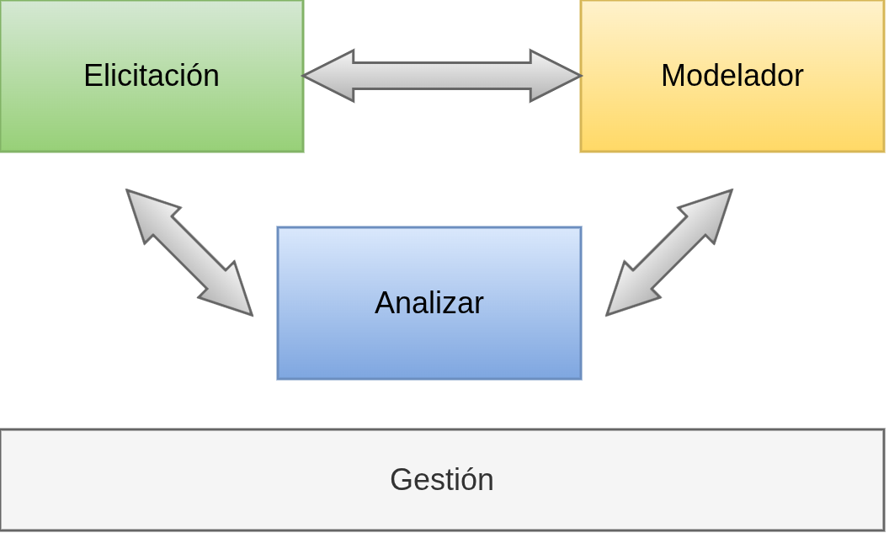
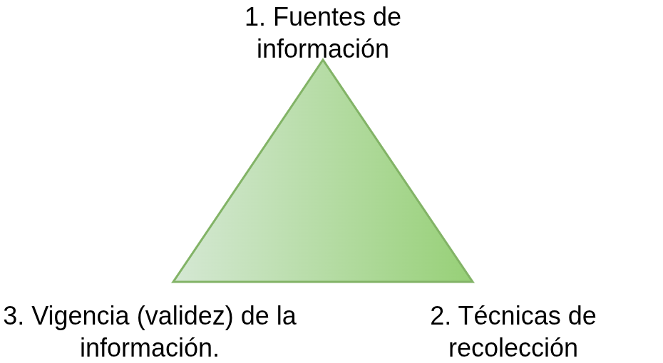
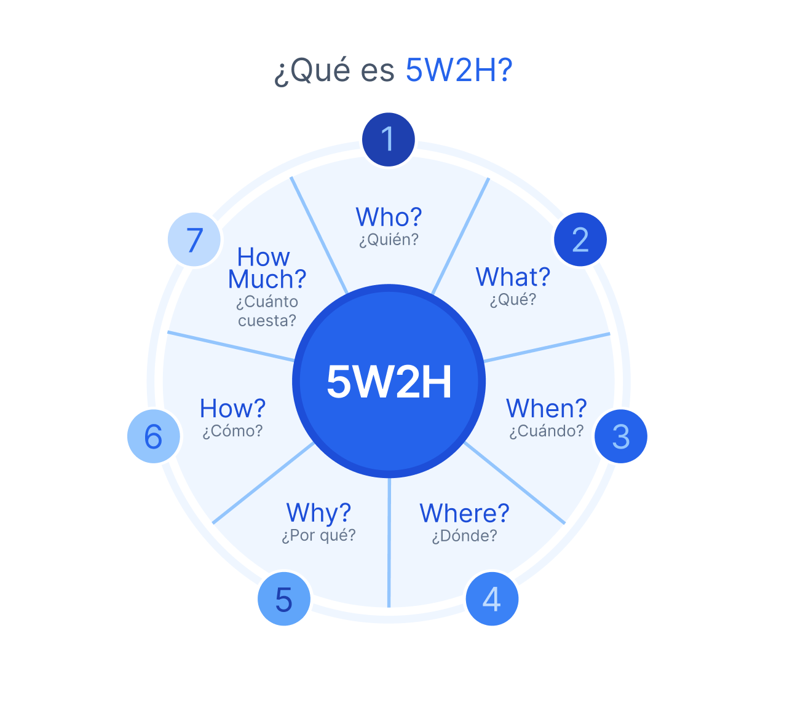
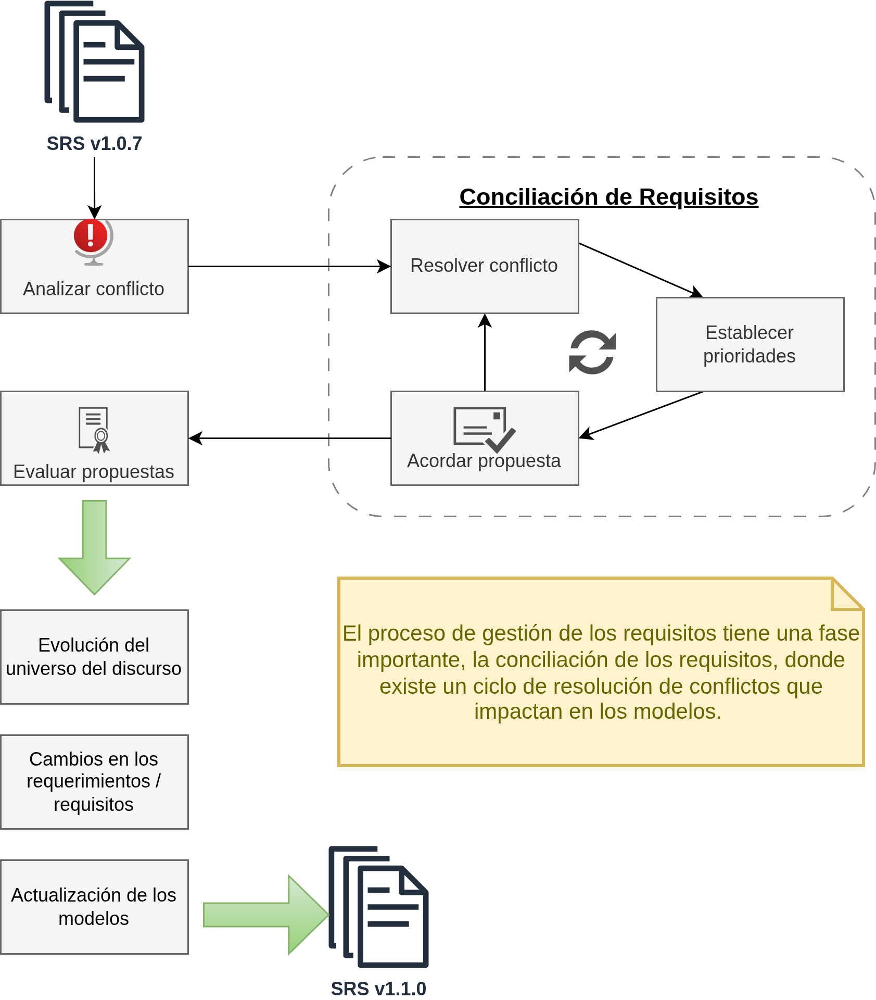
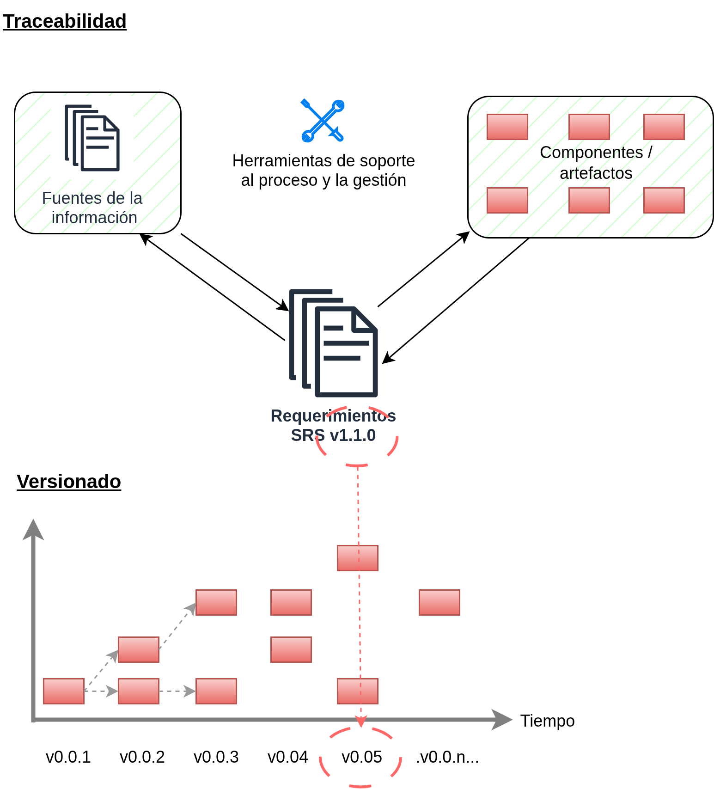

# El proceso de la Ingeniería de Requerimientos

El proceso inicia con conocer y comenzar a indagar el "universo del discurso", que representa el mundo real que se desea modelar. De aquí, es donde se debe extraer la información relevante.

Un dato importante es entender las características intrínsecas de los usuarios. Los usuarios se deben identificar, categorizar y junto con las características identificadas, se deberá además asociar como ayudarán a validar los requerimientos.



Todo el proceso se basa en la consigna de "descubrir" lo que el usuario/cliente "necesita". Para ésta tarea, la ingeniería de requerimientos se basa en lo siguientes pilares:

1. Métodos: proceso, metodología, herramientas;
2. Personal: personas capacitadas, con conocimiento de lo métodos, metódicos;
3. Tiempo: correcta gestión del tiempo, planificación, orden;
4. Puntos de vista: capacidad de ver el "sistema", el contexto y entender el universo del discurso, así como también las necesidades del negocio.

Los principales problemas que se presentan son:

1. Puntos de vista;
2. Fuentes de información;

Una buena práctica es, cuando se inicia el proceso, hacer un <mark style="background: #FFF3A3A6;">workshop</mark>. Este tipo de presentaciones sirve para presentar y explicar cual es el proceso, tiempos, herramientas que se utilizarán durante las tareas. Involucrar a los usuarios es critico y este tipo de presentaciones ayudan a esa tarea.

Además de las habilidades técnicas, son necesarias otras habilidades "blandas":

1. Comunicación constante;
2. Empatía;
3. Visualizar el trabajo (internamente en el equipo y hacia afuera).

## Actividades del proceso



### Elicitación

Esta primera etapa del proceso se basa en:

1. Identificar las fuentes de información;
2. Recolectar datos de las fuentes de información;
3. Comunicar, hablar, debatir (entre las personas)

Otros objetivos que se persiguen son:

1. Identificar a los usuarios/clientes;
2. Entender los planes del negocio, su visión;

Luego, viene la descripción de los requerimientos, para lo cual ya se deberán conocer a los usuarios. Una tarea que se desprende del proceso y se deberá realizar de forma planificada son las auditorias. Estas auditorias ayudarán a mantener el curso (horizonte) respecto de los requerimientos y el negocio. Generar los informes de auditoria permite además, de comunicar, hacer un cambio de curso si fuera necesario.




Hay un aspecto critico que no siempre sale a la vista y es el punto <mark style="background: #FFF3A3A6;">3) la vigencia de la información</mark>. Tanto los informes de auditoria como el feedback continuo de los usuarios y el negocio son críticos para estables la vigencia de la información y poder actualizarla en caso de necesidad.

Del triangulo ilustrado en la imagen, se pueden establecer 3 criterio a tener en cuenta durante todo el proceso:

1. <mark style="background: #ADCCFFA6;">actual</mark> -> lo que se hace!
2. <mark style="background: #ABF7F7A6;">formal</mark> -> lo que se debe hacer!
3. <mark style="background: #FFF3A3A6;">futura</mark> -> lo que se hará!


Durante todo el proceso, las "personas" están en el medio. Las personas tiene 2 niveles de conocimiento:

1. Conocimiento explicito: Es el conocimiento de su negocio, es estructurado, está almacenado en algún formato; se distribuye y generalmente está documentado.
2. Conocimiento tácito; lo contrario a lo anterior, es aquel conocimiento del día a día, de la experiencia y que en ocasiones no se desea compartir de forma libre o al menos, no sin restricciones.

Una tarea compleja y muy importante del proceso de elicitación es cómo convertir el conocimiento tácito en un conocimiento explicito teniendo en cuenta todas las restricciones antes mencionadas.

Existen algunas herramientas para soportar esta extracción y conversión de la información. Una de ellas es a través de una heuristica (un método de resolución de problema) llamado: Framework 5W2H.

Este framework se basa en un modelo ya existente: 5W (5 veces por qué, hasta llegar a la causa raíz).  Referencia: https://en.wikipedia.org/wiki/Five_whys

A lo cual se le suman las 2H (How y How much?)


Fuente: https://tractian.com/es/blog/5w2h-que-es


Este tipo de herramientas se utiliza para llegar a las causas raices de determinados tópicos. Las últimas 2 H's sirven para añadir información para el negocio. Es una herramienta de comunicación que intenta reducir el GAP semántico.

Hay un concepto clave en este proceso inicial de elicitación y que se puede definir como "SIMETRIA DE LA IGNORANCIA".

>[!note]
>“simetría de la ignorancia” postulada por Horst Rittel, profesor de metodología del diseño y teoría del conocimiento y de la comunicación en la HfG (Escuela superior de Diseño) de Ulm. Rittel sostiene que en los proyectos complejos, ningún actor tiene todo el conocimiento necesario para comprenderlo en su totalidad. Frente a la habitual jerarquía en la que el arquitecto impone su visión, existe una igualdad entre las partes que participan, ya que todos aportan su perspectiva y conocimiento, lo que refuerza la idea de un proceso abierto y flexible. Rittel introdujo este concepto en el contexto de la teoría de los problemas perversos (wicked problems), que son situaciones complejas y difíciles de resolver, que se puede encontrar especialmente en campos como el diseño de la ciudad, la planificación urbana o la propia política.

Fuente: https://www.jstor.org/stable/4531523
Referencia: https://en.wikipedia.org/wiki/Wicked_problem

### Modelado

Luego de recabar información y analizarla, estructurarla, comunicarla y validarla, viene un procesos de modelado. Esto quiere decir, aplicar determinadas plantillas a la información, de manera tal de seguir un determinado "modelo" de requerimiento. El modelado incluye:

1. Representación;https://en.wikipedia.org/wiki/Software_requirements_specification
2. Organización;
3. Almacenamiento;
4. Trazabilidad;

Todo el proceso de modelado y el template del modelo, es donde viven los requerimientos. A partir de este momento existe lo que se denomina un contrato. El contrato establece, en base a la información procesada y elicitada, cuales son las especificaciones y condiciones para cumplir determinada tarea.

El contrato se formaliza en lo que comúnmente se denomina un SRS: Software Requirement Specification. Un documento que es el resultado de la elicitación.


Referencia: https://en.wikipedia.org/wiki/Software_requirements_specification


### Análisis

El siguiente proceso en la cadena, es el análisis. Su función es determinar la calidad de los requerimientos listados y acordados en el SRS.

En este punto se introducen 2 conceptos clave. Verificación y Validación.

1. Verificación: se basa en establecer si estamos construyendo el producto de forma correcta;
2. Validación: indica si estamos construyendo el producto correcto.

Ambos son procedimientos diferentes y por lo tanto, se desarrollan con herramientas y técnicas diferentes. 

Referencia: https://en.wikipedia.org/wiki/Verification_and_validation

Un ejemplo más práctico es el siguiente:

```
RF-1000: “El sistema debe permitir al usuario iniciar sesión ingresando un nombre de usuario y una contraseña válidos.”
```


1. **Verificación (revisa el requisito en el SRS):**
	1. ¿Está claro y completo? (ej: define credenciales válidas e inválidas)
	2. ¿Es consistente con otros requisitos?
	3. ¿Es medible y testable?
2. **Validación (revisa el software vs. requisito):**
	1. ¿El sistema permite login con credenciales correctas?
	2. ¿Rechaza credenciales incorrectas?
	3. ¿Satisface la necesidad del usuario?

### Gestión

La gestión del proceso de ingeniería de requerimientos es un proceso totalmente transversal e involucra varias facetas, desde las personas, los procesos, las metodologías, etc.

Durante cada etapa del proceso de la IR, van a producirse varias <mark style="background: #FFF3A3A6;">"negociaciones"</mark>. La negociación se da generalmente entre las personas, esto es: los clientes, los usuarios, los stakeholder, actores externos y los ingenieros de requisitos. Se trata de un proceso de ida y vuelta, donde se evalúan los requisitos que definen el SRS (ya que se trata de un "contrato"). 

En las negociaciones aparecen varios sub-procesos y tareas que se retroalimentan para llegar a resultados. Desde analizar el conflicto, evaluar propuestas y luego conciliar los requisitos en base al input dado.



La gestión de requerimientos involucra la gestión de varias tareas:

1. Control de cambios;
2. Gestión de dependencias;
3. Rastreabilidad (o también llamada trazabilidad);
4. Uso de herramientas de soporte a los procesos;

## Rastreabilidad (trazabilidad)

El concepto es sencillo: tener la capacidad en todo momento de saber (traza) como surge un "artefacto" en toda la cadena de un proceso. Si se ve como un camino de migas (breadcrumb path), es la capacidad de pararse en cualquier punto y poder ir hacia adelante (forward traceabilty) y hacia atras (backward traceability).

Referencia: https://en.wikipedia.org/wiki/Traceability

Sumado al concepto de traceabilidad, está el concepto de "versionado". Como el mundo real cambia, cambia el negocio y así, a través del proceso de conciliación de los requerimientos, van a cambiar los requerimientos, es indispensable darle una versión a todos los artefactos. La versión permite gestionar la validez de un requerimientos, junto con su trazabilidad y así mantener la coherencia general.




### Contexto social

Un aspecto general a todo proceso de ingeniería de requerimientos es el contexto social, debido a que los requerimientos se "construyen", y esto quiere decir que hay interacciones entre personas, personas con distintos roles, responsabilidades y backgrounds. Elicitar no es otra cosa que construir los requerimientos a través de un proceso de "concebirlos y decidir".

Elicitar se resume en:

1. Adquirir conocimientos;
2. Modelar;
3. Negociar, acordad (conciliar);
4. Especificar (SRS, trazabilidad y versionado);
5. Agregar atributos adicionales;


## Requisitos

Ahora, hay que realizar una aclaración importante entre 2 conceptos:

- **Requerimiento**: necesidad o petición general de un cliente o usuario (qué quiere o necesita en términos amplios)​
- **Requisito**: condición concreta y específica que el sistema debe cumplir para satisfacer ese requerimiento (cómo se implementa esa necesidad).

Los requisitos siempre existen, pero se deben explicitar. Para explicitarlos, se les debe agregar información de contexto.

El contexto se define como el contexto de uso:

- Procesos de negocio;
- Dispositivos físicos;
- Algoritmos, computaciones y estructuras de datos;
- Instalaciones, distribución geográfica, maquinaras;

El <mark style="background: #FFF3A3A6;">contexto de uso</mark> define el macrosistema en el cual se deben especificar los requisitos y normalmente, este macrosistema se desarrolla o crea junto con los requisitos.

### Dinámica social

Ahora también existen otros factores de contexto que se deben considerar durante la especificación de requisitos.

1. Contexto de desarrollo:
	1. es un desarrollo a medida, ad-hoc, basado en el mercado;
	2. es un desarrollo interno, tercero, se utilizarán COTS?;
	3. es una actualización o ampliación de un sistema ya existente?
	4. es un desarrollo totalmente nuevo?
	5. tipo de sistema o software a desarrollar;
2. Dinámica social:
	1. Contexto de uso (usuarios, clientes, mercado);
	2. Proceso de la IR (elicitación, método, herramientas, personas involucradas);
	3. Contexto de desarrollo (a nivel técnico: desarrolladores, QA, DevOps, etc)

En la dinámica social, es clave identificar la <mark style="background: #FFF3A3A6;">posición dominante</mark>. Esto es: quienes deciden, quienes son los que mandan, como lo hacen, cuales son los intereses involucrados, etc.

## Esquemas de dinámica social

| Cliente dominante                                              | Desarrollo dominante                                                        | Cliente no maduro   | Situación equilibrada                                                     |
| -------------------------------------------------------------- | --------------------------------------------------------------------------- | ------------------- | ------------------------------------------------------------------------- |
| Gerencia (top-down)                                            | Departamento sistemas (ej: Microsoft, oracle)                               | No le importa la IR | Sistemas <> cliente                                                       |
| Departamento Sistemas (bottom)                                 | Otras áreas                                                                 | Demandas ilimitadas | Se llegan a acuerdos razonables                                           |
| Situación: <br> - poca negociación<br>- propuesta = imposición | - Prefieren desarrollo interno<br>- Les falta foco en negocio y mercado<br> | No quiere negociar  | Se sigue el proceso:<br> - Negociación<br> - Conciliación<br>  - Acuerdos |
| USAR ENLATADOS<br>ESTUDIOS DE MERCADO                          |                                                                             | USAR MÉTODOS ÁGILE  | MEJOR SITUACIÓN                                                           |

En la tabla se presentan varias situaciones de contextos sociales. Todas tienen un altísimo grado de <mark style="background: #FFF3A3A6;">"factor humano"</mark>. Todos necesitan una evaluación de madurez preliminar, para entender parte del contexto. Y en todos los casos se requieren cambios. Para poder gestionar los cambios es imprescindible una buena comunicación, debido a que cualquier cambio, involucra un "impacto" en algún punto de la organización.

Existen 2 conceptos que se pueden usar para entender estos "cambios":

1. Inculturización: sucede cuando un sistema se implanta armónicamente. Esto es, hay comunicación, se acompaña a los usuarios, se capacita, se da soporte.
2. Transculturización: cuando se altera la cultura actual de la organización, sucede cuando se compra un enlatado y se implanta de forma forzosa, se obliga a su uso

Ambos conceptos generalmente se dan en mayor o menor medida en cualquier organización. Lo importante sería tenerlos en cuenta y minimizar, a través de un correcto análisis y planificación su impacto en la organización.