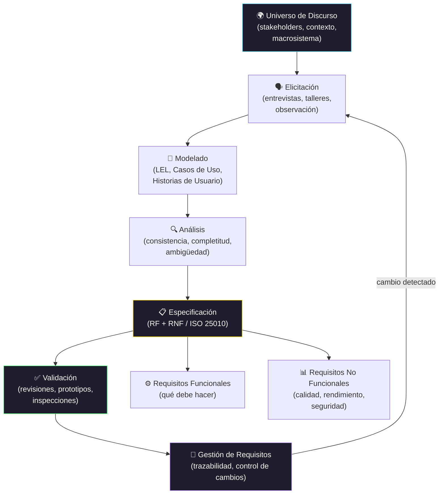

# Requerimientos de Software

[← El proceso de la Ingeniería de Requerimientos](sesion_2)

[← Inicio](https://matiaspakua.github.io/tech.notes.io)

--- 

## Proceso de Ingeniería de Requisitos

## Contenidos

Evolución de la Ingeniería de Software y futuras tendencias. Enfoque sistémico vs enfoque ingenieril. Concepto de producto y proceso. Conceptos de la Teoría General de Sistemas. Ciclo de vida del software. Factores técnicos y sociales en el proceso de software. Universo de Discurso y Macrosistema. Definición, relevancia y principios de la Ingeniería de Requisitos. Actores involucrados. La Ingeniería de Requisitos en los modelos de proceso de software. Requerimiento, Requisito y Especificación. Taxonomías de requisitos. Requisitos funcionales. Requisitos de calidad. Proceso de la Ingeniería de Requisitos: elicitación, modelado, análisis y gestión de requisitos. Una estrategia de requisitos utilizando modelos basados en lenguaje natural. Modelos Léxico Extendido del Lenguaje y Casos de Uso.
Estrategias y técnicas de la Ingeniería de Requerimientos para la determinación de los requisitos de un sistema. Especificación formal de requisitos en sistemas críticos. Modelos de requisitos orientados a estados para sistemas de tiempo real. Ingeniería de Requisitos dirigida por objetivos. Ingeniería de Requisitos en el Proceso Unificado. Requisitos ágiles. Elicitación y modelado de requisitos no funcionales. Requisitos para sistemas web y sistemas sensibles al contexto. Ingeniería de requisitos de data warehouses.