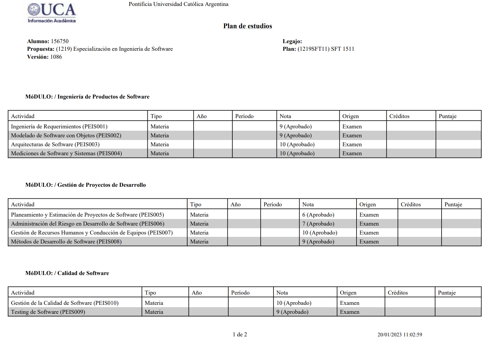
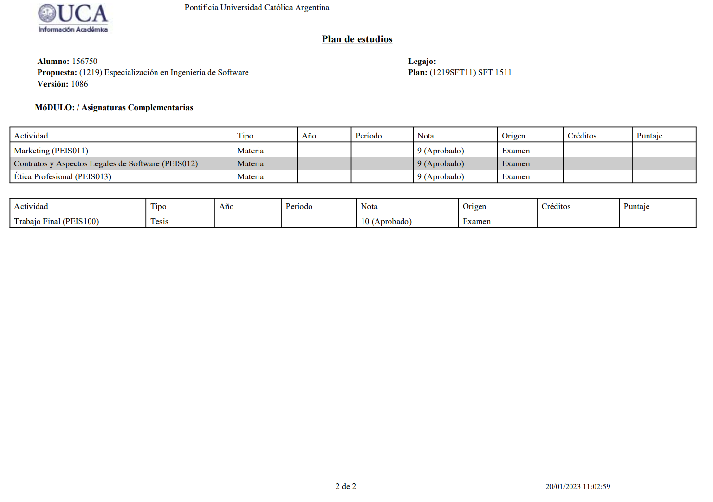

# Software Engineering Specialization 

<button class="back-button" onclick="window.location.href='https://matiaspakua.github.io/tech.notes.io'">All notes</button>

--- 

<mark style="background: #FFF3A3A6;">Módulo Ingeniería de Productos de Software  </mark>

- [Ingeniería de Requerimientos](/pages/sw_eng_specialization/software_requirements.md)
- [Modelado de Software con Objetos](/pages/sw_eng_specialization/software_modeling_with_objects.md)
- [Arquitecturas de Software](/pages/sw_eng_specialization/software_architecture.md)
- [Mediciones de Software y Sistemas](/pages/sw_eng_specialization/software_and_systems_measurements.md)
  
<mark style="background: #FFF3A3A6;">Módulo Gestión de Proyectos de Desarrollo  </mark>
- [Planeamiento y Estimación de Proyectos de Software](/pages/sw_eng_specialization/sofware_projects_scheduling_and_estimation.md)
- [Administración del Riesgo en Desarrollo de Software](/pages/sw_eng_specialization/software_development_risk_management.md)
- [Gestión de Recursos Humanos y Conducción de Equipos](/pages/sw_eng_specialization/team_driving_and_human_resource_management.md)
- [Métodos de Desarrollo de Software](/pages/sw_eng_specialization/software_development_methods.md)
  
<mark style="background: #FFF3A3A6;">Módulo Gestión de la Calidad de Software  </mark>
- [Testing de Software](/pages/sw_eng_specialization/software_testing.md)
- [Calidad de Software](/pages/sw_eng_specialization/software_quality.md)
  
<mark style="background: #FFF3A3A6;">Módulo Complementarias:  </mark>
- [Marketing](/pages/sw_eng_specialization/marketing.md)
- [Contratos y Aspectos Legales de Software](/pages/sw_eng_specialization/software_legal_aspects_and_contracts.md)
- [Ética Profesional](/pages/sw_eng_specialization/prefessional_ethics.md)

<mark style="background: #FFF3A3A6;">Proyecto Final</mark>

- [DevSecOps desde la perspectiva de QA Automation](/pages/sw_eng_specialization/final_projects_specialization.md)

## Notas de cada materia

