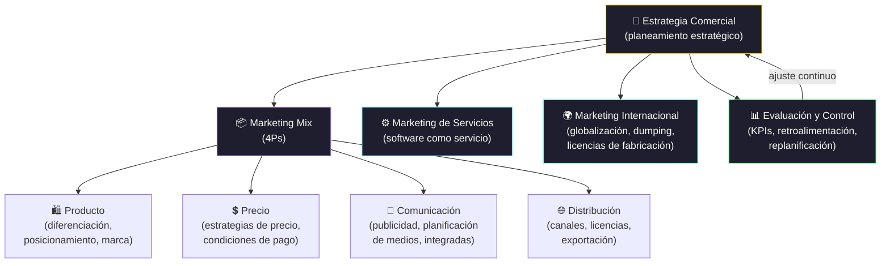

# Marketing

[← Inicio](https://matiaspakua.github.io/tech.notes.io)

--- 

## Marketing Mix para Software

## Contenidos

Manejo de la estrategia comercial y de distintas técnicas y herramientas del proceso de marketing en el software. Formulación de la estrategia comercial. Marketing y sistema de información. Planeamiento estratégico de marketing. Marketing mix. Evaluación, implantación y control de la estrategia. Estrategias y acciones sobre producto: diferenciación y posicionamiento. Consistencia entre las decisiones de producto y la estrategia. Marca. Servicio. Estrategias y acciones sobre precio y condiciones de pago. Estrategias y acciones sobre comunicación. La inversión publicitaria. Planificación de medios. Acciones integradas. Marketing de servicios. Marketing de servicios para la industria del software. Marketing internacional. Globalización. Exportación. Licencias de fabricación. Estrategias intermedias. Políticas arancelarias y barreras para –arancelarias. El dumping

## Referencias

- [Kotler & Armstrong — Principles of Marketing, Pearson, 2021](https://www.pearson.com/en-us/subject-catalog/p/principles-of-marketing/P200000005856)
- [The Lean Startup — Eric Ries, Crown Business, 2011](https://theleanstartup.com/)

## Notas relacionadas

- [Landing especialización](landing.md)
- [Trabajo Final de Especialización](final_projects_specialization.md)