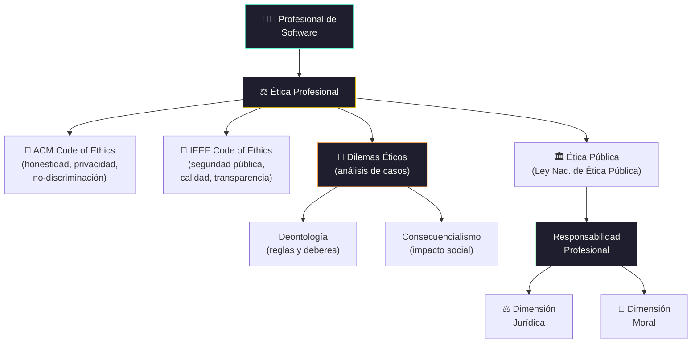

# Ética Profesional

[← Inicio](https://matiaspakua.github.io/tech.notes.io)

--- 

## Marco de Ética Profesional

## Contenidos

Concepto de Ética. Ética, moral, deontología. Caracterizaciones generales. Semejanzas y diferencias. Norma moral, norma jurídica y norma deontológica. Los derechos humanos como dimensión ética. La ética profesional. La libertad en el ejercicio profesional. Directivas y reglas de conducta en la profesión. Análisis de dilemas éticos. Deontología. Códigos de ética: La responsabilidad profesional en el campo jurídico y ético. La Ética pública. Ley Nacional de Ética Pública.

## Referencias

- [ACM Code of Ethics and Professional Conduct — Association for Computing Machinery, 2018](https://www.acm.org/code-of-ethics)
- [IEEE Code of Ethics — Institute of Electrical and Electronics Engineers](https://www.ieee.org/about/corporate/governance/p7-8.html)

## Notas relacionadas

- [Landing especialización](landing.md)
- [Trabajo Final de Especialización](final_projects_specialization.md)