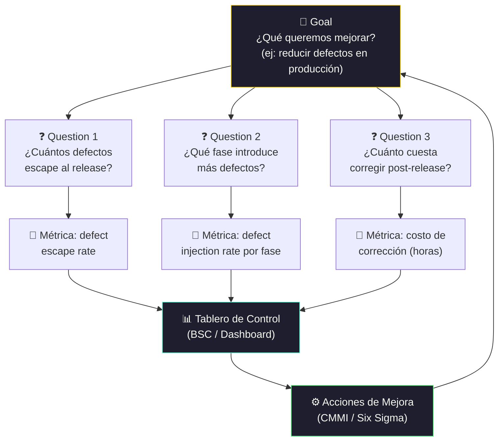

# Mediciones de Software y sistemas

[← Inicio](https://matiaspakua.github.io/tech.notes.io)

--- 

## Marco GQM de Medición

## Contenidos

Métricas específicas del desarrollo de software y del paradigma de objetos. Proceso de medición del software: Métrica y medición. Tipos de métricas y mediciones aplicadas al software. Atributos. Métricas de tamaño, esfuerzo y complejidad. Diferentes modelos de medición. Métodos para definir, implantar y usar métricas y mediciones. Metodologías para la definición y uso de las mediciones. Paradigmas para la definición de programas de medición: GQM, BSC (Balanced ScoreCard), PSM. Construcción del Plan de Mediciones. Reportes y soporte de decisiones. Uso de las métricas en un programa de mejoras. Herramientas para soportar programas de mediciones: tipos de herramientas. Armado de un tablero de control para la gestión de una organización productora de Software.

## Referencias

- [Software Metrics: A Rigorous and Practical Approach — Norman E. Fenton & James Bieman, CRC Press, 2014](https://www.crcpress.com/Software-Metrics-A-Rigorous-and-Practical-Approach/Fenton-Bieman/p/book/9781439838228)
- [Goal/Question/Metric (GQM) — Victor Basili, University of Maryland](https://www.cs.umd.edu/~mvz/handouts/gqm.pdf)
- [ISO/IEC 15939:2017 — Software Engineering: Software Measurement Process](https://www.iso.org/standard/71197.html)

## Notas relacionadas

- [Calidad de Software](software_quality.md)
- [Trabajo Final de Especialización](final_projects_specialization.md)