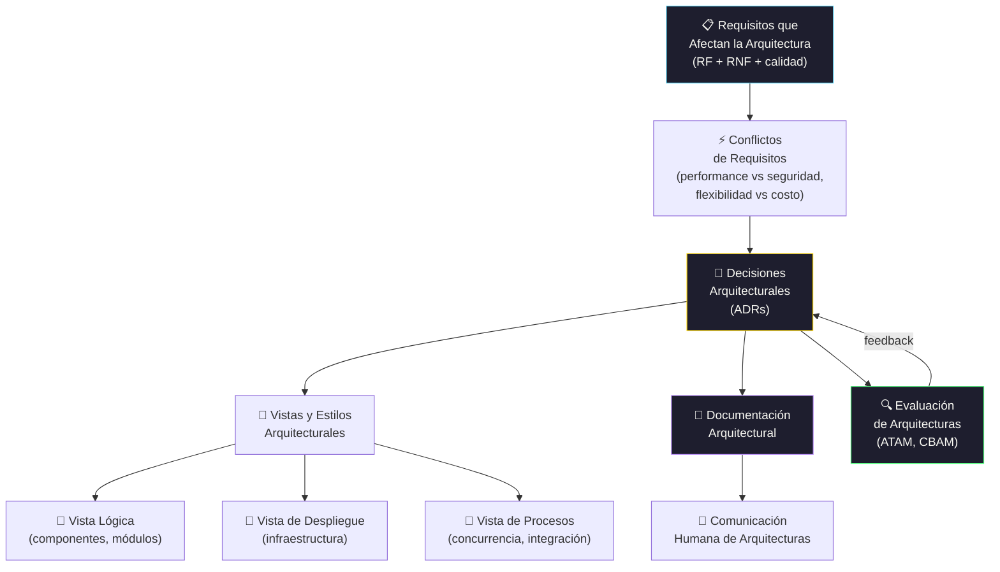

# Arquitectura de Software

[← Inicio](https://matiaspakua.github.io/tech.notes.io)

--- 

# Contenidos

## Marco de Arquitectura de Software

Conceptos, técnicas y modelos de Arquitectura de Software: Conceptos de Arquitectura de Software. Arquitecturas en el contexto de la Ingeniería del Software. Cómo se identifican los requerimientos que afectan una arquitectura de software. Conflictos entre requerimientos. 

Complejidad de crear una arquitectura de software Documentación formal en ingeniería de software. Necesidades y puntos a tener en cuenta al realizar cualquier tipo de documentación. Documentación de arquitecturas de software. Cómo se documenta una arquitectura de software. Las vistas y estilos existentes para modelar una arquitectura. Los roles y la importancia relativa de los distintos aspectos de una arquitectura. Aspectos humanos de la comunicación de arquitecturas de software. 

Evaluación y juicio crítico-objetivo de arquitecturas de software. Métodos y procesos formales, semi-formales e informales para evaluar arquitecturas de software. ROI de analizar una arquitectura de software. Parámetros para decidir si una arquitectura es lo suficientemente buena. Costo de evaluar arquitecturas de software.