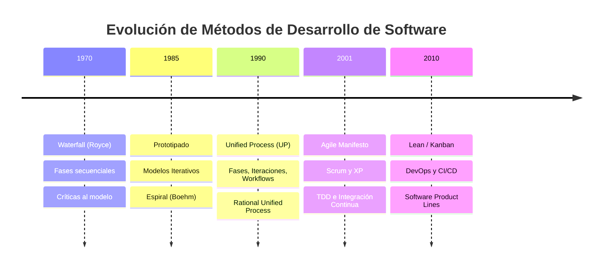

# Métodos de Desarrollo de Software

[← Inicio](https://matiaspakua.github.io/tech.notes.io)

--- 

## Evolución de Modelos de Ciclo de Vida

## Contenidos

Definición de Modelo de Ciclo de Vida. Waterfall y sus variantes. Las críticas de Royce al Waterfall. Modelos basados en prototipos. Modelos iterativos incrementales y sus variantes, el modelo en espiral. Modelos evolutivos y co-evolutivos. Modelos guiados por la arquitectura. Criterios para seleccionar un modelo de ciclo de vida en un proyecto.

El Unified Process y sus Variantes. Fases, Etapas e Iteraciones en el marco de UP. Conceptos de artefacto, worker y workflow. Repaso de los principales templates de UP. 

Métodos Agiles. Introducción a los métodos ágiles. El Agile Manifesto. Principios de los métodos ágiles. Scrum: roles, reuniones y productos de scrum. Extreme programming y sus prácticas. TDD e Integración Continua. Introducción al Lean Software Development y Kanban. 

Software Product Line. Definición de reuso sistemático. Definición de Product Line. Contextos de aplicación. Estrategias de implantación. Las prácticas esenciales de Product Line y su interpretación. Métodos Formales. La importancia de los formalismos en ciertos dominios. Introducción a los principales métodos formales de desarrollo y sus notaciones: Z, CSP y otras álgebras de procesos, FSMs y Statecharts, Cleanroom Software Development.

## Referencias

- [The Agile Manifesto — Beck et al., 2001](https://agilemanifesto.org/)
- [Managing the Development of Large Software Systems — Winston W. Royce, 1970](http://www-scf.usc.edu/~csci201/lectures/Lecture11/royce1970.pdf)
- [Extreme Programming Explained — Kent Beck, Addison-Wesley, 1999](../books/book_extreme_programming_explained.md)

## Notas relacionadas

- [Agile y Scrum](../software_engineering/agile_and_scrum.md)
- [Waterfall](../software_engineering/waterfall.md)
- [Trabajo Final de Especialización](final_projects_specialization.md)