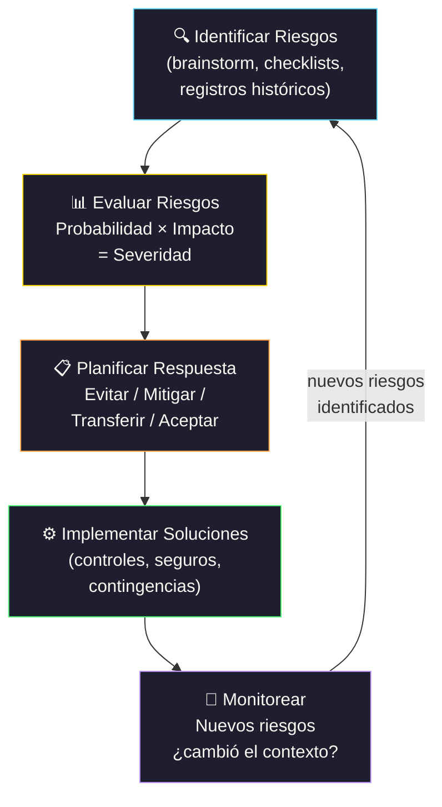

# Administración del Riesgo en Desarrollo de Software

[← Inicio](https://matiaspakua.github.io/tech.notes.io)

--- 

## Ciclo de Administración de Riesgos

## Contenidos

Conceptos, técnicas y pasos metodológicos para una eficiente administración de los riesgos en proyectos de desarrollo de sistemas. Definiciones y conceptos de riesgo y administración de riesgos. Atributos del riesgo. Tipos de riesgo. Riesgos del desarrollo de SW. Riesgos más frecuentes. Riesgos más severos. Pasos metodológicos del análisis de riesgos. Identificar posibles riesgos. Evaluar potenciales efectos. Desarrollar soluciones. Seguir el nivel de riesgo. Implementar las soluciones. Técnicas y herramientas automatizadas. Estrategias de solución de riesgos. Actitudes frente al riesgo. Teorías de Problem Solving en proyectos informáticos. Selección de alternativas de solución. Implantación de procesos de administración de riesgos. Organización para la administración de riesgos. Responsabilidades. Planificación. Manual de administración de riesgos. Procesos.

## Referencias

- [A Guide to the Project Management Body of Knowledge (PMBOK) — PMI, 7th Edition, 2021](https://www.pmi.org/pmbok-guide-standards/foundational/pmbok)
- [Risk Management for Software Projects — Robert Charette](https://ieeexplore.ieee.org/document/31560)

## Notas relacionadas

- [Métodos de Desarrollo de Software](software_development_methods.md)
- [Trabajo Final de Especialización](final_projects_specialization.md)