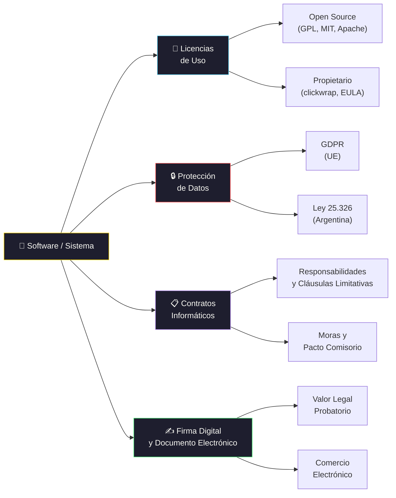

# Contratos y Aspectos Legales de Software 

[← Inicio](https://matiaspakua.github.io/tech.notes.io)

--- 

## Marco Legal del Software

## Contenidos

Legislación vigente y proyectos de ley relacionados con el software en la Argentina. Aspectos legales de las contrataciones en proyectos de desarrollo de sistemas. Derecho informático. Vinculación con otros derechos. Sistemas que contienen datos personales. Protección de datos y seguridad. Sanciones penales. Correo electrónico. Régimen jurídico del software y de las bases de datos. Régimen jurídico de los nombres de dominio. Documento electrónico. Valor legal y probatorio. Firma digital. Aspectos jurídicos relacionados con el acceso a Internet, albergue de páginas web, diseño de páginas web, publicidad en Internet, comercio electrónico en Internet. Licencia de uso de software. Licencia clickwraping. Licencia de uso de código fuente. Contratos informáticos: particularidades, responsabilidades, incumplimientos, moras. Pacto comisorio y cláusula penal. Cláusulas limitativas de responsabilidad. Contratos de proyectos de sistemas y consultoría informática.
## Referencias

- [Open Source Initiative — Licenses & Standards](https://opensource.org/licenses)
- [GDPR — General Data Protection Regulation, European Union, 2018](https://gdpr-info.eu/)
- [Ley de Protección de Datos Personales — Argentina, Ley 25.326](http://servicios.infoleg.gob.ar/infolegInternet/anexos/60000-64999/64790/texact.htm)

## Notas relacionadas

- [Ética Profesional](professional_ethics.md)
- [Trabajo Final de Especialización](final_projects_specialization.md)
