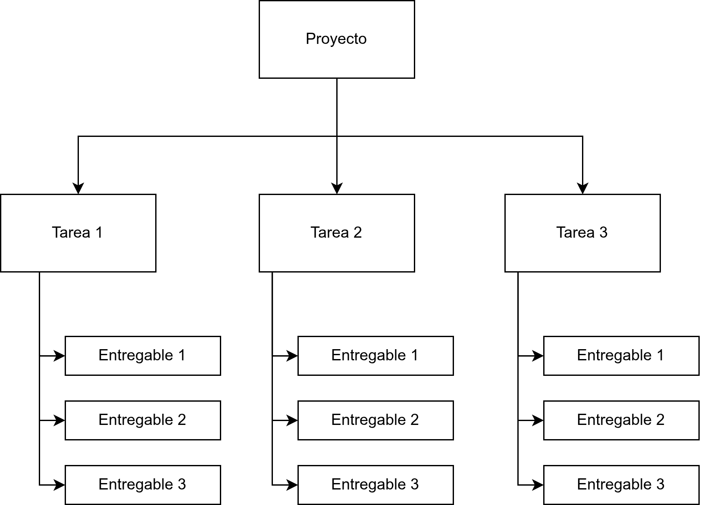

# alcance y objetivos

Un proyecto es un esfuerzo constituido por un grupo de procesos. Estos procesos se identifican como:
1. iniciación;
2. planificación;
3. Ejecución;
4. Monitoreo y control;
5. Cierre.

Este grupo de procesos es lo que determina el ciclo de vida de un proyecto. El PmBok extiende ese grupo de procesos en 49 áreas de conocimientos, los cuales están de alguna manera dentro de esos procesos base. Gran parte de estás áreas de conocimientos se ejecutan en el proceso de planificación.

A parte de los procesos, existen roles, uno de los cuales, y quizás el más conocido es el de PM o project manager cuya principal tarea es la de "integrador".

Además de tener la capacidad de tener una visión sistemica y cross, tiene un reto enorme en cuanto a traducir las necesidades de negocio y plasmarlas en su contrapartida en el proyecto y uno de los errores más grande que se le presentan a un PM es el de "<mark style="background: #FFF3A3A6;">suponer</mark>" que se sabe los que los clientes quieren.

Para minimizar el riesgo hay varias tácticas que aconsejan generalmente seguir:

>[!important]
>1. Hacer muchas entregas parciales, sin demasiado tiempo entre una y otra;
>2. Tener una visión global, cross y ;
>3. Estar muy enfocado en lo que el quiere quiere, comunicarse, escruchar;

## Gestión del alcance

Es clave en las etapas iniciales de un proyecto llegar a acuerdos y materializar por medio de acuerdos el trabajo a realizar y que quede muy claro lo que NO se va a realizar.

Es importante en este punto aclarar el alcance desde los siguientes puntos de vista:

1. Proyecto, donde se gestionan actividades y el alcance define "como";
2. Producto, donde se gestionan entregables y el alcance define el "qué";

### Componentes de gestión del alcance

Dentro del conjunto de herramientas se puede definir las siguientes:

1. Armar un plan de gestión del alcance;
2. Recopilar, clasificar y caracterizar los requerimientos;
3. Definición de técnicas y herramientas;
4. Crear una WBS (work breakdown structure), que permite definir el trabajo a realizar;
5. Acotar las expectativas del cliente;

La definición del "<mark style="background: #FFF3A3A6;">alcance</mark>" debe ser exhaustiva debido a que no todos entendemos lo mismo y por lo tanto, tanto lo que se hará como lo que no se hará es convenientes que sea claro, acordado y ayude a disminuir subjetividades.

### Project charter

Se trata de uno de los documentos iniciales que se generan en el momento en el cual se constituye un proyecto o contrato. El project charter deberá establece lo que se conoce como el SOW = Statement of Work. El SOW define:

1. las necesidades del cliente;
2. el alcance del producto o servicio;

Como se segunda parte del project charter se define, de acuerdo sea el caso, el "caso de negocio", o cual es la idea comercial que promueve la creación del projecto, el driver detras de él.

### Plan de gestión de alcance

El plan de gestión de alcance abarca varias tareas, desde definir y especificar un sistema de gestión de cambios, matriz de responsabilidades (RACI), método o proceso de gestión, las herramientas de soporte, y claro, los plazos de respuesta, definiciones y acuerdos del alcance.

El plan además deberá establecer:

1. Los supuestos y los riesgos asociados;
2. Las restricciones (internas y de contexto) y las limitaciones asociadas;

### Plan de gestión de requerimientos

Un plan de gestión de requerimientos debe incluir al menos;

1. Un apartado indicando el cómo se obtienen los requerimientos;
2. cómo serán registrados, analizados y tratados los requerimientos;
3. cómo serán gestionados los cambios en los requerimientos;
4. cómo se gestionará la trazabilidad de los requerimientos;
5. definición de las herramientas de soporte y gestión;

Tanto los requerimientos como la WBS tienen una relación de feedback reciproco, donde una tarea ayuda a la otra en su definición. Esto no quiere decir que se hagan en paralelo, pero si que la definición de una ayuda o poner contexto a la otra.

| Requerimientos       | WBS                  |
| -------------------- | -------------------- |
| Captura              | Costos               |
| Analisis             | Cronograma           |
| Registro y monitoreo | Estructura y Calidad |

>[!note]
>Hay una frase famosa que dicta: "los proyectos no fallan al final, fallan al principio"

Para poner un ejemplo, un project charter es generado y presentado a gerencia para su aprobación. En el project charter se incluye una clara <mark style="background: #FFF3A3A6;">declaración de alcance</mark>. Este tipo de documentos es generado normalmente por un PM (project manager). Junto con el alcance, se definen los objetivos del proyecto. Los objetivos generalmente se listan y para cada objectivo se realiza un análisis basado en el método SMART, donde cada objetivo se espera que sea:

1. S -> Specific. Claro, concreto, específico;
2. M -> Mesurable. Que se pueda medir, dimensionar, establecer un grado de completitud;
3. A -> Attainable.
4. R -> Realistic. Que se pueda llevar a cabo, cumplir, considerando los tiempos, dinero y recursos;
5. T -> Time-limited. Que el objetivo tenga una fecha de logro, de fin, de completitud;

### Límites

Los limites son los contraints sobre el alcance del proyecto. TAmbien forman parte de los límites indicar que cosas no se haran, que está fuera de alcance. Los limites deben servir para acortar todos los "supuestos" de los usuarios.

Los limites deben quedar registrados de forma explícita y clara en el documento del project charted.

### Entregables

Los entregables pueden ser tanto a nivel servicios como producto, sea cual sea el caso, se tienen que listar de forma exhaustiva, dejar todos los entregables por escrito y si ya forman parte del WBS, entonces es ahi donde se esblece la fecha de entrega (due date).
### WBS o EDT (en español)

Un clasico de la gestión de proyectos es la WBS que basicamente establece una especie de arbol jerarquico con la desomposición de todos los entregables del proyecto. La WBS se crea siguiente un enfoque top-down y donde cada elemento nodo (hoja o hijo) es un entregable que tiene sentido controlar y hacer un seguimiento.

El objetivo de la WBS ademas de establecer todo lo que se ejecutara, tambien sirve para aclarar todo lo que que no se hara, por lo tanto, si no aparece en la WBS entonces, cualquier elemento que quede fuera no se ejecutará, o que es lo mismo, no está en el alcance del proyecto.

Dependiendo de tamaño del proyecto, se puede armar una WBS para determinados entregables, cuyo tamaño y/o complejidad lo ameriten.

### Work package

El work package es un artefacto que se desprender del WBS y que sirve para definir los aspectos de la gestión de proyecto asociadas al entregable:

1. Especificación sobre qué se debe ejecutar;
2. Roles y responsabilidades asignados;
3. Plazos, hitos y milestones planificados;
4. Punto de control definidos;
5. Presupuesto, que puede ser horas, costos, recursos, etc.

Cuando se desarrolla el WBS y los work-package, se debe analizar cuidadosamente no caer en la trampa de la "<mark style="background: #FFF3A3A6;">corrupción del alcance</mark>" (scope creep), por lo tanto, la correcta definición de la WBS y el workpackage deben ser usado para dejar claro el alcance.

Otro aspecto que se consideran en el work-package son:
1. Control de calidad (hablando del entregable), donde se debe tener presente que la calidad no se controla, sino que se construye con el entregable;
2. Verificación del alcance: se deben establecer puntos de control claros, periódicos y bien definidos junto con el cliente o interesado del entregable;

No importa el sector o naturaleza del proyecto, <mark style="background: #FFF3A3A6;">siempre hay cambios</mark>.  Los cambios son una constante inevitable, por lo tanto, necesitan ser gestionados. La gestión del cambio es una disciplina per-se. Incluye tareas como análisis, registro, traceabilidad, versionado o histórico, mecanismos de revisión y autorización, análisis de impacto. El resultado final o salida son "actualizaciones". Las actualizaciones son inputs necesarios del proyecto y pueden actualizar por lo tanto, varias partes: cronogramas, alcances, WBS, work-packages, costos, etc.

Independientemente de la cascada de consecuencias que genera la gestión del cambios, tener un plan de gestión del cambio se traduce en algo critico para un proyecto: TRANQUILIDAD. Al tener los cambios y por lo tanto, los riesgos gestionado y controlados, generar tranquilidad a quienes gestionar el proyecto y también para los interesados.

