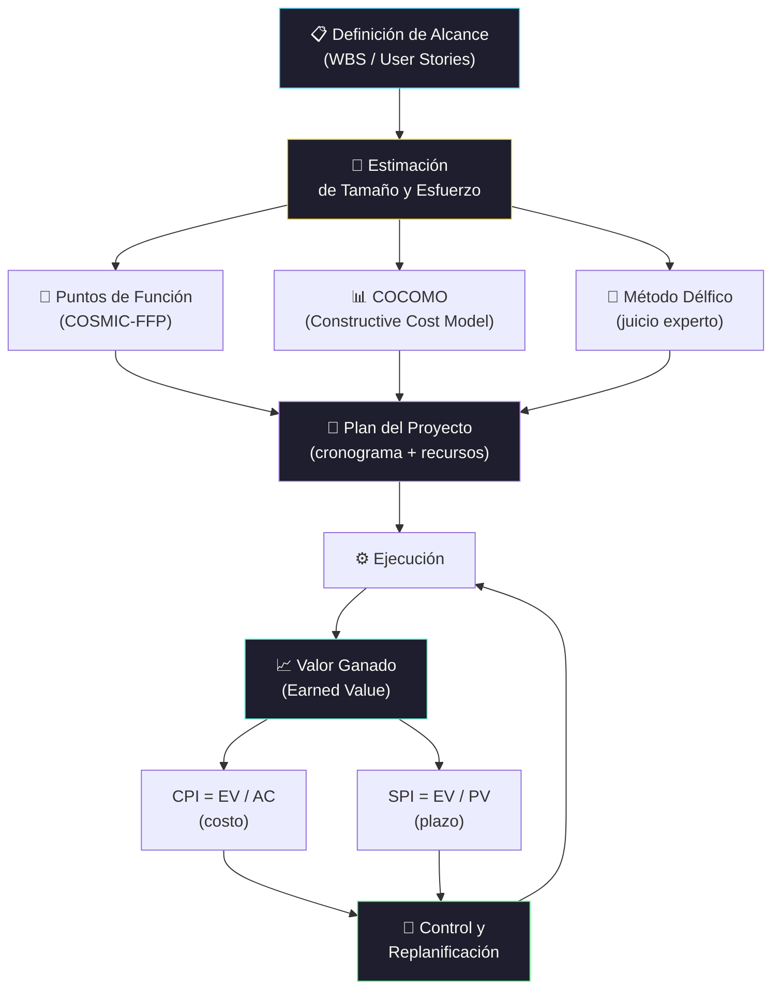

# Planeamiento y Estimación de Proyectos de Software

[← alcance y objetivos](sesion_2)

[← Inicio](https://matiaspakua.github.io/tech.notes.io)

--- 

## Proceso de Estimación y Control

## Contenidos

Técnicas y conceptos para una efectiva dirección y estimación de proyectos de desarrollo. Conceptos de proyecto y de dirección de proyectos. Causas de fracaso. Áreas de conocimiento según el Project Management Institute. El rol de gerente de proyecto. Oficina de proyecto. Definición del alcance. Verificación del alcance. Control de cambios. Work Breakdown Structure. Manejo de proveedores y consultores. Planeamiento de adquisiciones. Selección de proveedores. Administración de los contratos. Desarrollo del plan del proyecto: asignación y nivelación de recursos. Control del plan: actualizaciones, incorporación de cambios. Estimación de costos. Preparación de un presupuesto. Control del costo. Seguimiento del proyecto. Técnica del valor ganado. Reporte de performance. Integración de un proyecto. Coordinación de tareas. Herramientas de planeamiento y control de proyectos (Primavera). 

Estimación de tamaño, plazo y recursos. Falencias y sesgos en la estimación. Principales modelos. Etapas básicas en el proceso de estimación. Métodos prácticos aproximados. Método Délfico. Modelos de estimación. Modelos analógicos. Modelos Algorítmicos. Modelos con Puntos de Función. Puntos de Caso de Uso. COCOMO. COSMIC-FFP. Ecuación de Software (Putnam). Estimación de plazos (Rayleigh). Métodos automatizados (software y proveedores). Nuevos métodos y la estimación de aplicaciones OO y para Internet.