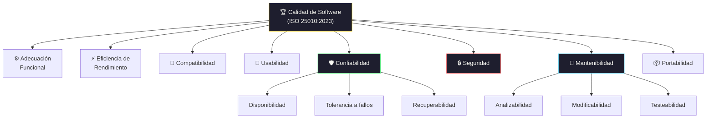

# Calidad de Software

[← Inicio](https://matiaspakua.github.io/tech.notes.io)

--- 

## Modelo de Calidad ISO 25010

## Contenidos

Introducción a la calidad. Aseguramiento, control y mejora de la calidad. La calidad en el ciclo de vida del producto de software. El proceso de desarrollo de software. Estándares de calidad del producto. Gestión de Procesos. Conceptos básicos Definición, medición, control y mejora. Modelado de procesos, herramientas, métodos. Desarrollo de un modelo de procesos de desarrollo de software. Calidad asociada a los procesos. Dominios de la Ingeniería de Software relacionada a los procesos de desarrollo. 

Gestión Cuantitativa de la Calidad. Métricas de calidad. Planificación y recolección de métricas. Análisis de resultados. Modelos de desempeño. Análisis de procesos. 

Estándares de calidad y modelos de referencia. ISO 9001-2008 aplicado al desarrollo del software. Modelos de madurez: Historia y estructura. CMM for Software, CMM for Systems Engineering, Capability Maturity Model Integration. Six Sigma for Software. 

Control de calidad. Verificación y validación. Revisiones de pares. Inspecciones de requerimientos, diseño, casos de prueba, manuales, planes, etc. Herramientas. 

Aseguramiento de la calidad. Revisiones, auditorías, puntos de control. Aspectos en: gestión de proyectos, administración de la configuración, ingeniería de producto, verificación, validación, etc. Aseguramiento de la calidad del producto final y de los productos intermedios. Revisión automatizada mediante herramientas.

## Referencias

- [ISO/IEC 25010:2023 — System and Software Quality Requirements and Evaluation (SQuaRE)](https://www.iso.org/standard/78175.html)
- [CMMI Institute — Capability Maturity Model Integration](https://cmmiinstitute.com/)
- [Software Quality Engineering — Jeff Tian, Wiley, 2005](https://www.wiley.com/en-us/Software+Quality+Engineering%3A+Testing%2C+Quality+Assurance%2C+and+Quantifiable+Improvement-p-9780471713357)

## Notas relacionadas

- [DevSecOps Foundations](../cybersecurity/dev_sec_ops_foundations.md)
- [Testing (TDD/BDD)](../testing/on_unit_test_tdd_and_bdd.md)
- [Trabajo Final de Especialización](final_projects_specialization.md)