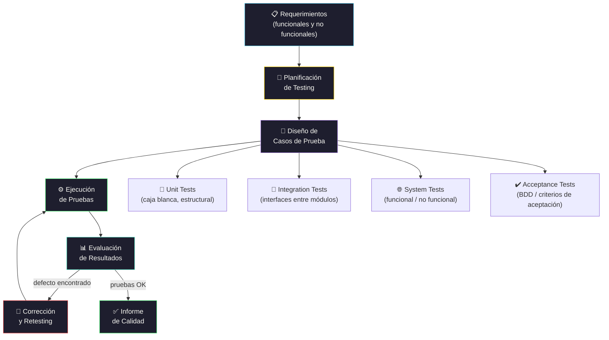

# Testing de Software

[← Inicio](https://matiaspakua.github.io/tech.notes.io)

--- 

## Pirámide y Ciclo de Testing

## Contenidos

Actividades, terminología y modelos de validación y verificación de software. Uso de técnicas y herramientas de validación y verificación. Calidad de producto software: calidad funcional y no funcional. Validación y verificación en los modelos de desarrollo. Validación y verificación en distintos dominios de aplicación. Taxonomía de técnicas y herramientas. Validación y verificación para distintos artefactos de software. Requerimientos, diseños, código. Testing. Tareas del proceso de testing. Niveles de testing. Tipos de testing. Testing funcional. Definición de casos y datos de prueba. Testing estructural. Testing de integración. Planificación de testing. Testing no funcional. Otras técnicas de validación y verificación para software crítico: Concepto de alta integridad. Dependability, survivability, reliability, safety, confiabilidad de software. Safety engineering. Técnicas avanzadas de análisis de software: dataflow analysis, model checking, slicing, abstract interpretation.

## Referencias

- [The Art of Software Testing — Glenford Myers, Wiley, 2011](https://www.wiley.com/en-us/The+Art+of+Software+Testing%2C+3rd+Edition-p-9781118031964)
- [ISTQB Certified Tester Foundation Level Syllabus](https://www.istqb.org/certifications/certified-tester-foundation-level)

## Notas relacionadas

- [TDD y BDD](../testing/on_unit_test_tdd_and_bdd.md)
- [BDD con Cucumber](../testing/bdd_with_cucumber_java_notes.md)
- [Gherkin y Automatización](../testing/gherkin_and_automation.md)
- [Trabajo Final de Especialización](final_projects_specialization.md)