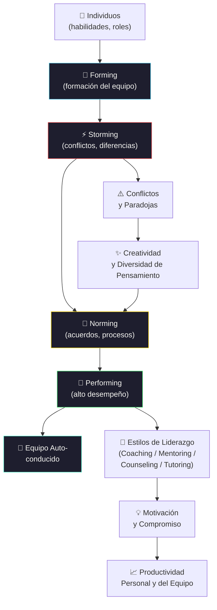

# Gestión de Recursos Humanos y Conducción de Equipos

[← Inicio](https://matiaspakua.github.io/tech.notes.io)

--- 

## Formación y Madurez de Equipos

## Contenidos

Organización, liderazgo, motivación y conducción de equipos. Características y etapas de formación de los equipos de alto desempeño. Estructuras modernas. Grupo vs equipo. Roles distintivos y aditivos. Múltiples competencias. Desarrollo de habilidades y competencias. Equipos de alto desempeño. Equipos autoconducidos. Etapas en la formación de un equipo. Aumento de la productividad personal. Relaciones interpersonales. Liderazgo. Liderazgo basado en valores. Estilos de liderazgo. Mentoring. Coaching, Counseling, Tutoring, Resourcing. Motivación. Compromiso. Equipos virtuales y networking. Groupware. Colaboración. Colaboración electrónica. Las paradojas de la participación. Diversidad de pensamiento. Creatividad. Problemas y conflictos. Mapa de técnicas para potenciar los equipos. Toma de decisión grupal. Estructura del modelo People CMM. Revisión general de los procesos y principales conceptos de los niveles 2 “Managed”, 3 “Defined”, 4 “Predictable” y 5 “Optimizing”. Aplicación y uso del modelo.

## Referencias

- [Five Dysfunctions of a Team — Patrick Lencioni, Jossey-Bass, 2002](https://www.tablegroup.com/books/dysfunctions)
- [People CMM — Carnegie Mellon SEI](https://resources.sei.cmu.edu/library/asset-view.cfm?assetid=9056)

## Notas relacionadas

- [Dev to Tech Lead](../leadership/dev_to_tech_lead.md)
- [Inteligencia Emocional](../leadership/emotional_intelligence.md)
- [Trabajo Final de Especialización](final_projects_specialization.md)