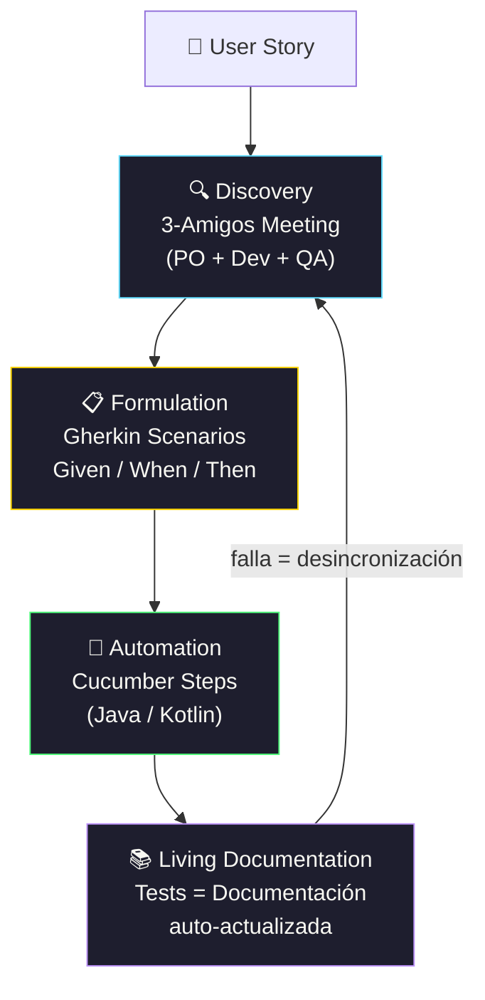

# BDD with Cucumber for JAVA

[← Inicio](https://matiaspakua.github.io/tech.notes.io)

## Table of content 

## Introduction

### BDD concept

Stands for: Behaviour-Driven Development. BDD is an approach that collaboratively specifies the system's desired behaviour. Each time a piece of behaviour is agreed, we use that specification to "drive" the development of the code that will implement that behaviour.

Objective: Reduce the GAP between business people and technical people.

BDD involve do 3 thinks:

1. **Discovery**: Take a user story and: Explore, Discover and Agree over this system need/value.
2. **Formulation**: Document the examples in a way can be automated.
3. **Automation**: Code the example in a way can be automate.

The combination of this 3 thinks is "Living Documentation". We call it "Living Documentation" because the documentation automatically tells us when it goes out of sync with the behaviour of the application. That's what special about it.

We start by collaboratively _**discovering**_ the scope of the behaviour required by the story. Once we have agreed on that behaviour, we **_formulate_** the specification in business-readable language. Finally, we **_automate_** the formulated specification to verify that the system actually behaves as expected.

BDD need that an Agile Process is in place and BDD need to be done JUST IN TIME, in the last responsible moment. Is important that the work is broken down into User Stories and on each user story there are written the Acceptance Criteria.

Ver también: [On User Stories Notes](../general_topic/on_user_stories_notes.md)

### Discovery Workshop

Who are the 3-amigos:

- customer / business perspective - usually provided by the Product Owner
- development perspective - usually provided by a Developer
- test perspective - usually provided by a Tester

The goal of a three amigos meeting is to ensure that the team fully understand the scope of the story being discussed. For this to be effective, we need to have at least three different perspectives represented at the meeting.

More than three people might attend a three amigos meeting, because:

- some stories are broad enough to require the input of more than three perspectives
- more than one representative of each perspective may attend

In every meeting new business rules or user scenario can be discovered. The whole purpose of the three amigos meeting is to **_discover_** things about the story that weren't previously obvious. We should expect to learn new things during a three amigos meeting.

## Referencias

 - [BDD with Cucumber (Java) — Cucumber School](https://school.cucumber.io/courses/take/bdd-with-cucumber-java)

## Notas relacionadas

- [On Unit Test, TDD and BDD](on_unit_test_tdd_and_bdd.md)
- [Gherkin and Automation](gherkin_and_automation.md)
