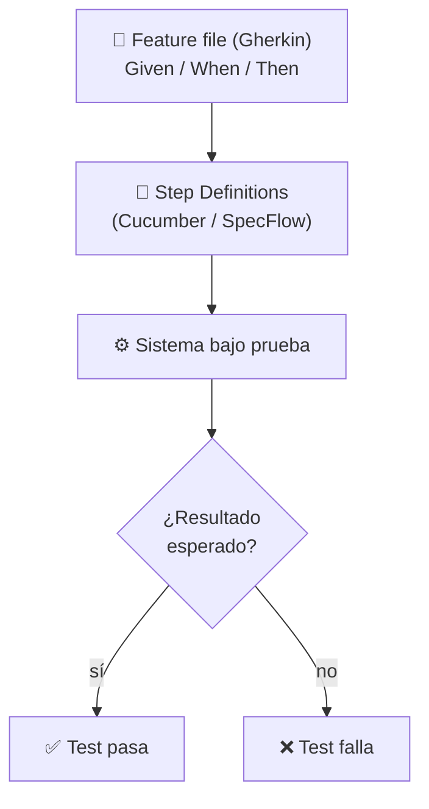

# Gherkin and Automation

[← Inicio](https://matiaspakua.github.io/tech.notes.io)

## Table of Content

## Introduction

Let start with some definitions:

1. **Gherkin**: Gherkin is a simple, human-readable language used to describe and define automated tests in a behaviour-driven development (BDD) approach. It uses a structured language syntax that is designed to be easily readable by both technical and non-technical team members. Gherkin is often used in conjunction with BDD frameworks such as Cucumber and SpecFlow to write and execute automated acceptance tests. The Gherkin syntax consists of a set of keywords and statements that allow users to define the behaviour of a system in a clear and concise way.

Gherkin was originated as part of the Cucumber framework, which was initially created in Ruby in 2008 by Aslak Hellesøy. Gherkin was later implemented in multiple programming languages and became a standalone specification language for defining behaviour in a structured, human-readable format.


2. **Specflow**: SpecFlow is an open-source testing framework for behaviour-driven development (BDD) that allows the creation of executable specifications using a plain text language. It allows the definition of feature files written in Gherkin, which describe the behaviour of the system in a way that can be easily understood by stakeholders, product owners, developers, and testers. These feature files can then be used to generate automated tests that can be executed against the system under test. SpecFlow integrates with popular .NET testing frameworks like NUnit, xUnit, and MSTest, and supports a wide range of programming languages and IDEs.

3. **Cucumber**:  Cucumber is a behaviour-driven development (BDD) tool that allows you to write automated tests in a human-readable format. Like SpecFlow, Cucumber supports Gherkin syntax, which allows for collaboration between business stakeholders and technical teams. Cucumber also integrates well with Java-based testing frameworks like JUnit and TestNG.

## De Gherkin a un test automatizado

Un escenario en Gherkin (`Given / When / Then`) se conecta con *step
definitions* que ejecutan el sistema bajo prueba:



Ejemplo de escenario en Gherkin:

```gherkin
Feature: Login de usuario
  Scenario: Credenciales válidas
    Given un usuario registrado
    When ingresa usuario y contraseña correctos
    Then accede al dashboard
```

## References

 - [SpecFlow — Official Site](https://specflow.org/)
 - [Cucumber — Official Site](https://cucumber.io/)
 - [Gherkin Specification — Cucumber Docs](https://cucumber.io/docs/gherkin/)

## Notas relacionadas

- [On Unit Test, TDD and BDD](on_unit_test_tdd_and_bdd.md)
- [BDD with Cucumber for JAVA](bdd_with_cucumber_java_notes.md)
