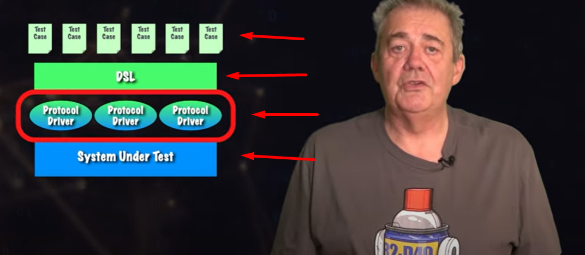

# On Unit Test, TDD and BDD

<button class="back-button" onclick="window.location.href='https://matiaspakua.github.io/tech.notes.io'">All notes</button>

## Table of content

## What is unit testing

The idea of "unit testing" is to test individual units or components of software to ensure that they are working correctly and meeting their intended functionality. Unit testing involves writing and running automated tests that isolate a specific piece of code, such as a function or method, and verify its behaviour under different scenarios or inputs. By catching errors early and ensuring that each unit works as intended, unit testing can help improve the quality and reliability of software, while also reducing the time and cost of debugging and fixing issues later in the development cycle.

## The Testing Pyramid

Different tests can be written at different levels of the system. At each level, there is a balance between the speed of execution, the “cost” to maintain the test, and the confidence it brings to system correctness. This hierarchy is often represented as a “testing pyramid”.

**Unit Tests**: A Unit Test exercises a small “unit” of the system that is isolated from the rest of the system. They should be simple and speedy. You want a high ratio of Unit Tests in your testing pyramid as they’re key to designing highly cohesive, loosely coupled software.

**Integration Tests**: Integration Tests exercise a subset of the system and may exercise groups of units in one test. They are more complicated to write and maintain, and run slower than unit tests.

**End-to-End Tests**: An End-to-End Test exercises the system using the same interface that a user would, such as a web browser. While extremely thorough, End-to-End Tests can be very slow and fragile because they use simulated user interactions in potentially complicated UIs. Implement the smallest number of these tests.

## TDD. Testing First

What is Test Driven Development? It’s common for software development teams to author automated test suites to guard against regressions. Often these tests are written after the application feature code is authored. We'll take an alternative approach: we'll write tests before implementing the application code. This is called test driven development (TDD).

Why apply TDD? By asserting expected behaviour before implementing the desired functionality, we’re designing the system based on what we want it to do, rather than what the system already does.

Another benefit of “test-driving” the application code is that the tests guide you to write the minimum code needed to satisfy the implementation. When the tests pass, you have a working implementation (the application code), and a guard against introducing errors in the future (the tests).

## The Red, Green, Refactor Loop

Software development teams love to move fast. So how do you go fast forever? By continuously improving and simplifying your code–refactoring. One of the only ways you can safely refactor is when you have a trustworthy test suite. Thus, the best time to refactor the code you're currently focusing on is during the TDD cycle. This is called the Red, Green, Refactor development loop:

1. **Red**: Write a failing test for the desired functionality.
2. **Green**: Implement the simplest thing that can work to make the test pass.
3. **Refactor**: Look for opportunities to simplify, reduce duplication, or otherwise improve the code without changing any behavior—to refactor.
4. Repeat!

## TDD vs BDD

Video: [TDD or BDD When It Comes To Automated Testing?](https://www.youtube.com/watch?v=Z9fGG1k6P40)

This great video of David Farley discusses the benefits and challenges of automated testing, and compares two approaches: test-driven development (TDD) and behavior-driven development (BDD). It argues that BDD is a more effective starting point for improving automated testing in most cases, and explains how to implement it using a domain-specific language and a four-layer approach.

Highlights:

1. The problem of automated testing
 - Most people prefer software with good automated tests
 - Manual testing is slow, expensive, and unpredictable
 - The question is how to automate testing effectively
2. The value of test-driven development
 - TDD gives fast and clear feedback on the design of the system
 - TDD produces lots of decoupled (if there are correctly written) tests that can run frequently
 - TDD is a valuable tool for individual developers
3. The difficulty of test-driven development
 - TDD is hard to retrofit to existing code that is not well designed
 - TDD requires refactoring skills and discipline
 - TDD is easier to adopt for new code than for old code
4. The alternative of behavior-driven development
 - BDD is easier to retrofit to existing code of any technology
 - BDD focuses on what the system does, not how it does it
 - BDD involves creating a domain-specific language (DSL) to script scenarios
5. The process of behavior-driven development
 - Start by learning how to determine the releasability of the system
 - Use acceptance test driven development to build the DSL
 - Start with a simple scenario and grow the DSL as needed
 - Use the four-layer approach to separate concerns and avoid coupling

1. The benefits of behavior-driven development
 - BDD can replace manual testing with automated tests quickly
 - BDD can run the tests all the time and give faster feedback
 - BDD can increase the determinism and control of the system

## References
- [10 Pines videos](https://academia.10pines.com/webinars_and_videos)
- [10 pines Diseño a la Gorra](https://academia.10pines.com/disenio_a_la_gorra)
- [TDD Cycle Wikipedia](https://en.wikipedia.org/wiki/Test-driven_development)
- Martin Fowler - TDD: https://martinfowler.com/bliki/TestDrivenDevelopment.html
Robert C. Martin - Cycles of TDD: http://blog.cleancoder.com/uncle-bob/2014/12/17/TheCyclesOfTDD.html
Robert C. Martin - ¿Por qué hacer TDD?: https://www.youtube.com/watch?v=GvAzrC6-spQ