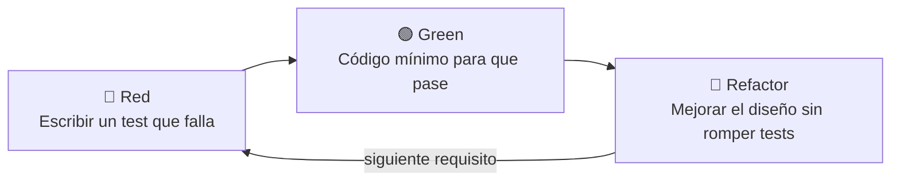
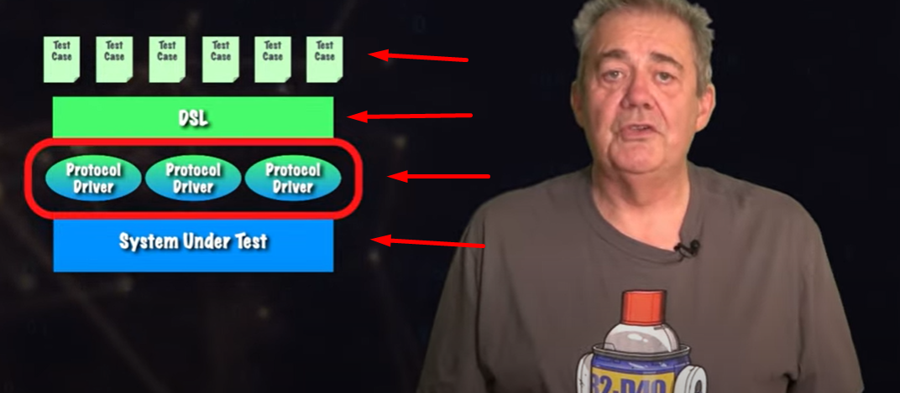

# On Unit Test, TDD and BDD

[← Inicio](https://matiaspakua.github.io/tech.notes.io)

## Table of content

## TDD vs BDD

Video: [TDD or BDD When It Comes To Automated Testing?](https://www.youtube.com/watch?v=Z9fGG1k6P40)

This great video of David Farley discusses the benefits and challenges of automated testing, and compares two approaches: test-driven development (TDD) and behavior-driven development (BDD). It argues that BDD is a more effective starting point for improving automated testing in most cases, and explains how to implement it using a domain-specific language and a four-layer approach.

The classic **TDD cycle** (Red → Green → Refactor):

```mermaid
flowchart LR
    R["🔴 Red<br/>Escribir un test que falla"] --> G["🟢 Green<br/>Código mínimo para que pase"]
    G --> RF["🔵 Refactor<br/>Mejorar el diseño sin romper tests"]
    RF -->|siguiente requisito| R
```

Highlights:

1. The problem of automated testing
 - Most people prefer software with good automated tests
 - Manual testing is slow, expensive, and unpredictable
 - The question is how to automate testing effectively
2. The value of test-driven development
 - TDD gives fast and clear feedback on the design of the system
 - TDD produces lots of decoupled (if there are correctly written) tests that can run frequently
 - TDD is a valuable tool for individual developers
3. The difficulty of test-driven development
 - TDD is hard to retrofit to existing code that is not well designed
 - TDD requires refactoring skills and discipline
 - TDD is easier to adopt for new code than for old code
4. The alternative of behavior-driven development
 - BDD is easier to retrofit to existing code of any technology
 - BDD focuses on what the system does, not how it does it
 - BDD involves creating a domain-specific language (DSL) to script scenarios
5. The process of behavior-driven development
 - Start by learning how to determine the releasability of the system
 - Use acceptance test driven development to build the DSL
 - Start with a simple scenario and grow the DSL as needed
 - Use the four-layer approach to separate concerns and avoid coupling

1. The benefits of behavior-driven development
 - BDD can replace manual testing with automated tests quickly
 - BDD can run the tests all the time and give faster feedback
 - BDD can increase the determinism and control of the system

## References

- [10 Pines videos — Academia 10 Pines](https://academia.10pines.com/webinars_and_videos)
- [10 Pines Diseño a la Gorra — Academia 10 Pines](https://academia.10pines.com/disenio_a_la_gorra)
- [Test-Driven Development — Wikipedia](https://en.wikipedia.org/wiki/Test-driven_development)
- [TestDrivenDevelopment — Martin Fowler](https://martinfowler.com/bliki/TestDrivenDevelopment.html)
- [The Cycles of TDD — Robert C. Martin](http://blog.cleancoder.com/uncle-bob/2014/12/17/TheCyclesOfTDD.html)
- [¿Por qué hacer TDD? — Robert C. Martin (YouTube)](https://www.youtube.com/watch?v=GvAzrC6-spQ)
