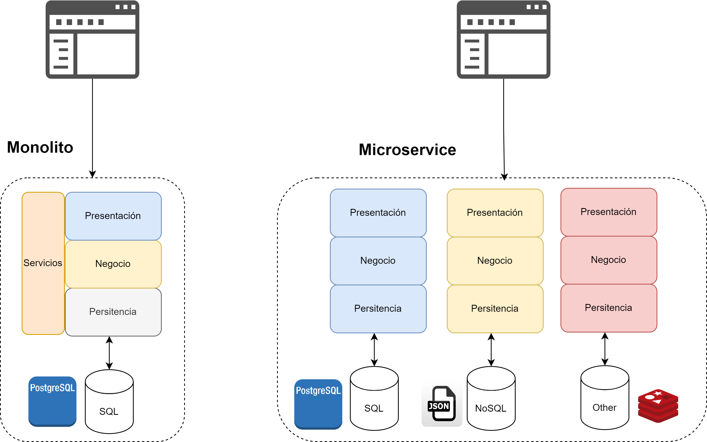
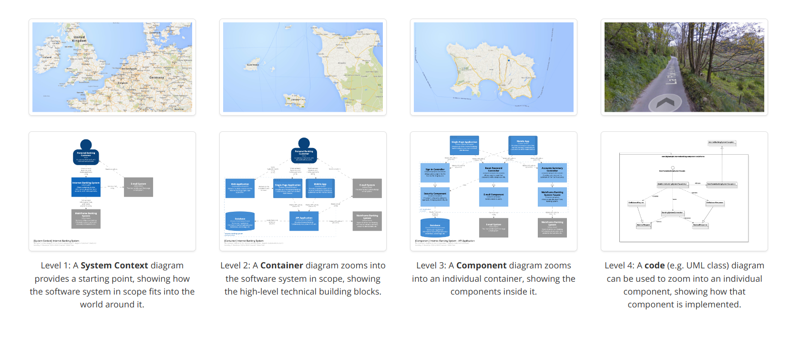
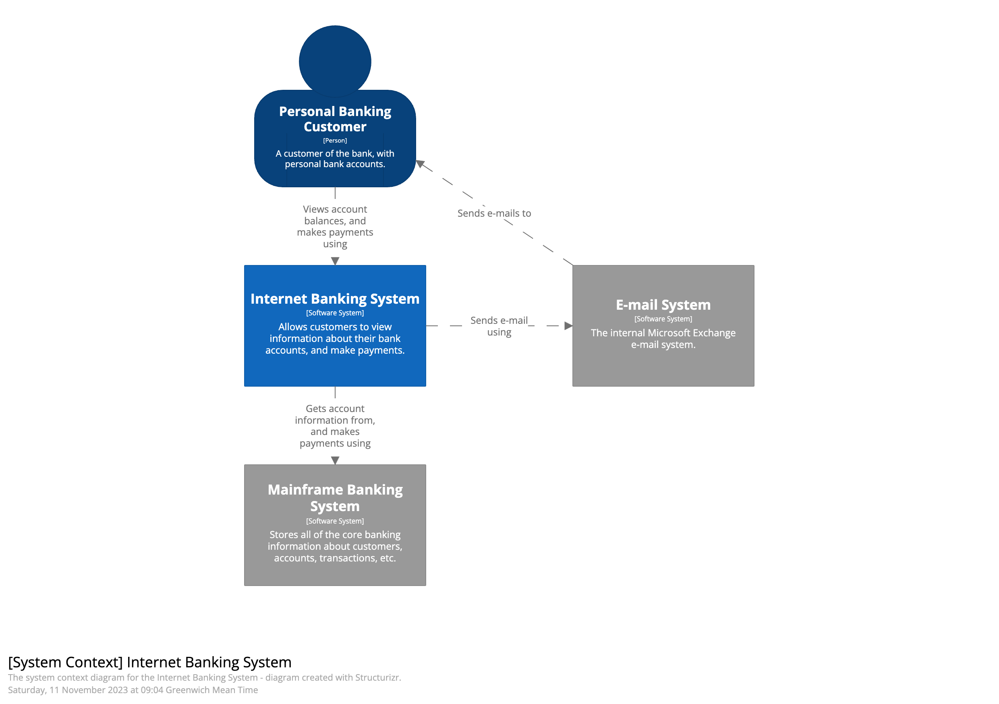
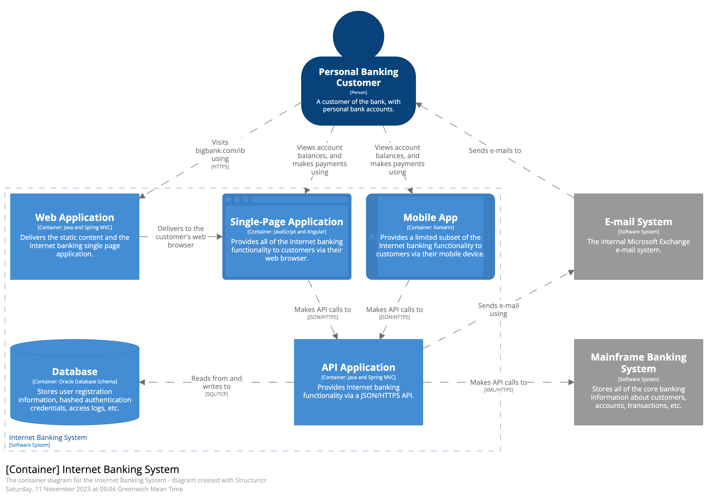
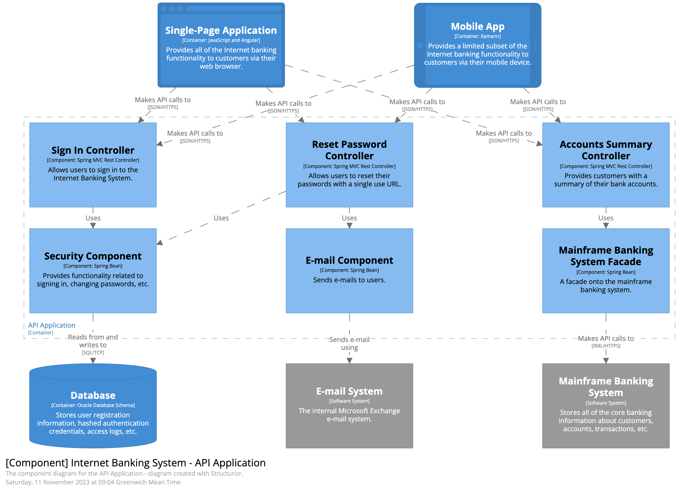
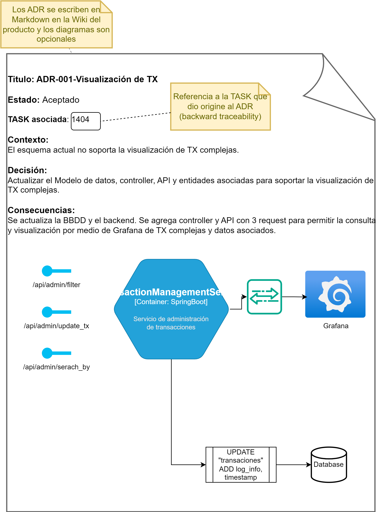
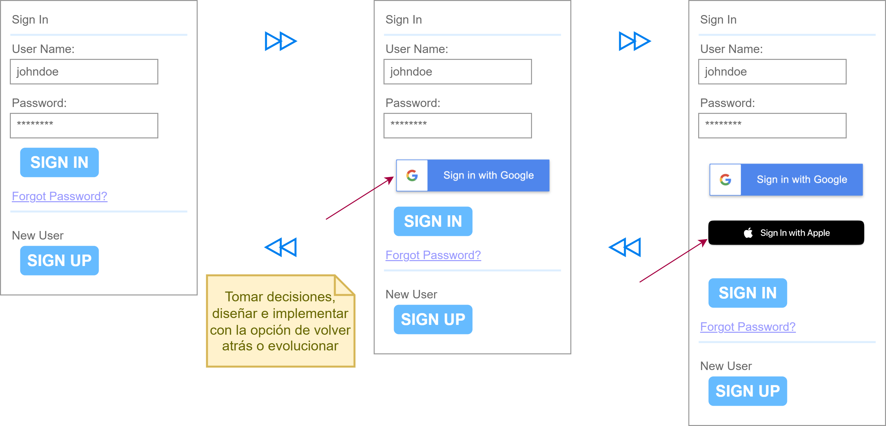
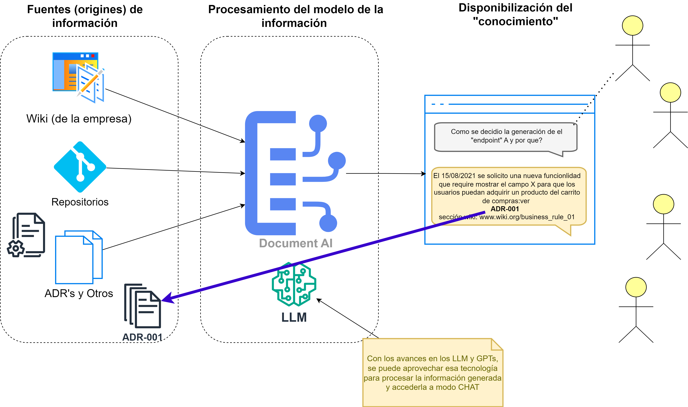

# Evolutionary Architecture: the art of making decisions

---

---
# Autor

José Enrique Calderón Sanz
Lead Software Engineer @ J.P Morgan & Chase

Linkedin: https://www.linkedin.com/in/josecalderonsanz

---

## Introducción

---

"Sagrada familia". la originalidad consiste en regresar a los orígenes. Gaudi Quote.

Que aprender de la arquitectura clásica? Tenemos más de 11.000 años de historia construyendo estructuras físicas.

---

Analogía con el juego de Legos => sirven para crear representaciones físicas de "ideas", el software es similar a los legos pero sin el aspecto físico.

---

---

## Arquitectura evolutiva 

El negocio siempre quiere cambios y los quiere ahora y baratos. => "**decisiones**". 

Las grandes preguntas de la ingeniería de software:

1. Como <mark style="background: #FFF3A3A6;">hacer planes a mediano/largo plazo</mark>, cuando las cosas cambian en el transcurso del tiempo.
2. Como puedo <mark style="background: #BBFABBA6;">prevenir que el producto se degrade</mark>, con el transcurso del tiempo.

Como responder a éstas preguntas?

---

## Framework para toma de decisiones

Del Libro: The software architecture elevator. Gregor Hohpe. 

--> **Poner foco en decisiones pertinentes**

---

1. Decisiones no triviales.

Estas son decisiones que <mark style="background: #FFF3A3A6;">no tienen una respuesta obvia o estándar</mark>. Implican un análisis cuidadoso y una comprensión profunda del problema, ya que afectan significativamente el diseño y el comportamiento del sistema. Estas decisiones suelen requerir la evaluación de múltiples <mark style="background: #BBFABBA6;">alternativas</mark> y sus respectivas consecuencias.

---

_Ejemplo_: Decidir entre una arquitectura de microservicios y una monolítica para una nueva aplicación empresarial.

---

---

2. Deben tener un downside

Se refiere a que las decisiones de arquitectura de software suelen tener<mark style="background: #FFF3A3A6;"> desventajas o "costos"</mark> asociados. No existe una solución perfecta; por lo tanto, es crucial identificar y considerar los posibles inconvenientes o compromisos que una decisión puede acarrear. Reconocer estos "downsides" ayuda a <mark style="background: #BBFABBA6;">mitigar riesgos</mark> y a preparar<mark style="background: #ADCCFFA6;"> estrategias de contingencia</mark>.

---

_Ejemplo_: Elegir utilizar una base de datos NoSQL en lugar de una base de datos relacional tradicional.

---

| **Aspecto**             | **Base de Datos Relacional** | **Base de Datos NoSQL**          |
|-------------------------|-----------------------------|----------------------------------|
| **Escalabilidad**       | Limitada horizontal         | Complejidad horizontal           |
| **Modelo de Datos**     | Esquemas rígidos            | Esquemas flexibles               |
| **Transacciones**       | ACID garantizado            | Consistencia eventual            |
| **Consultas Complejas** | Soporte robusto             | Limitaciones                     |
| **Mantenimiento**       | Mayor mantenimiento         | Menor mantenimiento              |
| **Consistencia**        | Consistencia fuerte         | Consistencia eventual            |
| **Rendimiento**         | Potencialmente lento        | Alto rendimiento                 |
| **Costo**               | Costoso                     | Económico, pero variable         |

--- 
 
3. Decisiones significativas: Meaningful.

Estas decisiones tienen un impacto considerable en el sistema y su desarrollo. No se centran en detalles menores o decisiones que pueden ser revertidas fácilmente, sino en aquellas que <mark style="background: #FFF3A3A6;">afectan aspectos críticos del sistema</mark>, como su escalabilidad, rendimiento, seguridad o mantenibilidad. Las decisiones significativas tienen un <mark style="background: #BBFABBA6;">efecto duradero y son difíciles de cambiar </mark>una vez implementadas, por lo que deben tomarse con cuidado y reflexión.

---

_Ejemplo_: Adoptar un marco de autenticación y autorización (como OAuth) para la gestión de acceso en una aplicación de alto riesgo.

---

| **Alternativa**       | **Características**                    | **Impacto en el Sistema**            |
|-----------------------|----------------------------------------|--------------------------------------|
| **OAuth 2.0**         | Protocolos estándar, amplia adopción   | Seguridad robusta, implementación compleja |
| **SAML (Security Assertion Markup Language)** | Federado, basado en XML                 | Integración con empresas, alto overhead  |
| **JWT (JSON Web Tokens)** | Simple, ligero, sin estado          | Fácil de usar, menos seguro sin SSL   |

---

--> <mark style="background: #FFF3A3A6;">SIMPLICIDAD</mark> como el verdadero NORTE.
--> Hacer cosas complejas no siempre es la mejor opción.
--> Necesito ver la solución claramente. Entendiendo las restricciones del contexto.
--> Incertidumbre genera perdida de confianza, como eliminarla: <mark style="background: #FFF3A3A6;">EXPERIMENTANDO</mark>.

---

## Experimentar para eliminar la Complejidad

**Ejemplo**: Experimento de Gaudi con los pesos dados vueltas para modelar la física y pesos de la iglesia. Proof-of-concepts de las estatuas.

---

---

--> Necesitamos validar algo, y si falla, que falle rápidamente. Usar modelos, referencias, ejemplos.
--> POC hacerlo fuera de tu dominio de negocio. 
--> Evitar creatividad innecesaria, usar los elementos más básicos disponibles.
--> como hacer cosas complejas => <mark style="background: #FFF3A3A6;">DOCUMENTACIÓN</mark>.
--> Como documentar: <mark style="background: #FFF3A3A6;">DIAGRAMAS</mark>.

---

## Cómo Documentar? Diagramas

--> C4 model.

web -> [The C4 model for visualising software architecture](https://c4model.com/)

---
## C1 - System Context

---

## C2 - Contenedor

---

## C3 - Componente

---

## C4 - Código

---

## Cómo Documentar? ADR's

--> ADR or SAD -> lo más sencillo son ADR.

web: [adr.github.io](https://adr.github.io/)

Example: [monorepo-vs-multirepo](https://github.com/joelparkerhenderson/architecture-decision-record/tree/main/locales/en/examples/monorepo-vs-multirepo)

---

---

## Decisiones Anti-Patrones

* No mandarlas por e-mails.
* Hacer decisiones que sean fáciles de volver-atrás.
* Hacer algo, una parte y dejarla de base para el resto. Que esa decisión quede aislada en una parte.

---

--- 

## AI para acceder a la documentación

 - Juntar todos los ADR en un mismo lugar.
 - Documentar usando formatos sencillos (markdown)
 - Proveer un mecanismo de búsqueda / gestión ==> Modelo de AI para acceder a la información y poder hacer preguntas.

---

