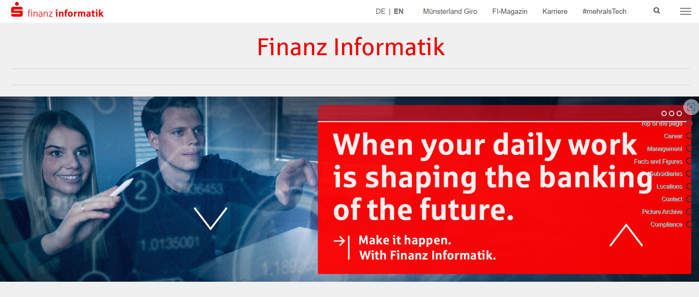

# Next Level Enterprise Architecture: Modular, Flexible, Scalable and IA ready?

---

## Introducción y Contexto

 - FI (empresa alemana)
 - Servicios financieros, uno de los más grandes de Alemania.
 - 50 M personas/clientes
 - Multicanal
 - Múltiples soluciones
 - 113 M de cuentas
 - 188 Billones de TX por año.
 - 300.000 dispositivos.

---

## Evolución de los sistemas bancarios modernos

**Evolución**
-> Mobile.
---> Personal y Social
-----> Conveniencia y a-demanda
-------> IoT, todo conectado y disponible.
---------->Responsable y sustentable.
-------------> Acelerada por AI.

Desde 1980 hasta la actualidad. Desde mainframes hasta cloud native.

---

## Cual es el Siguiente nivel? Como alcanzarlo?

---

 - Estandarización
 - Modular, flexible, multicanales
--> <mark style="background: #FFF3A3A6;">LEGO model</mark> para arquitecturas modernas

---

---

## Recomendaciones para la modernización

Perspectiva de cliente, negocio y desarrollo.
1700 desarrolladores.

--> Empoderar a los desarrolladores, para lo cual, les preguntaron que les hacían felices:
 
 a. Let me Work => estandarización de los ambientes, reinicios de sistemas, estandarización de setups. Efficency killers.
 b. Comunidad: dejar aprender de proyectos open-source, generar comunidades  por tópicos.
 c. Preguntarles a los desarrolladores: opiniones, ideas, invitarlos a "darle" forma a la tecnología de la compañía.

Estos factores resultan en un win-win, para las personas y para la compañía. Reduce costos y aumenta el buen ambiente de desarrollo.

--> Hackatones

Mecanismo para aprender, compartir ideas y construir ideas en base a la colaboración de la comunidad de desarrolladores.