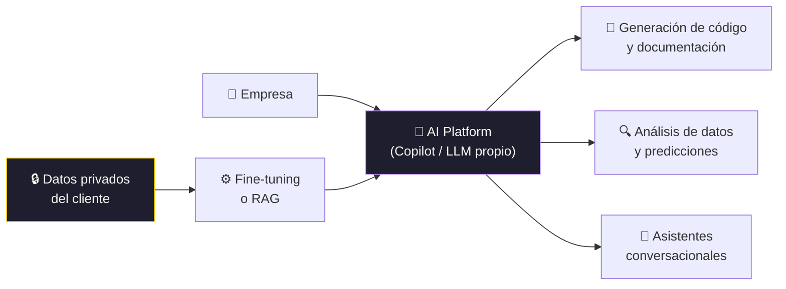

# Architecting the future: leveraging AI, Cloud, and data for business Sucess

[← Inicio](https://matiaspakua.github.io/tech.notes.io)

Panel sobre cómo las grandes empresas están arquitectando sus soluciones con AI, Cloud y datos.

## Panelistas

- **Quantum Computing + AI**: acelera el procesamiento de problemas complejos y potencia las capacidades de AI.
- **Microsoft**: empresa de "plataformas", integrando Copilot como una plataforma que los clientes incorporan en sus soluciones.
- **Salesforce**: los datos vienen de todos lados (competencia, partners). Salesforce tiene su propio modelo LLM para ser entrenado con datos "privados" de los clientes.

## Cómo se introduce AI en las empresas

- **Microsoft**: integra Copilot como plataforma central. Los clientes construyen encima.
- **Salesforce**: LLM propio entrenado con datos del cliente para mantener privacidad y personalización.

### Cómo las grandes empresas introducen AI

## Quantum: el límite del silicio

El nuevo paradigma que será esencial para acelerar los LLM, que cada vez requieren más datos y más procesamiento. El enfoque actual:

1. **Corto plazo**: optimizar los modelos actuales, mejorando algoritmos dentro de las restricciones de procesamiento actuales.
2. **Largo plazo**: cuando avance Quantum Computing, se podrá crear algoritmos cuánticos que realmente aceleren el procesamiento que requieren los LLMs.

## Implicaciones éticas del Quantum Computing

> [!warning]
> QC va a destruir todos los algoritmos de cifrado actuales (RSA, ECC). La preparación
> requiere migrar a algoritmos **post-quantum** antes de que QC alcance esa escala.

## Futuro

<mark style="background: #FFF3A3A6;">QC error correction</mark> es el siguiente gran paso. Una vez resuelto, se podrá exponer QC a niveles más altos y útiles para aplicaciones reales.

## Notas relacionadas

- [Quantum Computing for classical developers](charla_12.md)
- [Generative AI](../software_engineering/generative_ai.md)
