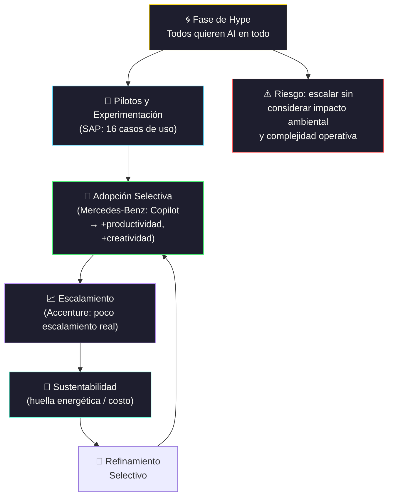

# Beyond the hype: Real-World AI strategies

[← Inicio](https://matiaspakua.github.io/tech.notes.io)

Panel con representantes de grandes empresas compartiendo sus experiencias reales implementando GenAI en producción.

## Panelistas

- **SAP**: 16 casos de aplicación de GenAI. Usan múltiples modelos de varios vendors, desde Open Source hasta propietarios (foundation models).

- **Mercedes-Benz**: Todos usan Copilot, lo liberaron el año pasado. Han implementado una incubadora y tienen múltiples partners. Usando Copilot notaron aumento en productividad y creatividad.

- **Accenture**: <mark style="background: #FFF3A3A6;">"Estamos en la fase de locura, todos quieren usar AI en todo."</mark> Tienen muchos casos de uso, pero poco escalamiento real.

## Sostenibilidad

Tema crítico: el consumo masivo de procesamiento que requieren los modelos de AI tiene un impacto ambiental significativo. No se puede escalar infinitamente sin considerar la huella energética.

## Recomendaciones para el futuro

- **Learning continuo**: curioso, aprender siempre, entender lo suficiente.
- **Deep-dive selectivo**: curiosidad enfocada en temas puntuales + colaboración.
- **Razonamiento y pensamiento crítico**: las herramientas cambian, la capacidad de pensar no.

## Notas relacionadas

- [Generative AI](../software_engineering/generative_ai.md)
- [AI — Conceptos Generales](../artificial_intelligence/ruta_de_aprendisaje/1.fundamentos_inteligencia_artificial/1_conceptos_generales.md)
