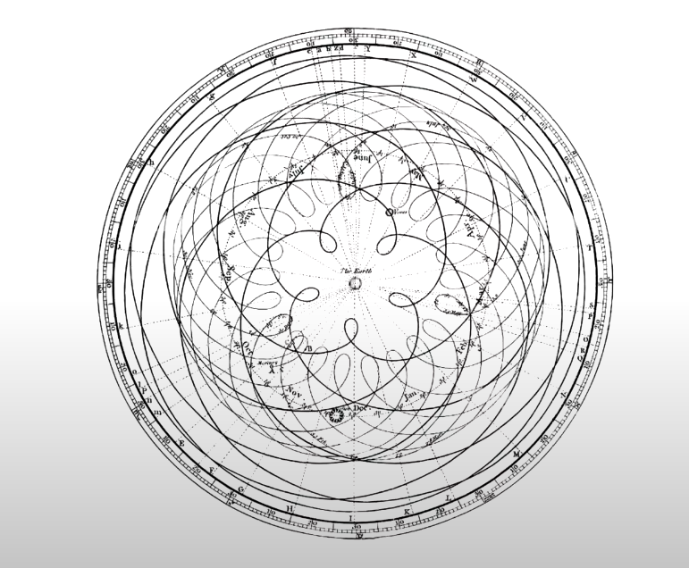
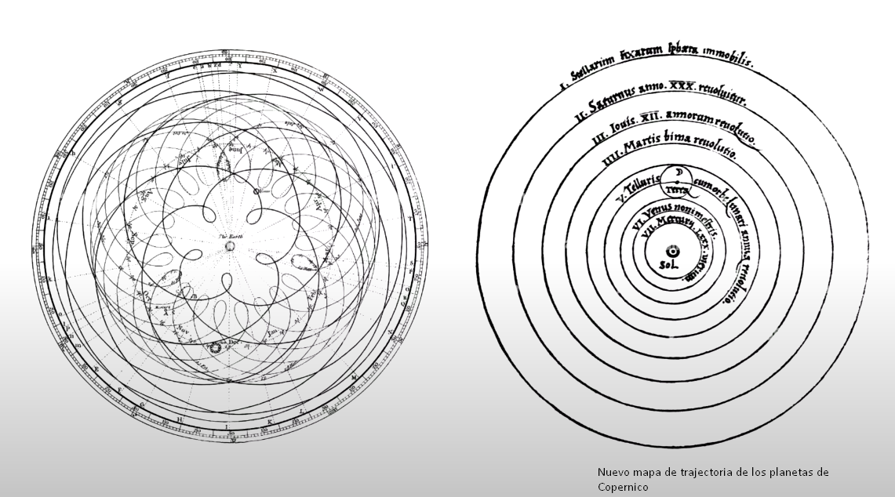
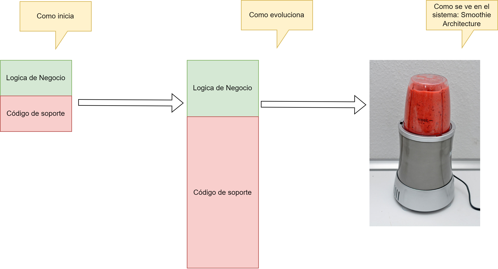
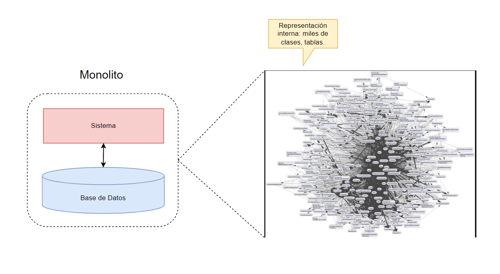
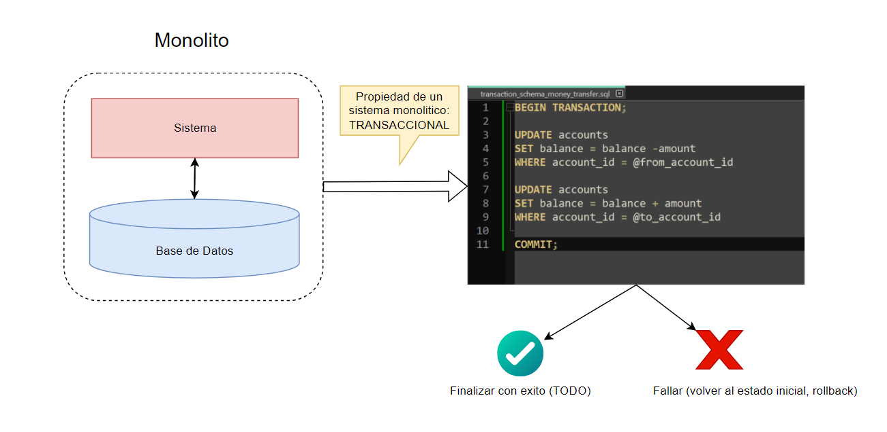
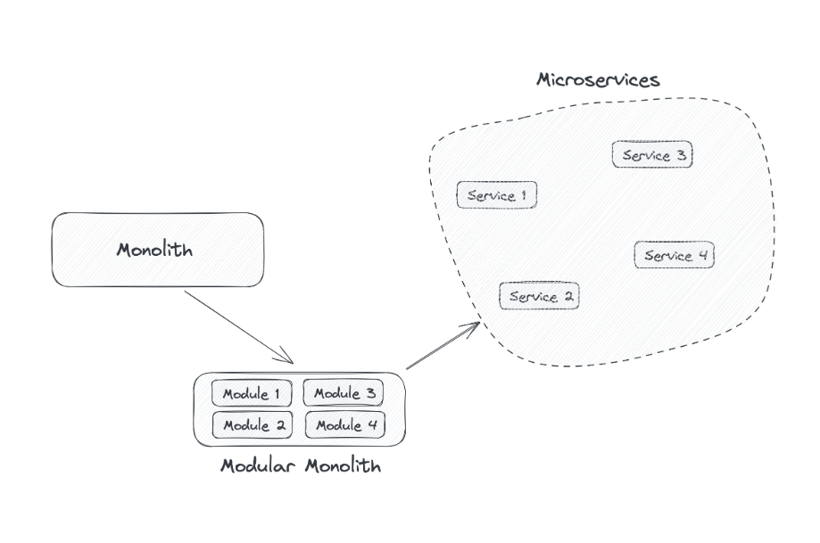
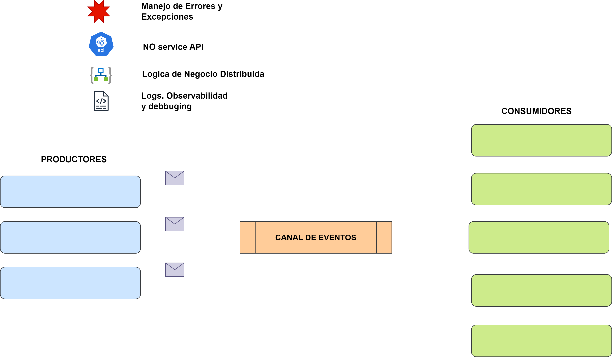
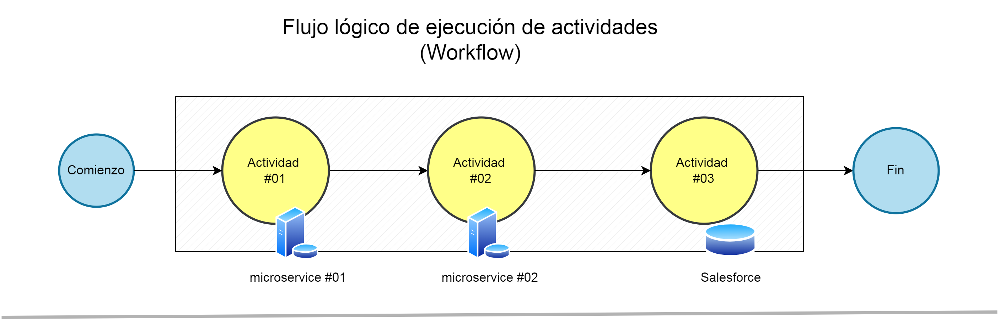
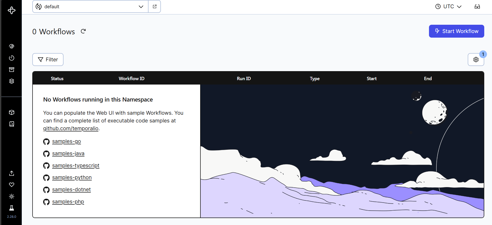

### Durable Execution: A revolutionary abstraction for building resilient applications

---

# Autor

Maxim Fateev
CTO/Cofounder @ Temporal.io

Linkedin: https://www.linkedin.com/in/fateev

---
### Introducción

Representación del sistema solar, trajectoria de los planetas:



---
### Abstracciones

Nosotros trabajamos con abstracciones, pero hay niveles de abstracción. El problema aparece cuando se modelas las abstracciones equivocadas o de manera equivocada.



---
### Complejidad de los sistemas



---
### Propiedad de un sistema monolito




---
### Concepto de Transaccionalidad



---

### Consistencia Eventual

Un sistema monolítico es <mark style="background: #BBFABBA6;">transaccional</mark> y las transacciones no permiten <mark style="background: #FFF3A3A6;">"fallas parciales"</mark>.

Pero cuando el monolito es muy grande, la estrategia es separarlo en **microservicios**. Y cuando los pasos de un determinado proceso está separado y toma más tiempo completarlo, las transacciones no sirven. Entonces apare: <mark style="background: #FFF3A3A6;">Event-Driven.</mark>

---



Fuente: https://pivovarit.github.io/talks/embracing-microservices/

---
### Event-Driven Architecture al rescate

 - <mark style="background: #FFF3A3A6;">Productores</mark>: produced => un EVENTO es generado
 - <mark style="background: #FFF3A3A6;">Canal</mark>: publica y propaga un mensaje (asociado un evento)
- <mark style="background: #FFF3A3A6;">Consumidores</mark>: detectan el mensaje del canal y consumen el mensaje, para luego actuar sobre el "evento"
- Arquitectura de mensajes <mark style="background: #FFF3A3A6;">"asincrónica" y distribuida</mark>.

Ref. https://en.wikipedia.org/wiki/Event-driven_architecture

---
### Abstracciones y sus complejidades


---
### Abstracciones y sus complejidades

 - Microservices => complejidad distribuida
 - Monolitos => complejidad en un solo lugar
 - Arquitectura basada en eventos=> se pierde la lógica
 - Scatered Logs. => se distribuye la lógica de negocio
 - Error Handling => mal manejada, distribuida, que pasa con la lógica distribuida.
 - Visibilidad y Debugging => solo notifica que pasan cosas n algún lugar

<mark style="background: #FFF3A3A6;">Eventos</mark> => son variables globales en sistemas distribuidos. ATENCION.

---



---
## Durable Execution 

=><mark style="background: #FFF3A3A6;"> ejecución que no crashea por causas de fallas a nivel sistema</mark>.

**La principal idea es**: recuperar el estado de una transacción distribuida, pese a la falla de una parte o todo el sistema.

---
### Caracteristicas:

1. Estado totalmente persistente.
2. Duración ilimitada
3. Duración ilimiatda de llamadas a API
4. Logica de Retry
5. Comunicación asincronica
6. Times Durables.

---



---

### Demo: Implementación

 - Usando event-sourcring.
 - Ejemplo de un banco y transacciones.


---
### Armar ambiente dev

Paso #01. Instalar el CLI de temporal.io para comenzar a desarrollar:

Link: [Set up a local development environment for Temporal and Java | Learn Temporal](https://learn.temporal.io/getting_started/java/dev_environment/)

Luego de bajar el CLI, se puede ejecutar:

```bash

$ temporal server start-dev
CLI 1.0.0 (Server 1.24.2, UI 2.28.0)

Server:  localhost:7233
UI:      http://localhost:8233
Metrics: http://localhost:63504/metrics

```

---
### Servidor local en localhost

Link: [Workflows default](http://localhost:8233/namespaces/default/workflows)



---
### Proyecto de ejemplo: money-transfer

```bash
 git clone https://github.com/temporalio/money-transfer-project-java
```

Básicamente la aplicación es lo siguiente:


---

1) Iniciar: TransferApp
2) Ver en la UI el workflow en progreso
3) Iniciar un worker: MoneyTransferWorker (hace el Withdraw y el Deposit )
4) 


---

# Video Tutorial

<iframe width="560" height="315" src="https://www.youtube.com/embed/wIpz4ioK0gI?si=xS7z-_UsLxl0McCV" title="YouTube video player" frameborder="0" allow="accelerometer; autoplay; clipboard-write; encrypted-media; gyroscope; picture-in-picture; web-share" referrerpolicy="strict-origin-when-cross-origin" allowfullscreen></iframe>


---

# Temporal.io  Durable Execution platform

Web: https://temporal.io
Github original: https://github.com/temporalio/money-transfer-project-java


