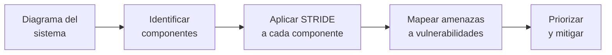

# Real-World Threat Modeling

[← Inicio](https://matiaspakua.github.io/tech.notes.io)

## Shift-Left journey

SAST y DAST básicamente mueven las pruebas de seguridad desde luego de la APP en producción hasta el código. Pero sigue siendo insuficiente si no se trabaja en el diseño.

## Threat Modeling

Identificar y cuantificar las posibles fallas de seguridad. Identificar problemas y diseñar las soluciones **en el momento de diseño** de la solución original (no como parche posterior).

Vocabulario clave:

- **Weakness**: defecto en el código o diseño
- **Vulnerability**: debilidad explotable
- **Attack**: explotación de una vulnerabilidad (target, attack vector, threat actor)
- **Attack surface**: la superficie o componentes que pueden ser atacados

## Methodologies

| Metodología | Enfoque |
|---|---|
| PASTA | Process for Attack Simulation and Threat Analysis |
| STRIDE | Categorías de amenazas (Microsoft) |
| OCTAVE | Risk-based, enfocado en activos |
| TRIKE | Basado en modelos de requerimientos |
| VAST | Visual, Agile and Simple Threat modeling |

## STRIDE

Categorías de amenazas identificadas por Microsoft:

- **S** — Spoofing (suplantación de identidad)
- **T** — Tampering (manipulación de datos)
- **R** — Repudiation (negación de acciones)
- **I** — Information Disclosure (fuga de información)
- **D** — Denial of Service (denegación de servicio)
- **E** — Elevation of Privilege (escalada de privilegios)

## STRIDE Workflow

## Addressing Threats

1. **Mitigation**: reducir la probabilidad o impacto
2. **Elimination**: eliminar el componente o feature riesgoso
3. **Transfer**: trasladar el riesgo (ej: seguro, terceros)
4. **Accept**: aceptar el riesgo documentado

## Demo

**Threat Dragon v2.2.0** — herramienta open-source para crear diagramas de threat modeling.

Ejemplo: Smart Home threat modeling (disponible en GitHub de OWASP Threat Dragon).

## References

- [OWASP Threat Modeling — OWASP Foundation](https://owasp.org/www-community/Threat_Modeling)
- [OWASP Threat Dragon — GitHub](https://github.com/OWASP/threat-dragon)
- [STRIDE — Microsoft Security Documentation](https://learn.microsoft.com/en-us/azure/security/develop/threat-modeling-tool-threats)

## Notas relacionadas

- [DevSecOps Foundations](../cybersecurity/dev_sec_ops_foundations.md)
