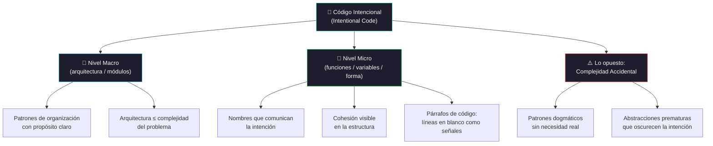

# Intentional code: minimalism in a world of dogmatic design

[← Inicio](https://matiaspakua.github.io/tech.notes.io)

Charla sobre cómo evitar la trampa de aplicar patrones de diseño dogmáticamente y en cambio escribir código **con intención clara**.

## Software as Literature

El software es una forma de literatura que se usa para comunicar de programador a programador (código), pero que además entiende la máquina. La clave: escribir para quien lo lee, no solo para quien lo ejecuta.

## Intentional > Clean

El objetivo no es "código limpio" como fin en sí mismo, sino comunicar la **intención**.

- **Macro** → patrones de organización (arquitectura, módulos)
- **Micro** → forma, flujos y cohesión (funciones, variables, estructura)

Hasta las líneas importan: así como usamos párrafos en texto, la forma del código da señales visuales al lector.

## The Central Challenge

<mark style="background: #FFF3A3A6;">INTENCIONALIDAD es lo opuesto a COMPLEJIDAD.</mark>

La complejidad de una aplicación debe ser como mucho tan compleja como el problema en el espacio en el cual habita, **y no mayor**. Cuando una solución es más compleja que el problema, algo está mal.

> [!note]
> El diseño estructural a veces se hace demasiado grande. Los patrones de diseño
> aplicados dogmáticamente generan más complejidad de la que resuelven.

## Buen código, diseño, abstracciones

1. Código que es fácil de leer para otra persona con poco conocimiento del negocio.
2. Código orientado para desarrolladores: fácil de leer, debuguear y usar.
3. Código cuya intención se vea tan clara como cuando se lee un párrafo de un buen libro.

## Poner el diseño en práctica

Repasar el diseño y el código que se escribe y ser autocrítico: ¿se entiende la intención sin leer los comentarios?

## References

- [A Philosophy of Software Design — John Ousterhout, Yaknyam Press, 2018](https://www.goodreads.com/book/show/39996759-a-philosophy-of-software-design)
- [Clean Code — Robert C. Martin, Prentice Hall, 2008](https://www.oreilly.com/library/view/clean-code-a/9780136083238/)
