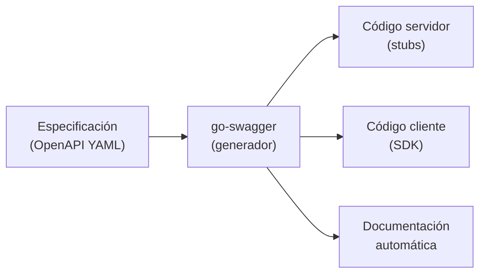

# Specifications as the better way of software development

[← Inicio](https://matiaspakua.github.io/tech.notes.io)

## ¿Qué es una Specification?

Es una descripción detallada del diseño para hacer (make) algo. Lo importante es que es <mark style="background: #FFF3A3A6;">agnóstica a la implementación</mark>: es un contrato que se establece antes de iniciar el desarrollo.

Ejemplos de especificaciones usadas en la industria:

| Especificación | Dominio |
|---|---|
| UML | Modelado de software |
| gRPC / Protocol Buffers | Comunicación entre servicios |
| OpenAPI / Swagger | REST APIs |
| IaC (Terraform, CloudFormation) | Infraestructura |

## El problema

El enfoque habitual es **code-first**: se desarrolla y luego (o nunca) se documenta. El enfoque **specification-first** invierte el orden: se define el contrato, se valida con stakeholders y recién entonces se empieza a codificar.

Esto resuelve problemas clásicos de la ingeniería de software: malentendidos de requisitos, integraciones rotas, acoplamiento entre equipos.

## Solución: go-swagger

Generación del código y la estructura desde la especificación. Usa un archivo YAML y la librería genera todo el resto.

## Referencias

- [OpenAPI Specification — OpenAPI Initiative](https://spec.openapis.org/oas/latest.html)
- [go-swagger — GitHub](https://github.com/go-swagger/go-swagger)
- [gRPC — Official Site](https://grpc.io/)

## Notas relacionadas

- [On APIs Notes](../development/on_rest_api_notes.md)
- [OpenApi foundations](../development/OpenApi.md)
