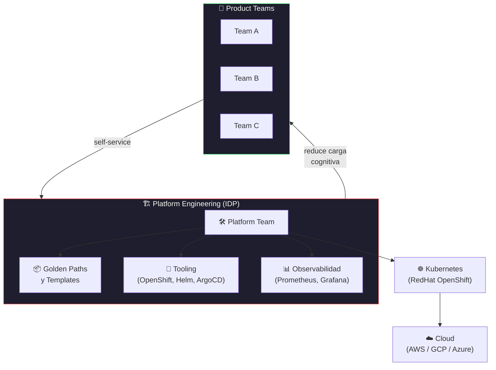

# From zero to Hero: Launch & manage your cloud apps with free OpenShift & Red Hat developer Hub

[← Inicio](https://matiaspakua.github.io/tech.notes.io)

## Mayores desafíos en la industria

Datos de encuesta a organizaciones tech:

| Desafío | % de empresas afectadas |
|---|---|
| Modernización de aplicaciones / deuda técnica | 80% |
| GenAI | 80% |
| Productividad de desarrolladores | 76% |
| Seguridad en la cadena de suministro de software | 74% |

Observación: quien casi siempre detiene el desarrollo es **Operations**. Y quien molesta desde arriba es el **Arquitecto**. DevOps nació para resolver exactamente esa tensión.

## Origen de DevOps

<mark style="background: #FFF3A3A6;">Shift left</mark>: "tú lo construyes, tú lo deployas." La seguridad también entra en el shift left (DevSecOps).

## Cognitive Load

La cantidad de cosas que constantemente tenemos que aprender — ese es el problema de la **carga cognitiva**. En organizaciones grandes (50-100 ingenieros) llegan a un cuello de botella porque cada equipo no puede ser experto en tantas herramientas.

## RedHat OpenShift y Platform Engineering

Personas, procesos, tecnologías + una plataforma cohesiva.

<mark style="background: #BBFABBA6;">Platform Engineering</mark> va a ser la evolución de DevOps: en lugar de que cada equipo configure su propio stack, un equipo de plataforma provee abstracciones que reducen la carga cognitiva.

Herramientas mencionadas: **Podman Desktop**, libros en PDF disponibles gratis desde Red Hat.

## References

- [Red Hat OpenShift — Official Site](https://www.redhat.com/en/technologies/cloud-computing/openshift)
- [Red Hat Developer Hub](https://developers.redhat.com/rhdh)

## Notas relacionadas

- [DevSecOps Foundations](../cybersecurity/dev_sec_ops_foundations.md)
