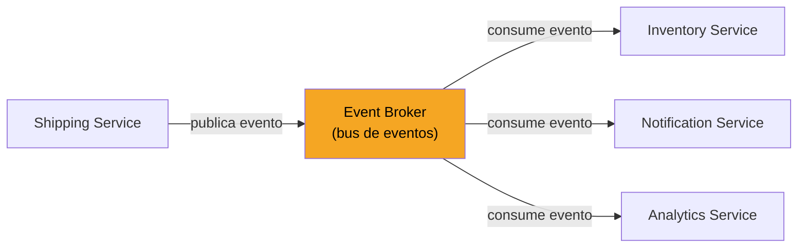

# Autonomous microservices with event-driven architecture

[← Inicio](https://matiaspakua.github.io/tech.notes.io)

## Conceptos clave

- **Servicios autónomos**: cada microservicio opera de forma independiente, sin llamadas síncronas directas entre ellos.
- **Bus de eventos** (<mark style="background: #FFF3A3A6;">event broker</mark>): el canal central de comunicación; los servicios publican y consumen eventos.
- **Event Sourcing**: los eventos son la <mark style="background: #BBFABBA6;">única fuente de verdad</mark> del estado del sistema.
- **Availability over consistency**: en sistemas distribuidos se prioriza la disponibilidad (ver Teorema CAP).
- **Plug-and-play (modular)**: nuevos servicios pueden conectarse al bus sin modificar los existentes.
- **Micro-frontends**: la misma filosofía aplicada al frontend — cada parte del UI es desplegable de forma independiente.

## Arquitectura

> [!note]
> El desacoplamiento del event broker permite que cualquier servicio nuevo se suscriba
> sin modificar los productores existentes (plug-and-play).

## Notas relacionadas

- [Arquitectura Hexagonal](../sw_and_system_architecture/on_hexagonal_architecture_notes.md)
- [Vertical Slicing Architectures](../sw_and_system_architecture/vertical_slicing_architectures.md)
