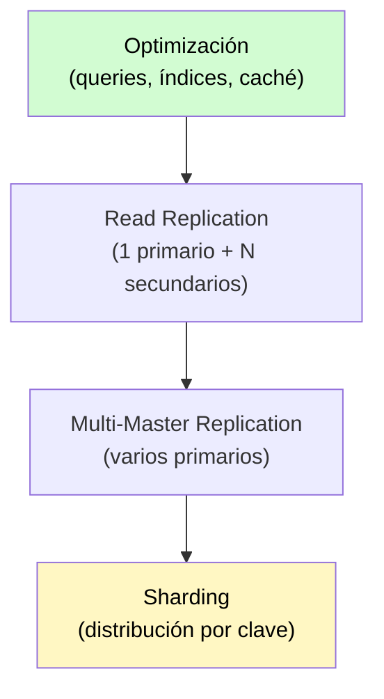

# Scaling Databases

[← Inicio](https://matiaspakua.github.io/tech.notes.io)

## Introducción

¿Es "X" suficientemente rápido? La base de datos es uno de los principales cuellos de botella en aplicaciones a escala.

## Before scaling: Optimize, Optimize, Optimize

Antes de escalar horizontalmente, agotar las optimizaciones:

1. Encontrar las queries lentas y arreglarlas (usar `EXPLAIN ANALYZE`)
2. Optimizar el backend y el acceso a la BBDD (evitar `FIND ALL`, paginar)
3. Implementar <mark style="background: #FFF3A3A6;">caching</mark> (Redis, Memcached)
4. Mejorar el hardware de la máquina donde corre la BBDD

## Estrategias de escalado

### Multi-Master Replication

Mantener varias BBDD (servidores) sincronizadas. Problema: conflictos en múltiples requests sobre un mismo dato ejecutados en diferentes clientes. No funciona bien para escrituras concurrentes intensas.

### Read Replication

- 1 servidor primario (escrituras)
- N servidores secundarios (lecturas)
- Los datos se sincronizan en background

> [!warning]
> Con replicación asíncrona, una lectura en un secundario puede devolver datos
> desactualizados si la sincronización aún no completó.

### Sharding

Distribuir los datos en distintas bases de datos sin replicación. Se necesita un coordinador (ej: Redis) que indique dónde están los datos.

El problema: un `SELECT` que necesita datos distribuidos en diferentes servidores no puede hacer un `JOIN` entre ellos en SQL. El join debe hacerse a nivel backend (ineficiente).

> [!important]
> **KISS siempre**: antes de caer en sharding, asegurarse de haber agotado
> todas las optimizaciones y estrategias más simples.

## References

- [Database Sharding — Wikipedia](https://en.wikipedia.org/wiki/Shard_(database_architecture))
- [CAP Theorem — Wikipedia](https://en.wikipedia.org/wiki/CAP_theorem)

## Notas relacionadas

- [NoSQL — The basis of](../general_topic/nosql_the_basis_of.md)
