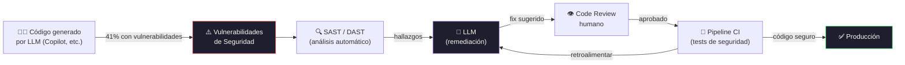

# The Transformative impact of GenAI for software development and its implications for cybersecurity

[← Inicio](https://matiaspakua.github.io/tech.notes.io)

## Contexto

La mejor forma de asegurar un producto es tratar de romperlo. Uno de los principales problemas: automatizar pruebas y procesos de seguridad.

Estado de la seguridad del software en 2024:

| Métrica | Valor |
|---|---|
| Empresas con deuda de seguridad | 70% |
| Empresas con deuda GRAVE de seguridad | 45% |
| Empresas que mantienen un ritmo de fix constante | 20% (2 de 10) |

En la medida que el software evoluciona, el volumen de vulnerabilidades también va en aumento.

## Seguridad: ¿por qué es complejo?

- Crece la complejidad del software
- Microservicios multiplican la superficie de ataque
- Avance constante de features sin tiempo para asegurar
- El ecosistema de amenazas también es mayor

## ¿Dónde entra GenAI?

El problema con los LLM son los datos de entrenamiento, que también pueden tener vulnerabilidades (descubiertas y sin describir).

Usos actuales:

1. Generación de código, tests, documentación.
2. <mark style="background: #FFF3A3A6;">Remediar vulnerabilidades de seguridad</mark> — uno de los usos más interesantes.
3. Dato alarmante: **41% del código generado con Copilot tiene vulnerabilidades de seguridad**.

## Implicaciones

| Métrica | Impacto con GenAI |
|---|---|
| Code reuse | Baja |
| Code velocity | Sube |
| Vulnerability density | Similar (¡no mejora!) |

> [!warning]
> Usar LLM en el estado actual puede **aumentar** las vulnerabilidades si no se
> incorporan workflows de revisión y remediación adecuados.

Necesitamos **workflows y pipelines** para remediar vulnerabilidades más rápido y luego, usando LLM, reentrenar los modelos para entender cómo generar fixes. Por ejemplo: agregar sanitización en el input de los formularios web.

## Recomendaciones

- Revisar qué modelo se usa, con qué datos ha sido entrenado, y sus licencias.
- Revisar los fixes de seguridad para ver si realmente son correctos.
- **Automatizar**: tests, pipelines, revisión de código.

## Notas relacionadas

- [DevSecOps Foundations](../cybersecurity/dev_sec_ops_foundations.md)
- [Generative AI](../software_engineering/generative_ai.md)
