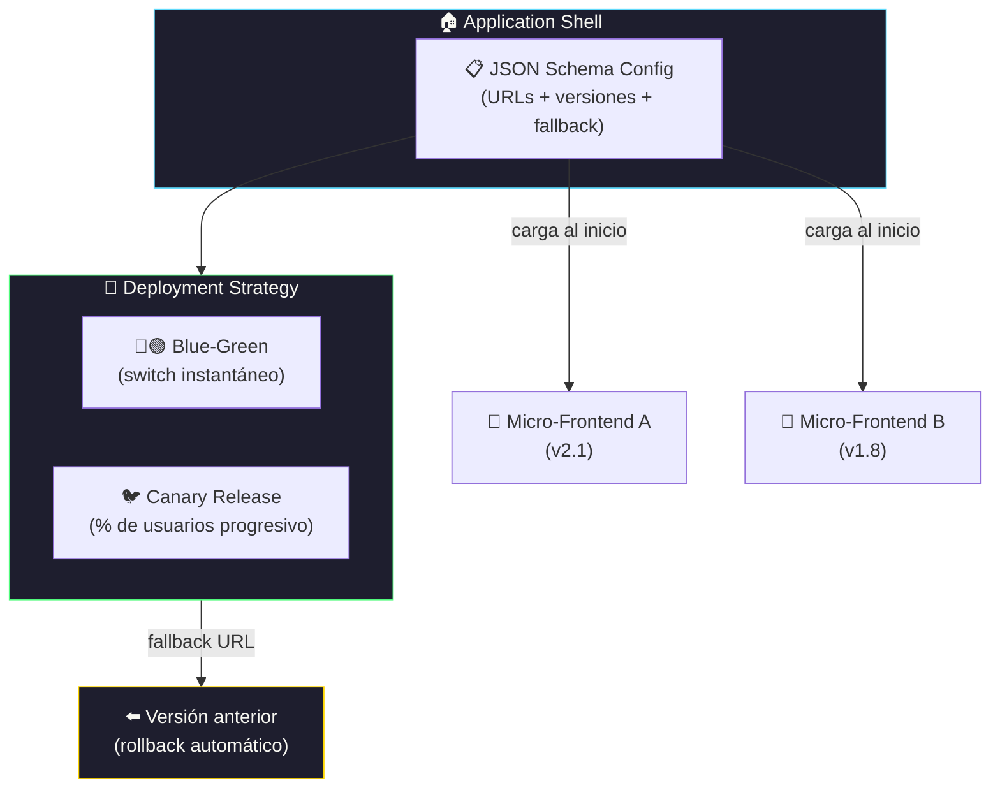

# Micro-Frontends discovery

[← Inicio](https://matiaspakua.github.io/tech.notes.io)

> [!note]
> Charla de **Luca Mezzalira** sobre micro-frontends y el patrón de service discovery aplicado al frontend.

- SPA es deployada a producción y luego los clientes la ven.
- CSR micro-frontend deployment.
- Static vs dynamic imports.
- Module federation (static import).
- Service discovery pattern => ver [microservices.io](https://microservices.io/patterns/service-registry.html).

## Challenges

1. discover new version
2. re-risk the deployment
3. fallback alternatives

como?

blue-gree deployment
canary release

### Arquitectura de Micro-Frontend con Service Discovery

## Problema y solución

como implementar todas las features en un application shell?

json-schema => acá se defien la URL a la nueva versión, dependencias y la URL a la versión de Fall-back y los ambientes de integración con las versiones de los componentes que se quieren deployar.

Esta configuración debe ser cargada antes que nada, lo primero para que sea reconocida y cargada.

## Referencias

- [awslabs/frontend-discovery — GitHub](https://github.com/awslabs/frontend-discovery)
- [awslabs/frontend-discovery-service — GitHub](https://github.com/awslabs/frontend-discovery-service)

## Notas relacionadas

- [Kubernetes](../general_topic/kubernetes.md)
- [Durable Execution — Temporal.io](charla_06.md)
- [Platform Engineering](charla_10.md)
