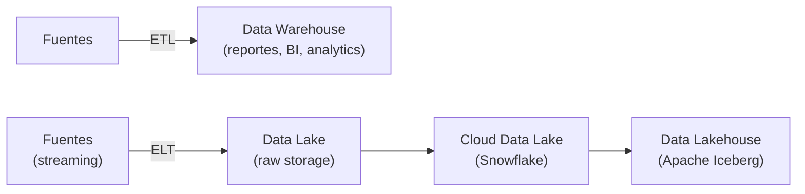

# Modern data Architectures need software engineering

[← Inicio](https://matiaspakua.github.io/tech.notes.io)

> [!note]
> Charla de **Matthias Niehoff** sobre cómo las arquitecturas de datos modernas necesitan prácticas de ingeniería de software.

## Introducción

¿Qué es data architecture? Sistemas, procesos, análisis de datos, toma de decisiones. Data-driven decision, design, etc.

Problemas recurrentes:
1. Datos distribuidos
2. Datos difíciles de manejar

## Evolución de los procesos clásicos

Evolución del patrón: **ETL** → **ELT** (Extract, Load → luego Transform). El Lakehouse combina lo mejor del data lake y el data warehouse.

## Challenge: centralización

Es lo más práctico, pero en grandes organizaciones puede ser un problema por el volumen y los equipos.

**Data Mesh**: aplicar DDD (Domain-Driven Design) para los datos. Cada dominio es dueño de sus datos y los expone como productos.

## Influencia en la ingeniería del software

- **Python**: ecosistema estándar para procesamiento de datos
- **Testing**: unit, integration, y **data tests** (validar la calidad de los datos)
- Ambientes: dev, pre-prod, prod — igual que en software tradicional

## Modern Data Stack: dbt

<mark style="background: #FFF3A3A6;">DevOps aplicado a data</mark>.

**dbt** (data build tool): herramienta para hacer consultas SQL y archivos YAML de configuración. Permite:
- Escribir **unit tests para datos** (TDD aplicado a transformaciones)
- Versionado en repositorio → pipeline automatizado

## Data Contract — como una API pero para DATA

Un data contract define el esquema, semántica y SLA de los datos que un productor provee a sus consumidores.

Ver [Data Contract Specification](https://datacontract.com/).

## Data-as-a-Product & data-thinking

Los datos pueden producir valor (son el "oro" de nuestros tiempos). La pregunta clave: ¿qué se puede hacer con estos datos para generar valor?

## References

- [dbt — Data Build Tool](https://www.getdbt.com/)
- [Data Contract Specification — datacontract.com](https://datacontract.com/)
- [Data Mesh — Martin Fowler](https://martinfowler.com/articles/data-mesh-principles.html)
- [Apache Iceberg — Open Table Format](https://iceberg.apache.org/)
