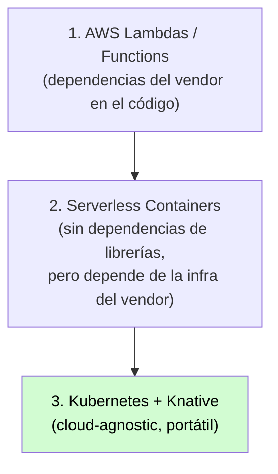

# Serverless Java in action: cloud agnostic design patterns and tips

[← Inicio](https://matiaspakua.github.io/tech.notes.io)

## Serverless: el modelo de uso

Serverless solo utiliza los recursos cuando los necesitás. Cuando la cantidad de requests aumenta, el ambiente se encarga de crear instancias y bajarlas automáticamente (auto-scaling a cero incluido).

Frameworks de referencia para Java: <mark style="background: #FFF3A3A6;">Quarkus</mark> (supersonic, subatomic Java).

## Java & Serverless: el problema del vendor lock-in

El problema se ve cuando los vendors exigen que se importen funciones específicas o librerías del SDK de cada vendor en nuestro código. Esto hace imposible migrar.

Evolución de las opciones:

## Knative

Proyecto que permite deployar funciones serverless sobre Kubernetes usando el patrón *knative eventing*. Desacopla el código de la infraestructura del vendor.

## References

- [Quarkus — Supersonic Subatomic Java](https://quarkus.io/)
- [Knative — Kubernetes-based Serverless](https://knative.dev/)

## Notas relacionadas

- [Charla MeetUp DevOps BCN — Kubernetes](../general_topic/kubernetes.md)
