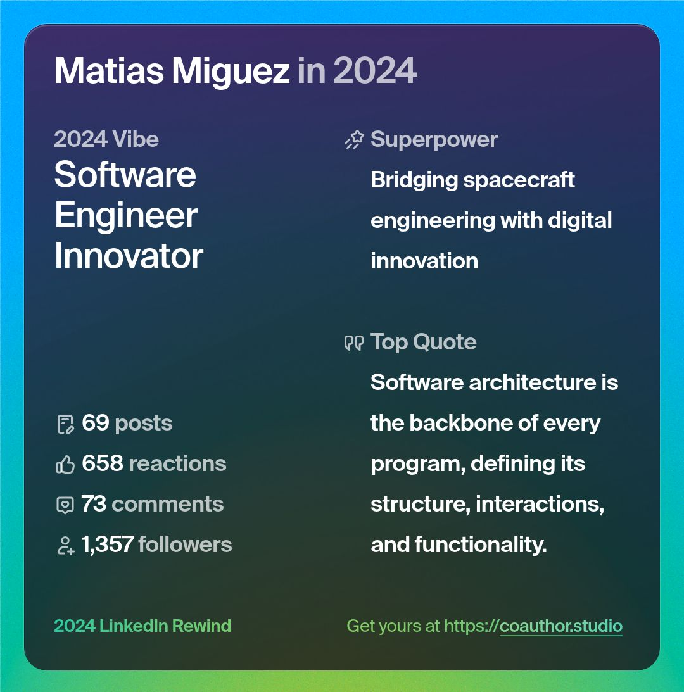

# 1. **Gestión Emocional y Empatía**

Curso: Inteligencia Emocional [[emotional_intelligence]]

# 2. **Desarrollo de Influencia**

### Calendario de Publicaciones

| Fecha | Titulo |
| ----- | ------ |
|       |        |
|       |        |

## 2024

Con la herramienta co-author, te genera un resumen de tu actividad de 2024:

## MeetUps (JUG)

### 2025

TBD. Hay varias propuesta, inclusive me han sugerido que yo de una charla.

### 2024

**12/11/2024**
Este fue co-organizado por mi en oficinas de K-Lagan (la consultora donde trabajo.)

https://www.meetup.com/es-ES/barcelonajug/events/304146598/?utm_medium=referral&utm_campaign=yourEvent_savedevents_share_modal&utm_source=link

**30/10/2024**
https://www.meetup.com/es-ES/barcelonajug/events/304141020/?utm_medium=referral&utm_campaign=yourEvent_savedevents_share_modal&utm_source=link

**17/09/2024**
https://www.meetup.com/es-ES/barcelonajug/events/303352116/?utm_medium=referral&utm_campaign=yourEvent_savedevents_share_modal&utm_source=link

# 3. **Comunicación Persuasiva y Presentaciones**

Curso Coursera: [Cómo hablar bien en público - Cómo hablar bien en público - Week 1 | Coursera](https://www.coursera.org/learn/hablar-bien-en-publico/home/module/1)

How To Speak: [Cómo hablar](https://www.youtube.com/watch?v=Unzc731iCUY&ab_channel=MITOpenCourseWare)
